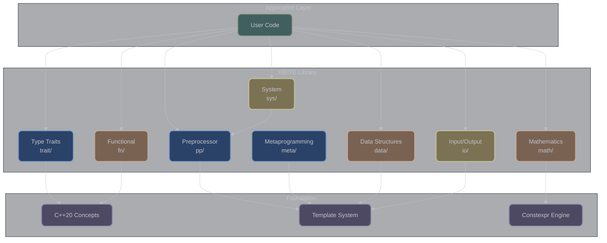
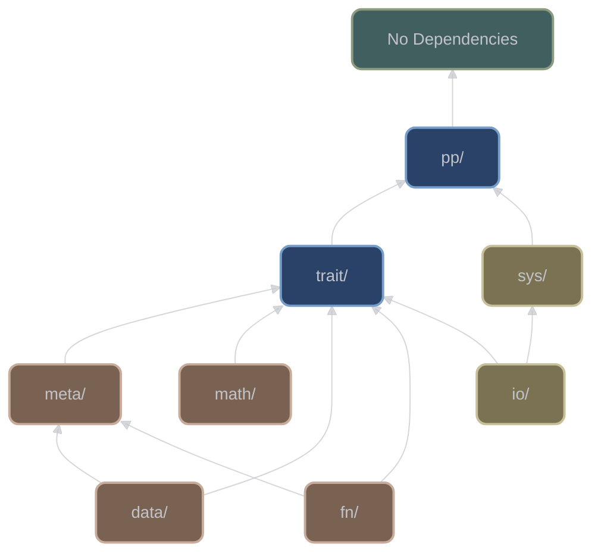

# Architecture Overview

## Design Philosophy

XIEITE embodies modern C++ design principles with an emphasis on zero-overhead abstractions, compile-time computation, and cross-platform portability. The library architecture reflects four core tenets:

1. **Header-Only Design**: No compilation required, maximum inlining opportunity
2. **Template Metaprogramming**: Extensive compile-time computation and type safety
3. **Concept-Based Constraints**: C++20 concepts for clear, expressive interfaces
4. **Platform Agnosticism**: Unified API across diverse systems

## Architectural Layers



## Directory Organization

```
include/xieite/
│
├── pp/         # Preprocessor (72 headers)
│   ├── Core macros (arrow, if, eval)
│   ├── Platform detection
│   └── Token manipulation
│
├── trait/      # Type Traits (276 headers)
│   ├── Type properties
│   ├── Type relationships
│   └── Concept definitions
│
├── math/       # Mathematics (110 headers)
│   ├── Arithmetic operations
│   ├── Statistical functions
│   └── Geometric utilities
│
├── data/       # Data Structures (65 headers)
│   ├── Fixed containers
│   ├── String utilities
│   └── Compile-time structures
│
├── fn/         # Functional (35 headers)
│   ├── Function composition
│   ├── Currying & partial application
│   └── Scope guards
│
├── meta/       # Metaprogramming (28 headers)
│   ├── Template manipulation
│   ├── Type lists
│   └── Pack operations
│
├── sys/        # System (21 headers)
│   ├── Platform utilities
│   ├── Environment access
│   └── OS-specific features
│
└── io/         # Input/Output (9 headers)
    ├── Stream utilities
    ├── Formatting helpers
    └── Debug output
```

## Core Design Patterns

### 1. Header-Only Architecture

All functionality is implemented in headers using:
- `inline` functions for ODR compliance
- Template definitions in headers
- `constexpr`/`consteval` for compile-time execution
- Header guards with unique naming pattern

```cpp
#ifndef DETAIL_XIEITE_HEADER_CATEGORY_NAME
#define DETAIL_XIEITE_HEADER_CATEGORY_NAME

namespace xieite {
    template<typename T>
    inline constexpr auto utility(T value) noexcept {
        // Implementation directly in header
        return process(value);
    }
}

#endif
```

### 2. Namespace Strategy

Single-level namespace with category-based organization:

```cpp
namespace xieite {
    // All utilities in single namespace
    // No nested namespaces for categories

    // Type traits
    template<typename T>
    concept is_integral = /* ... */;

    // Math functions
    template<typename T>
    constexpr T factorial(T n);

    // Data structures
    template<typename T, size_t N>
    class fixed_array;
}
```

### 3. Concept-First Design

C++20 concepts used extensively for:
- Template parameter constraints
- Overload resolution
- SFINAE replacement
- Clear error messages

```cpp
template<typename T>
concept arithmetic = std::is_arithmetic_v<T>;

template<arithmetic T>
constexpr auto square(T value) noexcept {
    return value * value;
}
```

### 4. Compile-Time Emphasis

Maximum computation at compile time:

```cpp
template<size_t N>
consteval auto fibonacci() {
    if constexpr (N == 0) return 0;
    else if constexpr (N == 1) return 1;
    else return fibonacci<N-1>() + fibonacci<N-2>();
}

// Computed entirely at compile time
constexpr auto fib_10 = fibonacci<10>();
```

## Dependency Management

### Internal Dependencies



### External Dependencies

**NONE** - XIEITE is completely self-contained with:
- No external library dependencies
- Standard library usage only
- No build system requirements
- No configuration needed

## Compilation Model

### Include Strategy

```cpp
// Option 1: Specific includes (recommended)
#include <xieite/pp/arrow.hpp>
#include <xieite/trait/is_integral.hpp>
#include <xieite/math/factorial.hpp>

// Option 2: Category includes
#include <xieite/pp.hpp>    // All preprocessor utilities
#include <xieite/trait.hpp>  // All type traits

// Option 3: Everything (not recommended)
#include <xieite/xieite.hpp>  // Entire library
```

### Compilation Characteristics

| Aspect | Impact | Mitigation |
|--------|--------|------------|
| Compile Time | Increased with templates | Use specific includes |
| Binary Size | Minimal (inlined code) | Link-time optimization |
| Debug Symbols | Larger with templates | Strip in release |
| Memory Usage | Template instantiation cost | Explicit instantiation |

## Error Handling Philosophy

### Compile-Time Errors

Primary error detection through:
- Static assertions for invalid usage
- Concept requirements for clear messages
- SFINAE for overload resolution
- Requires expressions for validation

```cpp
template<typename T>
constexpr auto safe_divide(T a, T b) {
    static_assert(std::is_arithmetic_v<T>,
                  "safe_divide requires arithmetic type");

    if constexpr (std::is_integral_v<T>) {
        // Integer division checks
        if (b == 0) {
            // Compile-time error for constexpr context
            // Runtime handling for non-constexpr
        }
    }
    return a / b;
}
```

### No Runtime Exceptions

XIEITE follows a no-exception policy:
- All functions marked `noexcept` where possible
- Preconditions checked at compile time
- Undefined behavior documented clearly
- Optional/expected patterns for error handling

## Platform Abstraction

### Cross-Platform Interface

```cpp
namespace xieite {
    // Unified API regardless of platform
    auto get_environment_variable(const std::string& name);

    // Platform-specific implementation hidden
    namespace detail {
        #if XIEITE_PLATFORM_TYPE_WINDOWS
            // Windows implementation
        #elif XIEITE_PLATFORM_TYPE_UNIX
            // Unix implementation
        #endif
    }
}
```

### Conditional Compilation

Platform variations handled through:
- Preprocessor detection macros
- Compile-time if for C++17+
- Template specialization
- Concept-based overloading

## Performance Characteristics

### Zero-Overhead Principle

All abstractions compile to optimal code:
- Inlined functions eliminate call overhead
- Template specialization for type-specific optimization
- Constexpr evaluation eliminates runtime computation
- Perfect forwarding preserves value categories

### Optimization Opportunities

| Technique | Application | Benefit |
|-----------|------------|---------|
| Inline expansion | All small functions | No call overhead |
| Template specialization | Type-specific paths | Optimal code generation |
| Constexpr evaluation | Compile-time computation | Zero runtime cost |
| SIMD detection | Platform-specific vectorization | Hardware acceleration |
| Branch prediction hints | Hot/cold path marking | Better CPU utilization |

## Versioning Strategy

### Semantic Versioning

XIEITE follows semantic versioning (MAJOR.MINOR.PATCH):
- **MAJOR**: Breaking API changes
- **MINOR**: New functionality, backward compatible
- **PATCH**: Bug fixes, performance improvements

Current version extracted from `include/xieite/xieite.hpp`:
```cpp
#define XIEITE_VERSION_MAJOR 0
#define XIEITE_VERSION_MINOR 118
#define XIEITE_VERSION_PATCH 2
```

## Quality Assurance

### Compile-Time Validation

Every utility includes:
- Static assertions for preconditions
- Concept requirements for type safety
- SFINAE tests for feature detection
- Requires expressions for API contracts

### Documentation Standards

All headers follow consistent documentation:
- Purpose and usage description
- Template parameter documentation
- Complexity analysis where applicable
- Example usage patterns
- Platform-specific notes

## Integration Patterns

### CMake Integration

```cmake
# Header-only library
add_library(xieite INTERFACE)
target_include_directories(xieite INTERFACE
    $<BUILD_INTERFACE:${CMAKE_CURRENT_SOURCE_DIR}/include>
    $<INSTALL_INTERFACE:include>
)
target_compile_features(xieite INTERFACE cxx_std_20)
```

### Package Managers

Support for various package managers:
- **vcpkg**: Header-only port available
- **Conan**: Recipe for integration
- **Build2**: Package configuration
- **Manual**: Simple directory copy

## Future Direction

### Planned Enhancements

1. **C++23 Features**: Adoption as compiler support improves
2. **Reflection Support**: When standardized
3. **Modules**: Module interface when mature
4. **Coroutine Utilities**: Extended async support
5. **Ranges Integration**: Enhanced algorithm support

### Design Stability

Core architecture principles remain stable:
- Header-only design
- Zero dependencies
- Compile-time focus
- Platform abstraction
- Concept-based interfaces

---

*Next: [Library Architecture Details](overview.md)*
