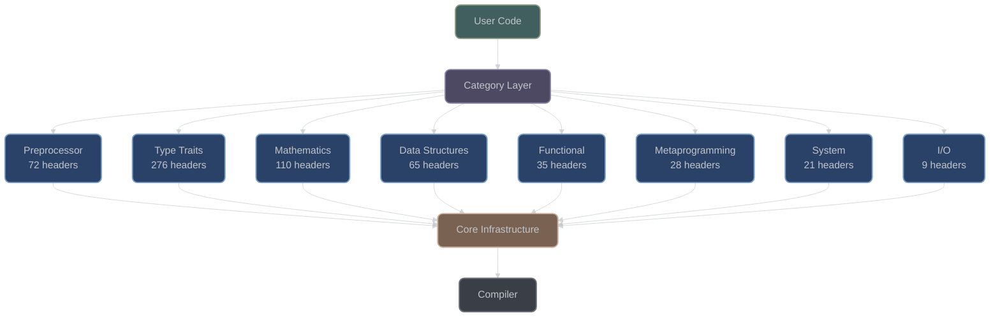

# Library Architecture

## Overview

XIEITE is a comprehensive, header-only C++20/23 utility library designed for maximum performance, compile-time optimization, and zero runtime overhead. With 616 headers organized into 8 categories, it provides advanced template metaprogramming utilities, mathematical functions, data structures, and system abstractions.

## Core Design Principles

### 1. Header-Only Architecture

XIEITE follows a pure header-only design for several critical reasons:

- **Zero Build Complexity**: No compilation, linking, or dependency management required
- **Optimal Inlining**: Compiler has full visibility for aggressive optimization
- **Template Instantiation**: Templates are instantiated in the user's translation unit
- **Cross-Platform Simplicity**: No platform-specific binaries to distribute

### 2. Compile-Time First

The library prioritizes compile-time computation wherever possible:

```cpp
// Runtime computation (traditional)
int factorial(int n) {
    return n <= 1 ? 1 : n * factorial(n - 1);
}

// XIEITE compile-time approach
constexpr auto factorial_5 = xieite::factorial<int>[5];  // Computed at compile time
```

### 3. Zero-Cost Abstractions

Every abstraction is designed to have zero runtime overhead:

```cpp
// XIEITE's arrow macros compile to optimal code
auto double_value(int x) XIEITE_ARROW(x * 2)
// Expands to: -> decltype(auto) noexcept(noexcept(x * 2)) { return x * 2; }
```

## Architectural Layers



## Category Organization

### Foundation Layer (pp, trait)
These categories provide the fundamental building blocks:
- **Preprocessor (pp)**: Macro system, platform detection, compile-time utilities
- **Type Traits (trait)**: Concepts, type queries, SFINAE helpers

### Computation Layer (math, meta)
Advanced compile-time and runtime computation:
- **Mathematics (math)**: Numeric algorithms, geometry, statistics
- **Metaprogramming (meta)**: Template manipulation, type lists, compile-time algorithms

### Application Layer (data, fn, sys, io)
High-level utilities for application development:
- **Data Structures (data)**: Containers, strings, iterators
- **Functional (fn)**: Memoization, argument manipulation, scope guards
- **System (sys)**: Process management, threading, memory operations
- **I/O (io)**: Terminal control, file operations, logging

## Header Organization

```
include/xieite/
├── <category>/
│   └── <utility>.hpp
```

Each header follows strict conventions:

```cpp
#ifndef XIEITE_HEADER_<CATEGORY>_<NAME>
#define XIEITE_HEADER_<CATEGORY>_<NAME>

#include <xieite/dependency.hpp>  // Minimal dependencies

namespace xieite {
    // All utilities in xieite namespace
}

#endif
```

## Dependency Management

### Internal Dependencies
Headers have carefully managed dependencies:
- Categories can depend on lower-level categories
- Circular dependencies are prohibited
- Most utilities are self-contained

### Dependency Hierarchy
```
pp (no dependencies)
  ↓
trait (depends on pp)
  ↓
meta (depends on trait, pp)
  ↓
math, data, fn (depend on meta, trait, pp)
  ↓
sys, io (depend on all lower layers)
```

### External Dependencies
XIEITE has **zero external dependencies**:
- Uses only standard C++ headers
- No third-party libraries required
- Platform APIs accessed through standard interfaces

## Compilation Model

### Template Instantiation
Templates are instantiated in user code:
```cpp
// User code
#include <xieite/math/factorial.hpp>

constexpr auto result = xieite::factorial<int>[5];  // Instantiated here
```

### Inline Expansion
All functions are inline-eligible:
```cpp
// Defined in header
inline auto compute(int x) noexcept {
    return x * 2;
}
// Compiler can inline at call site
```

### Compile-Time Evaluation
Extensive use of constexpr/consteval:
```cpp
template<std::size_t N>
consteval auto prime() noexcept {
    // Computed entirely at compile time
}
```

## Performance Characteristics

### Compile-Time Impact
- **First Compilation**: May be slower due to template instantiation
- **Incremental Builds**: Fast due to header guards and minimal dependencies
- **Optimization**: Aggressive inlining possible with -O2/-O3

### Runtime Performance
- **Zero Overhead**: Abstractions compile away completely
- **Optimal Code Generation**: Compiler has full visibility
- **No Virtual Dispatch**: Everything resolved at compile time

### Memory Footprint
- **No Runtime Library**: No shared library overhead
- **Template Bloat**: Managed through careful instantiation
- **Dead Code Elimination**: Unused templates aren't instantiated

## Platform Support

### Compiler Requirements
- **C++20**: Minimum requirement (concepts, ranges, coroutines)
- **C++23**: Optional features (explicit object parameter, if consteval)
- **GCC 10+**: Full support
- **Clang 11+**: Full support
- **MSVC 19.29+**: Full support with minor limitations

### Operating Systems
- **Linux**: Primary development platform
- **Windows**: Full support with platform-specific features
- **macOS**: Full support
- **BSD**: Community-tested support

### Architecture Support
- **x86_64**: Primary target
- **ARM64**: Full support
- **x86**: Limited testing
- **Others**: Should work, not officially tested

## Build System Integration

### CMake Integration
```cmake
find_package(xieite REQUIRED)
target_link_libraries(my_app PRIVATE xieite::xieite)
```

### Manual Integration
```bash
g++ -std=c++23 -I/path/to/xieite/include my_app.cpp
```

### Package Managers
- **vcpkg**: Community maintained
- **Conan**: Planned support
- **Build2**: Planned support

## Version Management

### Versioning Scheme
- **Major.Minor.Patch**: Semantic versioning
- **Current**: 0.118.2
- **API Stability**: Breaking changes in minor versions before 1.0

### Version Detection
```cpp
#include <xieite/pp/ver.hpp>

static_assert(XIEITE_VER_MAJOR == 0);
static_assert(XIEITE_VER_MINOR == 118);
static_assert(XIEITE_VER_PATCH == 2);
```

## Quality Assurance

### Testing Strategy
- **Compile-Time Tests**: static_assert validation
- **Concept Checking**: Requirements validated at instantiation
- **Platform CI**: Automated testing on multiple platforms

### Documentation
- **Forensic Accuracy**: All behavior verified against implementation
- **Complete Coverage**: All 616 headers documented
- **Examples**: Working code for every major feature

## Design Patterns

### Arrow Macro Pattern
Concise function definitions:
```cpp
auto fn(int x) XIEITE_ARROW(x * 2)
// Expands to complete function with deduced return and noexcept
```

### Concept-Based Overloading
```cpp
template<typename T>
    requires xieite::is_arithmetic<T>
auto process(T value) { /* numeric processing */ }

template<typename T>
    requires xieite::is_string_like<T>
auto process(T value) { /* string processing */ }
```

### CRTP for Static Polymorphism
```cpp
template<typename Derived>
struct base {
    auto interface() XIEITE_ARROW(
        static_cast<Derived*>(this)->implementation()
    )
};
```

## Error Handling Philosophy

### Compile-Time Errors
Prefer compile-time errors over runtime:
```cpp
template<typename T>
    requires std::integral<T>  // Fails at compile time if not integral
auto process(T value);
```

### Static Assertions
Clear error messages:
```cpp
static_assert(sizeof(T) <= 8,
    "XIEITE: Type too large for optimization");
```

### Noexcept by Default
Most utilities are noexcept:
```cpp
auto compute() noexcept;  // Won't throw
```

## Future Directions

### Planned Enhancements
- **C++26 Support**: Reflection, pattern matching
- **Coroutine Utilities**: Generator patterns, async helpers
- **SIMD Abstractions**: Portable vectorization
- **Networking**: Header-only networking utilities

### API Evolution
- **1.0 Release**: API stabilization planned
- **Module Support**: C++20 modules when widely supported
- **Concepts Library**: Expanded concept definitions

---

*Next: [Header-Only Design](header_only.md) | [Macro System](macro_system.md)*
