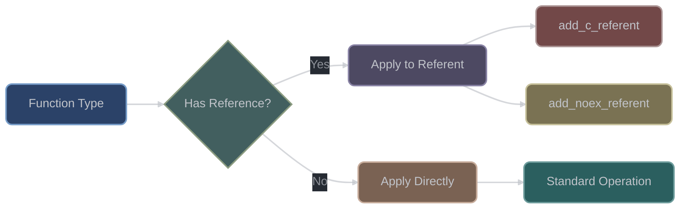

# Type Traits Architecture

## Overview

XIEITE's type traits system represents one of the library's largest and most comprehensive modules, containing 276 header files that extend and enhance the C++ standard library's type traits facilities. The architecture emphasizes composability, consistency, and compile-time performance through careful design of naming conventions, dependency management, and template metaprogramming patterns.

## Core Design Philosophy

### Concept-First Design

```cpp
// Traditional type trait (C++11 style)
template<typename T>
struct is_arithmetic : std::integral_constant<bool,
    std::is_integral_v<T> || std::is_floating_point_v<T>> {};

// XIEITE concept-based approach
template<typename T>
concept is_arith = std::integral<T> || std::floating_point<T>;
```

The library prioritizes C++20 concepts over traditional SFINAE-based traits, providing:
- Better error messages at point of instantiation
- Cleaner syntax for constraints
- Direct subsumption relationships
- Reduced compilation overhead

### Naming Convention System

XIEITE employs a systematic abbreviation scheme for type traits to maintain consistency across 276 headers:

| Abbreviation | Full Term | Example Usage |
|-------------|-----------|---------------|
| `c` | const | `add_c`, `rm_c`, `is_c` |
| `v` | volatile | `add_v`, `rm_v`, `is_v` |
| `cv` | const volatile | `add_cv`, `rm_cv`, `is_cv` |
| `ref` | reference | `add_ref`, `rm_ref`, `is_ref` |
| `lref` | lvalue reference | `add_lref`, `is_lref` |
| `rref` | rvalue reference | `add_rref`, `is_rref` |
| `ptr` | pointer | `add_ptr`, `rm_ptr`, `is_ptr` |
| `noex` | noexcept | `add_noex_referent`, `is_noex_fn` |
| `ctor` | constructor | `has_ctor`, `has_default_ctor` |
| `dtor` | destructor | `has_dtor`, `has_virtual_dtor` |
| `cp` | copy | `cp_c`, `has_cp_ctor`, `cp_cv` |
| `mv` | move | `has_mv_ctor`, `has_mv_assign` |
| `arith` | arithmetic | `is_arith` |
| `fn` | function | `is_fn`, `get_fn_ret` |

## Architectural Layers

### Layer 1: Primitive Operations

The foundation layer provides basic type manipulations:

```cpp
// Remove operations (rm_*)
template<typename T>
using rm_c = /* implementation */;

template<typename T>
using rm_v = /* implementation */;

template<typename T>
using rm_ref = /* implementation */;
```

### Layer 2: Composite Operations

Building on primitives, composite operations handle multiple qualifiers:

```cpp
// Copy operations (cp_*)
template<typename From, typename To>
using cp_c = /* copies const from From to To */;

template<typename From, typename To>
using cp_cv = /* copies const and volatile */;

template<typename From, typename To>
using cp_cvref = /* copies cv-qualifiers and reference */;
```

### Layer 3: Query Traits

Query traits extract information about types:

```cpp
// Get operations (get_*)
template<typename Fn>
using get_fn_ret = /* extract return type */;

template<typename Fn>
using get_fn_args = /* extract argument types */;

template<typename MemberPtr>
using get_member_ptr_class = /* extract class type */;
```

### Layer 4: Predicate Traits

Predicate traits test type properties:

```cpp
// Has operations (has_*)
template<typename T>
concept has_default_ctor = /* test for default constructor */;

template<typename T>
concept has_virtual_dtor = /* test for virtual destructor */;

// Is operations (is_*)
template<typename T>
concept is_trivially_copyable = /* test trivial copyability */;
```

## Reference Type Handling

### The Referent System

XIEITE introduces a unique "referent" suffix convention for operations on function types:



```cpp
// Standard operation on value type
using T1 = add_c<int>;  // const int

// Referent operation on function type
using F1 = void();
using F2 = add_c_referent<F1>;  // void() const

// Works with member function pointers
using M1 = void (Class::*)();
using M2 = add_noex_referent<M1>;  // void (Class::*)() noexcept
```

## Dependency Management

### Minimal Dependency Principle

Each trait header includes only the minimum required dependencies:

```cpp
// is_arith.hpp - minimal dependencies
#include <concepts>  // Only what's needed

namespace xieite {
    template<typename T>
    concept is_arith = std::integral<T> || std::floating_point<T>;
}
```

### Layered Include Strategy

Complex traits build on simpler ones through careful includes:

```cpp
// rm_c.hpp - composed from primitives
#include <type_traits>
#include "../trait/cp_ref.hpp"    // Copy reference
#include "../trait/rm_ref.hpp"    // Remove reference

namespace xieite {
    template<typename T>
    using rm_c = cp_ref<T, std::remove_const_t<rm_ref<T>>>;
}
```

## Compile-Time Performance

### Instantiation Minimization

Traits avoid unnecessary template instantiations:

```cpp
// Bad: Forces instantiation of multiple traits
template<typename T>
struct is_numeric {
    static constexpr bool value =
        is_integral<T>::value ||
        is_floating_point<T>::value;
};

// Good: Leverages concept short-circuiting
template<typename T>
concept is_numeric = std::integral<T> || std::floating_point<T>;
```

### Alias Template Optimization

Type aliases prevent intermediate type generation:

```cpp
// Direct alias - no intermediate struct
template<typename T>
using add_ptr = T*;

// Avoids struct wrapper overhead
template<typename T>
using decay = std::decay_t<T>;
```

## Extension Mechanisms

### Custom Trait Creation

The architecture supports user-defined traits following XIEITE patterns:

```cpp
// User trait following XIEITE conventions
template<typename T>
concept is_serializable = requires(T t) {
    { t.serialize() } -> std::convertible_to<std::string>;
    { T::deserialize(std::string{}) } -> std::same_as<T>;
};

// Composed trait using XIEITE primitives
template<typename T>
using serializable_value = rm_cvref<T>;
```

### STL Interoperability

XIEITE traits seamlessly integrate with standard traits:

```cpp
// Combining XIEITE and STL traits
template<typename T>
concept copyable_arithmetic =
    xieite::is_arith<T> &&
    std::is_trivially_copyable_v<T>;

// Using XIEITE traits in STL contexts
template<xieite::is_numeric auto N>
constexpr auto square = N * N;
```

## Special Categories

### Constructor/Destructor Traits

Comprehensive constructor and destructor analysis:

```cpp
// Constructor detection
has_default_ctor<T>      // Default constructible
has_cp_ctor<T>           // Copy constructible
has_mv_ctor<T>           // Move constructible
has_ctor<T, Args...>     // Constructible from Args
has_brace_ctor<T, Args...> // Brace-initializable

// Destructor properties
has_dtor<T>              // Has destructor
has_virtual_dtor<T>      // Virtual destructor
has_trivial_dtor<T>      // Trivial destructor
has_noex_dtor<T>         // Noexcept destructor
```

### Triviality Analysis

Complete triviality checking system:

```cpp
has_trivial_default_ctor<T>
has_trivial_cp_ctor<T>
has_trivial_cp_assign<T>
has_trivial_mv_ctor<T>
has_trivial_mv_assign<T>
has_trivial_dtor<T>
```

### Noexcept Specifications

Systematic noexcept detection:

```cpp
has_noex_default_ctor<T>
has_noex_cp_ctor<T>
has_noex_mv_ctor<T>
has_noex_cp_assign<T>
has_noex_mv_assign<T>
has_noex_dtor<T>
```

## Usage Patterns

### Constraint Composition

```cpp
template<typename T>
concept arithmetic_value =
    xieite::is_arith<T> &&
    !xieite::is_ref<T> &&
    !xieite::is_cv<T>;

template<arithmetic_value T>
T normalize(T value) {
    return value / std::abs(value);
}
```

### Type Manipulation Chains

```cpp
template<typename T>
using base_type = xieite::rm_ptr<
    xieite::rm_ref<
        xieite::rm_cv<T>
    >
>;

// Or using decay
template<typename T>
using decayed = xieite::decay<T>;
```

### SFINAE Helpers

```cpp
// Using traits for SFINAE
template<typename T, typename = void>
struct serializer {
    // Default implementation
};

template<typename T>
struct serializer<T, std::enable_if_t<xieite::is_arith<T>>> {
    // Arithmetic specialization
};
```

## Implementation Details

### Concept Subsumption

Traits leverage concept subsumption for overload resolution:

```cpp
template<typename T>
concept numeric = xieite::is_arith<T>;

template<typename T>
concept integral = numeric<T> && std::integral<T>;

// integral subsumes numeric, enabling proper overload selection
void process(numeric auto x) { /* general */ }
void process(integral auto x) { /* specialized */ }
```

### Reference Collapsing

Reference manipulation traits handle collapsing rules:

```cpp
// collapse_ref handles reference collapsing
template<typename T>
using collapse_ref = /* implementation handles T&& + & = & */;

// Used in perfect forwarding scenarios
template<typename T>
using forward_type = collapse_ref<T&&>;
```

## Best Practices

### 1. Prefer Concepts Over Type Traits

```cpp
// Prefer this
template<xieite::is_arith T>
void compute(T value);

// Over this
template<typename T>
    requires xieite::is_arith<T>
void compute(T value);
```

### 2. Use Appropriate Trait Categories

```cpp
// For type manipulation
using base = xieite::rm_cvref<T>;

// For type queries
if constexpr (xieite::has_virtual_dtor<T>) {
    // Handle polymorphic type
}

// For constraints
template<xieite::is_trivially_copyable T>
void fast_copy(T* dst, const T* src, std::size_t n);
```

### 3. Compose Complex Traits

```cpp
template<typename T>
concept safe_numeric =
    xieite::is_arith<T> &&
    !xieite::is_ptr<T> &&
    !xieite::is_ref<T> &&
    sizeof(T) >= 4;
```

## Performance Considerations

### Compilation Speed

- Concepts compile faster than traditional SFINAE
- Alias templates avoid struct instantiation overhead
- Minimal includes reduce preprocessing time
- Header guards use consistent naming pattern

### Runtime Performance

- All traits are compile-time only (zero runtime cost)
- No virtual functions or RTTI required
- Concepts enable better optimization opportunities
- constexpr evaluation where applicable

## Future Evolution

The type traits architecture is designed to accommodate:

- Additional C++23/26 trait categories
- Extended reflection capabilities
- Compile-time type manipulation
- Custom trait generation macros
- Integration with reflection TS

## Summary

XIEITE's type traits architecture provides a comprehensive, efficient, and extensible system for compile-time type manipulation and inspection. Through careful layering, consistent naming, and modern C++ features, it offers both power and usability while maintaining zero runtime overhead. The 276 trait headers work together as a cohesive system, enabling sophisticated template metaprogramming while keeping individual components simple and focused.
