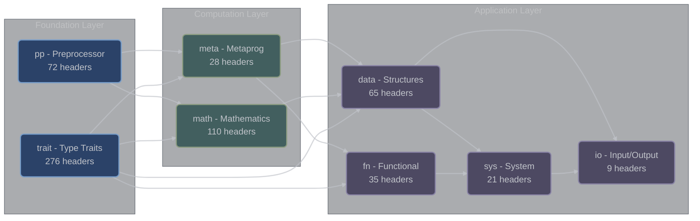

# Categories Overview

## XIEITE Library Organization

XIEITE's 616 headers are organized into 8 carefully designed categories, each serving a specific purpose in the library's architecture. This modular organization ensures clear separation of concerns, manageable dependencies, and intuitive navigation.

## Category Summary

| Category | Headers | Purpose | Primary Focus |
|----------|---------|---------|---------------|
| **[trait](trait/)** | 276 | Type traits and concepts | Compile-time type introspection |
| **[pp](pp/)** | 72 | Preprocessor utilities | Macros and compile-time code generation |
| **[math](math/)** | 110 | Mathematical functions | Algorithms, constants, and computations |
| **[data](data/)** | 65 | Data structures | Containers, strings, and algorithms |
| **[fn](fn/)** | 35 | Functional programming | Function composition and utilities |
| **[meta](meta/)** | 28 | Metaprogramming | Template manipulation and type lists |
| **[sys](sys/)** | 21 | System utilities | OS interaction and hardware access |
| **[io](io/)** | 9 | Input/Output | Terminal, files, and logging |

## Architectural Layers



## Category Dependencies

### Foundation Layer
The foundation layer provides the basic building blocks:

- **pp (Preprocessor)**: No dependencies, provides macro infrastructure
- **trait (Type Traits)**: Depends only on pp, provides type introspection

### Computation Layer
Built on the foundation, these categories enable complex compile-time operations:

- **math (Mathematics)**: Uses pp macros and trait concepts
- **meta (Metaprogramming)**: Leverages both pp and trait extensively

### Application Layer
High-level utilities that combine lower-layer functionality:

- **data (Data Structures)**: Uses traits for type checking, meta for manipulation
- **fn (Functional)**: Employs traits and meta for function composition
- **sys (System)**: Builds on data structures and functional utilities
- **io (I/O)**: Uses all lower layers for comprehensive I/O operations

## Category Highlights

### Type Traits (trait) - 276 Headers
The largest category, providing comprehensive type introspection:
- **Concepts**: 150+ concept definitions for C++20
- **Type Queries**: Detection of type properties
- **Type Modifications**: Add/remove qualifiers
- **SFINAE Helpers**: Enable conditional compilation

```cpp
// Example: Detecting container types
template<typename T>
concept container = xieite::is_container<T>;

// Example: Type modification
using const_ptr = xieite::add_ptr<const int>;  // const int*
```

### Preprocessor (pp) - 72 Headers
Sophisticated macro system including the famous Arrow macros:
- **Arrow Macros**: 8 function definition macros
- **Token Manipulation**: Advanced preprocessor techniques
- **Platform Detection**: Cross-platform compilation
- **Utility Macros**: Common patterns simplified

```cpp
// Arrow macro example
auto double_value(int x) XIEITE_ARROW(x * 2)
```

### Mathematics (math) - 110 Headers
Comprehensive mathematical utilities:
- **Algorithms**: Prime numbers, factorials, combinations
- **Geometry**: 2D/3D operations, transformations
- **Statistics**: Mean, median, standard deviation
- **Constants**: Mathematical constants with arbitrary precision

```cpp
// Compile-time computation
constexpr auto factorial_10 = xieite::fact<10>;
static_assert(factorial_10 == 3628800);
```

### Data Structures (data) - 65 Headers
Modern data structure implementations:
- **Containers**: Fixed-size, compile-time containers
- **Strings**: String manipulation and parsing
- **Algorithms**: Container operations
- **Iterators**: Advanced iterator utilities

```cpp
// Fixed string for compile-time use
xieite::fixed_str<32> name = "XIEITE";
```

### Functional Programming (fn) - 35 Headers
Functional programming patterns:
- **Composition**: Function chaining and composition
- **Currying**: Partial application
- **Guards**: Scope and exception guards
- **Memoization**: Automatic result caching

```cpp
// Currying example
auto add = /* Manual currying */
auto add5 = add(5);
auto result = add5(3);  // 8
```

### Metaprogramming (meta) - 28 Headers
Advanced template metaprogramming:
- **Type Lists**: Compile-time type containers
- **Fold Operations**: Variadic reductions
- **Compile-Time Loops**: Template-based iteration
- **Aggregate Introspection**: Struct member detection

```cpp
// Type list operations
using types = xieite::type_list<int, double, char>;
using reversed = types::reverse;  // char, double, int
```

### System Utilities (sys) - 21 Headers
Platform interaction and system operations:
- **Process Management**: Execution and control
- **Threading**: Thread pools and synchronization
- **Memory Operations**: Aligned operations, secure erasure
- **Hardware Info**: CPU, memory queries

```cpp
// Thread pool usage
xieite::thread_pool pool(xieite::nproc());
auto future = pool.enqueue([] { return compute(); });
```

### Input/Output (io) - 9 Headers
Comprehensive I/O operations:
- **Terminal Control**: Full ANSI escape sequence support
- **File Operations**: Cross-platform file handling
- **Logging**: Structured, colored logging
- **Input Handling**: Keyboard and stream input

```cpp
// Terminal control
xieite::term terminal;
terminal.fg(255, 0, 0);  // Red text
terminal.bold(true);
std::cout << "Error!" << std::endl;
terminal.reset_style();
```

## Usage Patterns

### Layered Dependencies
When using XIEITE, understand the dependency layers:

1. **Start with traits**: Most utilities require type trait concepts
2. **Add preprocessing**: Many features use arrow macros
3. **Build up**: Higher-level categories combine lower-level features

### Category Combinations
Common usage patterns combine multiple categories:

```cpp
// Combining trait, math, and fn
template<typename T>
    requires xieite::is_arithmetic<T>  // trait
auto compute(T value) {
    auto doubled = /* Manual currying */
        [](T x) { return x * 2; }
    );
    return doubled(xieite::abs(value)); // math
}
```

### Performance Considerations

Different categories have different performance characteristics:

- **pp, trait, meta**: Zero runtime cost (compile-time only)
- **math**: Mix of compile-time and optimized runtime
- **data, fn**: Runtime with heavy inlining
- **sys, io**: System call overhead

## Best Practices

### 1. Include What You Use
Include only the specific headers needed:

```cpp
#include <xieite/math/abs.hpp>      // Just abs function
#include <xieite/trait/is_arithmetic.hpp>  // Just the concept
```

### 2. Understand Dependencies
Check header dependencies to avoid surprises:

```cpp
// This header might pull in others
#include <xieite/meta/type_list.hpp>
// Automatically includes trait headers
```

### 3. Leverage Compile-Time
Prefer compile-time features when possible:

```cpp
// Compile-time computation
constexpr auto value = xieite::fact<5>;

// Instead of runtime
auto value = factorial(5);
```

### 4. Use Appropriate Categories
Choose the right tool for the job:

- **Type checking**: Use trait/
- **Code generation**: Use pp/
- **Algorithms**: Check math/ first
- **Containers**: Look in data/
- **Function utilities**: Explore fn/
- **Template magic**: Dive into meta/
- **System calls**: Find in sys/
- **I/O operations**: Check io/

## Category Statistics

### Size Distribution
```
trait: ████████████████████████████████████ 44.8% (276)
math:  ███████████████ 17.9% (110)
pp:    ██████████ 11.7% (72)
data:  █████████ 10.6% (65)
fn:    █████ 5.7% (35)
meta:  ████ 4.5% (28)
sys:   ███ 3.4% (21)
io:    █ 1.5% (9)
```

### Complexity Distribution
- **High Complexity**: trait, meta, pp (template-heavy)
- **Medium Complexity**: math, data, fn (algorithm-focused)
- **Lower Complexity**: sys, io (wrapper-focused)

## Navigation Guide

Each category has its own detailed documentation:

1. **[Preprocessor Utilities (`pp`)](pp/)** - Start here for macro system
2. **[Type Traits (`trait`)](trait/)** - Foundation for type checking
3. **[Mathematics (`math`)](math/)** - Mathematical algorithms
4. **[Data Structures (`data`)](data/)** - Containers and algorithms
5. **[Functional Programming (`fn`)](fn/)** - Function utilities
6. **[Metaprogramming (`meta`)](meta/)** - Template metaprogramming
7. **[System Utilities (`sys`)](sys/)** - System interaction
8. **[Input/Output (`io`)](io/)** - I/O operations

## Quick Start Examples

### Example 1: Type-Safe Math
```cpp
#include <xieite/trait/is_arithmetic.hpp>
#include <xieite/math/abs.hpp>
#include <xieite/pp/arrow.hpp>

template<typename T>
    requires xieite::is_arithmetic<T>
auto safe_abs(T value) XIEITE_ARROW(xieite::abs(value))
```

### Example 2: Compile-Time Strings
```cpp
#include <xieite/data/fixed_str.hpp>
#include <xieite/meta/type_list.hpp>

using name = xieite::fixed_str<"XIEITE">;
using types = xieite::type_list<int, double>;
```

### Example 3: System Information
```cpp
#include <xieite/sys/nproc.hpp>
#include <xieite/io/log.hpp>

xieite::log::info("System has {} CPU cores", xieite::nproc());
```

---

*Start Exploring: [Type Traits](trait/) | [Preprocessor](pp/) | [Mathematics](math/)*
