# Data Structures and Utilities (`data/`)

The `data/` category provides a comprehensive collection of data structures, containers, and data manipulation utilities. With 65 headers, it offers fixed-size containers, string utilities, character processing, and advanced searching algorithms.

## Overview

```mermaid
---
config:
    theme: 'base'
    curve: 'straight'
    themeVariables:
        darkMode: true
        clusterBkg: '#22272f62'
        clusterBorder: '#6a6f77ff'
        clusterTextColor: '#6a6f77ff'
        lineColor: '#C1C4CAAA'
        background: '#262B33'
        primaryColor: '#2b4268ff'
        primaryTextColor: '#C1C4CAff'
        primaryBorderColor: '#6a6f77ff'
        primaryLabelBkg: '#262B33'
        secondaryColor: '#425f5fff'
        secondaryBorderColor: '#8c9c81ff'
        secondaryTextColor: '#C1C4CAff'
        tertiaryColor: '#4d4962ff'
        tertiaryBorderColor: '#8983a5ff'
        tertiaryTextColor: '#eeeeee55'
        nodeTextColor: '#C1C4CA'
        defaultLinkColor: '#C1C4CA'
        edgeLabelBackground: '#262B33'
        edgeLabelBorderColor: '#C1C4CAff'
        labelTextColor: '#ffffff'
        errorBkgColor: '#724848ff'
        errorTextColor: '#C1C4CA'
        flowchart:
            curve: 'basis'
            nodeSpacing: 50
            rankSpacing: 50
            subGraphTitleMargin:
                top: 15
                bottom: 15
                left: 15
                right: 15
---
flowchart LR
    Data[data/]

    Data --> Fixed[Fixed Containers]
    Data --> Str[String Utilities]
    Data --> Char[Character Processing]
    Data --> Search[Search & Find]
    Data --> Manip[Data Manipulation]

    Fixed --> fixed_array[fixed_array.hpp]
    Fixed --> fixed_str[fixed_str.hpp]
    Fixed --> fixed_map[fixed_map.hpp]
    Fixed --> fixed_set[fixed_set.hpp]
    Fixed --> fixed_md[fixed_md_container.hpp]

    Str --> trim[trim.hpp]
    Str --> split[str_split.hpp]
    Str --> join[str_join.hpp]
    Str --> replace[str_replace.hpp]
    Str --> case[Case Conversion]

    Char --> isalpha[isalpha.hpp]
    Char --> isdigit[isdigit.hpp]
    Char --> isalnum[isalnum.hpp]
    Char --> isspace[isspace.hpp]
    Char --> iscntrl[iscntrl.hpp]

    Search --> find_occur[find_occur.hpp]
    Search --> find_consec[find_most_consec.hpp]
    Search --> between[between.hpp]
    Search --> after[after/before.hpp]

    Manip --> reverse[reverse.hpp]
    Manip --> rotate[rotate.hpp]
    Manip --> unique[unique.hpp]
    Manip --> sort[sort_stable.hpp]

    style Data fill:#0d1117,stroke:#58a6ff,stroke-width:2px,color:#c9d1d9
    style Fixed fill:#161b22,stroke:#58a6ff,stroke-width:2px,color:#c9d1d9
    style Str fill:#161b22,stroke:#58a6ff,stroke-width:2px,color:#c9d1d9
    style Char fill:#161b22,stroke:#58a6ff,stroke-width:2px,color:#c9d1d9
    style Search fill:#161b22,stroke:#58a6ff,stroke-width:2px,color:#c9d1d9
    style Manip fill:#161b22,stroke:#58a6ff,stroke-width:2px,color:#c9d1d9


    linkStyle default stroke:#C1C4CAaa,stroke-width:2px,color:#C1C4CAaa

    style Data fill:#2b4268ff,stroke:#779DC9ff,stroke-width:2px,color:#C1C4CA,rx:8,ry:8
    style Fixed fill:#425f5fff,stroke:#8c9c81ff,stroke-width:2px,color:#C1C4CA,rx:8,ry:8
    style Str fill:#4d4962ff,stroke:#8983a5ff,stroke-width:2px,color:#C1C4CA,rx:8,ry:8
    style Char fill:#7a6253ff,stroke:#c7ac9bff,stroke-width:2px,color:#C1C4CA,rx:8,ry:8
    style Search fill:#724848ff,stroke:#ac9696ff,stroke-width:2px,color:#C1C4CA,rx:8,ry:8
    style Manip fill:#425f5fff,stroke:#8c9c81ff,stroke-width:2px,color:#C1C4CA,rx:8,ry:8

    style fixed_array fill: #353748ff,stroke:#8c90a4ff,stroke-width:2px,color:#C1C4CA,rx:8,ry:8
    style fixed_str fill: #353748ff,stroke:#8c90a4ff,stroke-width:2px,color:#C1C4CA,rx:8,ry:8
    style fixed_map fill: #353748ff,stroke:#8c90a4ff,stroke-width:2px,color:#C1C4CA,rx:8,ry:8
    style fixed_set fill: #353748ff,stroke:#8c90a4ff,stroke-width:2px,color:#C1C4CA,rx:8,ry:8
    style fixed_md fill: #353748ff,stroke:#8c90a4ff,stroke-width:2px,color:#C1C4CA,rx:8,ry:8
    style trim fill: #353748ff,stroke:#8c90a4ff,stroke-width:2px,color:#C1C4CA,rx:8,ry:8
    style split fill: #353748ff,stroke:#8c90a4ff,stroke-width:2px,color:#C1C4CA,rx:8,ry:8
    style join fill: #353748ff,stroke:#8c90a4ff,stroke-width:2px,color:#C1C4CA,rx:8,ry:8
    style replace fill: #353748ff,stroke:#8c90a4ff,stroke-width:2px,color:#C1C4CA,rx:8,ry:8
    style case fill: #353748ff,stroke:#8c90a4ff,stroke-width:2px,color:#C1C4CA,rx:8,ry:8
    style isalpha fill: #353748ff,stroke:#8c90a4ff,stroke-width:2px,color:#C1C4CA,rx:8,ry:8
    style isdigit fill: #353748ff,stroke:#8c90a4ff,stroke-width:2px,color:#C1C4CA,rx:8,ry:8
    style isalnum fill: #353748ff,stroke:#8c90a4ff,stroke-width:2px,color:#C1C4CA,rx:8,ry:8
    style isspace fill: #353748ff,stroke:#8c90a4ff,stroke-width:2px,color:#C1C4CA,rx:8,ry:8
    style iscntrl fill: #353748ff,stroke:#8c90a4ff,stroke-width:2px,color:#C1C4CA,rx:8,ry:8
    style find_occur fill: #353748ff,stroke:#8c90a4ff,stroke-width:2px,color:#C1C4CA,rx:8,ry:8
    style find_consec fill: #353748ff,stroke:#8c90a4ff,stroke-width:2px,color:#C1C4CA,rx:8,ry:8
    style between fill: #353748ff,stroke:#8c90a4ff,stroke-width:2px,color:#C1C4CA,rx:8,ry:8
    style after fill: #353748ff,stroke:#8c90a4ff,stroke-width:2px,color:#C1C4CA,rx:8,ry:8
    style reverse fill: #353748ff,stroke:#8c90a4ff,stroke-width:2px,color:#C1C4CA,rx:8,ry:8
    style rotate fill: #353748ff,stroke:#8c90a4ff,stroke-width:2px,color:#C1C4CA,rx:8,ry:8
    style unique fill: #353748ff,stroke:#8c90a4ff,stroke-width:2px,color:#C1C4CA,rx:8,ry:8
    style sort fill: #353748ff,stroke:#8c90a4ff,stroke-width:2px,color:#C1C4CA,rx:8,ry:8
```



## Fixed-Size Containers

### Core Fixed Containers

#### `fixed_array<T, N>`
A fixed-size array with compile-time size and enhanced functionality:
```cpp
#include <xieite/data/fixed_array.hpp>

// Create fixed array from initializer list
xieite::fixed_array<int, 5> arr = {1, 2, 3, 4, 5};

// Concatenate arrays
auto combined = arr1 + arr2;  // Result has size N1 + N2

// Slice operations
auto slice = arr.slice<1, 3>();  // Extract elements [1, 3)
```

#### `fixed_str<Char, N>`
Fixed-size string for compile-time string operations:
```cpp
#include <xieite/data/fixed_str.hpp>

// Compile-time string
xieite::fixed_str<char, 5> str = "hello";

// String concatenation at compile-time
constexpr auto full = str1 + str2;

// Character access
char c = str[0];
```

#### `fixed_map<K, V, N>`
Fixed-capacity map with compile-time size limit:
```cpp
#include <xieite/data/fixed_map.hpp>

// Fixed map with max 10 entries
xieite::fixed_map<int, std::string, 10> map;
map[1] = "one";
map[2] = "two";
```

#### `fixed_set<T, N>`
Fixed-capacity set with unique elements:
```cpp
#include <xieite/data/fixed_set.hpp>

xieite::fixed_set<int, 100> set;
set.insert(42);
bool has = set.contains(42);
```

### Multi-Dimensional Container

#### `fixed_md_container<T, Dims...>`
Fixed-size multi-dimensional container:
```cpp
#include <xieite/data/fixed_md_container.hpp>

// 3D array [4][5][6]
xieite::fixed_md_container<int, 4, 5, 6> tensor;
tensor[1][2][3] = 42;
```

## String Processing

### Text Manipulation

```mermaid
---
config:
    theme: 'base'
    curve: 'straight'
    themeVariables:
        darkMode: true
        clusterBkg: '#22272f62'
        clusterBorder: '#6a6f77ff'
        clusterTextColor: '#6a6f77ff'
        lineColor: '#C1C4CAAA'
        background: '#262B33'
        primaryColor: '#2b4268ff'
        primaryTextColor: '#C1C4CAff'
        primaryBorderColor: '#6a6f77ff'
        primaryLabelBkg: '#262B33'
        secondaryColor: '#425f5fff'
        secondaryBorderColor: '#8c9c81ff'
        secondaryTextColor: '#C1C4CAff'
        tertiaryColor: '#4d4962ff'
        tertiaryBorderColor: '#8983a5ff'
        tertiaryTextColor: '#eeeeee55'
        nodeTextColor: '#C1C4CA'
        defaultLinkColor: '#C1C4CA'
        edgeLabelBackground: '#262B33'
        edgeLabelBorderColor: '#C1C4CAff'
        labelTextColor: '#ffffff'
        errorBkgColor: '#724848ff'
        errorTextColor: '#C1C4CA'
        flowchart:
            curve: 'basis'
            nodeSpacing: 50
            rankSpacing: 50
            subGraphTitleMargin:
                top: 15
                bottom: 15
                left: 15
                right: 15
---
flowchart TD
    Input[Input String]

    Input --> Trim[Trim]
    Input --> Split[Split]
    Input --> Replace[Replace]
    Input --> Case[Case Convert]

    Trim --> trim_start[trim_start]
    Trim --> trim_end[trim_end]
    Trim --> trim_all[trim]
    Split --> split_delim[By Delimiter]
    Split --> split_pred[By Predicate]
    Split --> split_lines[By Lines]
    Replace --> replace_all[Replace All]
    Replace --> replace_first[Replace First]
    Replace --> replace_last[Replace Last]
    Case --> to_upper[to_upper]
    Case --> to_lower[to_lower]
    Case --> to_title[to_title]

    linkStyle default stroke:#C1C4CAaa,stroke-width:2px,color:#C1C4CAaa

    style Input fill:#2b4268ff,stroke:#779DC9ff,stroke-width:2px,color:#C1C4CA,rx:8,ry:8
    style Trim fill:#425f5fff,stroke:#8c9c81ff,stroke-width:2px,color:#C1C4CA,rx:8,ry:8
    style Split fill:#4d4962ff,stroke:#8983a5ff,stroke-width:2px,color:#C1C4CA,rx:8,ry:8
    style Replace fill:#7a6253ff,stroke:#c7ac9bff,stroke-width:2px,color:#C1C4CA,rx:8,ry:8
    style Case fill:#724848ff,stroke:#ac9696ff,stroke-width:2px,color:#C1C4CA,rx:8,ry:8

    style trim_start fill: #353748ff,stroke:#8c90a4ff,stroke-width:2px,color:#C1C4CA,rx:8,ry:8
    style trim_end fill: #353748ff,stroke:#8c90a4ff,stroke-width:2px,color:#C1C4CA,rx:8,ry:8
    style trim_all fill: #353748ff,stroke:#8c90a4ff,stroke-width:2px,color:#C1C4CA,rx:8,ry:8
    style split_delim fill: #353748ff,stroke:#8c90a4ff,stroke-width:2px,color:#C1C4CA,rx:8,ry:8
    style split_pred fill: #353748ff,stroke:#8c90a4ff,stroke-width:2px,color:#C1C4CA,rx:8,ry:8
    style split_lines fill: #353748ff,stroke:#8c90a4ff,stroke-width:2px,color:#C1C4CA,rx:8,ry:8
    style replace_all fill: #353748ff,stroke:#8c90a4ff,stroke-width:2px,color:#C1C4CA,rx:8,ry:8
    style replace_first fill: #353748ff,stroke:#8c90a4ff,stroke-width:2px,color:#C1C4CA,rx:8,ry:8
    style replace_last fill: #353748ff,stroke:#8c90a4ff,stroke-width:2px,color:#C1C4CA,rx:8,ry:8
    style to_upper fill: #353748ff,stroke:#8c90a4ff,stroke-width:2px,color:#C1C4CA,rx:8,ry:8
    style to_lower fill: #353748ff,stroke:#8c90a4ff,stroke-width:2px,color:#C1C4CA,rx:8,ry:8
    style to_title fill: #353748ff,stroke:#8c90a4ff,stroke-width:2px,color:#C1C4CA,rx:8,ry:8
```



#### Trimming Functions
```cpp
#include <xieite/data/trim_front.hpp>
#include <xieite/data/trim_back.hpp>
#include <xieite/data/trim.hpp>

std::string s = "  hello  ";
auto trimmed = xieite::trim(s);           // "hello"
auto left = xieite::trim_front(s);        // "hello  "
auto right = xieite::trim_back(s);         // "  hello"
```

#### Splitting Functions
```cpp
#include <xieite/data/str_split.hpp>

std::string text = "a,b,c";
auto parts = xieite::str_split(text, ',');    // ["a", "b", "c"]

std::string lines = "line1\nline2\nline3";
auto line_vec = xieite::str_split(lines, '\n');
```

#### Joining Functions
```cpp
#include <xieite/data/str_join.hpp>

std::vector<std::string> parts = {"a", "b", "c"};
auto joined = xieite::str_join(parts, ", ");  // "a, b, c"
```

## Character Classification

### Unicode-Aware Character Tests

```cpp
#include <xieite/data/isalpha.hpp>
#include <xieite/data/isdigit.hpp>
#include <xieite/data/isalnum.hpp>
#include <xieite/data/isspace.hpp>

// Character classification
bool is_letter = xieite::isalpha('A');     // true
bool is_digit = xieite::isdigit('5');      // true
bool is_alnum = xieite::isalnum('X');      // true
bool is_space = xieite::isspace(' ');      // true
```

### Extended Character Sets

```cpp
#include <xieite/data/ispunct.hpp>
#include <xieite/data/iscntrl.hpp>
#include <xieite/data/isprint.hpp>
#include <xieite/data/isgraph.hpp>

bool is_punct = xieite::ispunct('!');      // true
bool is_ctrl = xieite::iscntrl('\n');      // true
bool is_print = xieite::isprint('A');      // true
bool is_graph = xieite::isgraph('#');      // true
```

## Search and Find Operations

### Advanced Search Algorithms

```mermaid
---
config:
    theme: 'base'
    curve: 'straight'
    themeVariables:
        darkMode: true
        clusterBkg: '#22272f62'
        clusterBorder: '#6a6f77ff'
        clusterTextColor: '#6a6f77ff'
        lineColor: '#C1C4CAAA'
        background: '#262B33'
        primaryColor: '#2b4268ff'
        primaryTextColor: '#C1C4CAff'
        primaryBorderColor: '#6a6f77ff'
        primaryLabelBkg: '#262B33'
        secondaryColor: '#425f5fff'
        secondaryBorderColor: '#8c9c81ff'
        secondaryTextColor: '#C1C4CAff'
        tertiaryColor: '#4d4962ff'
        tertiaryBorderColor: '#8983a5ff'
        tertiaryTextColor: '#eeeeee55'
        nodeTextColor: '#C1C4CA'
        defaultLinkColor: '#C1C4CA'
        edgeLabelBackground: '#262B33'
        edgeLabelBorderColor: '#C1C4CAff'
        labelTextColor: '#ffffff'
        errorBkgColor: '#724848ff'
        errorTextColor: '#C1C4CA'
        flowchart:
            curve: 'basis'
            nodeSpacing: 50
            rankSpacing: 50
            subGraphTitleMargin:
                top: 15
                bottom: 15
                left: 15
                right: 15
---
flowchart TB
    Search[Search Operations]

    Search --> Occur[Occurrence Finding]
    Search --> Consec[Consecutive Elements]
    Search --> Pos[Position-Based]
    Search --> Pred[Predicate-Based]

    Occur --> find_occur[find_occur]
    Occur --> find_nth[find_occur_if]

    Consec --> find_most[find_most_consec]
    Consec --> find_consec_if[find_most_consec_if]

    Pos --> after[after]
    Pos --> before[before]
    Pos --> between[between]

    Pred --> find_if[find_if variants]
    Pred --> count_if[count_if variants]

    linkStyle default stroke:#C1C4CAaa,stroke-width:2px,color:#C1C4CAaa

    style Search fill:#2b4268ff,stroke:#779DC9ff,stroke-width:2px,color:#C1C4CA,rx:8,ry:8
    style Occur fill:#425f5fff,stroke:#8c9c81ff,stroke-width:2px,color:#C1C4CA,rx:8,ry:8
    style Consec fill:#4d4962ff,stroke:#8983a5ff,stroke-width:2px,color:#C1C4CA,rx:8,ry:8
    style Pos fill:#7a6253ff,stroke:#c7ac9bff,stroke-width:2px,color:#C1C4CA,rx:8,ry:8
    style Pred fill:#724848ff,stroke:#ac9696ff,stroke-width:2px,color:#C1C4CA,rx:8,ry:8
    style find_occur fill: #353748ff,stroke:#8c90a4ff,stroke-width:2px,color:#C1C4CA,rx:8,ry:8
    style find_nth fill: #353748ff,stroke:#8c90a4ff,stroke-width:2px,color:#C1C4CA,rx:8,ry:8
    style find_most fill: #353748ff,stroke:#8c90a4ff,stroke-width:2px,color:#C1C4CA,rx:8,ry:8
    style find_consec_if fill: #353748ff,stroke:#8c90a4ff,stroke-width:2px,color:#C1C4CA,rx:8,ry:8
    style after fill: #353748ff,stroke:#8c90a4ff,stroke-width:2px,color:#C1C4CA,rx:8,ry:8
    style before fill: #353748ff,stroke:#8c90a4ff,stroke-width:2px,color:#C1C4CA,rx:8,ry:8
    style between fill: #353748ff,stroke:#8c90a4ff,stroke-width:2px,color:#C1C4CA,rx:8,ry:8
    style find_if fill: #353748ff,stroke:#8c90a4ff,stroke-width:2px,color:#C1C4CA,rx:8,ry:8
    style count_if fill: #353748ff,stroke:#8c90a4ff,stroke-width:2px,color:#C1C4CA,rx:8,ry:8
```



#### Finding Occurrences
```cpp
#include <xieite/data/find_occur.hpp>
#include <xieite/data/find_occur_if.hpp>

std::vector<int> v = {1, 2, 3, 2, 4, 2};

// Find nth occurrence
auto it = xieite::find_occur(v, 2, 2);  // Find 2nd occurrence of value 2

// Find with predicate
auto pred_it = xieite::find_occur_if(v,
    [](int x) { return x > 2; }, 1);     // Find 1st element > 2
```

#### Finding Consecutive Elements
```cpp
#include <xieite/data/find_most_consec.hpp>
#include <xieite/data/find_most_consec_if.hpp>

std::vector<int> v = {1, 1, 1, 2, 2, 3};

// Find longest consecutive sequence
auto [begin, end] = xieite::find_most_consec(v);

// Find consecutive with predicate
auto [p_begin, p_end] = xieite::find_most_consec_if(v,
    [](int x) { return x % 2 == 0; });
```

#### Position-Based Access
```cpp
#include <xieite/data/after.hpp>
#include <xieite/data/before.hpp>
#include <xieite/data/between.hpp>

std::string s = "hello:world:test";

// Get substring after delimiter
auto after_colon = xieite::after(s, ':');        // "world:test"
auto after_last = xieite::after_last(s, ':');    // "test"

// Get substring before delimiter
auto before_colon = xieite::before(s, ':');      // "hello"
auto before_last = xieite::before_last(s, ':');  // "hello:world"

// Get substring between delimiters
auto between = xieite::between(s, ':', ':');     // "world"
```

## Data Manipulation

### Container Operations

#### Reversing
```cpp
#include <xieite/data/reverse.hpp>

std::vector<int> v = {1, 2, 3, 4, 5};
xieite::reverse(v);  // v becomes {5, 4, 3, 2, 1}
```

#### Rotating
```cpp
#include <xieite/data/rotate.hpp>

std::vector<int> v = {1, 2, 3, 4, 5};
xieite::rotate(v, 2);  // v becomes {3, 4, 5, 1, 2}
```

#### Unique Elements
```cpp
#include <xieite/data/unique.hpp>

std::vector<int> v = {1, 2, 2, 3, 3, 3};
xieite::unique(v);  // v becomes {1, 2, 3}
```

#### Stable Sorting
```cpp
#include <xieite/data/sort_stable.hpp>

std::vector<std::pair<int, int>> v = {{1, 5}, {2, 3}, {1, 2}};
xieite::sort_stable(v, [](const auto& a, const auto& b) {
    return a.first < b.first;
});  // Maintains relative order of equal elements
```

## Specialized Utilities

### Character Set Constants

```cpp
#include <xieite/data/chars.hpp>

namespace xieite::chars {
    // Predefined character sets
    constexpr std::string_view digits = "0123456789";
    constexpr std::string_view uppercase = "ABCDEFGHIJKLMNOPQRSTUVWXYZ";
    constexpr std::string_view lowercase = "abcdefghijklmnopqrstuvwxyz";
    constexpr std::string_view alphanumeric = /* digits + letters */;
    constexpr std::string_view hexadecimal = "0123456789ABCDEFabcdef";
    constexpr std::string_view whitespace = " \t\n\r\f\v";
}
```

### Case-Insensitive Comparison

```cpp
#include <xieite/data/cmp_ignore_case.hpp>

bool equal = xieite::cmp_ignore_case("Hello", "HELLO");  // true
```

### Number String Configuration

```cpp
#include <xieite/data/number_str_config.hpp>

xieite::number_str_config config;
config.digits = "0123456789ABCDEF";  // Hexadecimal
config.precision = 10;
config.minus = "-";
config.plus = "+";
config.point = ".";
```

## Performance Characteristics

### Fixed Containers
- **Compile-time size**: No dynamic allocation
- **Stack allocation**: Better cache locality
- **Zero overhead**: No indirection for element access
- **Constexpr support**: Usable at compile-time

### String Operations
- **View-based**: Minimal copying when possible
- **Range support**: Works with C++20 ranges
- **Unicode aware**: Proper character handling
- **Memory efficient**: In-place operations when feasible

### Search Algorithms
- **Linear complexity**: O(n) for most searches
- **Iterator-based**: Works with any container
- **Predicate support**: Flexible matching
- **Early termination**: Stops at first match

## Design Philosophy

The data/ category follows these principles:

1. **Fixed-size preference**: Compile-time sizes for predictability
2. **Zero allocation**: Stack-based containers when possible
3. **Range compatibility**: Full C++20 ranges support
4. **Constexpr everything**: Maximum compile-time computation
5. **View semantics**: Minimize unnecessary copies
6. **Unicode correctness**: Proper character handling

## Integration Examples

### Building a Token Parser
```cpp
#include <xieite/data/split.hpp>
#include <xieite/data/trim.hpp>
#include <xieite/data/isalnum.hpp>

std::vector<std::string> tokenize(std::string_view input) {
    auto lines = xieite::split_lines(input);
    std::vector<std::string> tokens;

    for (const auto& line : lines) {
        auto trimmed = xieite::trim(line);
        auto parts = xieite::split(trimmed, ' ');

        for (const auto& part : parts) {
            if (!part.empty() && xieite::isalnum(part[0])) {
                tokens.push_back(part);
            }
        }
    }

    return tokens;
}
```

### Fixed Configuration Storage
```cpp
#include <xieite/data/fixed_map.hpp>
#include <xieite/data/fixed_str.hpp>

template<std::size_t N>
class Config {
    xieite::fixed_map<
        xieite::fixed_str<char, 32>,  // Key
        xieite::fixed_str<char, 256>, // Value
        N
    > settings;

public:
    void set(std::string_view key, std::string_view value) {
        settings[xieite::fixed_str<char, 32>(key)] =
            xieite::fixed_str<char, 256>(value);
    }

    auto get(std::string_view key) const {
        return settings.find(xieite::fixed_str<char, 32>(key));
    }
};
```

## See Also

- [Functional Utilities](../fn/) - Functional programming support
- [Meta Programming](../meta/) - Template metaprogramming
- [Type Traits](../trait/) - Type introspection
- [Math Functions](../math/) - Mathematical operations
