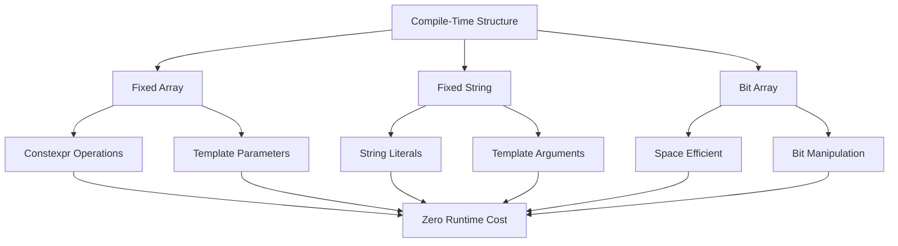

# Compile-Time Structures

## Overview

XIEITE's compile-time data structures enable zero-runtime-cost data manipulation through constexpr operations, template metaprogramming, and static storage. These structures form the foundation for compile-time computation and optimization.

## Design Philosophy

### Zero Runtime Cost
All compile-time structures are designed to have no runtime overhead:
- Operations resolve at compile time
- No dynamic allocations
- Optimal code generation
- Static initialization

### Constexpr Everything
Every operation that can be constexpr is constexpr:
```cpp
constexpr xieite::fixed_array<int, 5> arr{1, 2, 3, 4, 5};
constexpr auto sum = arr.apply([](auto... values) { return (values + ...); });  // Computed at compile time
static_assert(sum == 15);
```

### Template-Friendly
Designed for use in template metaprogramming:
```cpp
template<xieite::fixed_string Name>
struct named_type {
    static constexpr auto name = Name;
};

using my_type = named_type<"Configuration">;
```

## Core Structures

### Fixed Array
Fixed-size array with compile-time operations:
```cpp
constexpr xieite::fixed_array<int, 10> data{};
constexpr auto size = data.size();
constexpr auto ptr = data.data();
```

### Fixed String
Compile-time string for template parameters:
```cpp
template<xieite::fixed_string S>
constexpr auto make_label() {
    return "[" + S + "]";
}

constexpr auto label = make_label<"ERROR">();  // "[ERROR]"
```

### Bit Array
Space-efficient bit storage:
```cpp
xieite::bit_array<256> flags;
flags.set(42);
flags.flip(100);
if (flags.test(42)) { /* ... */ }
```

## Implementation Patterns

### Recursive Templates
Many compile-time operations use recursive templates:
```cpp
template<std::size_t N>
struct factorial {
    static constexpr std::size_t value = N * factorial<N-1>::value;
};

template<>
struct factorial<0> {
    static constexpr std::size_t value = 1;
};
```

### Index Sequences
Leverage std::index_sequence for array operations:
```cpp
template<typename T, std::size_t N>
class fixed_array {
    template<std::size_t... Is>
    constexpr auto reverse_impl(std::index_sequence<Is...>) const {
        return fixed_array{array[N - 1 - Is]...};
    }

public:
    constexpr auto reverse() const {
        return reverse_impl(std::make_index_sequence<N>{});
    }
};
```

### SFINAE for Optimization
Use SFINAE to select optimal implementations:
```cpp
template<typename T>
constexpr auto optimize_storage(T value)
    -> std::enable_if_t<sizeof(T) <= 8, T> {
    return value;  // Store small types directly
}

template<typename T>
constexpr auto optimize_storage(T value)
    -> std::enable_if_t<(sizeof(T) > 8), T*> {
    return &value;  // Store large types by reference
}
```

## Static String Operations

### Compile-Time Concatenation
```cpp
template<std::size_t N, std::size_t M>
constexpr auto operator+(
    const xieite::static_string<N>& a,
    const xieite::static_string<M>& b
) {
    xieite::static_string<N + M> result;
    // Copy a, then b
    return result;
}
```

### String as Template Parameter
```cpp
template<xieite::fixed_string Str>
struct tag {
    static constexpr auto value = Str;
};

using error_tag = tag<"ERROR">;
using warning_tag = tag<"WARNING">;
```

## Memory Layout Optimization

### Alignment Considerations
```cpp
template<typename T, std::size_t N>
class alignas(std::max(alignof(T), std::size_t{16})) fixed_array {
    T array[N];
    // Ensures optimal alignment for SIMD operations
};
```

### Pack Optimization
```cpp
template<typename... Ts>
struct packed_tuple {
    // Order members by size to minimize padding
    using sorted = sort_by_size<Ts...>;
    sorted data_;
};
```

## Compile-Time Algorithms

### Sorting at Compile Time
```cpp
template<typename T, std::size_t N>
constexpr auto sort(const std::array<T, N>& arr) {
    std::array<T, N> result = arr;
    // Bubble sort (simple for constexpr)
    for (std::size_t i = 0; i < N - 1; ++i) {
        for (std::size_t j = 0; j < N - i - 1; ++j) {
            if (result[j] > result[j + 1]) {
                std::swap(result[j], result[j + 1]);
            }
        }
    }
    return result;
}
```

### Compile-Time Map
```cpp
template<typename K, typename V, std::size_t N>
class static_map {
    std::array<std::pair<K, V>, N> data_;

public:
    constexpr V get(K key) const {
        for (const auto& [k, v] : data_) {
            if (k == key) return v;
        }
        throw "Key not found";
    }
};
```

## Usage Patterns

### Configuration Tables
```cpp
constexpr xieite::static_map<int, const char*, 3> errors{{
    {404, "Not Found"},
    {500, "Internal Error"},
    {503, "Service Unavailable"}
}};

constexpr auto msg = errors.get(404);  // "Not Found"
```

### Compile-Time Validation
```cpp
template<int Min, int Max>
struct bounded_int {
    int value;

    constexpr bounded_int(int v) : value(v) {
        if (v < Min || v > Max) {
            throw "Value out of bounds";
        }
    }
};

constexpr bounded_int<0, 100> percentage{50};  // OK
// constexpr bounded_int<0, 100> invalid{150};  // Compile error
```

### Static Lookup Tables
```cpp
constexpr auto make_sqrt_table() {
    xieite::fixed_array<double, 100> table;
    for (int i = 0; i < 100; ++i) {
        table[i] = std::sqrt(i);  // Computed at compile time
    }
    return table;
}

constexpr auto sqrt_table = make_sqrt_table();
```

## Performance Considerations

### Compilation Time
- Complex compile-time operations increase compilation time
- Balance between runtime performance and build time
- Use explicit instantiation to reduce template bloat

### Binary Size
- Compile-time data becomes part of the binary
- Large static arrays increase executable size
- Consider trade-offs between speed and size

### Optimization Opportunities
```cpp
// Compiler can optimize this completely
constexpr auto result = complex_computation();
int value = result;  // No runtime computation

// vs runtime computation
int value = complex_computation();  // Computed at runtime
```

## Advanced Techniques

### Compile-Time Regular Expressions
```cpp
template<xieite::fixed_string Pattern>
struct regex {
    template<xieite::fixed_string Input>
    static constexpr bool match() {
        // Compile-time regex matching
        return match_impl<Pattern, Input>();
    }
};

static_assert(regex<"[0-9]+">::match<"123">());
```

### Static Reflection Tables
```cpp
template<typename T>
constexpr auto make_field_table() {
    return xieite::static_array{
        field_info{"id", offsetof(T, id)},
        field_info{"name", offsetof(T, name)},
        field_info{"value", offsetof(T, value)}
    };
}
```

## Integration Examples

### With Type Traits
```cpp
template<typename T>
constexpr auto type_properties() {
    xieite::fixed_array<bool, 5> props{
        std::is_integral_v<T>,
        std::is_floating_point_v<T>,
        std::is_pointer_v<T>,
        std::is_const_v<T>,
        std::is_volatile_v<T>
    };
    return props;
}
```

### With Concepts
```cpp
template<typename T>
concept CompileTimeContainer = requires(T t) {
    { T::size } -> std::convertible_to<std::size_t>;
    { t.data() } -> std::convertible_to<const typename T::value_type*>;
    requires std::is_constant_evaluated();
};
```

## Common Pitfalls

### Constexpr Limitations
```cpp
// Cannot use in constexpr (pre-C++20)
// - Dynamic allocation
// - Virtual functions
// - Goto statements
// - Try-catch blocks
```

### Template Instantiation Depth
```cpp
// May hit template depth limits
template<int N>
struct deep_recursion : deep_recursion<N-1> {};

// Better: use iterative approach or fold expressions
template<int... Is>
constexpr int sum = (... + Is);
```

## Best Practices

1. **Prefer constexpr over templates** when possible for better error messages
2. **Use static_assert** for compile-time validation
3. **Consider compilation time** for complex operations
4. **Document compile-time requirements** clearly
5. **Test with multiple compilers** for portability

## Mermaid Diagram



## See Also

- [Data Structures API](../../reference/api/data.md)
- [Template Patterns](../../architecture/template_patterns.md)
- [Compile-Time Computation](../../architecture/compile_time.md)
- [String Utilities](./strings.md)