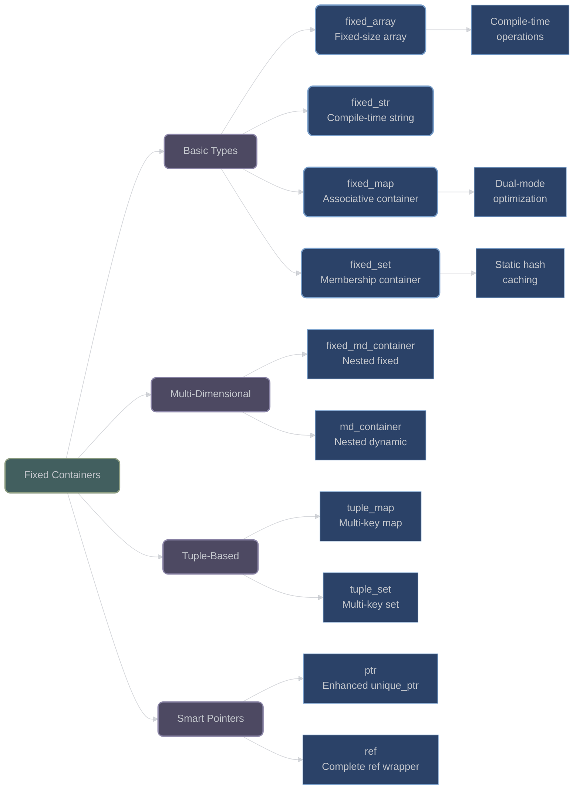

# Fixed-Size Containers

## Overview

XIEITE provides a comprehensive suite of fixed-size containers optimized for compile-time operations, offering both performance benefits and memory predictability. These containers bridge the gap between C-style arrays and STL containers with enhanced safety and functionality.

## Core Fixed Containers

### fixed_array

**`xieite::fixed_array<Value, length>`** - Compile-time fixed-size array:
```cpp
template<typename Value, std::size_t length>
struct fixed_array {
    Value array[length];

    // Complete STL interface
    constexpr auto begin() noexcept;
    constexpr auto end() noexcept;
    constexpr Value& operator[](std::size_t i) noexcept;
    constexpr Value& at(std::size_t i);

    // Special operations
    constexpr auto apply(auto&& fn) const;
    constexpr fixed_array operator+(const fixed_array& other) const;
};
```

#### Key Features

- **Zero Overhead**: Direct array storage with no indirection
- **STL Compatible**: Complete container interface
- **Compile-Time Operations**: All methods are constexpr
- **Concatenation**: Operator+ creates combined arrays
- **Apply Method**: Functional operations over all elements

#### Usage Examples

```cpp
// Basic usage
xieite::fixed_array<int, 5> arr{1, 2, 3, 4, 5};
auto doubled = arr.apply([](int x) { return x * 2; });

// Concatenation
xieite::fixed_array<int, 3> arr1{1, 2, 3};
xieite::fixed_array<int, 2> arr2{4, 5};
auto combined = arr1 + arr2;  // fixed_array<int, 5>{1, 2, 3, 4, 5}

// Zero-length specialization is safe
xieite::fixed_array<int, 0> empty;
auto ptr = empty.data();  // Returns nullptr safely
```

### fixed_str

**`xieite::fixed_str<Char, length>`** - Compile-time string:
```cpp
template<xieite::is_char Char, std::size_t length>
struct fixed_str {
    xieite::fixed_array<Char, length> array;

    // String operations
    constexpr auto view() const noexcept -> std::basic_string_view<Char>;
    constexpr fixed_str operator+(const fixed_str& other) const;
};
```

#### Features

- **NTTP Support**: Can be used as non-type template parameter
- **String View Conversion**: Efficient view() method
- **Character Type Safe**: Constrained by xieite::is_char concept
- **Deduction Guide**: Automatic size deduction from string literals

```cpp
// Compile-time string
constexpr xieite::fixed_str hello{"Hello"};
constexpr auto world = xieite::fixed_str{" World"};
constexpr auto message = hello + world;

// As template parameter
template<xieite::fixed_str str>
struct Logger {
    static constexpr auto prefix = str.view();
};

Logger<"DEBUG"> debug_logger;
```

### fixed_map

**`xieite::fixed_map<Key, Value, length>`** - Compile-time associative container:
```cpp
template<typename Key, typename Value, std::size_t length,
         typename Hash = std::hash<Key>,
         typename Cmp = std::equal_to<>,
         typename Alloc = std::allocator<std::pair<const Key, Value*>>>
struct fixed_map {
    // Dual-mode operations
    constexpr std::optional<Value> get(const Key& key) const noexcept;
    constexpr std::optional<std::reference_wrapper<Value>> get(const Key& key) noexcept;
};
```

#### Implementation Strategy

The fixed_map uses a sophisticated dual-mode approach:

```cpp
if consteval {
    // Compile-time: Linear search through array
    for (const auto& [k, v] : array) {
        if (cmp(k, key)) return v;
    }
} else {
    // Runtime: Static hash map for O(1) lookup
    static auto& map = get_map();
    if (auto iter = map.find(key); iter != map.end()) {
        return *iter->second;
    }
}
```

#### Usage

```cpp
// Create compile-time map
xieite::fixed_map<int, std::string, 3> status_codes{{
    {200, "OK"},
    {404, "Not Found"},
    {500, "Internal Server Error"}
}};

// Compile-time lookup
constexpr auto msg = status_codes.get(200);  // "OK"

// Runtime optimization
auto runtime_msg = status_codes.get(user_input);  // Uses hash map
```

### fixed_set

**`xieite::fixed_set<Key, length>`** - Compile-time set:
```cpp
template<typename Key, std::size_t length,
         typename Hash = std::hash<Key>,
         typename Cmp = std::equal_to<>,
         typename Alloc = std::allocator<Key>>
struct fixed_set {
    constexpr bool has(const Key& key) const noexcept;
    constexpr bool operator[](const Key& key) const noexcept;
};
```

```cpp
// Compile-time set operations
xieite::fixed_set<int, 5> primes{2, 3, 5, 7, 11};

static_assert(primes.has(7));
static_assert(!primes.has(6));

// Runtime uses hash set internally
if (primes[user_number]) {
    // Number is prime
}
```

## Multi-Dimensional Containers

### fixed_md_container

**`xieite::fixed_md_container`** - Multi-dimensional fixed containers:
```cpp
template<template<typename, std::size_t> typename Container,
         typename Value, std::size_t... lengths>
using fixed_md_container = /* nested container type */;
```

Creates nested fixed-size containers for multi-dimensional data:

```cpp
// 2D array: 3x4 matrix
using Matrix3x4 = xieite::fixed_md_container<
    xieite::fixed_array, int, 3, 4
>;

Matrix3x4 matrix;
matrix[0][0] = 1;

// 3D array: 2x3x4
using Tensor = xieite::fixed_md_container<
    xieite::fixed_array, double, 2, 3, 4
>;
```

### md_container

**`xieite::md_container`** - Dynamic multi-dimensional containers:
```cpp
template<template<typename> typename Container,
         typename Value, std::size_t rank>
using md_container = /* nested container type */;
```

```cpp
// 2D vector
using Matrix = xieite::md_container<std::vector, double, 2>;
Matrix m;
m.resize(10);
for (auto& row : m) {
    row.resize(10);
}

// 3D deque
using Cube = xieite::md_container<std::deque, int, 3>;
```

## Tuple-Based Containers

### tuple_map

**`xieite::tuple_map`** - Multi-key associative container:
```cpp
template<template<typename, typename> typename Container,
         typename Keys, typename Value>
struct tuple_map;
```

Provides multi-dimensional mapping with tuple keys:

```cpp
// 2D coordinate map
xieite::tuple_map<std::map, std::tuple<int, int>, std::string> grid;

// Insert with tuple key
grid.insert({5, 10}, "treasure");

// Access with tuple
if (grid.has({5, 10})) {
    auto& value = grid[{5, 10}];
}
```

### tuple_set

**`xieite::tuple_set`** - Multi-dimensional set:
```cpp
template<template<typename> typename Container, typename Keys>
struct tuple_set;
```

```cpp
// 3D point set
xieite::tuple_set<std::set, std::tuple<int, int, int>> points;

points.insert({1, 2, 3});
if (points.has({1, 2, 3})) {
    // Point exists
}
```

## Smart Pointer Types

### ptr

**`xieite::ptr<Value>`** - Enhanced unique pointer:
```cpp
template<typename Value>
struct ptr {
    Value* value;

    // RAII management
    constexpr ~ptr() noexcept;
    constexpr ptr(ptr&& other) noexcept;

    // Value assignment
    constexpr ptr& operator=(const Value& val);

    // Resource management
    constexpr Value* release() noexcept;
    constexpr void reset(Value* new_ptr = nullptr) noexcept;
};
```

Features over std::unique_ptr:
- Direct value assignment when pointer is valid
- Debug null pointer checks
- Array specialization with operator[]

```cpp
xieite::ptr<int> p{new int{42}};
*p = 100;  // Direct assignment

xieite::ptr<int[]> arr{new int[10]};
arr[5] = 42;  // Array access
```

### ref

**`xieite::ref<Value>`** - Complete reference wrapper:
```cpp
template<typename Value>
struct ref {
    Value& value;

    // Complete operator transparency
    template<typename T>
    constexpr auto operator+(T&& x) const
        XIEITE_ARROW(value + XIEITE_FWD(x))

    // All operators forwarded...
};
```

Unlike std::reference_wrapper, provides complete operator transparency:

```cpp
int x = 42;
xieite::ref<int> r{x};

r += 10;  // Modifies x
auto y = r * 2;  // Uses x's value
r++;  // Increments x
```

## Architecture Diagram



## Performance Characteristics

### Compile-Time Performance
- **fixed_array**: Zero overhead, direct memory layout
- **fixed_str**: NTTP-compatible for template parameters
- **fixed_map/set**: Linear search at compile-time

### Runtime Performance
- **fixed_map/set**: O(1) average via static hash map
- **ptr**: Same as raw pointer with optional debug checks
- **ref**: Zero overhead operator forwarding

### Memory Usage
- **Fixed containers**: Stack allocation, predictable size
- **Static optimization**: One-time hash map construction
- **No hidden allocations**: What you see is what you get

## Best Practices

1. **Use fixed containers for compile-time data**:
   ```cpp
   // Good: Compile-time configuration
   constexpr xieite::fixed_map<int, const char*, 3> errors{{
       {400, "Bad Request"},
       {401, "Unauthorized"},
       {403, "Forbidden"}
   }};
   ```

2. **Leverage dual-mode optimization**:
   ```cpp
   // Automatically optimized for both scenarios
   constexpr auto compile_time = map.get(known_key);
   auto runtime = map.get(user_input);
   ```

3. **Prefer fixed_str for template parameters**:
   ```cpp
   template<xieite::fixed_str name>
   class Component {
       static constexpr auto component_name = name.view();
   };
   ```

4. **Use tuple containers for composite keys**:
   ```cpp
   // Natural syntax for multi-dimensional access
   xieite::tuple_map<std::map, std::tuple<int, int, int>, Cell> voxels;
   voxels[{x, y, z}] = cell;
   ```

---

*Next: [String Manipulation Utilities](string_utilities.md)*
