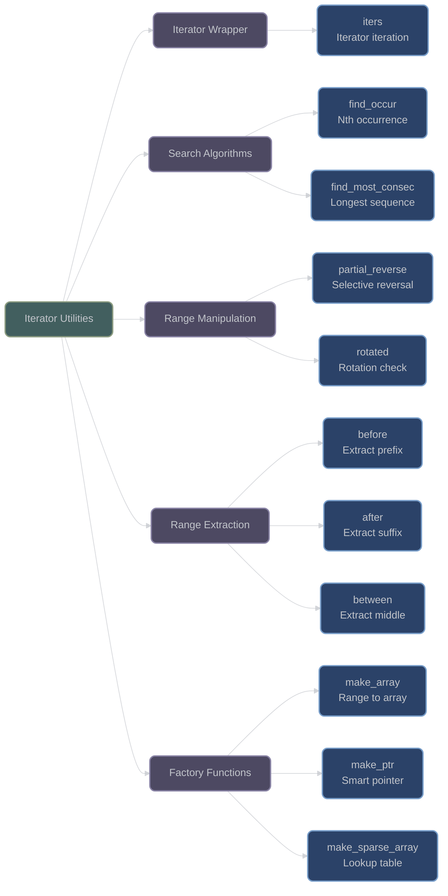

# Iterator and Range Utilities

## Overview

XIEITE provides advanced iterator and range utilities that extend C++20 ranges functionality with specialized algorithms, iterator wrappers, and range transformations designed for complex data manipulation scenarios.

## Iterator Wrapper

### iters

**`xieite::iters<Range>`** - Iterate over iterators instead of values:
```cpp
template<std::ranges::range Range>
struct iters {
    Range& value;

    // Standard range interface
    constexpr auto begin();
    constexpr auto end();
    constexpr auto rbegin();
    constexpr auto rend();
};
```

This unique utility allows iteration over the iterators of a range rather than the values they point to:

```cpp
std::vector<int> vec{1, 2, 3, 4, 5};
xieite::iters wrapped{vec};

// Iterate over iterators
for (auto iter : wrapped) {
    std::cout << "Iterator points to: " << *iter << std::endl;
    // Can modify through iterator
    *iter *= 2;
}

// Useful for algorithms that need iterator positions
auto find_indices(const auto& container, const auto& value) {
    std::vector<size_t> indices;
    xieite::iters iters{container};
    for (auto iter : iters) {
        if (*iter == value) {
            indices.push_back(std::distance(container.begin(), iter));
        }
    }
    return indices;
}
```

## Range Search Algorithms

### find_occur / find_occur_if

**`xieite::find_occur(range, idx, value)`** - Find nth occurrence:
```cpp
template<std::ranges::forward_range Range>
[[nodiscard]] constexpr auto find_occur(
    Range& range,
    std::size_t idx,
    const auto& value
) -> std::ranges::iterator_t<Range>;
```

**`xieite::find_occur_if(range, idx, pred)`** - Find nth matching element:
```cpp
template<std::ranges::forward_range Range>
[[nodiscard]] constexpr auto find_occur_if(
    Range& range,
    std::size_t idx,
    auto&& pred
) -> std::ranges::iterator_t<Range>;
```

```cpp
std::vector<int> numbers{1, 2, 3, 2, 5, 2, 7};

// Find 3rd occurrence of 2 (0-indexed)
auto third_two = xieite::find_occur(numbers, 2, 2);
// Points to the 2 at index 5

// Find 2nd even number
auto second_even = xieite::find_occur_if(numbers, 1,
    [](int x) { return x % 2 == 0; });
// Points to the second 2

if (third_two != numbers.end()) {
    *third_two = 20;  // Replace 3rd occurrence
}
```

### find_most_consec / find_most_consec_if

**`xieite::find_most_consec(range, value)`** - Find longest consecutive sequence:
```cpp
template<xieite::is_fwd_sized_range Range>
[[nodiscard]] constexpr auto find_most_consec(
    Range& range,
    const auto& value
) -> std::ranges::subrange<std::ranges::iterator_t<Range>>;
```

```cpp
std::vector<int> data{1, 2, 2, 2, 3, 2, 2, 4, 2, 2, 2, 2, 5};

// Find longest sequence of 2s
auto longest = xieite::find_most_consec(data, 2);
// Returns subrange of 4 consecutive 2s (indices 8-11)

// Find longest sequence of even numbers
auto even_seq = xieite::find_most_consec_if(data,
    [](int x) { return x % 2 == 0; });

// Get the actual values
std::vector<int> sequence(longest.begin(), longest.end());
```

## Range Manipulation

### partial_reverse

**`xieite::partial_reverse(range, pred)`** - Reverse only matching elements:
```cpp
template<std::ranges::bidirectional_range Range>
constexpr void partial_reverse(Range& range, auto&& pred);
```

Reverses the order of elements that satisfy a predicate while keeping others in place:

```cpp
std::vector<int> nums{1, 2, 3, 4, 5, 6, 7, 8};

// Reverse only even numbers
xieite::partial_reverse(nums, [](int x) { return x % 2 == 0; });
// Result: {1, 8, 3, 6, 5, 4, 7, 2}
//          odd numbers stay in place, evens are reversed

std::string text = "Hello World!";
// Reverse only uppercase letters
xieite::partial_reverse(text, [](char c) { return std::isupper(c); });
// Result: "Wello Horld!"
```

### rotated

**`xieite::rotated(range1, range2)`** - Check if ranges are rotations:
```cpp
template<std::ranges::input_range Range0, std::ranges::input_range Range1>
[[nodiscard]] constexpr bool rotated(Range0&& range0, Range1&& range1);
```

Determines if one range is a rotation of another:

```cpp
std::vector<int> original{1, 2, 3, 4, 5};
std::vector<int> rotated1{3, 4, 5, 1, 2};
std::vector<int> rotated2{5, 1, 2, 3, 4};
std::vector<int> different{1, 2, 3, 4, 6};

bool is_rot1 = xieite::rotated(original, rotated1);  // true
bool is_rot2 = xieite::rotated(original, rotated2);  // true
bool is_rot3 = xieite::rotated(original, different); // false

// Works with strings too
bool is_rotation = xieite::rotated("abcde", "cdeab");  // true
```

## Range Extraction

### before / after / between

Extract portions of ranges relative to delimiters:

```cpp
// Extract before delimiter
template<std::ranges::forward_range Range>
[[nodiscard]] constexpr auto before(Range&& range, auto&& delimiter);

// Extract after delimiter
template<std::ranges::forward_range Range>
[[nodiscard]] constexpr auto after(Range&& range, auto&& delimiter);

// Extract between delimiters
[[nodiscard]] constexpr auto between(auto&& range, auto&& start, auto&& end);
```

These work with any range, not just strings:

```cpp
std::vector<int> data{1, 2, 3, 0, 4, 5, 6, 0, 7, 8};

// Extract before first 0
auto before_zero = xieite::before(data, 0);
// Subrange: {1, 2, 3}

// Extract after first 0
auto after_zero = xieite::after(data, 0);
// Subrange: {4, 5, 6, 0, 7, 8}

// Extract between two 0s
auto between_zeros = xieite::between(data, 0, 0);
// Subrange: {4, 5, 6}

// Works with sub-sequences too
std::vector<int> pattern{3, 0};
auto after_pattern = xieite::after(data, pattern);
// Subrange: {4, 5, 6, 0, 7, 8}
```

## Factory Functions

### make_array

**`xieite::make_array<T, N>(range, converter)`** - Create array from range:
```cpp
template<typename Value, std::size_t length, std::ranges::input_range Range>
[[nodiscard]] constexpr std::array<Value, length> make_array(
    Range&& range,
    auto&& converter = std::identity{}
);
```

```cpp
// Convert vector to array
std::vector<int> vec{1, 2, 3, 4, 5};
auto arr = xieite::make_array<int, 5>(vec);

// With conversion
std::vector<double> doubles{1.5, 2.7, 3.9};
auto ints = xieite::make_array<int, 3>(doubles,
    [](double d) { return static_cast<int>(d); });
// Result: {1, 2, 3}

// From initializer list
auto arr2 = xieite::make_array<std::string, 3>(
    {"hello", "world", "!"}
);
```

### make_ptr

**`xieite::make_ptr`** - Smart pointer factory functions:
```cpp
// Create single object
template<typename Value>
[[nodiscard]] constexpr auto make_ptr();

// Create with arguments
template<typename Value>
[[nodiscard]] constexpr auto make_ptr_init(auto&&... args);

// Create array
template<xieite::is_unbounded_array Array>
[[nodiscard]] constexpr auto make_ptr(std::size_t length);

// Non-throwing versions
template<typename Value>
[[nodiscard]] constexpr auto make_ptr_noex();
```

```cpp
// Create single object
auto int_ptr = xieite::make_ptr<int>();
auto str_ptr = xieite::make_ptr_init<std::string>("Hello");

// Create array
auto arr_ptr = xieite::make_ptr<int[]>(10);
arr_ptr[5] = 42;

// Non-throwing version returns nullptr on failure
auto safe_ptr = xieite::make_ptr_noex<LargeObject>();
if (safe_ptr) {
    // Allocation succeeded
}
```

### make_sparse_array

**`xieite::make_sparse_array<K, V>(entries)`** - Create lookup table:
```cpp
template<typename Key, typename Value>
[[nodiscard]] constexpr auto make_sparse_array(auto&& entries);
```

Creates dense array indexed by integral/enum keys:

```cpp
enum class Status : uint8_t {
    OK = 200,
    NOT_FOUND = 404,
    ERROR = 500
};

// Create lookup table
auto messages = xieite::make_sparse_array<Status, const char*>({
    {Status::OK, "Success"},
    {Status::NOT_FOUND, "Not Found"},
    {Status::ERROR, "Internal Error"}
});

// O(1) lookup
const char* msg = messages[static_cast<size_t>(Status::NOT_FOUND)];

// Sparse int keys
auto sparse = xieite::make_sparse_array<int8_t, std::string>({
    {-50, "Very Cold"},
    {0, "Freezing"},
    {25, "Room Temp"},
    {100, "Boiling"}
});
```

## Architecture Diagram



## Performance Considerations

- **Iterator Wrapper**: Zero overhead abstraction
- **Search Algorithms**: Linear complexity, single pass where possible
- **Sparse Arrays**: O(1) lookup after construction
- **Range Views**: Use subranges to avoid copying
- **Factory Functions**: Compile-time optimization with `xieite::unroll`

## Best Practices

1. **Use iters for position-aware algorithms**:
   ```cpp
   // Find all positions of a value
   std::vector<size_t> find_all_positions(const auto& range, const auto& value) {
       std::vector<size_t> positions;
       xieite::iters iters{range};
       for (auto iter : iters) {
           if (*iter == value) {
               positions.push_back(std::distance(range.begin(), iter));
           }
       }
       return positions;
   }
   ```

2. **Leverage partial operations**:
   ```cpp
   // Selectively transform elements
   xieite::partial_reverse(data, is_negative);
   // Only negative numbers are reversed
   ```

3. **Use sparse arrays for enum lookups**:
   ```cpp
   // Efficient enum-to-value mapping
   auto lookup = xieite::make_sparse_array<ErrorCode, std::string>(
       error_messages
   );
   ```

4. **Combine range utilities**:
   ```cpp
   // Extract and process subsequences
   auto middle = xieite::between(data, delimiter1, delimiter2);
   auto longest = xieite::find_most_consec_if(middle, predicate);
   ```

---

*Next: [Data Module Summary](index.md)*
