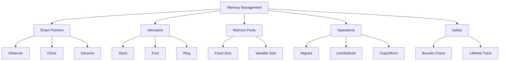

# Memory Management

## Overview

XIEITE's memory management utilities provide advanced memory handling patterns, smart pointer extensions, custom allocators, and memory-safe operations that complement the standard library's memory management facilities.

## Design Philosophy

### Zero-Overhead Principle
Memory utilities maintain C++'s zero-overhead principle:
```cpp
// No runtime cost for compile-time checks
template<typename T>
    requires std::is_trivially_copyable_v<T>
void fast_copy(T* dst, const T* src, std::size_t n) {
    std::memcpy(dst, src, n * sizeof(T));
}
```

### Type Safety
Strong typing prevents memory errors at compile time:
```cpp
template<typename T>
class typed_buffer {
    alignas(T) std::byte buffer_[sizeof(T)];
    // Type-safe operations only
};
```

### RAII Everywhere
All memory resources follow RAII principles:
```cpp
class memory_guard {
    void* ptr_;
public:
    ~memory_guard() { if (ptr_) std::free(ptr_); }
    // Move-only semantics
};
```

## Smart Pointer Extensions

### Observer Pointer
```cpp
template<typename T>
class observer_ptr {
    T* ptr_ = nullptr;

public:
    constexpr observer_ptr() = default;
    constexpr explicit observer_ptr(T* ptr) : ptr_(ptr) {}

    constexpr T* get() const noexcept { return ptr_; }
    constexpr T& operator*() const { return *ptr_; }
    constexpr T* operator->() const noexcept { return ptr_; }

    constexpr explicit operator bool() const noexcept { return ptr_ != nullptr; }
    constexpr void reset(T* ptr = nullptr) noexcept { ptr_ = ptr; }

    // No ownership semantics
    observer_ptr(const observer_ptr&) = default;
    observer_ptr& operator=(const observer_ptr&) = default;
};

// Usage
void process(observer_ptr<Widget> widget) {
    if (widget) {
        widget->update();
    }
}
```

### Clone Pointer
```cpp
template<typename T, typename Cloner = std::default_clone<T>>
class clone_ptr {
    std::unique_ptr<T> ptr_;
    Cloner cloner_;

public:
    clone_ptr() = default;
    explicit clone_ptr(T* ptr) : ptr_(ptr) {}

    // Deep copy semantics
    clone_ptr(const clone_ptr& other)
        : ptr_(other.ptr_ ? cloner_(*other.ptr_) : nullptr) {}

    clone_ptr& operator=(const clone_ptr& other) {
        if (this != &other) {
            ptr_.reset(other.ptr_ ? cloner_(*other.ptr_) : nullptr);
        }
        return *this;
    }

    // Move semantics preserved
    clone_ptr(clone_ptr&&) = default;
    clone_ptr& operator=(clone_ptr&&) = default;
};
```

### Intrusive Pointer
```cpp
template<typename T>
class intrusive_ptr {
    T* ptr_ = nullptr;

    void add_ref() { if (ptr_) ptr_->add_ref(); }
    void release() { if (ptr_) ptr_->release(); }

public:
    explicit intrusive_ptr(T* ptr) : ptr_(ptr) { add_ref(); }
    ~intrusive_ptr() { release(); }

    intrusive_ptr(const intrusive_ptr& other) : ptr_(other.ptr_) { add_ref(); }
    intrusive_ptr& operator=(const intrusive_ptr& other) {
        intrusive_ptr tmp(other);
        swap(tmp);
        return *this;
    }
};
```

## Memory Pools

### Fixed Pool Allocator
```cpp
template<typename T, std::size_t BlockSize = 1024>
class fixed_pool {
    struct block {
        alignas(T) std::byte storage[sizeof(T) * BlockSize];
        std::bitset<BlockSize> used;
        std::unique_ptr<block> next;
    };

    std::unique_ptr<block> head_;
    block* current_ = nullptr;

public:
    T* allocate() {
        if (!current_ || current_->used.all()) {
            auto new_block = std::make_unique<block>();
            new_block->next = std::move(head_);
            head_ = std::move(new_block);
            current_ = head_.get();
        }

        auto idx = find_free_slot();
        current_->used.set(idx);
        return std::launder(reinterpret_cast<T*>(
            &current_->storage[idx * sizeof(T)]));
    }

    void deallocate(T* ptr) {
        // Find block and mark as free
    }
};
```

### Stack Allocator
```cpp
template<std::size_t Size>
class stack_allocator {
    alignas(std::max_align_t) std::byte buffer_[Size];
    std::size_t offset_ = 0;

public:
    void* allocate(std::size_t size, std::size_t align = alignof(std::max_align_t)) {
        offset_ = align_up(offset_, align);
        if (offset_ + size > Size) {
            throw std::bad_alloc{};
        }
        void* ptr = buffer_ + offset_;
        offset_ += size;
        return ptr;
    }

    void deallocate(void* ptr, std::size_t size) {
        // Stack allocator typically doesn't support individual deallocation
    }

    void reset() { offset_ = 0; }
};
```

### Ring Buffer Allocator
```cpp
template<std::size_t Size>
class ring_allocator {
    alignas(std::max_align_t) std::byte buffer_[Size];
    std::size_t head_ = 0;
    std::size_t tail_ = 0;

public:
    void* allocate(std::size_t size) {
        std::size_t available = (tail_ - head_ - 1 + Size) % Size;
        if (size > available) {
            throw std::bad_alloc{};
        }

        void* ptr = buffer_ + head_;
        head_ = (head_ + size) % Size;
        return ptr;
    }

    void free_oldest(std::size_t size) {
        tail_ = (tail_ + size) % Size;
    }
};
```

## Memory Operations

### Aligned Allocation
```cpp
template<typename T>
T* aligned_alloc(std::size_t count, std::size_t alignment = alignof(T)) {
    std::size_t size = count * sizeof(T);
    void* ptr = std::aligned_alloc(alignment, align_up(size, alignment));
    if (!ptr) throw std::bad_alloc{};
    return static_cast<T*>(ptr);
}

template<typename T>
void aligned_free(T* ptr) {
    std::free(ptr);
}

template<typename T, typename... Args>
T* aligned_new(Args&&... args) {
    void* ptr = aligned_alloc<T>(1);
    return ::new(ptr) T(std::forward<Args>(args)...);
}
```

### Memory Utilities
```cpp
// Safe memory comparison
template<typename T>
bool memory_equal(const T* a, const T* b, std::size_t count) {
    if constexpr (std::is_trivially_copyable_v<T>) {
        return std::memcmp(a, b, count * sizeof(T)) == 0;
    } else {
        return std::equal(a, a + count, b);
    }
}

// Memory pattern fill
template<typename T>
void memory_fill(T* ptr, std::size_t count, const T& value) {
    if constexpr (std::is_trivial_v<T> && sizeof(T) == 1) {
        std::memset(ptr, static_cast<int>(value), count);
    } else {
        std::fill_n(ptr, count, value);
    }
}

// Zero memory
template<typename T>
void memory_zero(T* ptr, std::size_t count) {
    std::memset(ptr, 0, count * sizeof(T));
}
```

### Copy Operations
```cpp
// Type-aware copy
template<typename T>
void typed_copy(T* dst, const T* src, std::size_t count) {
    if constexpr (std::is_trivially_copyable_v<T>) {
        std::memcpy(dst, src, count * sizeof(T));
    } else {
        std::uninitialized_copy_n(src, count, dst);
    }
}

// Move with destruction
template<typename T>
void relocate(T* dst, T* src, std::size_t count) {
    if constexpr (std::is_trivially_relocatable_v<T>) {
        std::memcpy(dst, src, count * sizeof(T));
    } else {
        std::uninitialized_move_n(src, count, dst);
        std::destroy_n(src, count);
    }
}
```

## Uninitialized Memory

### Uninitialized Array
```cpp
template<typename T, std::size_t N>
class uninitialized_array {
    alignas(T) std::byte storage_[sizeof(T) * N];
    std::bitset<N> initialized_;

public:
    T* data() { return std::launder(reinterpret_cast<T*>(storage_)); }

    template<typename... Args>
    T& emplace(std::size_t idx, Args&&... args) {
        if (initialized_[idx]) {
            destroy(idx);
        }
        T* ptr = ::new(&storage_[idx * sizeof(T)]) T(std::forward<Args>(args)...);
        initialized_.set(idx);
        return *ptr;
    }

    void destroy(std::size_t idx) {
        if (initialized_[idx]) {
            std::destroy_at(reinterpret_cast<T*>(&storage_[idx * sizeof(T)]));
            initialized_.reset(idx);
        }
    }

    ~uninitialized_array() {
        for (std::size_t i = 0; i < N; ++i) {
            destroy(i);
        }
    }
};
```

## Memory Views

### Typed Memory View
```cpp
template<typename T>
class memory_view {
    T* ptr_;
    std::size_t size_;

public:
    constexpr memory_view(T* ptr, std::size_t size)
        : ptr_(ptr), size_(size) {}

    constexpr T* data() const { return ptr_; }
    constexpr std::size_t size() const { return size_; }
    constexpr std::size_t size_bytes() const { return size_ * sizeof(T); }

    constexpr T& operator[](std::size_t idx) const {
        assert(idx < size_);
        return ptr_[idx];
    }

    constexpr memory_view subview(std::size_t offset, std::size_t count) const {
        assert(offset + count <= size_);
        return {ptr_ + offset, count};
    }
};
```

### Byte Span
```cpp
class byte_span {
    std::byte* data_;
    std::size_t size_;

public:
    byte_span(void* ptr, std::size_t size)
        : data_(static_cast<std::byte*>(ptr)), size_(size) {}

    template<typename T>
    T* as() {
        assert(size_ >= sizeof(T));
        return std::launder(reinterpret_cast<T*>(data_));
    }

    template<typename T>
    span<T> as_span() {
        assert(size_ % sizeof(T) == 0);
        return {reinterpret_cast<T*>(data_), size_ / sizeof(T)};
    }
};
```

## Custom Allocators

### Tracking Allocator
```cpp
template<typename T>
class tracking_allocator {
    static inline std::atomic<std::size_t> allocated_ = 0;
    static inline std::atomic<std::size_t> deallocated_ = 0;

public:
    using value_type = T;

    T* allocate(std::size_t n) {
        allocated_ += n * sizeof(T);
        return static_cast<T*>(::operator new(n * sizeof(T)));
    }

    void deallocate(T* ptr, std::size_t n) {
        deallocated_ += n * sizeof(T);
        ::operator delete(ptr);
    }

    static std::size_t bytes_allocated() { return allocated_; }
    static std::size_t bytes_deallocated() { return deallocated_; }
    static std::size_t bytes_in_use() { return allocated_ - deallocated_; }
};
```

### Fallback Allocator
```cpp
template<typename Primary, typename Fallback>
class fallback_allocator {
    Primary primary_;
    Fallback fallback_;

public:
    void* allocate(std::size_t size) {
        if (void* ptr = primary_.allocate(size)) {
            return ptr;
        }
        return fallback_.allocate(size);
    }

    void deallocate(void* ptr, std::size_t size) {
        if (primary_.owns(ptr)) {
            primary_.deallocate(ptr, size);
        } else {
            fallback_.deallocate(ptr, size);
        }
    }
};
```

## Memory Safety

### Bounds Checking
```cpp
template<typename T>
class checked_ptr {
    T* ptr_;
    T* begin_;
    T* end_;

public:
    checked_ptr(T* ptr, T* begin, T* end)
        : ptr_(ptr), begin_(begin), end_(end) {}

    T& operator*() const {
        if (ptr_ < begin_ || ptr_ >= end_) {
            throw std::out_of_range("Pointer out of bounds");
        }
        return *ptr_;
    }

    checked_ptr& operator++() {
        ++ptr_;
        return *this;
    }
};
```

### Use-After-Free Detection
```cpp
template<typename T>
class debug_ptr {
    T* ptr_;
    std::shared_ptr<bool> valid_;

public:
    explicit debug_ptr(T* ptr)
        : ptr_(ptr), valid_(std::make_shared<bool>(true)) {}

    ~debug_ptr() {
        *valid_ = false;
    }

    T& operator*() const {
        if (!*valid_) {
            throw std::runtime_error("Use after free detected");
        }
        return *ptr_;
    }
};
```

## Performance Optimization

### Memory Prefetching
```cpp
inline void prefetch(const void* addr, int locality = 0) {
    #ifdef __builtin_prefetch
        __builtin_prefetch(addr, 0, locality);
    #endif
}

template<typename T>
void prefetch_range(const T* begin, const T* end, std::size_t stride = 1) {
    for (const T* ptr = begin; ptr < end; ptr += stride) {
        prefetch(ptr);
    }
}
```

### Cache-Aligned Storage
```cpp
template<typename T>
struct alignas(std::hardware_destructive_interference_size) cache_aligned {
    T value;

    cache_aligned() = default;
    explicit cache_aligned(const T& v) : value(v) {}
    operator T&() { return value; }
    operator const T&() const { return value; }
};
```

## Usage Examples

### Custom Container with Pool
```cpp
template<typename T>
class pooled_vector {
    fixed_pool<T> pool_;
    std::vector<T*, tracking_allocator<T*>> elements_;

public:
    void push_back(const T& value) {
        T* ptr = pool_.allocate();
        ::new(ptr) T(value);
        elements_.push_back(ptr);
    }

    ~pooled_vector() {
        for (T* ptr : elements_) {
            ptr->~T();
            pool_.deallocate(ptr);
        }
    }
};
```

### Memory-Mapped File
```cpp
class memory_mapped_file {
    void* addr_ = nullptr;
    std::size_t size_ = 0;

public:
    explicit memory_mapped_file(const std::string& path) {
        // Platform-specific memory mapping
    }

    byte_span as_bytes() {
        return {addr_, size_};
    }

    template<typename T>
    span<T> as_array() {
        return byte_span{addr_, size_}.as_span<T>();
    }
};
```

## Best Practices

1. **Use appropriate smart pointers** for ownership semantics
2. **Prefer stack allocation** when size is known at compile time
3. **Pool allocate** frequently created/destroyed objects
4. **Align data** for SIMD operations
5. **Track allocations** in debug builds for leak detection

## Mermaid Diagram



## See Also

- [Data Structures API](../../reference/api/data.md)
- [Compile-Time Structures](./compile_time.md)
- [Container Algorithms](./algorithms.md)
- [System Utilities](../../reference/api/sys.md)