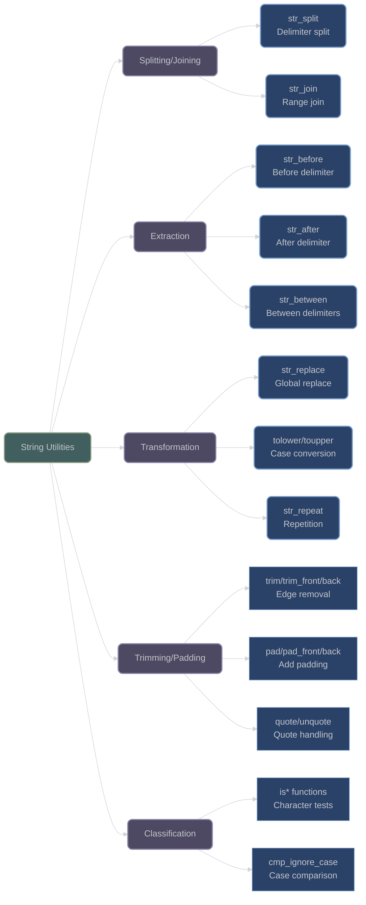

# String Manipulation Utilities

## Overview

XIEITE provides an extensive collection of string manipulation utilities designed for efficiency, type safety, and ease of use. These utilities work with various string types and offer both compile-time and runtime operations with consistent interfaces.

## String Splitting and Joining

### `str_split`

**`xieite::str_split(strv, delim, discard_empty)`** - Split string into segments:
```cpp
template<xieite::is_char Char, typename Traits = std::char_traits<Char>>
[[nodiscard]] constexpr auto str_split(
    std::basic_string_view<Char, Traits> strv,
    std::basic_string_view<Char, Traits> delim,
    bool discard_empty = false
) -> std::vector<std::basic_string_view<Char, Traits>>;
```

Key features:
- Returns vector of string_views for efficiency (no copying)
- Optional empty segment filtering
- Multiple overloads for character and string delimiters

```cpp
// Basic splitting
std::string csv = "apple,banana,,cherry";
auto parts = xieite::str_split(csv, ",");
// Result: {"apple", "banana", "", "cherry"}

auto filtered = xieite::str_split(csv, ",", true);
// Result: {"apple", "banana", "cherry"} - empty removed

// Split on multiple characters
std::string text = "one and two and three";
auto words = xieite::str_split(text, " and ");
// Result: {"one", "two", "three"}
```

### `str_join`

**`xieite::str_join(range, delim, prefix, suffix)`** - Join strings with delimiter:
```cpp
template<std::ranges::input_range Range, xieite::is_char Char>
[[nodiscard]] constexpr auto str_join(
    Range&& range,
    std::basic_string_view<Char> delim = "",
    std::basic_string_view<Char> prefix = "",
    std::basic_string_view<Char> suffix = ""
) -> std::basic_string<Char>;
```

Features:
- Range-based design for any iterable container
- Optional prefix and suffix for each element
- Efficient single-pass construction

```cpp
// Basic joining
std::vector<std::string> words{"hello", "world", "!"};
auto sentence = xieite::str_join(words, " ");
// Result: "hello world !"

// With prefix/suffix
auto formatted = xieite::str_join(words, ", ", "[", "]");
// Result: "[hello], [world], [!]"

// Join numbers
std::array<int, 4> numbers{1, 2, 3, 4};
auto csv = xieite::str_join(numbers, ",");
// Result: "1,2,3,4"
```

## String Extraction

### `str_before` / `str_after` / `str_between`

Extract portions of strings relative to delimiters:

```cpp
// Extract before delimiter
auto str_before(std::string_view strv, auto&& delim)
    XIEITE_ARROW(strv.substr(0, strv.find(delim)))

// Extract after delimiter
auto str_after(std::string_view strv, auto&& delim)
    XIEITE_ARROW(/* substring after delimiter */)

// Extract between two delimiters
auto str_between(std::string_view strv, auto&& start, auto&& end)
    XIEITE_ARROW(str_after(str_before(strv, end), start))
```

```cpp
std::string email = "user@example.com";
auto username = xieite::str_before(email, "@");     // "user"
auto domain = xieite::str_after(email, "@");        // "example.com"

std::string html = "<title>Page Title</title>";
auto title = xieite::str_between(html, "<title>", "</title>");
// Result: "Page Title"
```

### `before_last` / `after_last`

Extract relative to last occurrence:

```cpp
std::string path = "/home/user/documents/file.txt";
auto dir = xieite::str_before_last(path, "/");   // "/home/user/documents"
auto file = xieite::str_after_last(path, "/");   // "file.txt"
```

## String Transformation

### `str_replace`

**`xieite::str_replace(strv, find, replace)`** - Global string replacement:
```cpp
template<xieite::is_char Char>
[[nodiscard]] constexpr auto str_replace(
    std::string_view<Char> strv,
    std::string_view<Char> find,
    std::string_view<Char> replace
) -> std::string<Char>;
```

Replaces ALL occurrences:

```cpp
std::string text = "The quick brown fox jumps over the lazy fox";
auto replaced = xieite::str_replace(text, "fox", "cat");
// Result: "The quick brown cat jumps over the lazy cat"

// Character replacement
auto cleaned = xieite::str_replace("1-234-567", '-', "");
// Result: "1234567"
```

### `tolower` / `toupper`

Case conversion utilities:

```cpp
// Character conversion
char upper = xieite::toupper('a');  // 'A'
char lower = xieite::tolower('A');  // 'a'

// String conversion (returns new string)
std::string text = "Hello World";
auto lower_text = xieite::tolower(text);  // "hello world"
auto upper_text = xieite::toupper(text);  // "HELLO WORLD"
```

### `str_repeat`

**`xieite::str_repeat(count, str)`** - Repeat string multiple times:
```cpp
auto line = xieite::str_repeat(80, "-");  // 80 dashes
auto pattern = xieite::str_repeat(3, "abc");  // "abcabcabc"

// Efficient implementation with pre-allocation
template<typename Char>
auto str_repeat(size_t count, const std::string<Char>& str) {
    std::string result;
    result.reserve(str.size() * count);  // Pre-allocate
    for (size_t i = 0; i < count; ++i) {
        result += str;
    }
    return result;
}
```

## String Trimming

### `trim` / `trim_front` / `trim_back`

Remove characters from string edges:

```cpp
// Default: trim whitespace
std::string text = "  hello world  \n";
auto trimmed = xieite::trim(text);  // "hello world"

// Custom character set
std::string data = "---message---";
auto clean = xieite::trim(data, "-");  // "message"

// Directional trimming
auto left = xieite::trim_front("   text", " ");   // "text"
auto right = xieite::trim_back("text...", ".");   // "text"

// Multiple characters
auto cleaned = xieite::trim("##!hello!##", "#!");  // "hello"
```

## String Padding

### `pad` / `pad_front` / `pad_back`

Add padding to achieve target length:

```cpp
// Center padding
auto centered = xieite::pad("text", 10, '*');  // "***text***"

// Alignment control
auto left_align = xieite::pad("text", 10, ' ', false);   // "   text   "
auto right_align = xieite::pad("text", 10, ' ', true);   // "   text   "

// Directional padding
auto padded_left = xieite::pad_front("42", 5, '0');   // "00042"
auto padded_right = xieite::pad_back("text", 8, '.');  // "text...."
```

### `str_truncate`

Truncate string with suffix:

```cpp
// Basic truncation
std::string long_text = "This is a very long string that needs truncation";
auto short = xieite::str_truncate(long_text, 20, "...");
// Result: "This is a very lo..."

// Smart truncation (suffix aware)
auto truncated = xieite::str_truncate("filename.txt", 8, "~");
// Result: "filenam~"
```

## String Quoting

### `quote` / `unquote`

Handle quoted strings with escaping:

```cpp
// Quote a string
std::string text = "Hello \"World\"";
auto quoted = xieite::quote(text);
// Result: "\"Hello \\\"World\\\"\""

// Custom quote and escape characters
auto custom = xieite::quote("path/to/file", '\'', '/');
// Result: "'path//to//file'"

// Unquote
std::string quoted_str = "\"Hello \\\"World\\\"\"";
auto unquoted = xieite::unquote(quoted_str);
// Result: "Hello \"World\""
```

## Utility Functions

### `strlen`

Unified length calculation for various string types:

```cpp
// Works with multiple types
size_t len1 = xieite::strlen("hello");           // C-string: 5
size_t len2 = xieite::strlen(std::string{"hi"}); // std::string: 2
size_t len3 = xieite::strlen('A');               // char: 1
size_t len4 = xieite::strlen(std::string_view{"test"}); // string_view: 4

// Array handling (accounts for null terminator)
char arr[10] = "hello";
size_t len5 = xieite::strlen(arr);  // 5 (not 10)
```

### `substr`

Enhanced substring with offset parameters:

```cpp
// Basic substring
std::string_view text = "Hello World";
auto sub1 = xieite::substr(text, 0, 5);  // "Hello"

// With offsets
auto sub2 = xieite::substr(text, 0, 5, 1, 1);
// Start at 0+1=1, end at 5+1=6: "ello "

// Handle npos
auto sub3 = xieite::substr(text, 6, std::string::npos);  // "World"
```

### `palindrome`

Check or make palindromes:

```cpp
// Check palindrome
bool is_palin = xieite::palindrome("racecar");  // true
bool not_palin = xieite::palindrome("hello");   // false

// Case-insensitive check
bool palin2 = xieite::palindrome("RaceCar", xieite::tolower);  // true
```

### Case-Insensitive Comparison

**`xieite::cmp_ignore_case`** - Case-insensitive string comparison:

```cpp
xieite::cmp_ignore_case cmp;

bool equal = cmp("Hello", "HELLO");  // true
bool less = cmp("abc", "DEF");       // true (lexicographic)

// Use with containers
std::map<std::string, int, xieite::cmp_ignore_case> case_insensitive_map;
case_insensitive_map["Hello"] = 1;
auto value = case_insensitive_map["HELLO"];  // Found: 1
```

## Character Classification

XIEITE provides locale-independent character classification:

```cpp
// Character type checking
bool is_alpha = xieite::isalpha('A');     // true
bool is_digit = xieite::isdigit('5');     // true
bool is_alnum = xieite::isalnum('a');     // true
bool is_space = xieite::isspace(' ');     // true
bool is_punct = xieite::ispunct('!');     // true
bool is_upper = xieite::isupper('A');     // true
bool is_lower = xieite::islower('a');     // true
bool is_xdigit = xieite::isxdigit('F');   // true (hex)
bool is_blank = xieite::isblank('\t');    // true
bool is_cntrl = xieite::iscntrl('\n');    // true
bool is_graph = xieite::isgraph('!');     // true (visible)
bool is_print = xieite::isprint(' ');     // true (printable)
```

## Architecture Diagram



## Performance Considerations

- **String Views**: Most functions return or work with string_views to avoid copying
- **Pre-allocation**: Functions like `str_repeat` and `str_join` pre-allocate memory
- **Single Pass**: Algorithms designed for single-pass operation where possible
- **Constexpr**: All functions are constexpr-compatible for compile-time use
- **Range-Based**: Modern range interfaces for efficiency and flexibility

## Best Practices

1. **Use string_view for non-owning operations**:
   ```cpp
   // Good: No allocation
   auto parts = xieite::str_split(large_string, ",");

   // Parts are views into original string
   for (auto part : parts) {
       process(part);  // No copy
   }
   ```

2. **Chain operations efficiently**:
   ```cpp
   // Compose operations
   auto result = xieite::trim(
       xieite::str_replace(input, "\r\n", "\n")
   );
   ```

3. **Use appropriate character classification**:
   ```cpp
   // Locale-independent, consistent behavior
   if (xieite::isalpha(ch)) {
       // Always ASCII alphabet check
   }
   ```

4. **Leverage compile-time operations**:
   ```cpp
   // Compile-time string manipulation
   constexpr auto prefix = xieite::str_before("config.json", ".");
   static_assert(prefix == "config");
   ```

---

*Next: [Iterator and Range Utilities](iterator_utilities.md)*
