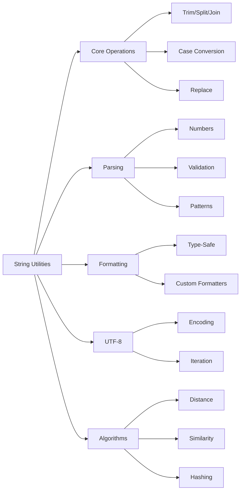

# String Utilities

## Overview

XIEITE provides comprehensive string manipulation utilities that extend beyond the standard library, offering compile-time string operations, efficient parsing, and advanced text processing capabilities optimized for both runtime and compile-time use.

## Design Philosophy

### Compile-Time First
Many string operations are constexpr-enabled for compile-time evaluation:
```cpp
constexpr auto result = xieite::trim("  hello  ");
static_assert(result == "hello");
```

### Zero-Copy Operations
String views and references are preferred to avoid unnecessary allocations:
```cpp
std::string_view trimmed = xieite::trim_view(input);  // No allocation
```

### UTF-8 Aware
String utilities handle UTF-8 correctly:
```cpp
auto length = xieite::utf8_length("Hello 世界");  // 8 characters, not bytes
```

## Core String Operations

### Trimming Operations

#### Basic Trimming
```cpp
// Trim whitespace from both ends
std::string_view trim(std::string_view str);
std::string_view trim_left(std::string_view str);
std::string_view trim_right(std::string_view str);

// Custom delimiter trimming
std::string_view trim(std::string_view str, char delim);
std::string_view trim(std::string_view str, std::string_view delims);
```

#### Advanced Trimming
```cpp
// Trim until predicate fails
template<typename Pred>
std::string_view trim_while(std::string_view str, Pred pred);

// Trim matching pattern
std::string_view trim_prefix(std::string_view str, std::string_view prefix);
std::string_view trim_suffix(std::string_view str, std::string_view suffix);
```

### Splitting and Joining

#### String Splitting
```cpp
// Split by delimiter
std::vector<std::string_view> split(std::string_view str, char delim);
std::vector<std::string_view> split(std::string_view str, std::string_view delim);

// Split with limit
std::vector<std::string_view> split_n(std::string_view str, char delim, std::size_t n);

// Split by predicate
template<typename Pred>
std::vector<std::string_view> split_if(std::string_view str, Pred pred);

// Split into lines
std::vector<std::string_view> split_lines(std::string_view str);
```

#### String Joining
```cpp
// Join with separator
template<typename Range>
std::string join(const Range& range, std::string_view sep);

// Join with custom formatter
template<typename Range, typename Formatter>
std::string join_with(const Range& range, std::string_view sep, Formatter fmt);

// Efficient joining with pre-allocation
template<typename Range>
std::string join_reserve(const Range& range, std::string_view sep);
```

### Case Conversion

#### Basic Case Operations
```cpp
std::string to_lower(std::string_view str);
std::string to_upper(std::string_view str);
std::string to_title(std::string_view str);

// In-place versions
void to_lower_inplace(std::string& str);
void to_upper_inplace(std::string& str);
void to_title_inplace(std::string& str);
```

#### Case Style Conversion
```cpp
std::string to_snake_case(std::string_view str);   // hello_world
std::string to_camel_case(std::string_view str);   // helloWorld
std::string to_pascal_case(std::string_view str);  // HelloWorld
std::string to_kebab_case(std::string_view str);   // hello-world
std::string to_screaming_snake(std::string_view str); // HELLO_WORLD
```

### String Replacement

#### Basic Replacement
```cpp
std::string replace(std::string_view str, std::string_view from, std::string_view to);
std::string replace_first(std::string_view str, std::string_view from, std::string_view to);
std::string replace_last(std::string_view str, std::string_view from, std::string_view to);
std::string replace_nth(std::string_view str, std::string_view from, std::string_view to, std::size_t n);
```

#### Advanced Replacement
```cpp
// Replace with callback
template<typename Callback>
std::string replace_with(std::string_view str, std::string_view pattern, Callback cb);

// Multiple replacements
std::string replace_all(std::string_view str,
                       const std::vector<std::pair<std::string_view, std::string_view>>& replacements);

// Regex-like replacement
std::string replace_pattern(std::string_view str, std::string_view pattern, std::string_view replacement);
```

## String Queries

### Content Checks
```cpp
bool starts_with(std::string_view str, std::string_view prefix);
bool ends_with(std::string_view str, std::string_view suffix);
bool contains(std::string_view str, std::string_view substr);
bool contains_any(std::string_view str, std::string_view chars);
bool contains_all(std::string_view str, std::string_view chars);
```

### Pattern Matching
```cpp
std::size_t count(std::string_view str, std::string_view pattern);
std::size_t count_lines(std::string_view str);
std::size_t count_words(std::string_view str);

std::optional<std::size_t> find_nth(std::string_view str, std::string_view pattern, std::size_t n);
std::vector<std::size_t> find_all(std::string_view str, std::string_view pattern);
```

### String Validation
```cpp
bool is_numeric(std::string_view str);
bool is_integer(std::string_view str);
bool is_float(std::string_view str);
bool is_hex(std::string_view str);
bool is_binary(std::string_view str);
bool is_octal(std::string_view str);

bool is_alpha(std::string_view str);
bool is_alphanumeric(std::string_view str);
bool is_ascii(std::string_view str);
bool is_printable(std::string_view str);
bool is_whitespace(std::string_view str);

bool is_valid_utf8(std::string_view str);
bool is_valid_identifier(std::string_view str);
```

## Compile-Time String Operations

### Fixed String
```cpp
template<std::size_t N>
struct fixed_string {
    char data[N + 1] = {};
    std::size_t len = 0;

    constexpr fixed_string() = default;

    constexpr fixed_string(const char (&str)[N + 1]) {
        std::copy_n(str, N + 1, data);
        len = N;
    }

    constexpr operator std::string_view() const {
        return {data, len};
    }
};

// Used as template parameter
template<fixed_string Name>
struct named {
    static constexpr auto name = Name;
};

using my_type = named<"Configuration">;
```

### Static String
```cpp
template<std::size_t N>
class static_string {
    std::array<char, N> data_;
    std::size_t size_ = 0;

public:
    constexpr static_string() = default;

    constexpr auto substr(std::size_t pos, std::size_t len) const;
    constexpr auto find(char c) const;
    constexpr auto replace(char from, char to) const;

    constexpr auto operator+(const static_string& other) const;
    constexpr bool operator==(std::string_view other) const;
};
```

### Compile-Time String Builder
```cpp
template<std::size_t Capacity>
class string_builder {
    char buffer_[Capacity];
    std::size_t pos_ = 0;

public:
    constexpr string_builder& append(std::string_view str);
    constexpr string_builder& append(char c);
    constexpr string_builder& append_number(int n);

    constexpr std::string_view view() const {
        return {buffer_, pos_};
    }
};

// Usage
constexpr auto build_message() {
    string_builder<256> builder;
    builder.append("Error ")
           .append_number(404)
           .append(": Not Found");
    return builder.view();
}
```

## String Parsing

### Number Parsing
```cpp
template<typename T>
std::optional<T> parse(std::string_view str);

std::optional<int> parse_int(std::string_view str);
std::optional<long> parse_long(std::string_view str);
std::optional<float> parse_float(std::string_view str);
std::optional<double> parse_double(std::string_view str);

// With base
std::optional<int> parse_int(std::string_view str, int base);

// Parse with default
template<typename T>
T parse_or(std::string_view str, T default_value);
```

### Advanced Parsing
```cpp
// Parse with validation
template<typename T, typename Validator>
std::optional<T> parse_if(std::string_view str, Validator valid);

// Parse multiple values
template<typename... Ts>
std::tuple<std::optional<Ts>...> parse_multiple(std::string_view str);

// Parse key-value pairs
std::unordered_map<std::string, std::string> parse_kvp(std::string_view str,
                                                        char pair_sep = ',',
                                                        char kv_sep = '=');
```

## String Formatting

### Type-Safe Formatting
```cpp
template<typename... Args>
std::string format(std::string_view fmt, Args&&... args);

// Positional arguments
std::string format_indexed(std::string_view fmt,
                           const std::vector<std::string>& args);

// Named arguments
std::string format_named(std::string_view fmt,
                         const std::unordered_map<std::string, std::string>& args);
```

### Custom Formatters
```cpp
struct hex_formatter {
    template<typename T>
    std::string operator()(T value) const {
        return to_hex(value);
    }
};

struct binary_formatter {
    template<typename T>
    std::string operator()(T value) const {
        return to_binary(value);
    }
};
```

## UTF-8 Operations

### UTF-8 Utilities
```cpp
std::size_t utf8_length(std::string_view str);
std::u32string utf8_to_utf32(std::string_view str);
std::string utf32_to_utf8(std::u32string_view str);

// Iterate UTF-8 codepoints
template<typename Callback>
void for_each_codepoint(std::string_view str, Callback cb);

// UTF-8 safe substring
std::string_view utf8_substr(std::string_view str, std::size_t pos, std::size_t count);
```

## String Algorithms

### Levenshtein Distance
```cpp
std::size_t levenshtein_distance(std::string_view a, std::string_view b);

// Normalized distance (0.0 to 1.0)
double normalized_distance(std::string_view a, std::string_view b);
```

### String Similarity
```cpp
double similarity_ratio(std::string_view a, std::string_view b);
bool is_similar(std::string_view a, std::string_view b, double threshold = 0.8);
```

### String Hashing
```cpp
std::size_t hash_djb2(std::string_view str);
std::size_t hash_fnv1a(std::string_view str);
std::size_t hash_murmur3(std::string_view str);

// Compile-time hashing
template<fixed_string Str>
constexpr std::size_t compile_time_hash = hash_fnv1a(Str);
```

## Performance Optimizations

### Small String Optimization
```cpp
template<std::size_t SmallSize = 23>
class small_string {
    union {
        char small_[SmallSize + 1];
        struct {
            char* ptr_;
            std::size_t size_;
            std::size_t capacity_;
        } large_;
    };
    bool is_small_;

    // SSO implementation
};
```

### String Interning
```cpp
class string_interner {
    std::unordered_set<std::string> pool_;

public:
    std::string_view intern(std::string_view str) {
        auto [it, inserted] = pool_.insert(std::string(str));
        return *it;
    }
};
```

## Usage Examples

### Text Processing Pipeline
```cpp
std::string process_text(std::string_view input) {
    return input
        | xieite::trim()
        | xieite::to_lower()
        | xieite::replace("  ", " ")
        | xieite::split_lines()
        | xieite::filter([](auto line) { return !line.empty(); })
        | xieite::join("\n");
}
```

### Configuration Parsing
```cpp
auto parse_config(std::string_view config) {
    std::unordered_map<std::string, std::string> result;

    for (auto line : xieite::split_lines(config)) {
        line = xieite::trim(line);
        if (line.empty() || line.starts_with('#')) continue;

        auto parts = xieite::split(line, '=');
        if (parts.size() == 2) {
            result[std::string(xieite::trim(parts[0]))] =
                   std::string(xieite::trim(parts[1]));
        }
    }

    return result;
}
```

### Compile-Time String Processing
```cpp
template<fixed_string Pattern>
constexpr auto make_regex() {
    // Compile pattern at compile time
    return compiled_regex<Pattern>{};
}

constexpr auto email_regex = make_regex<"[a-z]+@[a-z]+\\.[a-z]+">();
```

## Best Practices

1. **Prefer string_view** for non-owning operations
2. **Use constexpr** for compile-time string processing
3. **Reserve capacity** for string building operations
4. **Validate UTF-8** when processing user input
5. **Cache compiled patterns** for repeated operations

## Mermaid Diagram



## See Also

- [Data Structures API](../../reference/api/data.md)
- [Compile-Time Structures](./compile_time.md)
- [Iterator Utilities](./iterators.md)
- [I/O API](../../reference/api/io.md)
