# Functional Programming Utilities (`fn/`)

The `fn/` category provides powerful functional programming utilities and higher-order functions. With 35 headers, it offers function composition, memoization, combinators, and user-defined literals for modern C++ development.

## Overview

```mermaid
---
config:
    theme: 'base'
    curve: 'straight'
    themeVariables:
        darkMode: true
        clusterBkg: '#22272f62'
        clusterBorder: '#6a6f77ff'
        clusterTextColor: '#6a6f77ff'
        lineColor: '#C1C4CAAA'
        background: '#262B33'
        primaryColor: '#2b4268ff'
        primaryTextColor: '#C1C4CAff'
        primaryBorderColor: '#6a6f77ff'
        primaryLabelBkg: '#262B33'
        secondaryColor: '#425f5fff'
        secondaryBorderColor: '#8c9c81ff'
        secondaryTextColor: '#C1C4CAff'
        tertiaryColor: '#4d4962ff'
        tertiaryBorderColor: '#8983a5ff'
        tertiaryTextColor: '#eeeeee55'
        nodeTextColor: '#C1C4CA'
        defaultLinkColor: '#C1C4CA'
        edgeLabelBackground: '#262B33'
        edgeLabelBorderColor: '#C1C4CAff'
        labelTextColor: '#ffffff'
        errorBkgColor: '#724848ff'
        errorTextColor: '#C1C4CA'
        flowchart:
            curve: 'basis'
            nodeSpacing: 50
            rankSpacing: 50
            subGraphTitleMargin:
                top: 15
                bottom: 15
                left: 15
                right: 15
---
flowchart LR
    Fn[fn/]

    Fn --> HOF[Higher-Order Functions]
    Fn --> Comb[Combinators]
    Fn --> Guards[Guards & Scopes]
    Fn --> UDL[User-Defined Literals]
    Fn --> Utils[Utilities]

    HOF --> memoize[memoize.hpp]
    HOF --> apply[apply_array.hpp]
    HOF --> distribute[distribute_args.hpp]
    HOF --> reverse[reverse_args.hpp]

    Comb --> y_comb[y_combinator.hpp]
    Comb --> visitor[visitor.hpp]
    Comb --> mixfix[mixfix.hpp]

    Guards --> scope[scope_guard.hpp]
    Guards --> process[process_guard.hpp]

    UDL --> number[number_udl.hpp]
    UDL --> range[range_udl.hpp]
    UDL --> unit[unit_udl.hpp]
    UDL --> fstr[fstr_udl.hpp]

    Utils --> unroll[unroll.hpp]
    Utils --> time[time.hpp]
    Utils --> cast[cast.hpp]
    Utils --> also[also.hpp]

linkStyle default stroke:#C1C4CAaa,stroke-width:2px,color:#C1C4CAaa

style Fn fill:#2b4268ff,stroke:#779DC9ff,stroke-width:2px,color:#C1C4CA,rx:8,ry:8
style HOF fill:#425f5fff,stroke:#8c9c81ff,stroke-width:2px,color:#C1C4CA,rx:8,ry:8
style Comb fill:#4d4962ff,stroke:#8983a5ff,stroke-width:2px,color:#C1C4CA,rx:8,ry:8
style Guards fill:#7a6253ff,stroke:#c7ac9bff,stroke-width:2px,color:#C1C4CA,rx:8,ry:8
style UDL fill:#724848ff,stroke:#ac9696ff,stroke-width:2px,color:#C1C4CA,rx:8,ry:8
style Utils fill:#7a7253ff,stroke:#c7c19bff,stroke-width:2px,color:#C1C4CA,rx:8,ry:8
style memoize fill:#2b5f5fff,stroke:#6d9c9cff,stroke-width:2px,color:#C1C4CA,rx:8,ry:8
style apply fill:#3a3f47ff,stroke:#6a6f77ff,stroke-width:2px,color:#C1C4CA,rx:8,ry:8
style distribute fill:#2b4268ff,stroke:#779DC9ff,stroke-width:2px,color:#C1C4CA,rx:8,ry:8
style reverse fill:#425f5fff,stroke:#8c9c81ff,stroke-width:2px,color:#C1C4CA,rx:8,ry:8
style y_comb fill:#4d4962ff,stroke:#8983a5ff,stroke-width:2px,color:#C1C4CA,rx:8,ry:8
style visitor fill:#7a6253ff,stroke:#c7ac9bff,stroke-width:2px,color:#C1C4CA,rx:8,ry:8
style mixfix fill:#724848ff,stroke:#ac9696ff,stroke-width:2px,color:#C1C4CA,rx:8,ry:8
style scope fill:#7a7253ff,stroke:#c7c19bff,stroke-width:2px,color:#C1C4CA,rx:8,ry:8
style process fill:#2b5f5fff,stroke:#6d9c9cff,stroke-width:2px,color:#C1C4CA,rx:8,ry:8
style number fill:#3a3f47ff,stroke:#6a6f77ff,stroke-width:2px,color:#C1C4CA,rx:8,ry:8
style range fill:#2b4268ff,stroke:#779DC9ff,stroke-width:2px,color:#C1C4CA,rx:8,ry:8
style unit fill:#425f5fff,stroke:#8c9c81ff,stroke-width:2px,color:#C1C4CA,rx:8,ry:8
style fstr fill:#4d4962ff,stroke:#8983a5ff,stroke-width:2px,color:#C1C4CA,rx:8,ry:8
style unroll fill:#7a6253ff,stroke:#c7ac9bff,stroke-width:2px,color:#C1C4CA,rx:8,ry:8
style time fill:#724848ff,stroke:#ac9696ff,stroke-width:2px,color:#C1C4CA,rx:8,ry:8
style cast fill:#7a7253ff,stroke:#c7c19bff,stroke-width:2px,color:#C1C4CA,rx:8,ry:8
style also fill:#2b5f5fff,stroke:#6d9c9cff,stroke-width:2px,color:#C1C4CA,rx:8,ry:8
```



## Higher-Order Functions

### Memoization

```cpp
#include <xieite/fn/memoize.hpp>

// Memoize function calls
auto expensive_fn = [](int x) { return x * x; };
int result = xieite::memoize(expensive_fn, 10);  // Returns 100
int cached = xieite::memoize(expensive_fn, 10);   // Uses cached result
```

### Argument Manipulation

#### Distribute Arguments
```cpp
#include <xieite/fn/distribute_args.hpp>

// Distribute arguments across multiple functions
auto distributed = xieite::distribute_args(
    [](int x) { return x * 2; },
    [](int y) { return y + 1; },
    [](int z) { return z - 3; }
);

auto [a, b, c] = distributed(5, 10, 15);
// a = 10, b = 11, c = 12
```

#### Reverse Arguments
```cpp
#include <xieite/fn/reverse_args.hpp>

auto sub = [](int a, int b) { return a - b; };
auto reversed = xieite::reverse_args(sub);

int result = reversed(3, 10);  // Returns 7 (10 - 3)
```

#### Rotate Arguments
```cpp
#include <xieite/fn/rotate_args.hpp>

auto fn = [](int a, int b, int c) {
    return std::make_tuple(a, b, c);
};

auto rotated = xieite::rotate_args<1>(fn);
auto [x, y, z] = rotated(1, 2, 3);  // Returns (2, 3, 1)
```

### Application Functions

#### Apply Array
```cpp
#include <xieite/fn/apply_array.hpp>

std::array<int, 3> arr = {1, 2, 3};
auto sum = xieite::apply_array(arr,
    [](int a, int b, int c) { return a + b + c; });
// sum = 6
```

#### Apply as Tuple
```cpp
#include <xieite/fn/apply_as_tuple.hpp>

auto result = xieite::apply_as_tuple(
    [](auto... args) { return sizeof...(args); },
    1, 2.0, "hello", 'c'
);
// result = 4
```

## Combinators

### Y Combinator

```cpp
#include <xieite/fn/y_combinator.hpp>

// Fixed-point combinator for recursive functions
auto factorial = xieite::y_combinator([](auto self, int n) -> int {
    return n <= 1 ? 1 : n * self(n - 1);
});

int result = factorial(5);  // 120
```

### Visitor Pattern

```cpp
#include <xieite/fn/visitor.hpp>

std::variant<int, double, std::string> v = 42;

auto visitor = xieite::visitor(
    [](int i) { return i * 2; },
    [](double d) { return d / 2; },
    [](const std::string& s) { return s.length(); }
);

auto result = std::visit(visitor, v);  // 84
```

### Mixfix Notation

```cpp
#include <xieite/fn/mixfix.hpp>

// Create custom infix operators
auto between = xieite::mixfix([](int x, int low, int high) {
    return low <= x && x <= high;
});

bool in_range = between(5, 1, 10);  // true
```

## Guards and Scopes

### Scope Guard


```cpp
#include <xieite/fn/scope_guard.hpp>

void process() {
    auto guard = xieite::scope_guard([]{
        // Cleanup code executed on scope exit
        cleanup_resources();
    });

    // Do work...
    if (error_condition) {
        return;  // Guard executes here
    }

    // Normal flow...
}  // Guard executes here
```

### Process Guard

```cpp
#include <xieite/fn/process_guard.hpp>

// Execute action when process exits
auto guard = xieite::process_guard([] {
    save_state();
    close_connections();
});

// Guard executes at program termination
```

## User-Defined Literals

### Numeric Literals

```cpp
#include <xieite/fn/number_udl.hpp>
#include <xieite/fn/radix_udl.hpp>
#include <xieite/fn/exp_udl.hpp>

using namespace xieite::literals;

// Binary literal
auto binary = "101010"_bin;     // 42

// Custom radix
auto base36 = "Z"_radix<36>;    // 35

// Exponential notation
auto exp = 1.23_e3;              // 1230.0
```

### Range Literal

```cpp
#include <xieite/fn/range_udl.hpp>

using namespace xieite::literals;

// Create range from literal
auto range = "[1,10]"_range;    // Inclusive range 1 to 10
auto open = "(0,5)"_range;      // Exclusive range 0 to 5
```

### Fixed String Literal

```cpp
#include <xieite/fn/fstr_udl.hpp>

using namespace xieite::literals;

// Create fixed string at compile-time
auto str = "hello"_fstr;         // xieite::fixed_str<char, 5>
```

### Unit Conversions

```cpp
#include <xieite/fn/unit_udl.hpp>

using namespace xieite::literals;

// Physical units
auto distance = 5_km;            // 5000 meters
auto time = 30_min;              // 1800 seconds
auto data = 1_GB;                // 1073741824 bytes
```

## Compile-Time Utilities

### Unroll

```cpp
#include <xieite/fn/unroll.hpp>

// Compile-time loop unrolling
auto result = xieite::unroll<5>([](auto... indices) {
    return ((indices + 1) + ...);
});

// Type-based unrolling
xieite::unroll<int, double, char>([](auto... indices) {
    // Process with indices 0, 1, 2...
});
```

### Time Measurement

```cpp
#include <xieite/fn/time.hpp>

// Measure execution time
auto [result, duration] = xieite::time([] {
    // Some expensive computation
    return complex_calculation();
});

std::cout << "Result: " << result
          << " Time: " << duration.count() << "ms\n";
```

## Type Conversion

### Safe Cast

```cpp
#include <xieite/fn/cast.hpp>

// Safe casting with validation
double d = 3.14;
auto opt_int = xieite::cast<int>(d);
if (opt_int) {
    int i = *opt_int;
}

// Cast with custom converter
auto converted = xieite::cast<std::string>(42,
    [](int i) { return std::to_string(i); });
```

### As Helper

```cpp
#include <xieite/fn/as.hpp>

// Convert to specific type
auto str = xieite::as<std::string>("hello");
auto vec = xieite::as<std::vector<int>>({1, 2, 3});
```

## Utility Functions

### Also (Tap)

```cpp
#include <xieite/fn/also.hpp>

// Perform side effect and return value
auto result = xieite::also(calculate_value(), [](auto& val) {
    log_value(val);
    validate(val);
});
```

### Discardable

```cpp
#include <xieite/fn/discardable.hpp>

// Mark result as intentionally discardable
xieite::discardable(expensive_function());
// No [[nodiscard]] warning
```

### Try Optional

```cpp
#include <xieite/fn/try_opt.hpp>

// Convert exception to optional
auto result = xieite::try_opt([] {
    return risky_operation();
});

if (result) {
    use(*result);
} else {
    handle_error();
}
```

## Truth Testing

### All True

```cpp
#include <xieite/fn/all_true.hpp>

bool all = xieite::all_true(
    is_valid(x),
    check_condition(y),
    verify_state(z)
);
```

### Any True

```cpp
#include <xieite/fn/any_true.hpp>

bool any = xieite::any_true(
    try_method_a(),
    try_method_b(),
    try_method_c()
);
```

## Function Traits

### Minimum Arguments

```cpp
#include <xieite/fn/min_args.hpp>

auto fn = [](int a, int b = 0, int c = 0) { };
constexpr size_t min = xieite::min_args<decltype(fn)>;  // 1
```

### Noexcept Wrapper

```cpp
#include <xieite/fn/noex.hpp>

// Make function noexcept
auto safe = xieite::noex([](int x) {
    if (x < 0) throw std::runtime_error("negative");
    return x * 2;
});

int result = safe(-5);  // No exception thrown
```

## Advanced Features

### Synthetic Three-Way Comparison

```cpp
#include <xieite/fn/synth_three_way.hpp>

struct Point {
    int x, y;
};

auto cmp = xieite::synth_three_way(
    Point{1, 2},
    Point{1, 3},
    [](const Point& p) { return std::tie(p.x, p.y); }
);
// cmp < 0
```

### Range Comparison

```cpp
#include <xieite/fn/range_cmp.hpp>

std::vector<int> v1 = {1, 2, 3};
std::vector<int> v2 = {1, 2, 4};

bool less = xieite::range_cmp(v1, v2, std::less{});  // true
```

### Temporary Value

```cpp
#include <xieite/fn/tmp.hpp>

// Create temporary with automatic cleanup
auto temp = xieite::tmp(expensive_object());
use(temp);
// Cleaned up at scope exit
```

### Analog Conversion

```cpp
#include <xieite/fn/analog.hpp>

// Map value from one range to another
double normalized = xieite::analog(
    75,      // Value
    0, 100,  // Input range
    0.0, 1.0 // Output range
);
// normalized = 0.75
```

## Design Philosophy

The fn/ category follows these principles:

1. **Zero-overhead abstractions**: No runtime cost for compile-time features
2. **Composability**: Functions designed to work together
3. **Type safety**: Strong typing with concepts
4. **Constexpr-first**: Compile-time evaluation when possible
5. **Exception safety**: Proper noexcept specifications
6. **Standard library integration**: Works with STL algorithms

## Performance Characteristics

- **Memoization**: O(1) lookup after first computation
- **Unrolling**: Zero runtime overhead, larger binary
- **Guards**: Minimal overhead (single function pointer)
- **UDLs**: Compile-time parsing and conversion
- **Combinators**: Inline-friendly implementations

## See Also

- [Meta Programming](../meta/) - Template metaprogramming
- [Type Traits](../trait/) - Type introspection
- [Data Structures](../data/) - Container utilities
- [Preprocessor](../pp/) - Macro utilities
