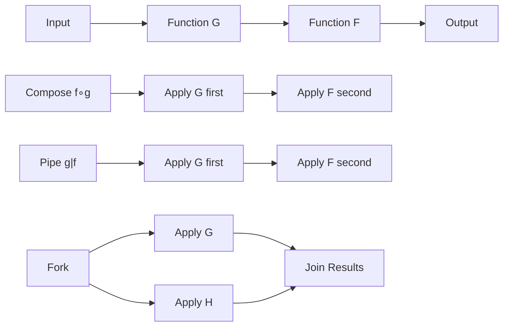

# Function Composition

## Overview

XIEITE's function composition utilities enable powerful functional programming patterns in C++, allowing developers to build complex operations from simple, reusable functions through composition, piping, and chaining mechanisms.

## Composition Fundamentals

### Mathematical Composition
Function composition follows mathematical principles where `(f ∘ g)(x) = f(g(x))`:

```cpp
auto add_one = [](int x) { return x + 1; };
auto double_it = [](int x) { return x * 2; };

// Mathematical order: first apply g, then f
auto f = xieite::compose(double_it, add_one);
auto result = f(5);  // double_it(add_one(5)) = 12
```

### Pipeline Composition
Pipeline composition provides intuitive left-to-right data flow:

```cpp
auto add_one = [](int x) { return x + 1; };
auto double_it = [](int x) { return x * 2; };

// Pipeline order: left to right
auto f = xieite::pipe(add_one, double_it);
auto result = f(5);  // double_it(add_one(5)) = 12
```

## Core Composition Functions

### Binary Composition
```cpp
template<typename F, typename G>
auto compose(F&& f, G&& g) {
    return [f = std::forward<F>(f), g = std::forward<G>(g)]
           <typename... Args>(Args&&... args)
           XIEITE_ARROW(
               f(g(std::forward<Args>(args)...))
           )
}

// Usage
auto sqrt_abs = xieite::compose(std::sqrt, std::abs);
auto result = sqrt_abs(-16.0);  // 4.0
```

### Variadic Composition
```cpp
template<typename F, typename... Fs>
auto compose_all(F&& f, Fs&&... fs) {
    if constexpr (sizeof...(fs) == 0) {
        return std::forward<F>(f);
    } else {
        return compose(std::forward<F>(f),
                      compose_all(std::forward<Fs>(fs)...));
    }
}

// Usage
auto process = xieite::compose_all(
    [](int x) { return x * x; },      // Last
    [](int x) { return x + 10; },     // Middle
    [](int x) { return x * 2; }       // First
);
auto result = process(5);  // ((5 * 2) + 10)² = 400
```

### Pipeline Composition
```cpp
template<typename F, typename G>
auto pipe(F&& f, G&& g) {
    return [f = std::forward<F>(f), g = std::forward<G>(g)]
           <typename... Args>(Args&&... args)
           XIEITE_ARROW(
               g(f(std::forward<Args>(args)...))
           )
}

// Variadic pipeline
template<typename... Fs>
auto pipeline(Fs&&... fs) {
    return (... | fs);  // Fold expression with custom operator|
}
```

## Advanced Composition Patterns

### Conditional Composition
```cpp
template<typename Pred, typename F, typename G>
auto compose_if(Pred&& pred, F&& f, G&& g) {
    return [=]<typename T>(T&& x) -> decltype(auto) {
        if (pred(x)) {
            return f(g(std::forward<T>(x)));
        } else {
            return std::forward<T>(x);
        }
    };
}

// Usage
auto safe_sqrt = xieite::compose_if(
    [](double x) { return x >= 0; },
    std::sqrt,
    std::abs
);
```

### Parallel Composition
```cpp
template<typename... Fs>
auto parallel(Fs&&... fs) {
    return [=]<typename T>(T&& x) {
        return std::make_tuple(fs(x)...);
    };
}

// Usage
auto analyze = xieite::parallel(
    [](const auto& data) { return data.size(); },
    [](const auto& data) { return data.empty(); },
    [](const auto& data) { return data.front(); }
);

auto [size, empty, first] = analyze(container);
```

### Fork Composition
```cpp
template<typename F, typename G, typename H>
auto fork(F&& join, G&& left, H&& right) {
    return [=]<typename T>(T&& x) -> decltype(auto) {
        return join(left(x), right(x));
    };
}

// Usage: Calculate average
auto average = xieite::fork(
    std::divides{},
    [](const auto& v) { return std::accumulate(v.begin(), v.end(), 0.0); },
    [](const auto& v) { return static_cast<double>(v.size()); }
);
```

## Composition with State

### Stateful Composition
```cpp
template<typename State, typename F>
class stateful_function {
    mutable State state_;
    F func_;

public:
    template<typename... Args>
    auto operator()(Args&&... args) const {
        return func_(state_, std::forward<Args>(args)...);
    }
};

template<typename State, typename F>
auto with_state(State initial, F&& f) {
    return stateful_function<State, std::decay_t<F>>{
        std::move(initial), std::forward<F>(f)
    };
}
```

### Accumulating Composition
```cpp
template<typename F, typename Init>
auto accumulate_compose(F&& f, Init init) {
    return [f = std::forward<F>(f), acc = std::move(init)]
           (auto x) mutable -> decltype(auto) {
        acc = f(acc, x);
        return acc;
    };
}

// Usage: Running sum
auto running_sum = xieite::accumulate_compose(std::plus{}, 0);
```

## Monadic Composition

### Optional Composition
```cpp
template<typename F>
auto lift_optional(F&& f) {
    return [f = std::forward<F>(f)]
           (const std::optional<auto>& opt) -> std::optional<decltype(f(*opt))> {
        if (opt) {
            return f(*opt);
        }
        return std::nullopt;
    };
}

template<typename F, typename G>
auto compose_optional(F&& f, G&& g) {
    return compose(lift_optional(std::forward<F>(f)),
                  lift_optional(std::forward<G>(g)));
}
```

### Result Composition
```cpp
template<typename T, typename E>
using result = std::variant<T, E>;

template<typename F>
auto lift_result(F&& f) {
    return [f = std::forward<F>(f)]<typename T, typename E>
           (const result<T, E>& r) -> result<decltype(f(std::get<T>(r))), E> {
        if (std::holds_alternative<T>(r)) {
            return f(std::get<T>(r));
        }
        return std::get<E>(r);
    };
}
```

## Lazy Composition

### Deferred Composition
```cpp
template<typename F>
class lazy_function {
    mutable std::optional<std::invoke_result_t<F>> cache_;
    F func_;

public:
    explicit lazy_function(F f) : func_(std::move(f)) {}

    const auto& operator()() const {
        if (!cache_) {
            cache_ = func_();
        }
        return *cache_;
    }
};

template<typename F, typename G>
auto compose_lazy(F&& f, G&& g) {
    return lazy_function([=] { return f(g()); });
}
```

## Composition Operators

### Operator Overloading
```cpp
template<typename F, typename G>
    requires std::is_invocable_v<F, std::invoke_result_t<G>>
auto operator|(G&& g, F&& f) {
    return pipe(std::forward<G>(g), std::forward<F>(f));
}

template<typename F, typename G>
    requires std::is_invocable_v<F, std::invoke_result_t<G>>
auto operator*(F&& f, G&& g) {
    return compose(std::forward<F>(f), std::forward<G>(g));
}

// Usage
auto process = add_one | double_it | negate;
auto math = sqrt * abs * add_one;
```

## Performance Optimizations

### Perfect Forwarding
```cpp
template<typename F, typename G>
class composed_function {
    [[no_unique_address]] F f_;
    [[no_unique_address]] G g_;

public:
    template<typename... Args>
    constexpr decltype(auto) operator()(Args&&... args) const& {
        return f_(g_(std::forward<Args>(args)...));
    }

    template<typename... Args>
    constexpr decltype(auto) operator()(Args&&... args) && {
        return std::move(f_)(std::move(g_)(std::forward<Args>(args)...));
    }
};
```

### Compile-Time Composition
```cpp
template<typename F, typename G>
constexpr auto constexpr_compose(F f, G g) {
    return [=]<typename... Args>(Args... args) constexpr {
        return f(g(args...));
    };
}

// Usage at compile time
constexpr auto add_mul = constexpr_compose(
    [](int x) constexpr { return x + 1; },
    [](int x) constexpr { return x * 2; }
);

static_assert(add_mul(5) == 11);
```

## Usage Examples

### Data Processing Pipeline
```cpp
auto process_data = xieite::pipeline(
    [](const std::string& s) { return xieite::trim(s); },
    [](const std::string& s) { return xieite::to_lower(s); },
    [](const std::string& s) { return xieite::split(s, ' '); },
    [](const auto& words) {
        return xieite::filter(words, [](const auto& w) {
            return w.length() > 3;
        });
    }
);

auto result = process_data("  Hello WORLD from C++  ");
```

### Error Handling Pipeline
```cpp
template<typename T>
using maybe = std::optional<T>;

auto safe_divide = [](double x, double y) -> maybe<double> {
    return y != 0 ? maybe{x / y} : std::nullopt;
};

auto safe_sqrt = [](double x) -> maybe<double> {
    return x >= 0 ? maybe{std::sqrt(x)} : std::nullopt;
};

auto safe_computation = xieite::compose_optional(safe_sqrt, safe_divide);
```

### Validation Pipeline
```cpp
auto validate = xieite::pipeline(
    [](const auto& input) { return trim(input); },
    [](const auto& input) {
        return input.length() >= 3 ? maybe{input} : std::nullopt;
    },
    [](const auto& input) {
        return is_valid_email(input) ? maybe{input} : std::nullopt;
    }
);
```

## Best Practices

1. **Use appropriate composition order** - compose for mathematical, pipe for data flow
2. **Leverage type deduction** with auto and concepts
3. **Minimize copies** with perfect forwarding
4. **Consider lazy evaluation** for expensive operations
5. **Use operator overloading** judiciously for readability

## Common Pitfalls

1. **Reference lifetime** - Be careful with captured references in composed functions
2. **Type mismatches** - Ensure compatible function signatures
3. **Performance overhead** - Multiple function calls vs. inlining
4. **Error handling** - Consider monadic composition for fallible operations

## Mermaid Diagram



## See Also

- [Functional API](../../reference/api/fn.md)
- [Currying Patterns](./currying.md)
- [Memoization](./memoization.md)
- [Combinator Patterns](./combinators.md)
