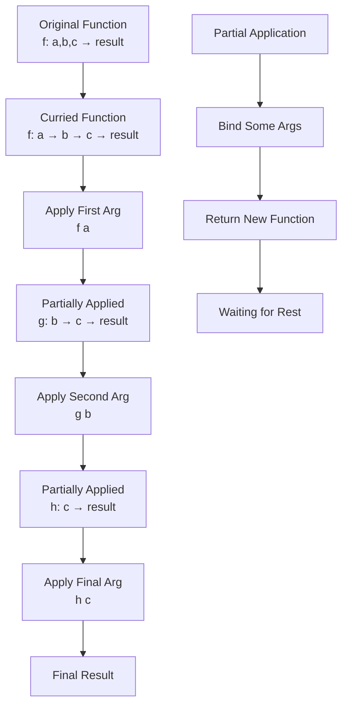

# Currying & Partial Application

## Overview

XIEITE's currying and partial application utilities transform multi-parameter functions into sequences of single-parameter functions, enabling powerful functional composition patterns and flexible argument binding strategies.

## Currying Fundamentals

### What is Currying?
Currying transforms a function that takes multiple arguments into a sequence of functions that each take a single argument:

```cpp
// Original function: (a, b, c) -> result
auto add3 = [](int a, int b, int c) { return a + b + c; };

// Curried form: a -> b -> c -> result
auto curried = xieite::curry(add3);
auto f1 = curried(10);      // Returns function waiting for b
auto f2 = f1(20);           // Returns function waiting for c
auto result = f2(30);       // Returns 60

// Or chain calls
auto result2 = curried(10)(20)(30);  // 60
```

### Mathematical Foundation
Currying is based on the isomorphism between multi-argument functions and higher-order functions:
- `(A × B) → C` is isomorphic to `A → (B → C)`
- Named after Haskell Curry, though introduced by Moses Schönfinkel

## Core Currying Implementation

### Basic Curry
```cpp
template<typename F>
class curry_wrapper {
    F func_;

public:
    explicit curry_wrapper(F f) : func_(std::move(f)) {}

    template<typename... Args>
    auto operator()(Args&&... args) const {
        if constexpr (std::is_invocable_v<F, Args...>) {
            return func_(std::forward<Args>(args)...);
        } else {
            return curry_wrapper{
                [f = func_, ...bound = std::forward<Args>(args)]
                <typename... Rest>(Rest&&... rest) {
                    return f(bound..., std::forward<Rest>(rest)...);
                }
            };
        }
    }
};

template<typename F>
auto curry(F&& f) {
    return curry_wrapper{std::forward<F>(f)};
}
```

### Variadic Curry
```cpp
template<typename F, std::size_t Arity>
class variadic_curry {
    F func_;
    std::tuple<> args_;

    template<typename... Bound>
    variadic_curry(F f, std::tuple<Bound...> bound)
        : func_(std::move(f)), args_(std::move(bound)) {}

public:
    explicit variadic_curry(F f) : func_(std::move(f)) {}

    template<typename Arg>
    auto operator()(Arg&& arg) const {
        auto new_args = std::tuple_cat(args_, std::make_tuple(std::forward<Arg>(arg)));

        if constexpr (std::tuple_size_v<decltype(new_args)> == Arity) {
            return std::apply(func_, new_args);
        } else {
            return variadic_curry{func_, std::move(new_args)};
        }
    }
};
```

## Partial Application

### Left Partial Application
```cpp
template<typename F, typename... BoundArgs>
auto partial(F&& f, BoundArgs&&... bound) {
    return [f = std::forward<F>(f),
            ...bound = std::forward<BoundArgs>(bound)]
           <typename... FreeArgs>(FreeArgs&&... free)
           XIEITE_ARROW(
               f(bound..., std::forward<FreeArgs>(free)...)
           )
}

// Usage
auto multiply = [](int a, int b, int c) { return a * b * c; };
auto times_10 = xieite::partial(multiply, 10);
auto result = times_10(2, 3);  // 60
```

### Right Partial Application
```cpp
template<typename F, typename... BoundArgs>
auto partial_right(F&& f, BoundArgs&&... bound) {
    return [f = std::forward<F>(f),
            ...bound = std::forward<BoundArgs>(bound)]
           <typename... FreeArgs>(FreeArgs&&... free)
           XIEITE_ARROW(
               f(std::forward<FreeArgs>(free)..., bound...)
           )
}

// Usage
auto divide = [](double a, double b) { return a / b; };
auto divide_by_2 = xieite::partial_right(divide, 2.0);
auto result = divide_by_2(10.0);  // 5.0
```

### Middle Partial Application
```cpp
template<std::size_t... Is, typename F, typename... BoundArgs>
auto partial_at(F&& f, BoundArgs&&... bound) {
    return [f = std::forward<F>(f),
            bound_tuple = std::make_tuple(std::forward<BoundArgs>(bound)...)]
           <typename... FreeArgs>(FreeArgs&&... free) {
        auto free_tuple = std::make_tuple(std::forward<FreeArgs>(free)...);
        return apply_with_holes<Is...>(f, bound_tuple, free_tuple);
    };
}

// Usage: bind 2nd and 4th arguments
auto f = [](int a, int b, int c, int d) {
    return a * 1000 + b * 100 + c * 10 + d;
};
auto bound = xieite::partial_at<1, 3>(f, 5, 7);
auto result = bound(1, 3);  // 1537
```

## Advanced Currying Patterns

### Auto-Curry
```cpp
template<typename F>
class auto_curry {
    F func_;
    static constexpr auto arity = function_arity_v<F>;

public:
    template<typename... Args>
    auto operator()(Args&&... args) const {
        if constexpr (sizeof...(args) == arity) {
            return func_(std::forward<Args>(args)...);
        } else if constexpr (sizeof...(args) < arity) {
            return partial(func_, std::forward<Args>(args)...);
        } else {
            static_assert(sizeof...(args) <= arity, "Too many arguments");
        }
    }
};
```

### Uncurrying
```cpp
template<typename F>
class uncurry_wrapper {
    F func_;

public:
    template<typename... Args>
    auto operator()(Args&&... args) const {
        return apply_recursive(func_, std::forward<Args>(args)...);
    }

private:
    template<typename Fn, typename Arg, typename... Rest>
    auto apply_recursive(Fn&& fn, Arg&& arg, Rest&&... rest) const {
        auto next = fn(std::forward<Arg>(arg));
        if constexpr (sizeof...(rest) > 0) {
            return apply_recursive(next, std::forward<Rest>(rest)...);
        } else {
            return next;
        }
    }
};

template<typename F>
auto uncurry(F&& f) {
    return uncurry_wrapper{std::forward<F>(f)};
}
```

## Placeholder-Based Binding

### Placeholder System
```cpp
template<std::size_t N>
struct placeholder {
    static constexpr std::size_t index = N;
};

inline constexpr placeholder<0> _1{};
inline constexpr placeholder<1> _2{};
inline constexpr placeholder<2> _3{};
// ... more placeholders

template<typename F, typename... BoundArgs>
auto bind_with_placeholders(F&& f, BoundArgs&&... bound) {
    return [f = std::forward<F>(f),
            ...bound = std::forward<BoundArgs>(bound)]
           <typename... CallArgs>(CallArgs&&... call_args) {
        return f(resolve_arg(bound, call_args...)...);
    };
}

// Usage
auto f = [](int a, int b, int c) { return a * 100 + b * 10 + c; };
auto bound = xieite::bind_with_placeholders(f, _2, 5, _1);
auto result = bound(7, 3);  // 357
```

## Currying with State

### Stateful Curry
```cpp
template<typename State, typename F>
class stateful_curry {
    mutable State state_;
    F func_;

public:
    stateful_curry(State s, F f) : state_(std::move(s)), func_(std::move(f)) {}

    template<typename Arg>
    auto operator()(Arg&& arg) const {
        return [this, arg = std::forward<Arg>(arg)]
               <typename... Rest>(Rest&&... rest) {
            state_ = update_state(state_, arg);
            return func_(state_, arg, std::forward<Rest>(rest)...);
        };
    }
};
```

### Accumulating Curry
```cpp
template<typename F, typename Op = std::plus<>>
class accumulating_curry {
    F func_;
    Op op_;

public:
    template<typename T>
    class bound {
        F func_;
        T accumulated_;
        Op op_;

    public:
        bound(F f, T acc, Op o)
            : func_(f), accumulated_(std::move(acc)), op_(o) {}

        template<typename U>
        auto operator()(U&& val) const {
            auto new_acc = op_(accumulated_, std::forward<U>(val));
            return bound{func_, new_acc, op_};
        }

        auto operator()() const {
            return func_(accumulated_);
        }
    };

    template<typename T>
    auto operator()(T&& initial) const {
        return bound{func_, std::forward<T>(initial), op_};
    }
};
```

## Type-Safe Currying

### Concept-Constrained Curry
```cpp
template<typename F>
    requires std::is_invocable_v<F>
class typed_curry {
    using traits = function_traits<F>;
    static constexpr auto arity = traits::arity;

    F func_;

    template<std::size_t N, typename... Bound>
    class partial_application {
        F func_;
        std::tuple<Bound...> bound_;

    public:
        template<typename Arg>
            requires std::is_convertible_v<Arg,
                typename traits::template arg_type<sizeof...(Bound)>>
        auto operator()(Arg&& arg) const {
            auto new_bound = std::tuple_cat(bound_,
                std::make_tuple(std::forward<Arg>(arg)));

            if constexpr (sizeof...(Bound) + 1 == arity) {
                return std::apply(func_, new_bound);
            } else {
                return partial_application<N - 1, Bound..., Arg>{
                    func_, std::move(new_bound)
                };
            }
        }
    };

public:
    template<typename Arg>
    auto operator()(Arg&& arg) const {
        return partial_application<arity - 1>{
            func_, std::make_tuple(std::forward<Arg>(arg))
        };
    }
};
```

## Performance Optimizations

### Zero-Cost Currying
```cpp
template<typename F>
class zero_cost_curry {
    [[no_unique_address]] F func_;

    template<typename... Bound>
    struct bound_function {
        [[no_unique_address]] F func_;
        std::tuple<Bound...> args_;

        template<typename... Rest>
        constexpr auto operator()(Rest&&... rest) const
            XIEITE_ARROW_NOEX(
                std::apply(func_,
                    std::tuple_cat(args_,
                        std::forward_as_tuple(std::forward<Rest>(rest)...)))
            )
    };

public:
    template<typename... Args>
    constexpr auto operator()(Args&&... args) const {
        if constexpr (std::is_invocable_v<F, Args...>) {
            return func_(std::forward<Args>(args)...);
        } else {
            return bound_function<Args...>{
                func_, std::forward_as_tuple(std::forward<Args>(args)...)
            };
        }
    }
};
```

### Compile-Time Currying
```cpp
template<auto F>
struct static_curry {
    template<typename... Args>
    static constexpr auto apply(Args... args) {
        if constexpr (std::is_invocable_v<decltype(F), Args...>) {
            return F(args...);
        } else {
            return []<typename... Rest>(Rest... rest) constexpr {
                return F(args..., rest...);
            };
        }
    }
};

// Usage
constexpr auto add = [](int a, int b) constexpr { return a + b; };
using curried_add = static_curry<add>;
constexpr auto add_5 = curried_add::apply(5);
static_assert(add_5(3) == 8);
```

## Practical Applications

### Configuration Builder
```cpp
auto configure = xieite::curry([](
    std::string host,
    int port,
    std::string username,
    std::string password
) {
    return Config{host, port, username, password};
});

auto local_config = configure("localhost");
auto dev_config = local_config(3000);
auto test_config = local_config(4000);

auto dev_admin = dev_config("admin")("secret");
auto test_user = test_config("user")("password");
```

### Event Handler Registration
```cpp
auto on_event = xieite::curry([](
    EventType type,
    Priority priority,
    Handler handler
) {
    event_system.register(type, priority, handler);
});

auto on_click = on_event(EventType::Click);
auto high_priority_click = on_click(Priority::High);
high_priority_click([](auto e) { /* handle */ });
```

### Validation Pipeline
```cpp
auto validate = xieite::curry([](
    Validator v1,
    Validator v2,
    Validator v3,
    const Data& data
) {
    return v1(data) && v2(data) && v3(data);
});

auto email_validator = validate(is_not_empty)(is_email)(is_verified);
bool is_valid = email_validator(user_email);
```

## Common Patterns

### Function Factories
```cpp
auto make_multiplier = xieite::curry([](int factor, int value) {
    return factor * value;
});

auto double_it = make_multiplier(2);
auto triple_it = make_multiplier(3);
```

### Dependency Injection
```cpp
auto create_service = xieite::curry([](
    Logger& log,
    Database& db,
    Cache& cache,
    Request req
) {
    return Service{log, db, cache}.handle(req);
});

auto with_infrastructure = create_service(logger)(database)(cache);
auto response = with_infrastructure(request);
```

## Best Practices

1. **Use curry for function transformation**, partial for argument binding
2. **Prefer left-to-right partial application** for readability
3. **Consider compile-time currying** for constexpr contexts
4. **Document curry order** clearly in APIs
5. **Use placeholders** for complex binding patterns

## Common Pitfalls

1. **Reference lifetime** - Be careful with reference parameters
2. **Evaluation order** - Curried functions may capture by value
3. **Template instantiation** - Can lead to code bloat
4. **Type deduction** - May need explicit types for complex functions

## Mermaid Diagram



## See Also

- [Function Composition](./composition.md)
- [Functional API](../../reference/api/fn.md)
- [Combinator Patterns](./combinators.md)
- [Memoization](./memoization.md)