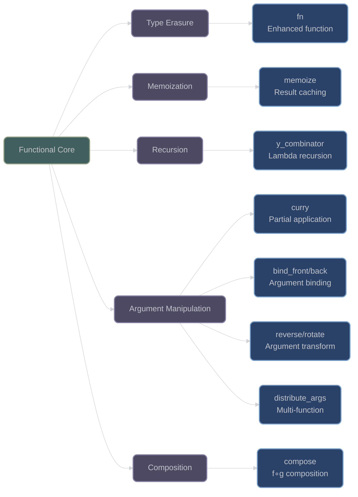

# Core Functional Programming Utilities

## Overview

XIEITE provides sophisticated functional programming utilities that extend C++ with type-erased functions, memoization, recursion combinators, and advanced argument manipulation patterns. These utilities leverage modern C++20 features to provide zero-overhead abstractions where possible.

## Type-Erased Function Wrapper

### fn

**`xieite::fn<Signature>`** - Enhanced std::function with noexcept support:
```cpp
template<typename Signature>
struct fn;

template<typename Result, typename... Args>
struct fn<Result(Args...)> {
    // Type-erased storage
    void* data;
    Result (*invoke_ptr)(void*, Args...);
    void (*destroy_ptr)(void*);
    void* (*clone_ptr)(void*);
    
    // noexcept specialization support
    constexpr bool is_noexcept = false;
};

template<typename Result, typename... Args>
struct fn<Result(Args...) noexcept> {
    // Same but with noexcept guarantee
    constexpr bool is_noexcept = true;
};
```

Key advantages over std::function:
- **Noexcept support**: Can wrap and guarantee noexcept functions
- **Lighter weight**: Optimized for common cases
- **Better error messages**: Cleaner template errors

```cpp
// Regular function
xieite::fn<int(int, int)> add = [](int a, int b) { return a + b; };
int result = add(5, 3);  // 8

// Noexcept function
xieite::fn<int(int) noexcept> safe_abs = [](int x) noexcept { 
    return x < 0 ? -x : x; 
};
static_assert(noexcept(safe_abs(-5)));  // Guaranteed noexcept

// Stateful lambda
int counter = 0;
xieite::fn<void()> increment = [&counter]() { ++counter; };
increment();  // counter = 1
```

## Memoization

### memoize

**`xieite::memoize(func)`** - Automatic result caching:
```cpp
template<typename Func>
[[nodiscard]] constexpr auto memoize(Func&& func) {
    return [func = XIEITE_FWD(func), 
            cache = std::map<std::tuple<Args...>, Result>{}]
           (Args... args) mutable -> Result {
        auto key = std::make_tuple(args...);
        if (auto it = cache.find(key); it != cache.end()) {
            return it->second;
        }
        auto result = func(args...);
        cache[key] = result;
        return result;
    };
}
```

Features:
- **Transparent caching**: No code changes needed
- **Thread-safe version available**: `memoize_mt`
- **Perfect forwarding**: Efficient argument passing

```cpp
// Expensive computation
auto fib = xieite::memoize([](auto self, int n) -> int {
    if (n <= 1) return n;
    return self(self, n-1) + self(self, n-2);
});

int result = fib(fib, 40);  // Fast due to caching

// With Y combinator for cleaner syntax
auto fib2 = xieite::memoize(
    xieite::y_combinator([](auto self, int n) -> int {
        if (n <= 1) return n;
        return self(n-1) + self(n-2);
    })
);

int result2 = fib2(40);  // Same performance
```

## Y Combinator

### y_combinator

**`xieite::y_combinator`** - Enable lambda recursion:
```cpp
template<typename Func>
struct y_combinator {
    Func func;
    
    template<typename... Args>
    constexpr decltype(auto) operator()(Args&&... args) const {
        return func(*this, XIEITE_FWD(args)...);
    }
};
```

Allows recursive lambdas without std::function overhead:

```cpp
// Factorial with Y combinator
auto factorial = xieite::y_combinator(
    [](auto self, int n) -> int {
        return (n <= 1) ? 1 : n * self(n - 1);
    }
);

int fact5 = factorial(5);  // 120

// Tree traversal
struct Node {
    int value;
    std::vector<Node> children;
};

auto sum_tree = xieite::y_combinator(
    [](auto self, const Node& node) -> int {
        int sum = node.value;
        for (const auto& child : node.children) {
            sum += self(child);
        }
        return sum;
    }
);
```

## Argument Manipulation

### curry

**`xieite::curry(func)`** - Automatic currying:
```cpp
template<typename Func>
[[nodiscard]] constexpr auto curry(Func&& func) {
    return [func = XIEITE_FWD(func)](auto&&... args) {
        if constexpr (std::invocable<Func, decltype(args)...>) {
            return func(XIEITE_FWD(args)...);
        } else {
            return curry([func, ...bound = XIEITE_FWD(args)]
                        (auto&&... more) {
                return func(bound..., XIEITE_FWD(more)...);
            });
        }
    };
}
```

```cpp
// Multi-argument function
auto add3 = [](int a, int b, int c) { return a + b + c; };
auto curried = xieite::curry(add3);

// Partial application
auto add1 = curried(1);        // Binds first arg
auto add1_2 = add1(2);         // Binds second arg  
int result = add1_2(3);        // 6

// Or all at once
int result2 = curried(1)(2)(3); // 6
int result3 = curried(1, 2, 3); // 6
```

### bind_front / bind_back

**`xieite::bind_front(func, args...)`** - Bind arguments at front:
```cpp
template<typename Func, typename... BoundArgs>
[[nodiscard]] constexpr auto bind_front(Func&& func, BoundArgs&&... bound) {
    return [func = XIEITE_FWD(func), 
            ...bound = XIEITE_FWD(bound)](auto&&... args) {
        return func(bound..., XIEITE_FWD(args)...);
    };
}
```

```cpp
// Logging with prefix
auto log_error = xieite::bind_front(printf, "[ERROR] %s\n");
log_error("File not found");  // Prints: [ERROR] File not found

// Bind from back
auto div_by_2 = xieite::bind_back(std::divides<>{}, 2);
int half = div_by_2(10);  // 5
```

### reverse_args / rotate_args

**`xieite::reverse_args(func)`** - Reverse argument order:
```cpp
template<typename Func>
[[nodiscard]] constexpr auto reverse_args(Func&& func) {
    return [func = XIEITE_FWD(func)](auto&&... args) {
        return [&func]<std::size_t... idxs>(std::index_sequence<idxs...>) {
            constexpr std::size_t n = sizeof...(args);
            auto tuple = std::forward_as_tuple(XIEITE_FWD(args)...);
            return func(std::get<n - 1 - idxs>(tuple)...);
        }(std::index_sequence_for<decltype(args)...>{});
    };
}
```

```cpp
// Reverse argument order
auto concat = [](const std::string& a, const std::string& b) {
    return a + " " + b;
};
auto reversed = xieite::reverse_args(concat);
std::string result = reversed("world", "hello");  // "hello world"

// Rotate arguments
auto rotate3 = xieite::rotate_args<1>(
    [](int a, int b, int c) { 
        return std::vector{a, b, c}; 
    }
);
auto rotated = rotate3(1, 2, 3);  // {2, 3, 1}
```

### distribute_args

**`xieite::distribute_args(funcs...)`** - Distribute args to multiple functions:
```cpp
template<typename... Funcs>
[[nodiscard]] constexpr auto distribute_args(Funcs&&... funcs) {
    return [funcs...](auto&&... args) {
        return std::tuple{
            funcs(XIEITE_FWD(args)...)...
        };
    };
}
```

```cpp
// Apply multiple operations
auto analyze = xieite::distribute_args(
    [](int x) { return x * 2; },      // Double
    [](int x) { return x + 10; },     // Add 10
    [](int x) { return x % 2 == 0; }  // Is even?
);

auto [doubled, plus10, is_even] = analyze(5);
// doubled = 10, plus10 = 15, is_even = false
```

## Function Composition

### compose

**`xieite::compose(f, g)`** - Function composition:
```cpp
template<typename F, typename G>
[[nodiscard]] constexpr auto compose(F&& f, G&& g) {
    return [f = XIEITE_FWD(f), g = XIEITE_FWD(g)](auto&&... args) {
        return f(g(XIEITE_FWD(args)...));
    };
}
```

```cpp
// Mathematical composition
auto add5 = [](int x) { return x + 5; };
auto mul2 = [](int x) { return x * 2; };

auto add5_then_mul2 = xieite::compose(mul2, add5);
int result = add5_then_mul2(3);  // (3 + 5) * 2 = 16

// String processing pipeline
auto process = xieite::compose(
    [](std::string s) { return "[" + s + "]"; },  // Add brackets
    [](std::string s) { return xieite::toupper(s); }  // Uppercase
);
std::string result = process("hello");  // "[HELLO]"
```

## Architecture Diagram



## Performance Considerations

- **Type Erasure**: Small overhead for virtual dispatch in `fn`
- **Memoization**: O(1) lookup after first call, memory usage grows with unique inputs
- **Y Combinator**: Zero overhead, purely compile-time
- **Currying**: Small overhead for nested lambdas
- **Argument manipulation**: Compile-time for most operations

## Best Practices

1. **Use Y combinator for recursive lambdas**:
   ```cpp
   // Cleaner than std::function self-reference
   auto recursive = xieite::y_combinator([](auto self, int n) {
       return n <= 0 ? 0 : n + self(n - 1);
   });
   ```

2. **Memoize expensive pure functions**:
   ```cpp
   // Cache results automatically
   auto expensive = xieite::memoize(compute_heavy_result);
   ```

3. **Compose for pipelines**:
   ```cpp
   // Build processing pipelines
   auto pipeline = xieite::compose(step3, xieite::compose(step2, step1));
   ```

4. **Curry for partial application**:
   ```cpp
   // Create specialized versions
   auto general = xieite::curry(process);
   auto specialized = general(default_config);
   ```

---

*Next: [Guards and Wrappers](guards_and_wrappers.md)*