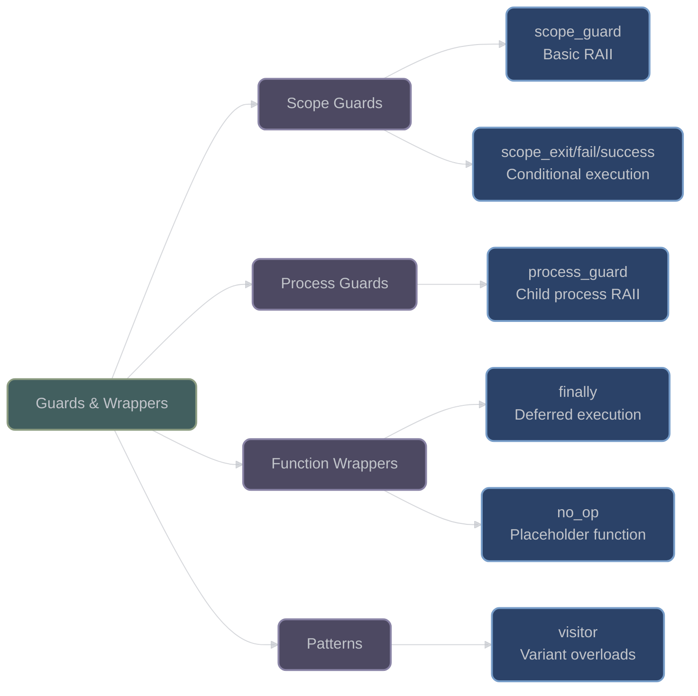

# Guards and Wrapper Utilities

## Overview

XIEITE provides RAII-based guard utilities for automatic cleanup, resource management, and scope-based actions. These utilities ensure exception safety and eliminate manual cleanup code through deterministic destruction.

## Scope Guards

### scope_guard

**`xieite::scope_guard`** - Execute code on scope exit:
```cpp
template<std::invocable<> Func>
struct scope_guard {
    Func func;
    bool active = true;
    
    // Execute on destruction if active
    ~scope_guard() noexcept(noexcept(func())) {
        if (active) func();
    }
    
    // Dismiss guard
    void release() noexcept { active = false; }
};
```

Key features:
- **RAII cleanup**: Automatic execution on scope exit
- **Exception safe**: Works correctly during stack unwinding
- **Dismissible**: Can be cancelled if operation succeeds
- **Move-only**: Unique ownership of cleanup action

```cpp
// File handling with automatic cleanup
void process_file(const char* path) {
    FILE* file = fopen(path, "r");
    if (!file) throw std::runtime_error("Cannot open file");
    
    xieite::scope_guard cleanup([file] { 
        fclose(file);
        std::cout << "File closed\n";
    });
    
    // Process file...
    if (error_condition) {
        throw std::runtime_error("Processing failed");
        // File automatically closed via destructor
    }
    
    // Success path
    cleanup.release();  // Don't close twice
    fclose(file);      // Manual close on success
}

// Transaction pattern
void database_transaction() {
    begin_transaction();
    
    xieite::scope_guard rollback([] {
        rollback_transaction();
    });
    
    // Multiple operations
    insert_record("users", data1);
    update_record("accounts", data2);
    delete_record("temp", id);
    
    // All succeeded
    commit_transaction();
    rollback.release();  // Don't rollback
}
```

### scope_exit / scope_fail / scope_success

Specialized guards for different exit conditions:

```cpp
// Always execute
template<std::invocable<> Func>
using scope_exit = scope_guard<Func>;

// Execute only on exception
template<std::invocable<> Func>
struct scope_fail {
    Func func;
    int exception_count = std::uncaught_exceptions();
    
    ~scope_fail() noexcept(noexcept(func())) {
        if (std::uncaught_exceptions() > exception_count) {
            func();
        }
    }
};

// Execute only on normal exit
template<std::invocable<> Func>
struct scope_success {
    Func func;
    int exception_count = std::uncaught_exceptions();
    
    ~scope_success() noexcept(noexcept(func())) {
        if (std::uncaught_exceptions() == exception_count) {
            func();
        }
    }
};
```

Usage examples:

```cpp
void complex_operation() {
    xieite::scope_exit always([] {
        std::cout << "Always executed\n";
    });
    
    xieite::scope_fail on_error([] {
        std::cerr << "Operation failed!\n";
        log_error();
    });
    
    xieite::scope_success on_success([] {
        std::cout << "Operation succeeded!\n";
        update_metrics();
    });
    
    // Risky operations
    if (failure) throw std::runtime_error("Failed");
    // on_error executes, on_success doesn't
    
    // Normal completion
    // on_success executes, on_error doesn't
    // always executes in both cases
}
```

## Process Guards

### process_guard

**`xieite::process_guard`** - Manage child processes:
```cpp
struct process_guard {
    #ifdef _WIN32
        HANDLE handle;
    #else
        pid_t pid;
    #endif
    
    // Terminate on destruction
    ~process_guard() noexcept {
        terminate();
    }
    
    // Check if alive
    [[nodiscard]] bool is_alive() const noexcept;
    
    // Terminate process
    void terminate() noexcept;
    
    // Wait for completion
    int wait(std::optional<std::chrono::milliseconds> timeout = {});
};
```

Cross-platform process management:

```cpp
// Launch and manage subprocess
void run_worker() {
    xieite::process_guard worker = launch_process("worker.exe");
    
    // Process automatically terminated if we throw
    if (!worker.is_alive()) {
        throw std::runtime_error("Worker failed to start");
    }
    
    // Wait with timeout
    auto exit_code = worker.wait(std::chrono::seconds(30));
    if (!exit_code) {
        std::cerr << "Worker timed out\n";
        // Destructor terminates process
    }
}

// Batch processing with cleanup
void batch_process(const std::vector<std::string>& tasks) {
    std::vector<xieite::process_guard> workers;
    
    for (const auto& task : tasks) {
        workers.push_back(launch_worker(task));
    }
    
    // All workers terminated if exception thrown
    process_results();
    
    // Normal termination
    for (auto& worker : workers) {
        worker.wait();
    }
}
```

## Function Wrappers

### finally

**`xieite::finally(func)`** - Deferred execution:
```cpp
template<std::invocable<> Func>
[[nodiscard]] auto finally(Func&& func) {
    return scope_guard{XIEITE_FWD(func)};
}
```

Convenient scope guard creation:

```cpp
void example() {
    auto cleanup = xieite::finally([] {
        std::cout << "Cleanup executed\n";
    });
    
    // Equivalent to scope_guard but more concise
    risky_operation();
    // Cleanup runs here
}

// With early return
bool validate_and_process() {
    auto notify = xieite::finally([] {
        send_notification("Processing complete");
    });
    
    if (!validate_input()) return false;
    if (!check_permissions()) return false;
    
    process();
    return true;
    // Notification sent regardless of path
}
```

### no_op

**`xieite::no_op`** - Do-nothing function object:
```cpp
struct no_op {
    template<typename... Args>
    constexpr void operator()(Args&&...) const noexcept {}
};
```

Useful as default callback or placeholder:

```cpp
// Default parameter
template<typename Callback = xieite::no_op>
void process(Callback cb = {}) {
    // Process data...
    cb(result);  // Safe even if no callback provided
}

// Conditional callback
auto callback = verbose ? 
    [](int x) { std::cout << "Result: " << x << '\n'; } :
    xieite::no_op{};

for (auto item : items) {
    auto result = process(item);
    callback(result);  // No-op if not verbose
}
```

## Visitor Pattern

### visitor

**`xieite::visitor`** - Overload set for std::visit:
```cpp
template<typename... Funcs>
struct visitor : Funcs... {
    using Funcs::operator()...;
};

// Deduction guide
template<typename... Funcs>
visitor(Funcs...) -> visitor<Funcs...>;
```

Simplifies variant visitation:

```cpp
using Value = std::variant<int, double, std::string>;

void process_value(const Value& v) {
    std::visit(xieite::visitor{
        [](int i) { std::cout << "Integer: " << i << '\n'; },
        [](double d) { std::cout << "Double: " << d << '\n'; },
        [](const std::string& s) { std::cout << "String: " << s << '\n'; }
    }, v);
}

// Pattern matching style
auto result = std::visit(xieite::visitor{
    [](int i) { return i * 2; },
    [](double d) { return static_cast<int>(d); },
    [](const std::string& s) { return static_cast<int>(s.length()); }
}, value);
```

## Architecture Diagram



## Performance Considerations

- **Scope Guards**: Zero overhead when dismissed, single branch on destruction
- **Process Guards**: Platform-specific optimal implementation
- **Visitor Pattern**: Compile-time overload resolution, no runtime overhead
- **No-op**: Completely optimized away by compiler

## Best Practices

1. **Use scope guards for cleanup**:
   ```cpp
   // Automatic resource management
   auto guard = xieite::scope_guard([&] {
       cleanup_resources();
   });
   ```

2. **Prefer specialized guards**:
   ```cpp
   // Clear intent with scope_fail
   xieite::scope_fail on_error([] {
       rollback_changes();
   });
   ```

3. **Combine with finally for readability**:
   ```cpp
   // Deferred execution pattern
   auto defer = xieite::finally([] {
       restore_state();
   });
   ```

4. **Use visitor for variants**:
   ```cpp
   // Type-safe pattern matching
   std::visit(xieite::visitor{
       [](auto&& value) { process(value); }
   }, variant);
   ```

---

*Next: [User-Defined Literals](user_defined_literals.md)*