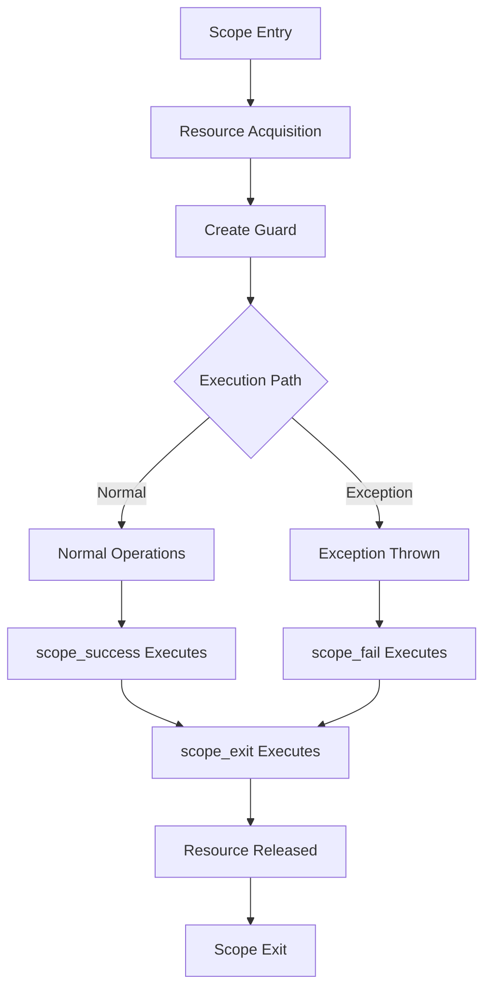

# Scope Guards

## Overview

XIEITE's scope guard utilities provide RAII-based resource management and automatic cleanup mechanisms, ensuring exception safety and deterministic execution of cleanup code regardless of how a scope is exited.

## Design Philosophy

### RAII Principles
Scope guards follow Resource Acquisition Is Initialization (RAII):
```cpp
void process_file(const std::string& path) {
    auto* file = fopen(path.c_str(), "r");
    auto guard = xieite::scope_exit([file] {
        if (file) fclose(file);
    });

    // File automatically closed on scope exit
    process_data(file);
    // No explicit cleanup needed
}
```

### Exception Safety
Guards ensure cleanup even during exception unwinding:
```cpp
void risky_operation() {
    acquire_resource();
    auto guard = xieite::scope_exit([] { release_resource(); });

    potentially_throwing_operation();  // Resource released even if throws
}
```

## Core Scope Guards

### Scope Exit
```cpp
template<typename F>
class scope_exit {
    F func_;
    bool active_ = true;

public:
    explicit scope_exit(F f) noexcept : func_(std::move(f)) {}

    ~scope_exit() noexcept {
        if (active_) {
            func_();
        }
    }

    // Move-only semantics
    scope_exit(scope_exit&& other) noexcept
        : func_(std::move(other.func_)), active_(other.active_) {
        other.active_ = false;
    }

    void dismiss() noexcept { active_ = false; }
    void release() noexcept { active_ = false; }
};

// Factory function
template<typename F>
auto make_scope_exit(F&& f) {
    return scope_exit<std::decay_t<F>>{std::forward<F>(f)};
}
```

### Scope Success
```cpp
template<typename F>
class scope_success {
    F func_;
    bool active_ = true;
    int exception_count_;

public:
    explicit scope_success(F f) noexcept
        : func_(std::move(f))
        , exception_count_(std::uncaught_exceptions()) {}

    ~scope_success() noexcept {
        if (active_ && exception_count_ == std::uncaught_exceptions()) {
            func_();  // Execute only on normal exit
        }
    }

    void dismiss() noexcept { active_ = false; }
};
```

### Scope Fail
```cpp
template<typename F>
class scope_fail {
    F func_;
    bool active_ = true;
    int exception_count_;

public:
    explicit scope_fail(F f) noexcept
        : func_(std::move(f))
        , exception_count_(std::uncaught_exceptions()) {}

    ~scope_fail() noexcept {
        if (active_ && exception_count_ < std::uncaught_exceptions()) {
            func_();  // Execute only on exception
        }
    }

    void dismiss() noexcept { active_ = false; }
};
```

## Advanced Scope Patterns

### Conditional Guards
```cpp
template<typename F>
class conditional_guard {
    F func_;
    std::function<bool()> condition_;
    bool active_ = true;

public:
    conditional_guard(F f, auto cond)
        : func_(std::move(f)), condition_(std::move(cond)) {}

    ~conditional_guard() noexcept {
        if (active_ && condition_()) {
            func_();
        }
    }
};

// Usage
auto guard = conditional_guard(
    [] { cleanup(); },
    [] { return needs_cleanup(); }
);
```

### Deferred Execution
```cpp
template<typename F>
class defer {
    F func_;

public:
    explicit defer(F f) : func_(std::move(f)) {}
    ~defer() { func_(); }

    // Prevent copying/moving
    defer(const defer&) = delete;
    defer& operator=(const defer&) = delete;
};

// Go-style defer macro
#define DEFER(code) \
    auto XIEITE_CONCAT(defer_, __LINE__) = xieite::defer([&]{ code; })

// Usage
void example() {
    DEFER(cleanup());
    DEFER(std::cout << "Second (executed first)\n");
    DEFER(std::cout << "First (executed second)\n");
}
```

### Finally Block
```cpp
template<typename F>
class finally {
    F func_;
    bool active_ = true;

public:
    explicit finally(F f) : func_(std::move(f)) {}

    ~finally() {
        if (active_) {
            try {
                func_();
            } catch (...) {
                // Suppress exceptions in destructor
            }
        }
    }

    void execute() {
        if (active_) {
            func_();
            active_ = false;
        }
    }
};

// Usage similar to Java/C#
void process() {
    auto guard = finally([] {
        // Always executed
        close_resources();
    });

    // Main logic
    do_work();
}
```

## Resource Management

### Generic Resource Guard
```cpp
template<typename Resource, typename Deleter>
class resource_guard {
    Resource resource_;
    Deleter deleter_;
    bool owns_ = true;

public:
    resource_guard(Resource r, Deleter d)
        : resource_(std::move(r)), deleter_(std::move(d)) {}

    ~resource_guard() {
        if (owns_) {
            deleter_(resource_);
        }
    }

    Resource& get() { return resource_; }
    const Resource& get() const { return resource_; }

    Resource release() {
        owns_ = false;
        return std::move(resource_);
    }
};

// Usage
auto file_guard = resource_guard(
    fopen("data.txt", "r"),
    [](FILE* f) { if (f) fclose(f); }
);
```

### Unique Resource
```cpp
template<typename Resource, typename Deleter = std::default_delete<Resource>>
class unique_resource {
    std::unique_ptr<Resource, Deleter> ptr_;

public:
    template<typename... Args>
    explicit unique_resource(Args&&... args)
        : ptr_(std::make_unique<Resource>(std::forward<Args>(args)...)) {}

    unique_resource(Resource* r, Deleter d = {})
        : ptr_(r, d) {}

    // Scope guard interface
    auto scope_exit(auto f) {
        return xieite::scope_exit([this, f] { f(*ptr_); });
    }
};
```

## Transaction Guards

### Transaction Scope
```cpp
template<typename CommitFunc, typename RollbackFunc>
class transaction_guard {
    CommitFunc commit_;
    RollbackFunc rollback_;
    bool committed_ = false;

public:
    transaction_guard(CommitFunc c, RollbackFunc r)
        : commit_(std::move(c)), rollback_(std::move(r)) {}

    ~transaction_guard() {
        if (!committed_) {
            rollback_();
        }
    }

    void commit() {
        commit_();
        committed_ = true;
    }

    void rollback() {
        rollback_();
        committed_ = true;  // Prevent double rollback
    }
};

// Usage
void transfer_funds(Account& from, Account& to, double amount) {
    from.withdraw(amount);

    auto guard = transaction_guard(
        [&] { /* commit */ },
        [&] { from.deposit(amount); }  // rollback
    );

    to.deposit(amount);  // May throw
    guard.commit();  // Only commit if successful
}
```

### Two-Phase Commit
```cpp
template<typename Prepare, typename Commit, typename Abort>
class two_phase_guard {
    Commit commit_;
    Abort abort_;
    bool prepared_ = false;
    bool committed_ = false;

public:
    two_phase_guard(Prepare p, Commit c, Abort a)
        : commit_(std::move(c)), abort_(std::move(a)) {
        p();  // Prepare phase
        prepared_ = true;
    }

    ~two_phase_guard() {
        if (prepared_ && !committed_) {
            abort_();
        }
    }

    void commit() {
        if (prepared_ && !committed_) {
            commit_();
            committed_ = true;
        }
    }
};
```

## State Restoration

### State Guard
```cpp
template<typename T>
class state_guard {
    T* ptr_;
    T original_value_;

public:
    explicit state_guard(T& ref)
        : ptr_(&ref), original_value_(ref) {}

    ~state_guard() {
        *ptr_ = std::move(original_value_);
    }

    void dismiss() { ptr_ = nullptr; }
};

// Usage
void modify_global() {
    state_guard guard(global_setting);
    global_setting = temporary_value;

    do_work();
    // global_setting automatically restored
}
```

### Stream State Guard
```cpp
class stream_state_guard {
    std::ios& stream_;
    std::ios::fmtflags flags_;
    std::streamsize precision_;
    std::streamsize width_;
    char fill_;

public:
    explicit stream_state_guard(std::ios& s)
        : stream_(s)
        , flags_(s.flags())
        , precision_(s.precision())
        , width_(s.width())
        , fill_(s.fill()) {}

    ~stream_state_guard() {
        stream_.flags(flags_);
        stream_.precision(precision_);
        stream_.width(width_);
        stream_.fill(fill_);
    }
};

// Usage
void print_hex(std::ostream& out, int value) {
    stream_state_guard guard(out);
    out << std::hex << std::uppercase << value;
    // Format automatically restored
}
```

## Lock Guards

### Scoped Lock
```cpp
template<typename Mutex>
class scoped_lock_guard {
    Mutex& mutex_;

public:
    explicit scoped_lock_guard(Mutex& m) : mutex_(m) {
        mutex_.lock();
    }

    ~scoped_lock_guard() {
        mutex_.unlock();
    }

    // Non-copyable, non-movable
    scoped_lock_guard(const scoped_lock_guard&) = delete;
    scoped_lock_guard& operator=(const scoped_lock_guard&) = delete;
};
```

### Shared Lock Guard
```cpp
template<typename SharedMutex>
class shared_lock_guard {
    SharedMutex& mutex_;
    bool owns_lock_ = false;

public:
    explicit shared_lock_guard(SharedMutex& m) : mutex_(m) {
        mutex_.lock_shared();
        owns_lock_ = true;
    }

    ~shared_lock_guard() {
        if (owns_lock_) {
            mutex_.unlock_shared();
        }
    }

    void unlock() {
        if (owns_lock_) {
            mutex_.unlock_shared();
            owns_lock_ = false;
        }
    }
};
```

## Performance Considerations

### Zero-Cost Abstractions
```cpp
template<typename F>
class [[nodiscard]] minimal_guard {
    [[no_unique_address]] F func_;
    bool active_ = true;

public:
    constexpr explicit minimal_guard(F f) noexcept : func_(f) {}

    constexpr ~minimal_guard() noexcept(noexcept(func_())) {
        if (active_) func_();
    }

    constexpr void dismiss() noexcept { active_ = false; }
};
```

### Compile-Time Guards
```cpp
template<auto Func>
struct static_guard {
    ~static_guard() { Func(); }
};

// Usage
constexpr auto cleanup = [] { /* compile-time known cleanup */ };
void example() {
    static_guard<cleanup> guard;
    // ...
}
```

## Usage Examples

### File Processing
```cpp
void process_file(const std::string& path) {
    std::ifstream file(path);
    if (!file) throw std::runtime_error("Cannot open file");

    auto guard = xieite::scope_exit([&] {
        if (file.is_open()) {
            file.close();
            std::cout << "File closed\n";
        }
    });

    auto success = xieite::scope_success([&] {
        std::cout << "File processed successfully\n";
    });

    auto fail = xieite::scope_fail([&] {
        std::cerr << "File processing failed\n";
    });

    // Process file...
}
```

### Database Transaction
```cpp
void update_database(Database& db) {
    db.begin_transaction();

    auto guard = xieite::transaction_guard(
        [&] { db.commit(); },
        [&] { db.rollback(); }
    );

    db.execute("INSERT INTO ...");
    db.execute("UPDATE ...");

    if (validate_changes(db)) {
        guard.commit();
    }
    // Automatic rollback if not committed
}
```

### Temporary Configuration
```cpp
void with_verbose_logging(auto func) {
    auto old_level = logger.level();
    logger.set_level(LogLevel::VERBOSE);

    auto guard = xieite::scope_exit([&, old_level] {
        logger.set_level(old_level);
    });

    func();
}
```

## Best Practices

1. **Prefer scope_exit** for simple cleanup
2. **Use scope_success/fail** for conditional cleanup
3. **Make guards const** when possible
4. **Document guard ownership** clearly
5. **Avoid exceptions in guard destructors**

## Common Pitfalls

1. **Guard lifetime** - Ensure guard outlives resource
2. **Exception safety** - Guards should be noexcept
3. **Move semantics** - Guards should be move-only
4. **Order of destruction** - Guards execute in reverse order

## Mermaid Diagram



## See Also

- [Functional API](../../reference/api/fn.md)
- [Memory Management](../data/memory.md)
- [Function Composition](./composition.md)
- [RAII Patterns](../../architecture/raii.md)