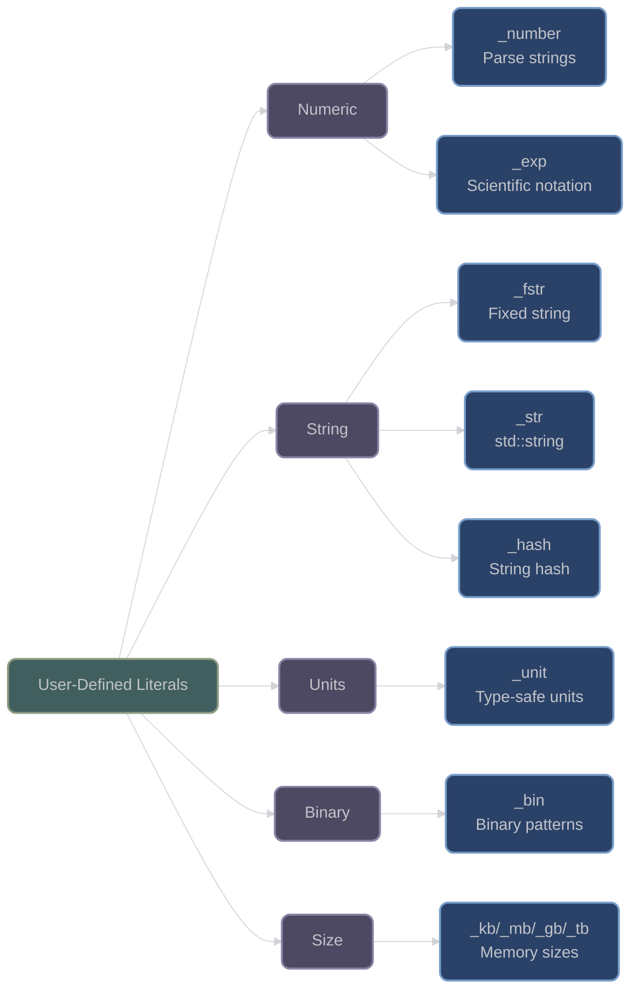

# User-Defined Literals

## Overview

XIEITE provides a comprehensive set of user-defined literals (UDLs) that enhance code readability and type safety. These literals enable natural expression of various data types including numbers, strings, time units, and specialized formats.

## Numeric Literals

### _number

**`operator""_number`** - Parse string to number at compile-time:
```cpp
template<xieite::is_arith Number = double, xieite::fixed_str str>
[[nodiscard]] consteval Number operator""_number() {
    return xieite::parse_number<Number>(str.view());
}
```

Supports various numeric formats:

```cpp
// Basic usage
auto integer = "42"_number<int>;          // 42
auto floating = "3.14"_number<double>;     // 3.14
auto hex = "0xFF"_number<int>;             // 255
auto binary = "0b1010"_number<int>;        // 10
auto octal = "077"_number<int>;            // 63

// Scientific notation
auto scientific = "1.5e10"_number<double>; // 15000000000.0

// With separators
auto large = "1'000'000"_number<long>;     // 1000000

// Compile-time validation
constexpr auto bad = "not_a_number"_number<int>; // Compilation error
```

### _exp

**`operator""_exp`** - Scientific notation literal:
```cpp
template<char... chars>
[[nodiscard]] consteval auto operator""_exp() {
    constexpr auto mantissa = parse_mantissa<chars...>();
    constexpr auto exponent = parse_exponent<chars...>();
    return mantissa * power_of_10(exponent);
}
```

```cpp
// Natural scientific notation
auto avogadro = 6.022e23_exp;     // Avogadro's number
auto planck = 6.626e-34_exp;      // Planck constant
auto light_speed = 2.998e8_exp;   // Speed of light

// More readable than standard literals
auto mass = 1.67e-27_exp;         // Proton mass
auto charge = 1.602e-19_exp;      // Elementary charge
```

## String Literals

### _fstr

**`operator""_fstr`** - Fixed string literal:
```cpp
template<xieite::fixed_str str>
[[nodiscard]] consteval auto operator""_fstr() {
    return str;
}
```

Create compile-time strings:

```cpp
// Fixed strings for templates
auto name = "config"_fstr;

// Use as template parameter
template<xieite::fixed_str prefix>
class Logger {
    static constexpr auto prefix_str = prefix.view();
};

Logger<"DEBUG"_fstr> debug_log;
Logger<"ERROR"_fstr> error_log;

// Compile-time string operations
constexpr auto combined = "Hello"_fstr + " World"_fstr;
```

### _str  

**`operator""_str`** - Convert to std::string:
```cpp
[[nodiscard]] inline std::string operator""_str(const char* str, std::size_t len) {
    return std::string(str, len);
}
```

```cpp
// Direct string creation
auto text = "Hello World"_str;  // std::string

// Useful in generic code
template<typename String>
void process(String&& s);

process("literal"_str);  // Passes std::string, not const char*

// Chain operations
auto result = "base"_str + "_suffix";  // String concatenation
```

## Time Unit Literals

### _unit

**`operator""_unit`** - Generic unit wrapper:
```cpp
template<typename Tag, typename Value = double>
struct unit {
    Value value;
    
    // Arithmetic operations
    constexpr unit operator+(unit other) const { 
        return {value + other.value}; 
    }
    constexpr unit operator*(Value scalar) const { 
        return {value * scalar}; 
    }
    // ... more operations
};

template<fixed_str tag>
[[nodiscard]] consteval auto operator""_unit(long double value) {
    return unit<tag>{static_cast<double>(value)};
}
```

Create type-safe units:

```cpp
// Define units
auto distance = 5.0_unit<"meters">;
auto time = 2.0_unit<"seconds">;
auto mass = 10.0_unit<"kg">;

// Type safety
auto total_distance = distance + 3.0_unit<"meters">;  // OK
// auto invalid = distance + time;  // Compilation error - different units

// Scale units
auto doubled = distance * 2.0;  // 10 meters

// Custom units
auto pixels = 1920_unit<"px">;
auto percent = 75.5_unit<"%">;
```

## Hash Literals

### _hash

**`operator""_hash`** - Compile-time string hash:
```cpp
template<xieite::fixed_str str>
[[nodiscard]] consteval auto operator""_hash() {
    return xieite::hash(str.view());
}
```

```cpp
// Compile-time hashing
constexpr auto hash1 = "hello"_hash;
constexpr auto hash2 = "world"_hash;
static_assert(hash1 != hash2);

// Use in switch statements
switch (xieite::hash(user_input)) {
    case "start"_hash:
        start_game();
        break;
    case "quit"_hash:
        exit(0);
        break;
    case "help"_hash:
        show_help();
        break;
}

// As map keys
std::unordered_map<std::size_t, Handler> handlers{
    {"GET"_hash, handle_get},
    {"POST"_hash, handle_post},
    {"DELETE"_hash, handle_delete}
};
```

## Binary Literals

### _bin

**`operator""_bin`** - Binary string literal:
```cpp
template<char... bits>
[[nodiscard]] consteval auto operator""_bin() {
    return parse_binary<bits...>();
}
```

```cpp
// Binary representation
auto byte = 11010110_bin;        // 0xD6
auto flags = 10000001_bin;       // 0x81

// Bit patterns
auto mask = 11110000_bin;        // Upper nibble mask
auto pattern = 01010101_bin;     // Alternating bits

// Clear bit patterns in code
if (status & 10000000_bin) {     // Check MSB
    // Handle sign bit
}
```

## Size Literals

### _kb, _mb, _gb, _tb

**Memory size literals**:
```cpp
[[nodiscard]] consteval std::size_t operator""_kb(unsigned long long value) {
    return value * 1024;
}

[[nodiscard]] consteval std::size_t operator""_mb(unsigned long long value) {
    return value * 1024 * 1024;
}

[[nodiscard]] consteval std::size_t operator""_gb(unsigned long long value) {
    return value * 1024 * 1024 * 1024;
}
```

```cpp
// Memory allocation
std::vector<char> buffer;
buffer.reserve(64_mb);  // 64 megabytes

// Size comparisons
if (file_size > 100_mb) {
    use_streaming_mode();
}

// Configuration
struct Config {
    std::size_t cache_size = 256_mb;
    std::size_t max_upload = 10_gb;
    std::size_t buffer_size = 64_kb;
};

// Clear intent
auto ram_needed = 4_gb + 512_mb;  // 4.5 GB total
```

## Architecture Diagram



## Combining Literals

Literals can be combined for expressive code:

```cpp
// Configuration with multiple literals
struct ServerConfig {
    std::string name = "server"_str;
    std::size_t port = "8080"_number<std::uint16_t>;
    std::size_t max_connections = "1000"_number<std::size_t>;
    std::size_t buffer_size = 64_kb;
    std::size_t max_request_size = 10_mb;
    auto timeout = 30.0_unit<"seconds">;
};

// Scientific computation
auto energy = mass * (light_speed * light_speed);  // E=mc²
where:
    auto mass = 1.0_unit<"kg">;
    auto light_speed = 3.0e8_unit<"m/s">;

// Binary flags
enum Flags : uint8_t {
    READ   = 00000001_bin,
    WRITE  = 00000010_bin,
    EXEC   = 00000100_bin,
    DELETE = 00001000_bin,
    ADMIN  = 10000000_bin
};
```

## Performance Considerations

- **Compile-Time**: All UDLs are consteval, zero runtime overhead
- **Type Safety**: Catches errors at compile-time
- **Optimization**: Compiler can optimize literal values
- **No Allocation**: Most literals create stack values

## Best Practices

1. **Use for clarity**:
   ```cpp
   // Clear intent with UDLs
   allocate_buffer(256_mb);  // vs allocate_buffer(268435456)
   ```

2. **Type safety with units**:
   ```cpp
   // Prevent unit mixing
   auto speed = distance_unit<"m"> / time_unit<"s">;
   ```

3. **Compile-time validation**:
   ```cpp
   // Validated at compile-time
   constexpr auto port = "8080"_number<uint16_t>;
   ```

4. **Configuration files**:
   ```cpp
   // Natural configuration syntax
   config.cache_size = 512_mb;
   config.timeout = 30.0_unit<"seconds">;
   ```

---

*Next: [Functional Module Summary](index.md)*