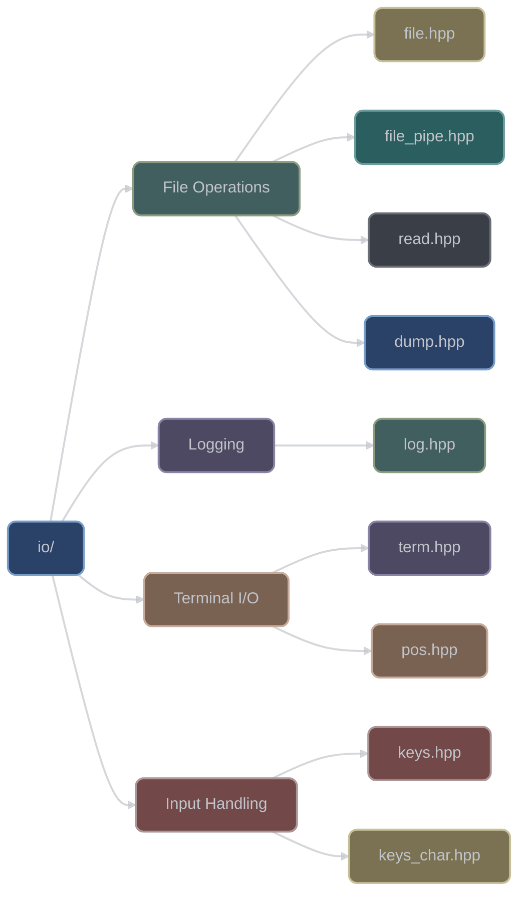
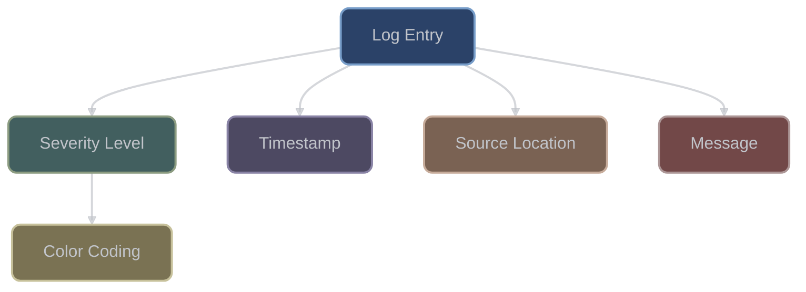

# Input/Output Utilities (`io/`)

The `io/` category provides comprehensive I/O operations for files, streams, and terminals. With 9 headers, it offers file handling, logging, keyboard input, and terminal control utilities.

## Overview



## File Operations

### File Class

```cpp
#include <xieite/io/file.hpp>

// Open file for reading
xieite::file input("data.txt", "r");

// Open file for writing
xieite::file output("output.txt", "w");

// Open binary file
xieite::file binary("data.bin", "rb");

// Use with existing FILE*
xieite::file stdout_file(stdout);

// Check if file is open
if (input.is_open()) {
    // Read from file
    std::string content = input.read_all();
}

// File automatically closes on destruction
```

### File Stream Conversion

```cpp
#include <xieite/io/file.hpp>

// Convert to C++ streams
xieite::file f("data.txt", "r+");
auto istream = f.to_istream();  // std::istream wrapper
auto ostream = f.to_ostream();  // std::ostream wrapper

// Use with standard stream operations
std::string line;
std::getline(*istream, line);
*ostream << "New data\n";
```

### File Pipes

```cpp
#include <xieite/io/file_pipe.hpp>

// Open pipe to command
xieite::file_pipe pipe("ls -la", "r");

// Read command output
std::string output = xieite::read(pipe.get());

// Get exit status
int exit_code = pipe.close();

// Write to command
xieite::file_pipe writer("grep pattern", "w");
writer.write("line with pattern\n");
writer.write("another line\n");
```

### Reading Files

```cpp
#include <xieite/io/read.hpp>

// Read entire file to string
std::string content = xieite::read("file.txt");

// Read from FILE*
FILE* fp = fopen("data.txt", "r");
std::string data = xieite::read(fp);
fclose(fp);

// Read from stream
std::ifstream ifs("input.txt");
std::string text = xieite::read(ifs);

// Read from streams and files
std::string content = xieite::read("file.txt");
```

### Data Dumping

```cpp
#include <xieite/io/dump.hpp>

// Simple data dumping utility for debugging
// Outputs structured representation of data
xieite::dump(data, output_stream);
```

## Logging System

### Structured Logging



```cpp
#include <xieite/io/log.hpp>

// Basic logging with severity levels
xieite::log::info("Application started");
xieite::log::warn("Memory usage at {}%", percentage);
xieite::log::error("Failed to open file: {}", filename);

// Log to file
FILE* log_file = fopen("app.log", "a");
xieite::log::info(log_file, "Logged to file");

// Format strings with arguments
xieite::log::info("Processing {} items", count);
xieite::log::error("Error code: {}", error_code);
```

The log system provides simple structured logging with automatic timestamps, source location, and color coding for terminal output.

## Terminal Control

### Terminal Operations

```cpp
#include <xieite/io/term.hpp>

// Terminal control utilities
// Check implementation for available functions
```

### Position Control

```cpp
#include <xieite/io/pos.hpp>

// Cursor position utilities
// Check implementation for available functions
```

## Keyboard Input

```cpp
#include <xieite/io/keys.hpp>
#include <xieite/io/keys_char.hpp>

// Keyboard input utilities
// Check implementation for available functions
```

## Summary

The io/ category provides utilities for:
- File operations and stream handling
- Terminal control and positioning
- Keyboard input detection
- Logging with automatic formatting
- Data dumping utilities

## Platform Considerations

### Windows Support
- Terminal colors via Windows Console API
- Wide character file paths supported
- Special key codes mapped correctly

### Unix/Linux Support
- ANSI escape sequences for colors
- termios for raw input mode
- Signal handling for terminal resize

### Cross-Platform Features
- Automatic platform detection
- Fallback for unsupported features
- Consistent API across platforms

## Performance Characteristics

- **Buffered I/O**: Efficient file reading/writing
- **Zero-copy streaming**: Direct memory operations
- **Lazy evaluation**: On-demand file access
- **RAII resource management**: Automatic cleanup
- **Non-blocking input**: Event-driven keyboard handling

## Design Philosophy

The io/ category follows these principles:

1. **RAII everywhere**: Automatic resource management
2. **Platform abstraction**: Hide OS differences
3. **Type safety**: Strong typing for file modes
4. **Performance**: Minimal overhead abstractions
5. **Usability**: Intuitive APIs for common tasks

## See Also

- [System Utilities](../sys/) - Process and system control
- [Data Structures](../data/) - String and data manipulation
- [Functional Utilities](../fn/) - Stream processing
- [Type Traits](../trait/) - Stream type detection
