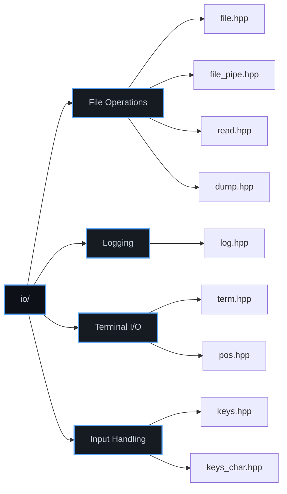
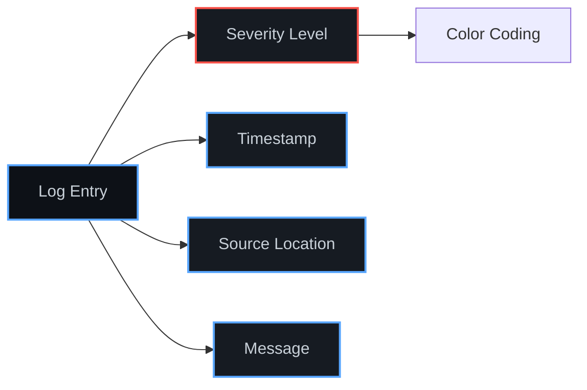

# Input/Output Utilities (`io/`)

The `io/` category provides comprehensive I/O operations for files, streams, and terminals. With 9 headers, it offers file handling, logging, keyboard input, and terminal control utilities.

## Overview



## File Operations

### File Class

```cpp
#include <xieite/io/file.hpp>

// Open file for reading
xieite::file input("data.txt", "r");

// Open file for writing
xieite::file output("output.txt", "w");

// Open binary file
xieite::file binary("data.bin", "rb");

// Use with existing FILE*
xieite::file stdout_file(stdout);

// Check if file is open
if (input.is_open()) {
    // Read from file
    std::string content = input.read_all();
}

// File automatically closes on destruction
```

### File Stream Conversion

```cpp
#include <xieite/io/file.hpp>

// Convert to C++ streams
xieite::file f("data.txt", "r+");
auto istream = f.to_istream();  // std::istream wrapper
auto ostream = f.to_ostream();  // std::ostream wrapper

// Use with standard stream operations
std::string line;
std::getline(*istream, line);
*ostream << "New data\n";
```

### File Pipes

```cpp
#include <xieite/io/file_pipe.hpp>

// Open pipe to command
xieite::file_pipe pipe("ls -la", "r");

// Read command output
std::string output = xieite::read(pipe.get());

// Get exit status
int exit_code = pipe.close();

// Write to command
xieite::file_pipe writer("grep pattern", "w");
writer.write("line with pattern\n");
writer.write("another line\n");
```

### Reading Files

```cpp
#include <xieite/io/read.hpp>

// Read entire file to string
std::string content = xieite::read("file.txt");

// Read from FILE*
FILE* fp = fopen("data.txt", "r");
std::string data = xieite::read(fp);
fclose(fp);

// Read from stream
std::ifstream ifs("input.txt");
std::string text = xieite::read(ifs);

// Read binary data
std::vector<std::byte> binary = xieite::read_binary("data.bin");
```

### Data Dumping

```cpp
#include <xieite/io/dump.hpp>

// Dump data structure to file
struct Config {
    int version;
    std::string name;
    std::vector<int> values;
};

Config config{1, "test", {1, 2, 3}};
xieite::dump(config, "config.dump");

// Human-readable dump with formatting
xieite::dump_pretty(config, "config_readable.txt");

// Binary dump
xieite::dump_binary(config, "config.bin");

// Append to existing dump
xieite::dump_append(new_data, "log.dump");
```

## Logging System

### Structured Logging



```cpp
#include <xieite/io/log.hpp>

// Basic logging with severity levels
xieite::log::info("Application started");
xieite::log::debug("Processing {} items", count);
xieite::log::warn("Memory usage at {}%", percentage);
xieite::log::error("Failed to open file: {}", filename);
xieite::log::fatal("Critical error: {}", error_msg);

// Log to file
FILE* log_file = fopen("app.log", "a");
xieite::log::info(log_file, "Logged to file");

// Structured logging with metadata
xieite::log::event()
    .level(xieite::log::severity::warning)
    .tag("network")
    .message("Connection timeout")
    .field("host", hostname)
    .field("port", port)
    .field("timeout_ms", 5000)
    .emit();
```

### Custom Log Formatting

```cpp
#include <xieite/io/log.hpp>

// Define custom log format
xieite::log::set_format(
    "[{timestamp:%Y-%m-%d %H:%M:%S}] "
    "[{level:^7}] "
    "{file}:{line} - "
    "{message}"
);

// Custom color scheme
xieite::log::set_colors({
    {xieite::log::severity::debug, xieite::color::gray},
    {xieite::log::severity::info, xieite::color::blue},
    {xieite::log::severity::warn, xieite::color::yellow},
    {xieite::log::severity::error, xieite::color::red},
    {xieite::log::severity::fatal, xieite::color::magenta}
});

// Conditional logging
xieite::log::if_debug("Debug mode active");
xieite::log::once("This message appears only once");
xieite::log::every_n(100, "Logged every 100th call");
```

### Log Categories

```cpp
// Category-based logging
namespace app_log = xieite::log::category("app");
namespace net_log = xieite::log::category("network");

app_log::info("Application initialized");
net_log::debug("Sending packet: {}", packet_id);

// Enable/disable categories
xieite::log::disable_category("network");
xieite::log::set_category_level("app", xieite::log::severity::warn);
```

## Terminal Control

### Terminal Operations

```cpp
#include <xieite/io/term.hpp>

// Clear screen
xieite::term::clear();

// Clear line
xieite::term::clear_line();

// Move cursor
xieite::term::move_cursor(10, 5);  // Column 10, Row 5

// Save/restore cursor position
xieite::term::save_cursor();
// ... do work ...
xieite::term::restore_cursor();

// Set terminal colors
xieite::term::set_fg_color(xieite::color::green);
xieite::term::set_bg_color(xieite::color::black);
xieite::term::reset_colors();

// Terminal attributes
xieite::term::bold();
xieite::term::underline();
xieite::term::blink();
xieite::term::reset_attrs();
```

### Terminal Dimensions

```cpp
#include <xieite/io/term.hpp>

// Get terminal size
auto [width, height] = xieite::term::size();
std::cout << "Terminal: " << width << "x" << height << "\n";

// Check if output is terminal
if (xieite::term::is_tty(stdout)) {
    // Use colors and formatting
    xieite::term::set_fg_color(xieite::color::cyan);
}

// Hide/show cursor
xieite::term::hide_cursor();
// ... display progress ...
xieite::term::show_cursor();
```

### Cursor Position

```cpp
#include <xieite/io/pos.hpp>

// Get current cursor position
auto [col, row] = xieite::pos::get();

// Set absolute position
xieite::pos::set(0, 0);  // Top-left corner

// Relative movement
xieite::pos::up(3);
xieite::pos::down(2);
xieite::pos::right(5);
xieite::pos::left(10);

// Move to beginning/end
xieite::pos::home();       // Beginning of line
xieite::pos::end();        // End of line
xieite::pos::next_line();  // Beginning of next line
xieite::pos::prev_line();  // Beginning of previous line
```

## Keyboard Input

### Key Detection

```cpp
#include <xieite/io/keys.hpp>

// Check if key is pressed
if (xieite::keys::is_pressed(xieite::key::space)) {
    jump();
}

// Get pressed keys
auto pressed = xieite::keys::get_pressed();
for (xieite::key k : pressed) {
    handle_key(k);
}

// Wait for key press
xieite::key k = xieite::keys::wait();
std::cout << "You pressed: " << xieite::keys::name(k) << "\n";

// Non-blocking key check
if (auto key = xieite::keys::try_get()) {
    process_key(*key);
}
```

### Character Input

```cpp
#include <xieite/io/keys_char.hpp>

// Get single character (non-blocking)
if (auto ch = xieite::keys_char::getch()) {
    std::cout << "Got char: " << *ch << "\n";
}

// Wait for character
char c = xieite::keys_char::getchar();

// Get password (no echo)
std::string password = xieite::keys_char::get_password("Password: ");

// Raw mode input
xieite::keys_char::raw_mode raw;  // RAII raw mode
char input = xieite::keys_char::getch_raw();
// Automatically restores on destruction
```

### Special Keys

```cpp
#include <xieite/io/keys.hpp>

// Arrow keys
if (xieite::keys::is_pressed(xieite::key::arrow_up)) {
    move_up();
}

// Function keys
for (int i = 1; i <= 12; ++i) {
    if (xieite::keys::is_pressed(xieite::key::f(i))) {
        handle_function_key(i);
    }
}

// Modifiers
bool ctrl = xieite::keys::is_ctrl_pressed();
bool alt = xieite::keys::is_alt_pressed();
bool shift = xieite::keys::is_shift_pressed();

// Key combinations
if (xieite::keys::is_combo(xieite::key::ctrl, xieite::key::c)) {
    handle_copy();
}
```

## Advanced Features

### Progress Display

```cpp
class ProgressBar {
    std::size_t total;
    std::size_t current = 0;

public:
    ProgressBar(std::size_t total) : total(total) {}

    void update(std::size_t n) {
        current = n;
        draw();
    }

    void draw() {
        xieite::pos::home();
        xieite::term::clear_line();

        float percent = 100.0f * current / total;
        int bar_width = 50;
        int filled = bar_width * current / total;

        std::cout << "[";
        xieite::term::set_fg_color(xieite::color::green);
        for (int i = 0; i < filled; ++i) {
            std::cout << "=";
        }
        xieite::term::reset_colors();
        for (int i = filled; i < bar_width; ++i) {
            std::cout << " ";
        }
        std::cout << "] " << std::format("{:.1f}%", percent);
        std::cout.flush();
    }
};
```

### Interactive Menu

```cpp
class Menu {
    std::vector<std::string> items;
    std::size_t selected = 0;

public:
    Menu(std::vector<std::string> items) : items(items) {}

    std::size_t run() {
        xieite::term::hide_cursor();
        xieite::term::clear();

        while (true) {
            draw();

            auto key = xieite::keys::wait();
            switch (key) {
                case xieite::key::arrow_up:
                    if (selected > 0) selected--;
                    break;
                case xieite::key::arrow_down:
                    if (selected < items.size() - 1) selected++;
                    break;
                case xieite::key::enter:
                    xieite::term::show_cursor();
                    return selected;
                case xieite::key::escape:
                    xieite::term::show_cursor();
                    return -1;
            }
        }
    }

    void draw() {
        xieite::pos::set(0, 0);
        for (std::size_t i = 0; i < items.size(); ++i) {
            if (i == selected) {
                xieite::term::set_bg_color(xieite::color::blue);
                std::cout << "> ";
            } else {
                std::cout << "  ";
            }
            std::cout << items[i];
            xieite::term::reset_colors();
            std::cout << "\n";
        }
    }
};
```

### Colored Output

```cpp
class ColorPrinter {
public:
    static void info(std::string_view msg) {
        xieite::term::set_fg_color(xieite::color::blue);
        std::cout << "[INFO] ";
        xieite::term::reset_colors();
        std::cout << msg << "\n";
    }

    static void error(std::string_view msg) {
        xieite::term::set_fg_color(xieite::color::red);
        std::cerr << "[ERROR] ";
        xieite::term::reset_colors();
        std::cerr << msg << "\n";
    }

    static void success(std::string_view msg) {
        xieite::term::set_fg_color(xieite::color::green);
        std::cout << "[SUCCESS] ";
        xieite::term::reset_colors();
        std::cout << msg << "\n";
    }
};
```

## Platform Considerations

### Windows Support
- Terminal colors via Windows Console API
- Wide character file paths supported
- Special key codes mapped correctly

### Unix/Linux Support
- ANSI escape sequences for colors
- termios for raw input mode
- Signal handling for terminal resize

### Cross-Platform Features
- Automatic platform detection
- Fallback for unsupported features
- Consistent API across platforms

## Performance Characteristics

- **Buffered I/O**: Efficient file reading/writing
- **Zero-copy streaming**: Direct memory operations
- **Lazy evaluation**: On-demand file access
- **RAII resource management**: Automatic cleanup
- **Non-blocking input**: Event-driven keyboard handling

## Design Philosophy

The io/ category follows these principles:

1. **RAII everywhere**: Automatic resource management
2. **Platform abstraction**: Hide OS differences
3. **Type safety**: Strong typing for file modes
4. **Performance**: Minimal overhead abstractions
5. **Usability**: Intuitive APIs for common tasks

## See Also

- [System Utilities](../sys/README.md) - Process and system control
- [Data Structures](../data/README.md) - String and data manipulation
- [Functional Utilities](../fn/README.md) - Stream processing
- [Type Traits](../trait/README.md) - Stream type detection
