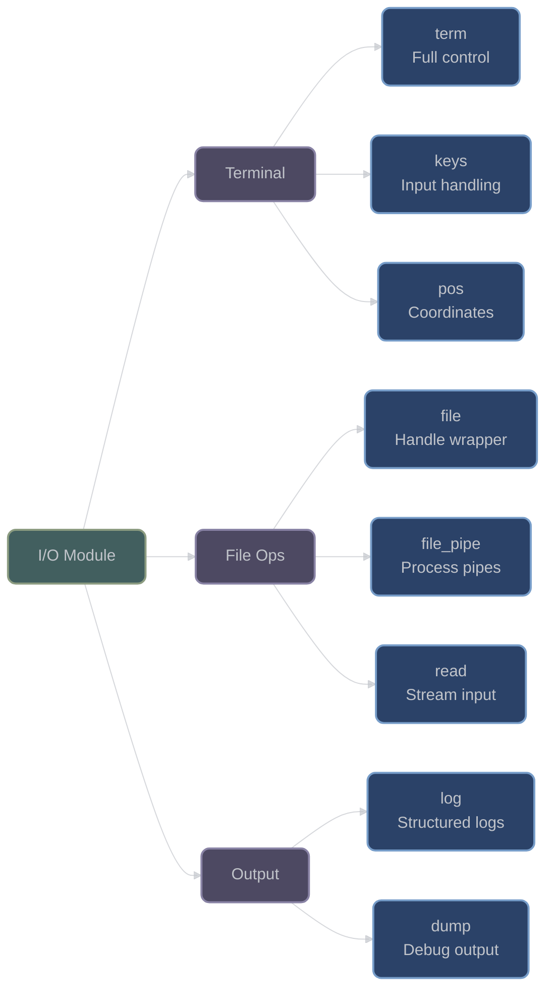

# XIEITE I/O Module

## Overview

The XIEITE I/O module provides comprehensive input/output utilities including terminal control, file handling, logging, and keyboard input. With 9 headers, it offers cross-platform abstractions for advanced terminal manipulation and robust file operations.

## Module Organization

### Terminal Control (4 headers)
- Terminal manipulation: `term` with ANSI escape sequences
- Keyboard input: `keys`, `keys_char` for input handling
- Position management: `pos` for 2D coordinates

### File Operations (3 headers)
- File handling: `file` with cross-platform support
- File pipes: `file_pipe` for process communication
- Reading: `read` for stream input

### Logging and Output (2 headers)
- Structured logging: `log` with colored output
- Debug dumping: `dump` for value inspection

## Key Features

### Advanced Terminal Control
Full terminal manipulation with ANSI sequences:
```cpp
// Create terminal controller
xieite::term terminal;

// Color and style
terminal.fg(255, 128, 0);  // Orange foreground
terminal.bg(0, 0, 128);    // Navy background
terminal.bold(true);
terminal.underline(true);

// Cursor control
terminal.set_cursor(10, 20);  // Move to row 10, col 20
terminal.cursor_invis(true);   // Hide cursor

// Screen manipulation
terminal.clear_screen();
terminal.screen_alt(true);  // Switch to alternate buffer

// Get screen dimensions
auto size = terminal.screen_size();
std::cout << "Terminal: " << size.row << "x" << size.col << '\n';
```

### Keyboard Input
Comprehensive keyboard detection:
```cpp
xieite::term terminal;

// Raw mode for immediate input
terminal.canon(false);  // Disable line buffering
terminal.echo(false);   // Disable echo

// Read single key
xieite::keys key = terminal.read_key();

switch (key) {
    case xieite::keys::up:
        move_cursor_up();
        break;
    case xieite::keys::ctrl_c:
        exit_program();
        break;
    case xieite::keys::f1:
        show_help();
        break;
}

// Convert to character
char ch = xieite::keys_char(key);
if (ch != '\0') {
    process_char(ch);
}
```

### Enhanced File Handling
Cross-platform file operations:
```cpp
// Open file with mode
xieite::file f("data.txt", "r+");

if (f) {
    // Get file descriptor
    int fd = f.desc();

    // Get FILE* pointer
    std::FILE* fp = f.get();

    // Read content
    std::string content = xieite::read(fp);
}

// Open from stream
xieite::file from_stream(std::cout);

// Reopen file
xieite::file log;
log.reopen("log.txt", "a", stderr);
```

### Structured Logging
Colored, timestamped logging:
```cpp
// Log with automatic timestamp and location
xieite::log::info("Application started with {} threads", 4);
xieite::log::warn("Memory usage at {}%", 85);
xieite::log::error("Failed to open file: {}", filename);

// Log to specific file
FILE* logfile = fopen("app.log", "a");
xieite::log::info(logfile, "Custom log destination");

// Output format:
// INFO  [2024-01-15 14:32:10] main.cpp:main:42: Application started with 4 threads
// WARN  [2024-01-15 14:32:11] memory.cpp:check:156: Memory usage at 85%
// ERROR [2024-01-15 14:32:12] file.cpp:open:89: Failed to open file: data.txt
```

## Terminal Features

### Color and Styling
```cpp
xieite::term t;

// RGB colors
t.fg(xieite::color3{255, 0, 128});  // Magenta
t.bg(32, 32, 32);                   // Dark gray

// Text styles
t.bold(true);
t.italic(true);
t.underline(true);
t.blink(true);
t.strike(true);
t.invert(true);     // Swap fg/bg
t.invis(true);      // Hidden text

// Reset all styles
t.reset_style();
```

### Cursor Management
```cpp
// Get current position
xieite::pos current = t.get_cursor();

// Absolute positioning
t.set_cursor(0, 0);  // Top-left corner

// Relative movement
t.mv_cursor(5, -10);  // Down 5, left 10

// Cursor styles
t.cursor_block(true);      // Block cursor, blinking
t.cursor_underscore();     // Underscore cursor
t.cursor_pipe(true);       // Pipe cursor, blinking

// Save/restore cursor
t.cursor_alt(true);   // Save position
// ... move around ...
t.cursor_alt(false);  // Restore position
```

### Screen Control
```cpp
// Clear operations
t.clear_screen();       // Clear entire screen
t.clear_line();         // Clear current line
t.clear_screen_from();  // Clear from cursor to end
t.clear_line_until();   // Clear from start to cursor

// Alternate screen buffer
t.screen_alt(true);   // Switch to alt buffer
// ... full screen app ...
t.screen_alt(false);  // Return to main buffer

// Get dimensions
auto [rows, cols] = t.screen_size();
```

## File Operations

### File Pipes
Process communication via pipes:
```cpp
// Execute command with pipe
xieite::file_pipe pipe("ls -la", "r");

// Read command output
std::string output = xieite::read(pipe.get());

// Close and get exit status
int status = pipe.close();
if (status == 0) {
    process_output(output);
}
```

### Stream Reading
```cpp
// Read entire file
std::string content = xieite::read("config.json");

// Read from FILE*
FILE* fp = fopen("data.txt", "r");
std::string data = xieite::read(fp);
fclose(fp);

// Read from stream
std::ifstream file("input.txt");
std::string text = xieite::read(file);
```

## Debug Output

### dump
Inspect values with type information:
```cpp
// Dump values for debugging
int x = 42;
std::vector<int> vec{1, 2, 3};
std::map<std::string, int> map{{"a", 1}, {"b", 2}};

xieite::dump(x);       // Outputs: x = 42
xieite::dump(vec);     // Outputs: vec = {1, 2, 3}
xieite::dump(map);     // Outputs: map = {"a": 1, "b": 2}

// Multiple values
xieite::dump(x, vec, map);

// Custom output stream
xieite::dump(stderr, "Error state:", error_code);
```

## Usage Examples

### Interactive Terminal Application
```cpp
class TerminalApp {
    xieite::term terminal;

public:
    TerminalApp() {
        // Setup raw mode
        terminal.canon(false);
        terminal.echo(false);
        terminal.cursor_invis(true);
        terminal.screen_alt(true);
    }

    ~TerminalApp() {
        // Automatic cleanup via term destructor
    }

    void run() {
        terminal.clear_screen();
        draw_ui();

        while (true) {
            auto key = terminal.read_key();

            if (key == xieite::keys::ctrl_c) {
                break;
            }

            handle_input(key);
            update_display();
        }
    }

    void draw_ui() {
        // Draw border
        terminal.fg(0, 255, 255);  // Cyan
        for (int i = 0; i < 80; ++i) {
            terminal.set_cursor(0, i);
            std::cout << '─';
            terminal.set_cursor(24, i);
            std::cout << '─';
        }
    }
};
```

### Progress Bar
```cpp
void show_progress(int current, int total) {
    xieite::term t;

    // Save cursor and hide it
    t.cursor_alt(true);
    t.cursor_invis(true);

    // Calculate percentage
    float percent = (float)current / total;
    int bar_width = 50;
    int filled = bar_width * percent;

    // Draw progress bar
    std::cout << "\r[";

    t.fg(0, 255, 0);  // Green for filled
    for (int i = 0; i < filled; ++i) {
        std::cout << '█';
    }

    t.fg(128, 128, 128);  // Gray for empty
    for (int i = filled; i < bar_width; ++i) {
        std::cout << '░';
    }

    t.reset_style();
    std::cout << "] " << int(percent * 100) << "%";
    std::cout.flush();

    // Restore cursor
    if (current == total) {
        std::cout << '\n';
        t.cursor_alt(false);
        t.cursor_invis(false);
    }
}
```

### Colored Logger
```cpp
class ColorLogger {
    std::FILE* file;

public:
    ColorLogger(const std::string& filename)
        : file(std::fopen(filename.c_str(), "a")) {}

    ~ColorLogger() {
        if (file) std::fclose(file);
    }

    template<typename... Args>
    void debug(std::format_string<Args...> fmt, Args&&... args) {
        xieite::log::info(file, fmt, std::forward<Args>(args)...);
    }

    template<typename... Args>
    void warning(std::format_string<Args...> fmt, Args&&... args) {
        xieite::log::warn(file, fmt, std::forward<Args>(args)...);
        xieite::log::warn(fmt, std::forward<Args>(args)...);  // Also to console
    }

    template<typename... Args>
    void error(std::format_string<Args...> fmt, Args&&... args) {
        xieite::log::error(file, fmt, std::forward<Args>(args)...);
        xieite::log::error(fmt, std::forward<Args>(args)...);  // Also to console
    }
};
```

## Architecture Diagram



## Performance Considerations

- **Terminal Operations**: Direct ANSI sequences, minimal overhead
- **Raw Mode**: Bypasses line buffering for immediate response
- **File Operations**: Platform-optimized (POSIX/Windows)
- **Logging**: Formatted at compile-time where possible
- **Key Detection**: Single-character lookahead for sequences

## Platform Support

### Unix/Linux
- Full terminal control via termios
- ANSI escape sequence support
- Process pipes via popen
- Non-blocking I/O

### Windows
- Limited terminal support (basic ANSI)
- Wide character file paths
- Process pipes via _popen
- Console API fallbacks

## Best Practices

1. **Use RAII for terminal modes**:
   ```cpp
   {
       xieite::term t;
       t.canon(false);
       t.echo(false);
       // Automatically restored on destruction
   }
   ```

2. **Check platform support**:
   ```cpp
   #if XIEITE_PLATFORM_TYPE_UNIX
       // Full terminal features available
   #endif
   ```

3. **Handle key combinations**:
   ```cpp
   auto key = terminal.read_key();
   if (key >= xieite::keys::ctrl_a &&
       key <= xieite::keys::ctrl_z) {
       // Control key pressed
   }
   ```

4. **Use structured logging**:
   ```cpp
   xieite::log::info("Operation {} completed in {} ms",
                     op_name, duration);
   ```

## Module Statistics

- **Total Headers**: 9
- **Terminal Control**: 3 headers
- **File Operations**: 3 headers
- **Output Utilities**: 2 headers
- **Logging**: 1 header
- **Platform-Specific**: ~40% of code

## Future Enhancements

Potential additions to the I/O module:
- Mouse input support
- Serial port communication
- Network I/O abstractions
- Async I/O operations
- More terminal emulator support

---

*Return to [XIEITE Documentation Home](../../README.md)*
