# Mathematics (math/)

## Overview

The mathematics category provides 110 header files offering extensive mathematical functions, algorithms, and numeric utilities. All functions emphasize compile-time computation, overflow safety, and generic programming through concepts.

## Directory Structure

```
include/xieite/math/
├── Basic Arithmetic (15+ headers)
│   ├── abs.hpp              # Absolute value with unsigned return
│   ├── add_overflow.hpp     # Safe addition with overflow detection
│   ├── sub_overflow.hpp     # Safe subtraction
│   ├── mul_overflow.hpp     # Safe multiplication
│   └── div_*.hpp            # Division variants
├── Advanced Math (20+ headers)
│   ├── factorial.hpp        # Compile-time factorial tables
│   ├── fib.hpp             # Fibonacci sequences
│   ├── pow.hpp             # Power functions
│   ├── log.hpp             # Logarithms
│   └── exp.hpp             # Exponential functions
├── Number Theory (15+ headers)
│   ├── prime.hpp           # Prime number operations
│   ├── gcd.hpp             # Greatest common divisor
│   ├── lcm.hpp             # Least common multiple
│   └── mod.hpp             # Modulo operations
├── Bit Operations (10+ headers)
│   ├── bit_size.hpp        # Bit width calculations
│   ├── reverse_bits.hpp    # Bit reversal
│   ├── join_bits.hpp       # Bit concatenation
│   └── mash_bits.hpp       # Bit interleaving
├── Geometric (15+ headers)
│   ├── point2d.hpp         # 2D point operations
│   ├── line2d.hpp          # 2D line representation
│   ├── polygon2d.hpp       # Polygon operations
│   └── intersection2d.hpp  # Intersection calculations
├── Statistics (10+ headers)
│   ├── mean.hpp            # Arithmetic mean
│   ├── median.hpp          # Median calculation
│   ├── modes.hpp           # Mode detection
│   └── avg.hpp             # Various averages
├── Extended Types (10+ headers)
│   ├── big_int.hpp         # Arbitrary precision integers
│   ├── wide_uint.hpp       # Wide unsigned integers
│   ├── int128_t.hpp        # 128-bit integer support
│   └── interval.hpp        # Interval arithmetic
└── Utilities (15+ headers)
    ├── parse_number.hpp    # String to number parsing
    ├── str_number.hpp      # Number to string conversion
    ├── roman.hpp           # Roman numeral conversion
    └── hash_*.hpp          # Hash utilities
```

## Core Design Principles

### 1. Compile-Time Optimization

Maximum computation at compile time through `constexpr` and `consteval`:

```cpp
// Factorial table computed at compile time
template<xieite::is_arith Arith>
constexpr auto factorial = /* compile-time table generation */;

// Usage - zero runtime cost
constexpr auto fact_10 = xieite::factorial<int>[10];
```

### 2. Overflow Safety

All arithmetic operations provide overflow-safe variants:

```cpp
template<std::integral Int>
[[nodiscard]] constexpr bool add_overflow(Int a, Int b, Int& result = /* ... */) noexcept;

template<std::integral Int>
[[nodiscard]] constexpr bool mul_overflow(Int a, Int b, Int& result = /* ... */) noexcept;
```

### 3. Generic Programming

All functions use concepts for type safety:

```cpp
template<xieite::is_arith Arith>
[[nodiscard]] constexpr auto abs(Arith x) noexcept;

template<std::floating_point Float>
[[nodiscard]] constexpr Float sqrt(Float x) noexcept;
```

## Mathematics Categories Visualization

```mermaid
---
config:
    theme: 'base'
    themeVariables:
        darkMode: true
        background: '#262B33'
        primaryColor: '#2b4268ff'
        primaryTextColor: '#C1C4CA'
        primaryBorderColor: '#779DC9ff'
        lineColor: '#C1C4CAAA'
        secondaryColor: '#425f5fff'
        secondaryTextColor: '#C1C4CA'
        secondaryBorderColor: '#8c9c81ff'
        tertiaryColor: '#4d4962ff'
        tertiaryTextColor: '#C1C4CA'
        tertiaryBorderColor: '#8983a5ff'
        backgroundColor: '#262B33'
        mainBkg: '#2b4268ff'
        secondBkg: '#425f5fff'
        tertiaryBkg: '#4d4962ff'
        mainContrastColor: '#C1C4CA'
        darkTextColor: '#C1C4CA'
        border1: '#779DC9ff'
        border2: '#8c9c81ff'
        clusterBkg: '#22272f62'
        clusterBorder: '#3a3f47ff'
        defaultLinkColor: '#C1C4CAAA'
        titleColor: '#C1C4CA'
        edgeLabelBackground: '#262B33'
        nodeTextColor: '#C1C4CA'
        fontFamily: 'ui-monospace, SFMono-Regular, Menlo, Monaco, Consolas, monospace'
        fontSize: '14px'
---
flowchart LR
    Math[Mathematics<br/>110 headers] --> Arithmetic[Basic Arithmetic]
    Math --> Advanced[Advanced Math]
    Math --> NumberTheory[Number Theory]
    Math --> Bits[Bit Operations]
    Math --> Geometry[Geometry]
    Math --> Stats[Statistics]
    Math --> Extended[Extended Types]

    Arithmetic --> SafeOps[Overflow-Safe Ops]
    Arithmetic --> Division[Division Variants]
    Arithmetic --> Rounding[Rounding Functions]

    Advanced --> Transcendental[Transcendental]
    Advanced --> Combinatorial[Combinatorial]
    Advanced --> Special[Special Functions]

    NumberTheory --> Primes[Prime Numbers]
    NumberTheory --> Divisibility[GCD/LCM]
    NumberTheory --> Modular[Modular Arithmetic]

    Bits --> Manipulation[Bit Manipulation]
    Bits --> Interleaving[Bit Interleaving]
    Bits --> Extraction[Bit Extraction]

    Geometry --> Points[Points & Vectors]
    Geometry --> Lines[Lines & Rays]
    Geometry --> Polygons[Polygons]

    Stats --> Averages[Averages]
    Stats --> Distributions[Distributions]
    Stats --> Analysis[Statistical Analysis]

    Extended --> BigNum[Big Numbers]
    Extended --> Fixed[Fixed Point]
    Extended --> Interval[Intervals]

    style Math fill:#2b4268ff,stroke:#779DC9ff,stroke-width:2px,color:#C1C4CA,rx:8,ry:8
    style Arithmetic fill:#425f5fff,stroke:#8c9c81ff,stroke-width:2px,color:#C1C4CA,rx:8,ry:8
    style Advanced fill:#425f5fff,stroke:#8c9c81ff,stroke-width:2px,color:#C1C4CA,rx:8,ry:8
    style NumberTheory fill:#425f5fff,stroke:#8c9c81ff,stroke-width:2px,color:#C1C4CA,rx:8,ry:8
    style Bits fill:#425f5fff,stroke:#8c9c81ff,stroke-width:2px,color:#C1C4CA,rx:8,ry:8
    style Geometry fill:#425f5fff,stroke:#8c9c81ff,stroke-width:2px,color:#C1C4CA,rx:8,ry:8
    style Stats fill:#425f5fff,stroke:#8c9c81ff,stroke-width:2px,color:#C1C4CA,rx:8,ry:8
    style Extended fill:#425f5fff,stroke:#8c9c81ff,stroke-width:2px,color:#C1C4CA,rx:8,ry:8
    style SafeOps fill:#7a6253ff,stroke:#c7ac9bff,stroke-width:2px,color:#C1C4CA,rx:8,ry:8
    style Division fill:#7a6253ff,stroke:#c7ac9bff,stroke-width:2px,color:#C1C4CA,rx:8,ry:8
    style Rounding fill:#7a6253ff,stroke:#c7ac9bff,stroke-width:2px,color:#C1C4CA,rx:8,ry:8
    style Transcendental fill:#4d4962ff,stroke:#8983a5ff,stroke-width:2px,color:#C1C4CA,rx:8,ry:8
    style Combinatorial fill:#4d4962ff,stroke:#8983a5ff,stroke-width:2px,color:#C1C4CA,rx:8,ry:8
    style Special fill:#4d4962ff,stroke:#8983a5ff,stroke-width:2px,color:#C1C4CA,rx:8,ry:8
    style Primes fill:#7a7253ff,stroke:#c7c19bff,stroke-width:2px,color:#C1C4CA,rx:8,ry:8
    style Divisibility fill:#7a7253ff,stroke:#c7c19bff,stroke-width:2px,color:#C1C4CA,rx:8,ry:8
    style Modular fill:#7a7253ff,stroke:#c7c19bff,stroke-width:2px,color:#C1C4CA,rx:8,ry:8
    style Manipulation fill:#2b5f5fff,stroke:#6d9c9cff,stroke-width:2px,color:#C1C4CA,rx:8,ry:8
    style Interleaving fill:#2b5f5fff,stroke:#6d9c9cff,stroke-width:2px,color:#C1C4CA,rx:8,ry:8
    style Extraction fill:#2b5f5fff,stroke:#6d9c9cff,stroke-width:2px,color:#C1C4CA,rx:8,ry:8
    style Points fill:#724848ff,stroke:#ac9696ff,stroke-width:2px,color:#C1C4CA,rx:8,ry:8
    style Lines fill:#724848ff,stroke:#ac9696ff,stroke-width:2px,color:#C1C4CA,rx:8,ry:8
    style Polygons fill:#724848ff,stroke:#ac9696ff,stroke-width:2px,color:#C1C4CA,rx:8,ry:8
    style Averages fill:#3a3f47ff,stroke:#6a6f77ff,stroke-width:2px,color:#C1C4CA,rx:8,ry:8
    style Distributions fill:#3a3f47ff,stroke:#6a6f77ff,stroke-width:2px,color:#C1C4CA,rx:8,ry:8
    style Analysis fill:#3a3f47ff,stroke:#6a6f77ff,stroke-width:2px,color:#C1C4CA,rx:8,ry:8
    style BigNum fill:#7a6253ff,stroke:#c7ac9bff,stroke-width:2px,color:#C1C4CA,rx:8,ry:8
    style Fixed fill:#7a6253ff,stroke:#c7ac9bff,stroke-width:2px,color:#C1C4CA,rx:8,ry:8
    style Interval fill:#7a6253ff,stroke:#c7ac9bff,stroke-width:2px,color:#C1C4CA,rx:8,ry:8
```



## Major Function Groups

### 1. Basic Arithmetic Operations

#### Absolute Value

**Source**: `include/xieite/math/abs.hpp`

```cpp
template<xieite::is_arith Arith>
[[nodiscard]] constexpr xieite::try_unsigned<Arith> abs(Arith x) noexcept;
```

Key feature: Returns unsigned type to prevent overflow on minimum values.

#### Safe Arithmetic with Overflow Detection

**Source**: `include/xieite/math/*_overflow.hpp`

| Function | Purpose | Returns |
|----------|---------|---------|
| `add_overflow(a, b, &result)` | Safe addition | `true` if overflow |
| `sub_overflow(a, b, &result)` | Safe subtraction | `true` if overflow |
| `mul_overflow(a, b, &result)` | Safe multiplication | `true` if overflow |
| `div_overflow(a, b, &result)` | Safe division | `true` if overflow |
| `mod_overflow(a, b, &result)` | Safe modulo | `true` if overflow |
| `pow_overflow(a, b, &result)` | Safe exponentiation | `true` if overflow |

#### Division Variants

**Source**: `include/xieite/math/div_*.hpp`

| Function | Rounding Mode | Example |
|----------|--------------|---------|
| `div_floor(a, b)` | Round toward -∞ | `div_floor(-7, 3) = -3` |
| `div_ceil(a, b)` | Round toward +∞ | `div_ceil(7, 3) = 3` |
| `div_truncate(a, b)` | Round toward 0 | `div_truncate(-7, 3) = -2` |
| `div_magnify(a, b)` | Round away from 0 | `div_magnify(-7, 3) = -3` |
| `div_*_half(a, b)` | Round to nearest (tie variants) | Various tie-breaking |

### 2. Advanced Mathematical Functions

#### Factorial

**Source**: `include/xieite/math/factorial.hpp`

```cpp
template<xieite::is_arith Arith>
constexpr auto factorial = /* compile-time table */;

// Usage
constexpr auto fact_5 = xieite::factorial<int>[5];  // 120
```

#### Fibonacci

**Source**: `include/xieite/math/fib.hpp`

```cpp
template<xieite::is_arith Arith>
constexpr auto fib = /* compile-time sequence */;
```

#### Power Functions

**Source**: `include/xieite/math/pow.hpp`, `exp.hpp`

```cpp
template<xieite::is_arith Base, std::integral Exp>
[[nodiscard]] constexpr auto pow(Base base, Exp exp) noexcept;

template<std::floating_point Float>
[[nodiscard]] constexpr Float exp(Float x) noexcept;
```

#### Logarithms

**Source**: `include/xieite/math/log.hpp`

```cpp
template<xieite::is_arith Arith>
[[nodiscard]] constexpr auto log(Arith x, Arith base = /* e */) noexcept;
```

### 3. Number Theory

#### Prime Numbers

**Source**: `include/xieite/math/prime.hpp`

```cpp
template<std::integral Int>
[[nodiscard]] constexpr bool prime(Int n) noexcept;

// Prime factorization, generation, etc.
```

#### GCD and LCM

**Source**: `include/xieite/math/gcd.hpp`, `lcm.hpp`

```cpp
template<std::integral Int>
[[nodiscard]] constexpr Int gcd(Int a, Int b) noexcept;

template<std::integral Int>
[[nodiscard]] constexpr Int lcm(Int a, Int b) noexcept;
```

#### Modular Arithmetic

**Source**: `include/xieite/math/mod.hpp`

```cpp
template<std::integral Int>
[[nodiscard]] constexpr Int mod(Int a, Int m) noexcept;
// Handles negative numbers correctly
```

### 4. Bit Operations

#### Bit Size and Manipulation

**Source**: `include/xieite/math/bit_size.hpp`, `reverse_bits.hpp`

```cpp
template<typename T>
inline constexpr std::size_t bit_size = sizeof(T) * CHAR_BIT;

template<std::unsigned_integral UInt>
[[nodiscard]] constexpr UInt reverse_bits(UInt x) noexcept;
```

#### Bit Interleaving

**Source**: `include/xieite/math/mash_bits.hpp`, `unmash_bits.hpp`

```cpp
// Morton encoding (Z-order)
template<std::unsigned_integral UInt>
[[nodiscard]] constexpr auto mash_bits(UInt x, UInt y) noexcept;

template<std::unsigned_integral UInt>
[[nodiscard]] constexpr auto unmash_bits(UInt z) noexcept;
```

#### Bit Joining and Splitting

**Source**: `include/xieite/math/join_bits.hpp`, `unjoin_bits.hpp`

```cpp
template<std::unsigned_integral... UInts>
[[nodiscard]] constexpr auto join_bits(UInts... values) noexcept;
```

### 5. Geometric Operations

#### 2D Point Operations

**Source**: `include/xieite/math/point2d.hpp`

```cpp
template<xieite::is_arith Arith>
struct point2d {
    Arith x, y;

    // Distance, angle, transformations
    [[nodiscard]] constexpr auto distance_to(point2d other) const noexcept;
    [[nodiscard]] constexpr auto angle_to(point2d other) const noexcept;
};
```

#### 2D Line and Ray

**Source**: `include/xieite/math/line2d.hpp`, `ray2d.hpp`

```cpp
template<xieite::is_arith Arith>
struct line2d {
    point2d<Arith> start, end;

    [[nodiscard]] constexpr auto length() const noexcept;
    [[nodiscard]] constexpr auto intersects(const line2d& other) const noexcept;
};
```

#### Polygon Operations

**Source**: `include/xieite/math/polygon2d.hpp`

```cpp
template<xieite::is_arith Arith>
struct polygon2d {
    std::vector<point2d<Arith>> vertices;

    [[nodiscard]] constexpr auto area() const noexcept;
    [[nodiscard]] constexpr auto perimeter() const noexcept;
    [[nodiscard]] constexpr bool contains(point2d<Arith> p) const noexcept;
};
```

#### Transformations

**Source**: `include/xieite/math/rotate2d.hpp`, `scale2d.hpp`, `translate2d.hpp`

```cpp
template<xieite::is_arith Arith>
[[nodiscard]] constexpr point2d<Arith> rotate2d(
    point2d<Arith> p, Arith angle, point2d<Arith> origin = {}) noexcept;

template<xieite::is_arith Arith>
[[nodiscard]] constexpr point2d<Arith> scale2d(
    point2d<Arith> p, Arith sx, Arith sy) noexcept;
```

### 6. Statistical Functions

#### Averages

**Source**: `include/xieite/math/mean.hpp`, `avg.hpp`

```cpp
template<std::ranges::input_range Range>
[[nodiscard]] constexpr auto mean(Range&& values) noexcept;

template<xieite::is_arith... Args>
[[nodiscard]] constexpr auto avg(Args... values) noexcept;
```

#### Median and Mode

**Source**: `include/xieite/math/median.hpp`, `modes.hpp`

```cpp
template<std::ranges::forward_range Range>
[[nodiscard]] constexpr auto median(Range&& values) noexcept;

template<std::ranges::forward_range Range>
[[nodiscard]] constexpr auto modes(Range&& values) noexcept;
```

### 7. Extended Numeric Types

#### Big Integer

**Source**: `include/xieite/math/big_int.hpp`

```cpp
template<std::unsigned_integral UInt = std::uint64_t>
struct big_int {
    // Arbitrary precision integer arithmetic
    constexpr big_int operator+(const big_int&) const noexcept;
    constexpr big_int operator*(const big_int&) const noexcept;
    // String conversion, comparison, etc.
};
```

#### Wide Unsigned Integer

**Source**: `include/xieite/math/wide_uint.hpp`

```cpp
template<std::size_t bits>
using wide_uint = /* implementation-defined */;

// Examples
using uint128_t = wide_uint<128>;
using uint256_t = wide_uint<256>;
```

#### Interval Arithmetic

**Source**: `include/xieite/math/interval.hpp`

```cpp
template<xieite::is_arith Arith>
struct interval {
    Arith lower, upper;

    [[nodiscard]] constexpr bool contains(Arith x) const noexcept;
    [[nodiscard]] constexpr auto intersect(const interval&) const noexcept;
    [[nodiscard]] constexpr auto union_with(const interval&) const noexcept;
};
```

### 8. Numeric Conversions

#### String to Number

**Source**: `include/xieite/math/parse_number.hpp`

```cpp
template<xieite::is_arith Arith>
[[nodiscard]] constexpr std::optional<Arith> parse_number(
    std::string_view str, int base = 10) noexcept;
```

#### Number to String

**Source**: `include/xieite/math/str_number.hpp`

```cpp
template<std::integral Int>
[[nodiscard]] constexpr std::string str_number(
    Int value, int base = 10,
    const number_str_config& config = {}) noexcept;
```

#### Roman Numerals

**Source**: `include/xieite/math/to_roman.hpp`, `from_roman.hpp`

```cpp
[[nodiscard]] constexpr std::string to_roman(int value) noexcept;
[[nodiscard]] constexpr std::optional<int> from_roman(std::string_view str) noexcept;
```

### 9. Hash Functions

#### Hash Combining

**Source**: `include/xieite/math/hash_combine.hpp`

```cpp
template<typename T>
[[nodiscard]] constexpr std::size_t hash_combine(
    std::size_t seed, const T& value) noexcept;
```

#### DJB2 Hash

**Source**: `include/xieite/math/djb2.hpp`

```cpp
[[nodiscard]] constexpr std::size_t djb2(std::string_view str) noexcept;
```

#### MD5

**Source**: `include/xieite/math/md5.hpp`

```cpp
[[nodiscard]] std::array<std::uint8_t, 16> md5(
    std::span<const std::uint8_t> data) noexcept;
```

### 10. Rounding Functions

#### Rounding Modes

**Source**: `include/xieite/math/floor.hpp`, `ceil.hpp`, `truncate.hpp`

```cpp
template<xieite::is_arith Arith>
[[nodiscard]] constexpr Arith floor(Arith x) noexcept;

template<xieite::is_arith Arith>
[[nodiscard]] constexpr Arith ceil(Arith x) noexcept;

template<xieite::is_arith Arith>
[[nodiscard]] constexpr Arith truncate(Arith x) noexcept;

// Half-rounding variants
template<xieite::is_arith Arith>
[[nodiscard]] constexpr Arith floor_half(Arith x) noexcept;
```

## Special Mathematical Constants

### Pi and Tau

**Source**: `include/xieite/math/pi.hpp`, `tau.hpp`

```cpp
template<std::floating_point Float = double>
inline constexpr Float pi = 3.14159265358979323846L;

template<std::floating_point Float = double>
inline constexpr Float tau = 2 * pi<Float>;  // 2π
```

### Numeric Limits Extensions

```cpp
template<typename T>
inline constexpr T min_v = std::numeric_limits<T>::min();

template<typename T>
inline constexpr T max_v = std::numeric_limits<T>::max();
```

## Implementation Patterns

### Compile-Time Tables

Many functions use compile-time lookup tables for performance:

```cpp
template<xieite::is_arith Arith>
constexpr auto factorial = ([] {
    // Generate table at compile time
    std::array<Arith, max_factorial> result{};
    result[0] = 1;
    for (size_t i = 1; i < max_factorial; ++i) {
        result[i] = result[i-1] * i;
    }
    return result;
})();
```

### Overflow Detection Pattern

```cpp
template<std::integral Int>
[[nodiscard]] constexpr bool add_overflow(Int a, Int b, Int& result) noexcept {
    if constexpr (std::unsigned_integral<Int>) {
        result = a + b;
        return result < a;  // Unsigned overflow detection
    } else {
        // Signed overflow detection
        if (b > 0 && a > std::numeric_limits<Int>::max() - b) {
            return true;
        }
        if (b < 0 && a < std::numeric_limits<Int>::min() - b) {
            return true;
        }
        result = a + b;
        return false;
    }
}
```

### Generic Numeric Algorithms

```cpp
template<xieite::is_arith Arith>
[[nodiscard]] constexpr Arith clamp(Arith value, Arith min, Arith max) noexcept {
    return (value < min) ? min : (value > max) ? max : value;
}
```

## Performance Characteristics

| Operation | Complexity | Compile-Time | Notes |
|-----------|------------|--------------|-------|
| Basic arithmetic | O(1) | ✅ | All constexpr |
| Factorial lookup | O(1) | ✅ | Pre-computed table |
| Prime testing | O(√n) | ✅ | Trial division |
| Big integer ops | O(n) to O(n²) | ✅ | Digit count dependent |
| Geometric ops | O(1) to O(n) | ✅ | Vertex count dependent |
| Statistical | O(n) to O(n log n) | ✅ | Range size dependent |

## Usage Examples

### Safe Arithmetic

```cpp
#include <xieite/math/add_overflow.hpp>

int a = INT_MAX;
int b = 1;
int result;

if (xieite::add_overflow(a, b, result)) {
    // Handle overflow
} else {
    // Use result safely
}
```

### Compile-Time Computation

```cpp
#include <xieite/math/factorial.hpp>
#include <xieite/math/fib.hpp>

// Computed at compile time
constexpr auto fact_10 = xieite::factorial<int>[10];
constexpr auto fib_20 = xieite::fib<long long>[20];
```

### Geometric Calculations

```cpp
#include <xieite/math/point2d.hpp>
#include <xieite/math/rotate2d.hpp>

xieite::point2d p1{3.0, 4.0};
xieite::point2d p2{6.0, 8.0};

auto distance = p1.distance_to(p2);
auto rotated = xieite::rotate2d(p1, M_PI / 4);  // Rotate 45 degrees
```

### Big Number Arithmetic

```cpp
#include <xieite/math/big_int.hpp>

xieite::big_int<> a = "123456789012345678901234567890";
xieite::big_int<> b = "987654321098765432109876543210";

auto sum = a + b;
auto product = a * b;
std::string result = sum.to_string();
```

## Error Handling

Mathematical functions handle errors through:

1. **Return Types**: Optional/expected for fallible operations
2. **Overflow Flags**: Boolean return for overflow detection
3. **Compile-Time Validation**: Static assertions for invalid inputs
4. **Concept Constraints**: Type requirements prevent misuse

## Platform Considerations

- **Floating Point**: IEEE 754 compliance assumed
- **Integer Sizes**: Works with all standard integer types
- **Endianness**: Handled automatically for bit operations
- **Compiler Support**: Requires C++20 for full functionality

## Best Practices

1. **Use Overflow-Safe Functions**: For untrusted input
2. **Prefer Compile-Time**: Use constexpr where possible
3. **Check Return Values**: Handle overflow conditions
4. **Use Appropriate Types**: Big integers for large values
5. **Validate Input**: Check ranges and preconditions

---

*Next: [Arithmetic Operations](arithmetic.md)*
