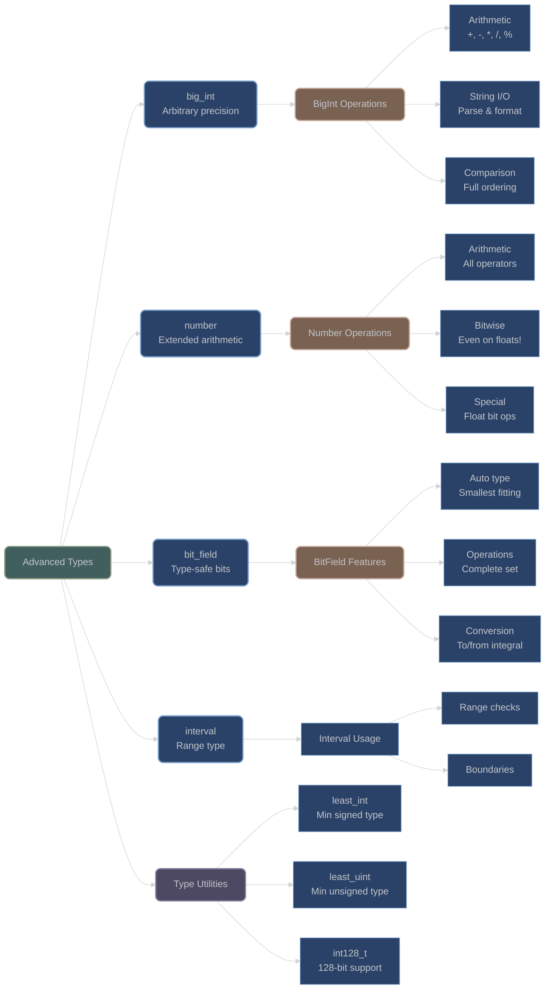

# Advanced Mathematical Types

## Overview

XIEITE provides sophisticated mathematical types that extend C++'s numeric capabilities with arbitrary precision integers, specialized number wrappers, bit manipulation types, and interval arithmetic.

## Arbitrary Precision Integer

### BigInt

**`xieite::big_int<Int>`** - Arbitrary precision integer implementation:
```cpp
template<std::integral Int = int>
struct big_int {
    std::vector<Int> digits;
    bool negative = false;

    // Constructors
    constexpr big_int() = default;
    constexpr big_int(std::integral auto value) noexcept;
    constexpr big_int(std::string_view value) noexcept;

    // Arithmetic operations
    constexpr big_int& operator+=(const big_int& other) noexcept;
    constexpr big_int& operator-=(const big_int& other) noexcept;
    constexpr big_int& operator*=(const big_int& other) noexcept;
    constexpr big_int& operator/=(const big_int& other) noexcept;
    constexpr big_int& operator%=(const big_int& other) noexcept;

    // Conversion
    [[nodiscard]] constexpr std::string string() const noexcept;
    [[nodiscard]] explicit constexpr operator bool() const noexcept;
};
```

#### Implementation Details

The `big_int` class provides a complete arbitrary precision integer implementation:

- **Storage**: Vector of digits with configurable base type
- **Sign Handling**: Separate boolean flag for sign
- **Algorithms**: Grade-school arithmetic with carry propagation
- **String Parsing**: Supports decimal string input/output
- **Comparison**: Full ordering with spaceship operator

#### BigInt Examples

```cpp
// Create from various sources
xieite::big_int<> small{42};
xieite::big_int<> large{"123456789012345678901234567890"};
xieite::big_int<> negative{-999};

// Arithmetic operations
auto sum = large + large;
auto product = large * xieite::big_int<>{"1000000000"};
auto quotient = large / xieite::big_int<>{12345};

// String conversion
std::string result = product.string();

// Use with different underlying types
xieite::big_int<std::uint64_t> fast_big;  // Larger chunks for performance
xieite::big_int<std::uint8_t> compact_big; // Smaller memory footprint
```

## Extended Number Type

### Number Wrapper

**`xieite::number<Arith>`** - Arithmetic wrapper with extended operations:
```cpp
template<xieite::is_arith Arith>
struct number {
    Arith value = 0;

    // Arithmetic operators
    constexpr number& operator+=(const number& other) noexcept;
    constexpr number& operator-=(const number& other) noexcept;
    constexpr number& operator*=(const number& other) noexcept;
    constexpr number& operator/=(const number& other) noexcept;
    constexpr number& operator%=(const number& other) noexcept;

    // Bitwise operators (even for floating-point!)
    constexpr number& operator&=(const number& other) noexcept;
    constexpr number& operator|=(const number& other) noexcept;
    constexpr number& operator^=(const number& other) noexcept;
    constexpr number& operator<<=(const number& other) noexcept;
    constexpr number& operator>>=(const number& other) noexcept;
};
```

#### Unique Features

The `number` type provides unified arithmetic interface with special handling:

**Floating-Point Bitwise Operations**:
```cpp
// Simulates bitwise operations on floating-point numbers
xieite::number<double> a{3.14};
xieite::number<double> b{2.71};

auto bitwise_and = a & b;  // Bit-level manipulation of float representation
auto shifted = a << xieite::number<double>{2};  // Multiplies by 2^2
```

**Implementation Strategy**:
- Integral types: Direct bitwise operations
- Floating-point: Iterates through bit positions using masks
- Shift operations: Uses powers of 2 for floating-point

## Bit Manipulation Types

### BitField

**`xieite::bit_field<bits, sign>`** - Type-safe bitfield wrapper:
```cpp
template<std::size_t bits, bool sign = false>
struct bit_field {
    using type = /* xieite::least_int<bits> or xieite::least_uint<bits> */;
    type value : bits;

    // Full arithmetic and bitwise operations
    constexpr bit_field& operator+=(const bit_field& other) noexcept;
    constexpr bit_field& operator&=(const bit_field& other) noexcept;
    // ... all operators

    // Conversion
    template<std::integral Int>
    [[nodiscard]] constexpr operator Int() const noexcept;
};
```

#### BitField Features

- **Automatic Type Selection**: Chooses smallest integer type that fits
- **Sign-Aware**: Supports both signed and unsigned bitfields
- **Complete Operations**: Full set of arithmetic and bitwise operations
- **Type Conversions**: Implicit conversion to integral types

#### BitField Examples

```cpp
// 5-bit unsigned field (0-31)
xieite::bit_field<5, false> small_counter;
small_counter = 25;
++small_counter;  // 26

// 12-bit signed field (-2048 to 2047)
xieite::bit_field<12, true> signed_value;
signed_value = -1500;

// Automatic wrapping on overflow
xieite::bit_field<4, false> nibble{15};
++nibble;  // Wraps to 0

// Bitwise operations
xieite::bit_field<8> byte1{0xAB};
xieite::bit_field<8> byte2{0xCD};
auto result = byte1 & byte2;
```

## Interval Type

### Mathematical Interval

**`xieite::interval<Arith>`** - Range/interval representation:
```cpp
template<xieite::is_arith Arith>
struct interval {
    Arith start;
    Arith end;

    [[nodiscard]] friend constexpr bool operator==(
        const interval&, const interval&
    ) noexcept = default;
};
```

#### Interval Usage

```cpp
// Create intervals
xieite::interval<double> range{0.0, 10.0};
xieite::interval<int> discrete{-5, 5};

// Check containment (user implementation needed)
auto in_range = [](const auto& interval, auto value) {
    return value >= interval.start && value <= interval.end;
};

if (in_range(range, 5.5)) {
    // Value is within interval
}
```

## Type Size Utilities

### Least Integer Types

**`xieite::least_int<bits>`** - Smallest signed integer type:
```cpp
template<std::size_t bits>
using least_int = /* implementation-defined */;
```

**`xieite::least_uint<bits>`** - Smallest unsigned integer type:
```cpp
template<std::size_t bits>
using least_uint = /* implementation-defined */;
```

These utilities select the smallest standard integer type that can hold the specified number of bits:

```cpp
// Automatically selects appropriate type
xieite::least_int<7> tiny;      // int8_t (holds -64 to 63)
xieite::least_uint<12> small;   // uint16_t (holds 0 to 4095)
xieite::least_int<20> medium;   // int32_t
xieite::least_uint<40> large;   // uint64_t
```

## 128-bit Integer Support

### Int128 Type Alias

**`xieite::int128_t`** - Platform-specific 128-bit integer:
```cpp
using int128_t = /* __int128 or equivalent */;
```

Provides portable access to 128-bit integer types when available:

```cpp
#ifdef XIEITE_HAS_INT128
    xieite::int128_t huge_value = 170141183460469231731687303715884105727_i128;
    auto squared = huge_value * huge_value;  // Won't overflow
#endif
```

## Architecture Diagram



## Performance Characteristics

### BigInt Performance
- **Space**: O(log n) digits for value n
- **Addition/Subtraction**: O(n) where n is digit count
- **Multiplication**: O(n²) grade-school algorithm
- **Division**: O(n²) long division
- **String Conversion**: O(n²) for decimal conversion

### Number Type Performance
- **Integral**: Native performance for all operations
- **Floating-Point Bitwise**: O(bits) iteration overhead
- **Memory**: Same as underlying type

### BitField Performance
- **All Operations**: Native CPU bitfield performance
- **Memory**: Packed into minimum bits
- **Alignment**: Compiler-dependent packing

## Best Practices

1. **Choose Appropriate Precision**:
   ```cpp
   // For known ranges, use bit_field
   xieite::bit_field<16> port_number;

   // For unlimited precision, use big_int
   xieite::big_int<> factorial_result;

   // For unified interface, use number
   xieite::number<double> unified_math;
   ```

2. **BigInt Optimization**:
   ```cpp
   // Use larger base type for performance
   xieite::big_int<std::uint64_t> fast_bigint;

   // Reserve capacity for known sizes
   xieite::big_int<> preallocated;
   preallocated.digits.reserve(100);
   ```

3. **Type Selection Guidelines**:
   - `bit_field`: When exact bit count is known
   - `big_int`: When values exceed 64-bit range
   - `number`: When uniform interface is needed
   - `interval`: For range-based algorithms

---

*Next: [Bit Operations and Utilities](bit_operations.md)*
