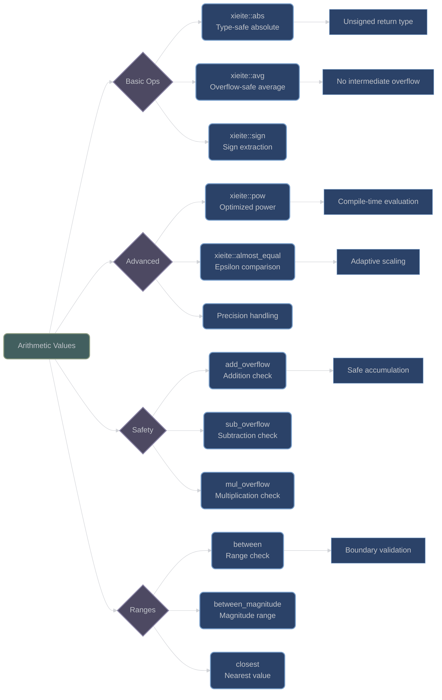

# Arithmetic Operations and Utilities

## Overview

XIEITE's math category provides a comprehensive suite of arithmetic operations with overflow detection, precision handling, and type-safe conversions. These utilities extend standard C++ math capabilities with compile-time optimizations and enhanced safety features.

## Core Arithmetic Operations

### Absolute Value

**`xieite::abs(x)`** - Type-safe absolute value with unsigned return:
```cpp
template<xieite::is_arith Arith>
[[nodiscard]] constexpr xieite::try_unsigned<Arith> abs(Arith x) noexcept;
```

Key features:
- Returns unsigned type when possible to avoid overflow
- Handles all arithmetic types (integral and floating-point)
- Special handling for edge cases (e.g., `INT_MIN`)

#### Implementation Details

The function uses compile-time branching to optimize for different types:
- **Floating-point**: Uses `std::abs` for IEEE-754 compliance
- **Unsigned integers**: Returns value unchanged
- **Signed integers**: Careful negation to avoid overflow

```cpp
// Usage examples
auto a = xieite::abs(-42);        // Returns unsigned type
auto b = xieite::abs(3.14);       // Returns 3.14
auto c = xieite::abs(42u);        // Returns 42u unchanged
```

### Overflow Detection

**`xieite::add_overflow(...)`** - Variadic addition with overflow detection:
```cpp
[[nodiscard]] constexpr bool add_overflow(xieite::is_arith auto first,
                                          xieite::is_arith auto... rest) noexcept;
```

**`xieite::sub_overflow(...)`** - Subtraction with overflow detection:
```cpp
[[nodiscard]] constexpr bool sub_overflow(xieite::is_arith auto minuend,
                                          xieite::is_arith auto subtrahend) noexcept;
```

**`xieite::mul_overflow(...)`** - Multiplication with overflow detection:
```cpp
[[nodiscard]] constexpr bool mul_overflow(xieite::is_arith auto... values) noexcept;
```

#### Overflow Detection Examples

```cpp
// Check for addition overflow
if (xieite::add_overflow(INT_MAX, 1)) {
    // Handle overflow condition
}

// Safe accumulation
int sum = 0;
for (int value : values) {
    if (xieite::add_overflow(sum, value)) {
        throw std::overflow_error("Sum overflow");
    }
    sum += value;
}

// Multi-value overflow check
if (xieite::mul_overflow(large_value, multiplier, scale_factor)) {
    // Product would overflow
}
```

### Averaging and Statistics

**`xieite::avg(...)`** - Compute average without overflow:
```cpp
template<xieite::is_arith... Args>
[[nodiscard]] constexpr auto avg(Args... values) noexcept;
```

Features:
- Avoids intermediate overflow
- Returns appropriate type based on inputs
- Handles empty parameter lists

```cpp
auto mean1 = xieite::avg(1, 2, 3, 4, 5);     // Returns 3
auto mean2 = xieite::avg(1.5, 2.5, 3.5);     // Returns 2.5
auto mean3 = xieite::avg(INT_MAX, INT_MAX);  // No overflow!
```

### Sign Manipulation

**`xieite::neg(x)`** - Check if value is negative:
```cpp
template<xieite::is_arith Arith>
[[nodiscard]] constexpr bool neg(Arith x) noexcept;
```

**`xieite::sign(x)`** - Get sign of value (-1, 0, or 1):
```cpp
template<xieite::is_arith Arith>
[[nodiscard]] constexpr int sign(Arith x) noexcept;
```

**`xieite::split_bool(b)`** - Convert boolean to ±1:
```cpp
[[nodiscard]] constexpr int split_bool(bool b) noexcept;
```

```cpp
// Sign operations
auto s1 = xieite::sign(-42);       // Returns -1
auto s2 = xieite::sign(0);         // Returns 0
auto s3 = xieite::sign(42);        // Returns 1

// Boolean to signed conversion
auto factor = xieite::split_bool(true);   // Returns 1
auto negate = xieite::split_bool(false);  // Returns -1
```

## Advanced Arithmetic

### Power Operations

**`xieite::pow(base, exp)`** - Optimized power function:
```cpp
template<xieite::is_arith Arith>
[[nodiscard]] constexpr Arith pow(Arith base, std::type_identity_t<Arith> exp);
```

Features:
- Compile-time evaluation for integral types
- Efficient exponentiation by squaring
- Special case optimizations (base = ±1, exp = 0/1)
- Exception handling for 0^(-n)

```cpp
constexpr auto p1 = xieite::pow(2, 10);      // 1024 (compile-time)
constexpr auto p2 = xieite::pow(-1, 100);    // 1
constexpr auto p3 = xieite::pow(3.14, 2.0);  // Uses std::pow for floating-point
```

### Precision Comparison

**`xieite::almost_equal(a, b)`** - Floating-point comparison with epsilon:
```cpp
template<xieite::is_arith Arith>
[[nodiscard]] constexpr bool almost_equal(Arith a, std::type_identity_t<Arith> b) noexcept;
```

**`xieite::almost_equal(a, b, epsilon)`** - Custom epsilon comparison:
```cpp
template<xieite::is_arith Arith>
[[nodiscard]] constexpr bool almost_equal(Arith a, std::type_identity_t<Arith> b,
                                          std::type_identity_t<Arith> epsilon) noexcept;
```

#### Precision Comparison Algorithm

The function uses adaptive scaling for robust comparison:
1. Computes scale as `|a| + |b|`
2. If scale < 1, uses reciprocal to avoid underflow
3. Compares difference against scaled epsilon

```cpp
// Floating-point comparison
if (xieite::almost_equal(computed_pi, 3.14159)) {
    // Values are effectively equal
}

// Custom tolerance
if (xieite::almost_equal(result, expected, 0.001)) {
    // Within 0.1% tolerance
}
```

### Type Conversions

**`xieite::as_signed(x)`** - Safe conversion to signed type:
```cpp
template<std::integral Int>
[[nodiscard]] constexpr auto as_signed(Int x) noexcept;
```

**`xieite::as_unsigned(x)`** - Safe conversion to unsigned type:
```cpp
template<std::integral Int>
[[nodiscard]] constexpr auto as_unsigned(Int x) noexcept;
```

**`xieite::sign_cast(x)`** - Cast preserving sign safety:
```cpp
template<std::integral Target, std::integral Source>
[[nodiscard]] constexpr Target sign_cast(Source x) noexcept;
```

## Range and Boundary Operations

### Value Range Checking

**`xieite::between(value, min, max)`** - Check if value is in range:
```cpp
template<typename T>
[[nodiscard]] constexpr bool between(T value, T min, T max) noexcept;
```

**`xieite::between_magnitude(value, min, max)`** - Range check by magnitude:
```cpp
template<typename T>
[[nodiscard]] constexpr bool between_magnitude(T value, T min, T max) noexcept;
```

**`xieite::closest(value, a, b)`** - Find closest value:
```cpp
template<typename T>
[[nodiscard]] constexpr T closest(T value, T a, T b) noexcept;
```

```cpp
// Range checking
bool in_range = xieite::between(5, 1, 10);           // true
bool mag_range = xieite::between_magnitude(-5, 2, 8); // true (|−5| = 5)

// Find nearest
auto nearest = xieite::closest(7, 5, 10);  // Returns 5 (closer to 7)
```

## Architecture Diagram



## Performance Considerations

- **Compile-Time Evaluation**: Most operations are `constexpr` for compile-time computation
- **Overflow Prevention**: Arithmetic operations designed to detect overflow before it occurs
- **Type Safety**: Return types chosen to minimize overflow risk
- **Branch Prediction**: Optimized paths for common cases (e.g., positive values, small exponents)
- **No Dynamic Allocation**: All basic operations work with stack values

## Best Practices

1. **Use overflow detection for untrusted input**:
   ```cpp
   if (xieite::add_overflow(user_value, system_value)) {
       return error_code;
   }
   ```

2. **Prefer `almost_equal` for floating-point comparison**:
   ```cpp
   // Bad: Direct comparison
   if (computed == expected) { }

   // Good: Epsilon comparison
   if (xieite::almost_equal(computed, expected)) { }
   ```

3. **Use type-safe conversions**:
   ```cpp
   auto unsigned_val = xieite::as_unsigned(signed_val);
   auto signed_val = xieite::as_signed(unsigned_val);
   ```

4. **Leverage compile-time evaluation**:
   ```cpp
   constexpr auto power_of_two = xieite::pow(2, 16);  // Computed at compile time
   ```

---

*Next: [Advanced Mathematical Types](advanced_types.md)*
