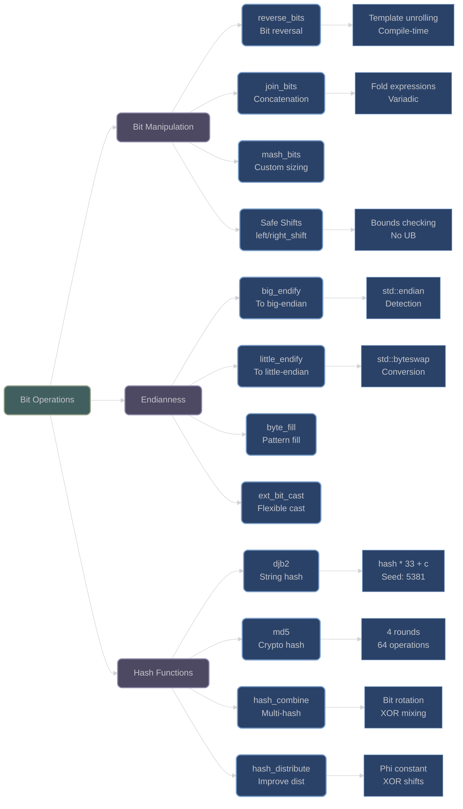

# Bit Operations and Hashing Utilities

## Overview

XIEITE provides comprehensive bit manipulation utilities and hashing functions designed for performance, safety, and cross-platform compatibility. These utilities leverage C++20 features for compile-time evaluation and type safety.

## Bit Manipulation Functions

### Bit Reversal

**`xieite::reverse_bits(x)`** - Reverse bit order:
```cpp
template<std::integral Int>
[[nodiscard]] constexpr Int reverse_bits(Int x) noexcept;

template<std::size_t bits>
[[nodiscard]] constexpr std::bitset<bits> reverse_bits(const std::bitset<bits>& x) noexcept;
```

Reverses the bit order of integral values or bitsets using compile-time unrolling:

```cpp
// Integral reversal
std::uint8_t byte = 0b11010010;
auto reversed = xieite::reverse_bits(byte);  // 0b01001011

// Bitset reversal
std::bitset<16> bits{"1100110011001100"};
auto rev_bits = xieite::reverse_bits(bits);  // "0011001100110011"
```

### Bit Joining

**`xieite::join_bits(...)`** - Concatenate integral values:
```cpp
template<std::integral... Ints>
[[nodiscard]] constexpr auto join_bits(Ints... args) noexcept
    -> std::bitset<(... + bit_size<Ints>)>;
```

Concatenates multiple integral values preserving full bit width:

```cpp
std::uint8_t a = 0xFF;       // 8 bits
std::uint16_t b = 0x1234;    // 16 bits
auto joined = xieite::join_bits(a, b);  // 24-bit bitset: 0xFF1234
```

**`xieite::mash_bits<sizes...>(...)`** - Join with custom bit sizes:
```cpp
template<std::size_t... sizes, std::integral... Ints>
[[nodiscard]] constexpr auto mash_bits(Ints... args) noexcept
    -> std::bitset<(... + sizes)>;
```

Allows precise control over bit contribution from each value:

```cpp
// Take 4 bits from first, 3 from second, 5 from third
auto mashed = xieite::mash_bits<4, 3, 5>(0xFF, 0xFF, 0xFF);
// Result: 12-bit bitset with 0xF, 0x7, 0x1F
```

### Safe Bit Shifting

**`xieite::left_shift(x, bits)`** - Safe left shift:
```cpp
template<std::integral Int>
[[nodiscard]] constexpr Int left_shift(Int x, std::size_t bits) noexcept;
```

**`xieite::right_shift(x, bits)`** - Safe right shift:
```cpp
template<std::integral Int>
[[nodiscard]] constexpr Int right_shift(Int x, std::size_t bits) noexcept;
```

Prevents undefined behavior from oversized shifts:

```cpp
std::uint32_t value = 0x12345678;

// Safe shifting - returns 0 for oversized shifts
auto safe_left = xieite::left_shift(value, 40);   // Returns 0 (>= 32)
auto safe_right = xieite::right_shift(value, 16); // Returns 0x1234

// Compare to undefined behavior in standard C++:
// auto unsafe = value << 40;  // Undefined behavior!
```

## Endianness Conversion

### Byte Order Functions

**`xieite::big_endify(x)`** - Convert to big-endian:
```cpp
template<std::integral Int>
[[nodiscard]] constexpr Int big_endify(Int x) noexcept;
```

**`xieite::little_endify(x)`** - Convert to little-endian:
```cpp
template<std::integral Int>
[[nodiscard]] constexpr Int little_endify(Int x) noexcept;
```

Cross-platform byte order conversion using C++20 `std::endian`:

```cpp
std::uint32_t value = 0x12345678;

// Convert to specific endianness
auto big = xieite::big_endify(value);      // Network byte order
auto little = xieite::little_endify(value); // x86 byte order

// Automatic detection and conversion
if constexpr (std::endian::native == std::endian::little) {
    // big_endify will byteswap on little-endian systems
    // little_endify returns unchanged
}
```

### Byte Pattern Utilities

**`xieite::byte_fill`** - Fill any type with repeated byte:
```cpp
struct byte_fill {
    template<typename T>
    [[nodiscard]] constexpr operator T() const noexcept;
};
```

Creates values filled with a repeated byte pattern:

```cpp
xieite::byte_fill filler{0xAB};
std::uint32_t filled = filler;  // 0xABABABAB
std::uint64_t filled64 = filler; // 0xABABABABABABABAB

// Useful for creating test patterns
xieite::byte_fill zero{0};
xieite::byte_fill ones{0xFF};
```

### Extended Bit Cast

**`xieite::ext_bit_cast<T>(x)`** - Flexible bit casting:
```cpp
template<typename T>
[[nodiscard]] constexpr T ext_bit_cast(auto&& x) noexcept;
```

Bit cast with automatic truncation or zero-padding:

```cpp
std::uint32_t source = 0x12345678;

// Truncate to smaller type
auto truncated = xieite::ext_bit_cast<std::uint16_t>(source); // 0x5678

// Zero-pad to larger type
auto padded = xieite::ext_bit_cast<std::uint64_t>(source);
// 0x0000000012345678

// Different-sized struct conversion
struct Small { std::uint8_t a, b; };
struct Large { std::uint32_t value; };

Small s{0x12, 0x34};
auto l = xieite::ext_bit_cast<Large>(s); // Padded with zeros
```

## Hashing Functions

### DJB2 Hash

**`xieite::djb2(str)`** - Dan Bernstein's hash function:
```cpp
[[nodiscard]] constexpr std::size_t djb2(std::string_view strv) noexcept;
```

Classic DJB2 algorithm with excellent distribution:

```cpp
auto hash1 = xieite::djb2("hello");    // Compile-time if constexpr
auto hash2 = xieite::djb2("world");

// DJB2 algorithm: hash = hash * 33 + char
// Starting seed: 5381
```

### MD5 Hash

**`xieite::md5(str)`** - MD5 cryptographic hash:
```cpp
[[nodiscard]] constexpr std::string md5(std::string_view strv) noexcept;
```

Full MD5 implementation with compile-time support:

```cpp
constexpr auto hash = xieite::md5("hello world");
// Returns: "5eb63bbbe01eeed093cb22bb8f5acdc3"

// Features:
// - Message padding to 512-bit blocks
// - Four rounds of operations
// - Precomputed sine-based constants
// - Returns lowercase hex string
```

### Hash Combination

**`xieite::hash_combine(...)`** - Combine multiple hashes:
```cpp
template<std::integral Int, std::integral... Rest>
[[nodiscard]] constexpr Int hash_combine(Int first, Rest... rest) noexcept;
```

Combines hash values with good mixing properties:

```cpp
std::size_t hash1 = std::hash<int>{}(42);
std::size_t hash2 = std::hash<std::string>{}("test");
std::size_t hash3 = std::hash<double>{}(3.14);

auto combined = xieite::hash_combine(hash1, hash2, hash3);

// Algorithm uses rotation and distribution for mixing
```

**`xieite::hash_distribute(x)`** - Improve hash distribution:
```cpp
template<std::integral Int>
[[nodiscard]] constexpr Int hash_distribute(Int x) noexcept;
```

Enhances hash distribution using golden ratio and XOR shifts:

```cpp
std::size_t poor_hash = 12345;  // Poor distribution
auto improved = xieite::hash_distribute(poor_hash);

// Uses phi (golden ratio) and double XOR shifts
// Provides avalanche effect for better distribution
```

## Architecture Diagram



## Usage Patterns

### Network Protocol Implementation

```cpp
struct NetworkHeader {
    std::uint32_t magic;
    std::uint16_t version;
    std::uint16_t flags;
};

// Serialize for network (big-endian)
NetworkHeader header{0x12345678, 0x0100, 0x0042};
header.magic = xieite::big_endify(header.magic);
header.version = xieite::big_endify(header.version);
header.flags = xieite::big_endify(header.flags);

// Deserialize from network
header.magic = xieite::big_endify(header.magic);  // Converts back
```

### Hash Table Implementation

```cpp
template<typename Key, typename Value>
class CustomHashMap {
    std::size_t hash_key(const Key& k) const {
        auto raw_hash = std::hash<Key>{}(k);
        // Improve distribution for better performance
        return xieite::hash_distribute(raw_hash) % bucket_count;
    }
};

// Composite key hashing
struct CompositeKey {
    int id;
    std::string name;
    double value;
};

std::size_t hash_composite(const CompositeKey& key) {
    return xieite::hash_combine(
        std::hash<int>{}(key.id),
        std::hash<std::string>{}(key.name),
        std::hash<double>{}(key.value)
    );
}
```

### Bit Packing

```cpp
// Pack multiple values into single integer
struct PackedData {
    std::uint8_t flags : 3;
    std::uint8_t type : 5;
    std::uint16_t value;
};

std::uint32_t pack_data(const PackedData& data) {
    return xieite::join_bits(
        xieite::mash_bits<3>(data.flags),
        xieite::mash_bits<5>(data.type),
        data.value
    ).to_ulong();
}
```

## Performance Considerations

- **Compile-Time**: All functions are `constexpr` for compile-time evaluation
- **No Branches**: Bit operations use template metaprogramming to avoid runtime branches
- **Platform Optimized**: Endianness conversion compiles to no-op on matching platforms
- **Cache Friendly**: Operations work on stack values, no heap allocation
- **SIMD Ready**: Bit operations can be vectorized by modern compilers

## Best Practices

1. **Use Safe Shifts**: Always prefer `left_shift`/`right_shift` over raw operators
2. **Hash Combination**: Use `hash_combine` for composite keys
3. **Endianness**: Always specify byte order for serialization
4. **Compile-Time**: Mark hash computations `constexpr` when possible
5. **Distribution**: Apply `hash_distribute` to improve poor hash functions

---

*Next: [Mathematical Functions and Constants](mathematical_functions.md)*
