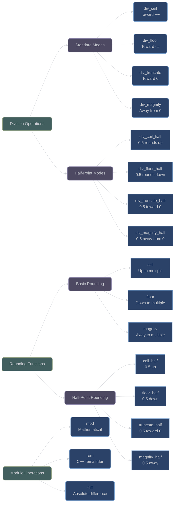

# Division and Rounding Operations

## Overview

XIEITE provides a comprehensive suite of division and rounding operations with precise control over rounding behavior. These functions handle edge cases correctly, support both integer and floating-point types, and offer various rounding strategies including half-point rounding.

## Division Operations

### Standard Division Modes

**`xieite::div_ceil(lhs, rhs)`** - Division rounding toward positive infinity:
```cpp
template<xieite::is_arith Arith>
[[nodiscard]] constexpr Arith div_ceil(Arith lhs, std::type_identity_t<Arith> rhs) noexcept;
```

**`xieite::div_floor(lhs, rhs)`** - Division rounding toward negative infinity:
```cpp
template<xieite::is_arith Arith>
[[nodiscard]] constexpr Arith div_floor(Arith lhs, std::type_identity_t<Arith> rhs) noexcept;
```

**`xieite::div_truncate(lhs, rhs)`** - Division rounding toward zero:
```cpp
template<xieite::is_arith Arith>
[[nodiscard]] constexpr Arith div_truncate(Arith lhs, std::type_identity_t<Arith> rhs) noexcept;
```

**`xieite::div_magnify(lhs, rhs)`** - Division rounding away from zero:
```cpp
template<xieite::is_arith Arith>
[[nodiscard]] constexpr Arith div_magnify(Arith lhs, std::type_identity_t<Arith> rhs) noexcept;
```

#### Division Mode Examples

```cpp
// Different rounding behaviors
int dividend = 7;
int divisor = 3;  // 7/3 = 2.333...

auto ceil_result = xieite::div_ceil(dividend, divisor);        // 3 (rounds up)
auto floor_result = xieite::div_floor(dividend, divisor);      // 2 (rounds down)
auto trunc_result = xieite::div_truncate(dividend, divisor);   // 2 (toward zero)
auto mag_result = xieite::div_magnify(dividend, divisor);      // 3 (away from zero)

// Negative numbers show different behaviors
dividend = -7;
auto neg_ceil = xieite::div_ceil(dividend, divisor);       // -2 (toward +∞)
auto neg_floor = xieite::div_floor(dividend, divisor);     // -3 (toward -∞)
auto neg_trunc = xieite::div_truncate(dividend, divisor);  // -2 (toward 0)
auto neg_mag = xieite::div_magnify(dividend, divisor);     // -3 (away from 0)
```

### Half-Point Division

Special division functions for handling 0.5 fractional parts:

**`xieite::div_ceil_half(lhs, rhs)`** - Half rounds up:
```cpp
template<xieite::is_arith Arith>
[[nodiscard]] constexpr Arith div_ceil_half(Arith lhs, std::type_identity_t<Arith> rhs) noexcept;
```

**`xieite::div_floor_half(lhs, rhs)`** - Half rounds down:
```cpp
template<xieite::is_arith Arith>
[[nodiscard]] constexpr Arith div_floor_half(Arith lhs, std::type_identity_t<Arith> rhs) noexcept;
```

**`xieite::div_truncate_half(lhs, rhs)`** - Half rounds toward zero:
```cpp
template<xieite::is_arith Arith>
[[nodiscard]] constexpr Arith div_truncate_half(Arith lhs, std::type_identity_t<Arith> rhs) noexcept;
```

**`xieite::div_magnify_half(lhs, rhs)`** - Half rounds away from zero:
```cpp
template<xieite::is_arith Arith>
[[nodiscard]] constexpr Arith div_magnify_half(Arith lhs, std::type_identity_t<Arith> rhs) noexcept;
```

#### Half-Point Examples

```cpp
// Half-point rounding behaviors
double value = 5.5;
double divisor = 2.0;  // 5.5/2 = 2.75

auto half_ceil = xieite::div_ceil_half(value, divisor);    // 3 (0.5 rounds up)
auto half_floor = xieite::div_floor_half(value, divisor);  // 2 (0.5 rounds down)

// Exact half case
value = 5.0;  // 5.0/2 = 2.5 exactly
auto exact_ceil = xieite::div_ceil_half(value, divisor);   // 3
auto exact_floor = xieite::div_floor_half(value, divisor); // 2
```

## Rounding Functions

### Basic Rounding with Step Size

**`xieite::ceil(x, step)`** - Round up to nearest multiple:
```cpp
template<xieite::is_arith Arith>
[[nodiscard]] constexpr Arith ceil(Arith x, std::type_identity_t<Arith> step = 1) noexcept;
```

**`xieite::floor(x, step)`** - Round down to nearest multiple:
```cpp
template<xieite::is_arith Arith>
[[nodiscard]] constexpr Arith floor(Arith x, std::type_identity_t<Arith> step = 1) noexcept;
```

**`xieite::magnify(x, step)`** - Round away from zero to nearest multiple:
```cpp
template<xieite::is_arith Arith>
[[nodiscard]] constexpr Arith magnify(Arith x, std::type_identity_t<Arith> step = 1) noexcept;
```

#### Rounding Examples

```cpp
// Round to nearest integer
double value = 3.7;
auto up = xieite::ceil(value);      // 4.0
auto down = xieite::floor(value);   // 3.0

// Round to nearest multiple of 5
value = 17.3;
auto ceil_5 = xieite::ceil(value, 5.0);   // 20.0
auto floor_5 = xieite::floor(value, 5.0);  // 15.0

// Round to nearest 0.25
value = 3.18;
auto quarter = xieite::ceil(value, 0.25);  // 3.25

// Round time to nearest 15 minutes
int seconds = 1234;
auto rounded_time = xieite::floor(seconds, 900);  // 900 (15 minutes)
```

### Half-Point Rounding with Step Size

**`xieite::ceil_half(x, step)`** - Round 0.5 up to nearest multiple:
```cpp
template<xieite::is_arith Arith>
[[nodiscard]] constexpr Arith ceil_half(Arith x, std::type_identity_t<Arith> step = 1) noexcept;
```

**`xieite::floor_half(x, step)`** - Round 0.5 down to nearest multiple:
```cpp
template<xieite::is_arith Arith>
[[nodiscard]] constexpr Arith floor_half(Arith x, std::type_identity_t<Arith> step = 1) noexcept;
```

**`xieite::truncate_half(x, step)`** - Round 0.5 toward zero:
```cpp
template<xieite::is_arith Arith>
[[nodiscard]] constexpr Arith truncate_half(Arith x, std::type_identity_t<Arith> step = 1) noexcept;
```

**`xieite::magnify_half(x, step)`** - Round 0.5 away from zero:
```cpp
template<xieite::is_arith Arith>
[[nodiscard]] constexpr Arith magnify_half(Arith x, std::type_identity_t<Arith> step = 1) noexcept;
```

## Modulo and Remainder

### Mathematical Modulo

**`xieite::mod(lhs, rhs)`** - True mathematical modulo:
```cpp
template<xieite::is_arith Arith>
[[nodiscard]] constexpr Arith mod(Arith lhs, std::type_identity_t<Arith> rhs) noexcept;
```

Always returns a positive result matching the sign of the divisor:

```cpp
// Mathematical modulo always positive
auto mod1 = xieite::mod(7, 3);     // 1
auto mod2 = xieite::mod(-7, 3);    // 2 (not -1!)
auto mod3 = xieite::mod(7, -3);    // -2
auto mod4 = xieite::mod(-7, -3);   // -1

// Useful for cyclic operations
int hour = xieite::mod(current_hour + offset, 24);  // Always 0-23
```

### C++ Remainder

**`xieite::rem(lhs, rhs)`** - Standard remainder operation:
```cpp
template<xieite::is_arith Arith>
[[nodiscard]] constexpr Arith rem(Arith lhs, std::type_identity_t<Arith> rhs) noexcept;
```

Matches C++ `%` operator behavior:

```cpp
// Standard remainder
auto rem1 = xieite::rem(7, 3);     // 1
auto rem2 = xieite::rem(-7, 3);    // -1 (negative like dividend)

// Floating-point remainder
auto frem = xieite::rem(7.5, 2.0); // 1.5
```

## Utility Functions

### Absolute Difference

**`xieite::diff(a, b)`** - Absolute difference between values:
```cpp
template<xieite::is_arith Arith>
[[nodiscard]] constexpr Arith diff(Arith a, std::type_identity_t<Arith> b) noexcept;
```

Safe absolute difference without overflow:

```cpp
// Safe difference calculation
auto d1 = xieite::diff(10, 7);     // 3
auto d2 = xieite::diff(7, 10);     // 3 (always positive)

// Handles overflow safely
unsigned int a = 0;
unsigned int b = UINT_MAX;
auto safe_diff = xieite::diff(a, b);  // UINT_MAX (no overflow)
```

## Implementation Details

### Division Algorithm Selection

The library uses different algorithms for integer vs floating-point:

**Integer Division**:
- Uses modulo and sign detection for rounding
- Avoids branches where possible
- Handles negative dividends correctly

**Floating-Point Division**:
- Uses standard library functions (`std::ceil`, `std::floor`)
- Maintains IEEE-754 compliance
- Handles special values (infinity, NaN)

### Half-Point Handling

Half-point functions use sophisticated logic:
1. Detect exact half-values
2. Apply appropriate rounding rule
3. Handle sign combinations correctly

## Architecture Diagram



## Use Cases

### Financial Calculations

```cpp
// Round currency to cents
double amount = 12.3456;
auto cents = xieite::floor(amount, 0.01);  // 12.34

// Round up to next billing period (monthly = 30 days)
int days_used = 47;
auto billed_days = xieite::div_ceil(days_used, 30) * 30;  // 60
```

### Time Calculations

```cpp
// Round timestamp to nearest minute
int64_t timestamp = 1634567890;  // Unix timestamp
auto minute_aligned = xieite::floor(timestamp, 60);

// Calculate weeks from days (always round up)
int days = 10;
auto weeks = xieite::div_ceil(days, 7);  // 2 weeks
```

### Grid Alignment

```cpp
// Snap coordinates to grid
struct Point { double x, y; };
Point mouse{123.7, 456.2};

const double grid_size = 16.0;
Point snapped{
    xieite::floor(mouse.x, grid_size),
    xieite::floor(mouse.y, grid_size)
};  // {112, 448}
```

## Performance Considerations

- **Compile-Time**: All functions are constexpr
- **Branch-Free**: Integer operations minimize branching
- **Type Safety**: `std::type_identity_t` prevents implicit conversions
- **Overflow Safety**: Careful handling of edge cases
- **IEEE Compliance**: Floating-point operations maintain standards

## Best Practices

1. **Choose Appropriate Rounding**:
   - Financial: Often requires `ceil` for charges, `floor` for payouts
   - Graphics: Usually `floor` for pixel coordinates
   - Statistics: Consider half-point rounding for fairness

2. **Use Mathematical Modulo for Cycles**:
   ```cpp
   // Good: Always positive result
   int hour = xieite::mod(time, 24);

   // Avoid: Can be negative
   int hour = time % 24;
   ```

3. **Leverage Step Parameter**:
   ```cpp
   // Round to nearest quarter
   auto quarters = xieite::floor(value, 0.25);

   // Round to nearest 100
   auto hundreds = xieite::ceil(value, 100);
   ```

---

*Next: [Search and Optimization Algorithms](search_optimization.md)*