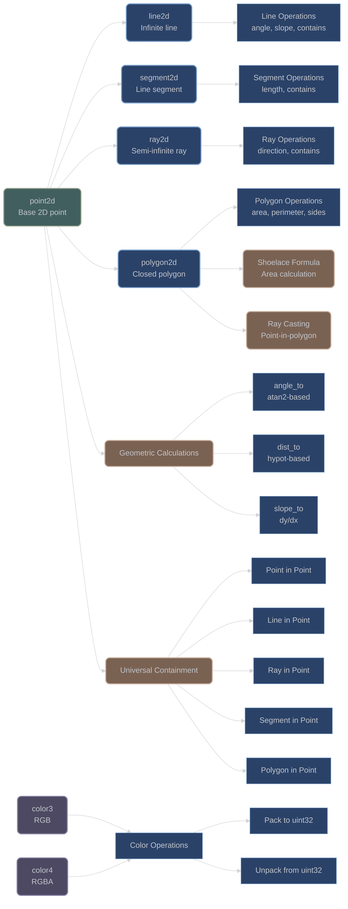

# 2D Geometric Types and Operations

## Overview

XIEITE provides a comprehensive suite of 2D geometric types with full arithmetic operations, containment testing, and geometric calculations. These types form a cohesive system for computational geometry applications.

## Core Point Type

### Point2D

**`xieite::point2d<Arith>`** - 2D point with geometric operations:
```cpp
template<xieite::is_arith Arith = double>
struct point2d {
    Arith x = 0;
    Arith y = 0;

    [[nodiscard]] constexpr Arith angle_to(const point2d& other) const noexcept;
    [[nodiscard]] constexpr Arith dist_to(const point2d& other) const noexcept;
    [[nodiscard]] constexpr Arith slope_to(const point2d& other) const noexcept;

    // Containment checks
    [[nodiscard]] constexpr bool contains(const point2d& point) const noexcept;
    [[nodiscard]] constexpr bool contains(const line2d<Arith>& line) const noexcept;
    [[nodiscard]] constexpr bool contains(const ray2d<Arith>& ray) const noexcept;
    [[nodiscard]] constexpr bool contains(const segment2d<Arith>& segment) const noexcept;
    [[nodiscard]] constexpr bool contains(const polygon2d<Arith>& polygon) const noexcept;
};
```

Key features:
- Template parameter allows any arithmetic type (default: `double`)
- Angle calculation using `std::atan2` for proper quadrant handling
- Distance using `std::hypot` for numerical stability
- Slope handles vertical lines (returns infinity)
- Universal containment testing

#### Usage Examples

```cpp
// Basic point operations
xieite::point2d p1{3.0, 4.0};
xieite::point2d p2{6.0, 8.0};

auto angle = p1.angle_to(p2);     // Angle in radians
auto dist = p1.dist_to(p2);       // Euclidean distance: 5.0
auto slope = p1.slope_to(p2);     // Slope: 4/3

// Containment checking
if (p1.contains(p2)) {
    // Points are coincident
}
```

## Line Types

### Infinite Line

**`xieite::line2d<Arith>`** - Infinite 2D line:
```cpp
template<xieite::is_arith Arith = double>
struct line2d {
    xieite::point2d<Arith> a, b;  // Two points defining the line

    // Constructors
    constexpr line2d(const point2d<Arith>& point_a, const point2d<Arith>& point_b);
    constexpr line2d(const point2d<Arith>& point, Arith angle);

    [[nodiscard]] constexpr Arith angle() const noexcept;
    [[nodiscard]] constexpr Arith length() const noexcept;  // Returns infinity
    [[nodiscard]] constexpr Arith slope() const noexcept;
    [[nodiscard]] constexpr bool contains(const point2d<Arith>& point) const noexcept;
};
```

Features:
- Defined by two points or point + angle
- Cross product test for point containment
- Length returns infinity for infinite lines

### Line Segment

**`xieite::segment2d<Arith>`** - Finite line segment:
```cpp
template<xieite::is_arith Arith = double>
struct segment2d {
    xieite::point2d<Arith> start, end;

    [[nodiscard]] constexpr Arith angle() const noexcept;
    [[nodiscard]] constexpr Arith length() const noexcept;
    [[nodiscard]] constexpr Arith slope() const noexcept;
    [[nodiscard]] constexpr bool contains(const point2d<Arith>& point) const noexcept;
};
```

Features:
- Triangle inequality test for containment
- Bidirectional equality (start→end == end→start)
- Finite length calculation

### Ray

**`xieite::ray2d<Arith>`** - Semi-infinite ray:
```cpp
template<xieite::is_arith Arith = double>
struct ray2d {
    xieite::point2d<Arith> a, b;  // Origin and direction point

    // Constructors
    constexpr ray2d(const point2d<Arith>& origin, const point2d<Arith>& direction);
    constexpr ray2d(const point2d<Arith>& origin, Arith angle);

    [[nodiscard]] constexpr Arith length() const noexcept;  // Returns infinity
    [[nodiscard]] constexpr bool contains(const point2d<Arith>& point) const noexcept;
};
```

Features:
- Direction-aware containment
- Only points in ray's direction are contained
- Semi-infinite length

#### Line Types Examples

```cpp
// Create different line types
xieite::point2d origin{0.0, 0.0};
xieite::point2d target{5.0, 5.0};

// Infinite line through two points
xieite::line2d line{origin, target};
auto line_angle = line.angle();     // 45 degrees (π/4 radians)
auto line_slope = line.slope();     // 1.0

// Line segment between points
xieite::segment2d segment{origin, target};
auto seg_length = segment.length();  // √50 ≈ 7.07

// Ray from origin through target
xieite::ray2d ray{origin, target};
xieite::point2d test_point{10.0, 10.0};
bool on_ray = ray.contains(test_point);  // true (extends beyond target)

// Ray from angle
xieite::ray2d angle_ray{origin, M_PI / 4};  // 45-degree ray
```

## Polygon Type

### Polygon2D

**`xieite::polygon2d<Arith>`** - General 2D polygon:
```cpp
template<xieite::is_arith Arith = double>
struct polygon2d {
    std::vector<xieite::point2d<Arith>> points;

    // Factory methods
    [[nodiscard]] static constexpr polygon2d rect(
        const point2d<Arith>& start,
        const point2d<Arith>& end
    ) noexcept;

    [[nodiscard]] constexpr Arith area() const noexcept;
    [[nodiscard]] constexpr Arith perim() const noexcept;
    [[nodiscard]] constexpr auto sides() const noexcept;
    [[nodiscard]] constexpr bool contains(const point2d<Arith>& point) const noexcept;
};
```

#### Implementation Details

**Area Calculation**: Uses the Shoelace formula (Gauss's area formula):

---

```math
area = |Σ(x[i] * y[i+1] - x[i+1] * y[i])| / 2
```

---

**Point-in-Polygon**: Ray casting algorithm:
1. Cast a ray from the point
2. Count intersections with polygon edges
3. Odd count = inside, even count = outside

**Equality Testing**: Handles cyclic permutations and reversals using `xieite::rotated`

#### Polygon Examples

```cpp
// Create a triangle
xieite::polygon2d<double> triangle{
    {{0.0, 0.0}, {4.0, 0.0}, {2.0, 3.0}}
};

auto area = triangle.area();        // 6.0
auto perimeter = triangle.perim();  // ~9.21
auto sides = triangle.sides();      // Vector of 3 segments

// Create a rectangle using factory method
auto rect = xieite::polygon2d<double>::rect(
    {0.0, 0.0},  // Bottom-left
    {5.0, 3.0}   // Top-right
);

// Point-in-polygon testing
xieite::point2d test{2.5, 1.5};
bool inside = rect.contains(test);  // true

// Complex polygon
xieite::polygon2d<double> pentagon{
    {{0, 0}, {2, 0}, {3, 1.5}, {1, 2.5}, {-1, 1.5}}
};
```

## Color Types

### RGB Color

**`xieite::color3`** - 24-bit RGB color:
```cpp
struct color3 {
    std::uint8_t r, g, b;

    constexpr color3(std::uint8_t r, std::uint8_t g, std::uint8_t b) noexcept;
    constexpr color3(std::uint32_t value) noexcept;

    [[nodiscard]] constexpr std::uint32_t value() const noexcept;
};
```

### RGBA Color

**`xieite::color4`** - 32-bit RGBA color with alpha:
```cpp
struct color4 {
    std::uint8_t r, g, b, a;

    constexpr color4(std::uint8_t r, std::uint8_t g, std::uint8_t b,
                     std::uint8_t a = 0xFF) noexcept;
    constexpr color4(std::uint32_t value) noexcept;

    [[nodiscard]] constexpr std::uint32_t value() const noexcept;
};
```

#### Color Examples

```cpp
// Create colors from components
xieite::color3 red{255, 0, 0};
xieite::color4 semi_transparent_blue{0, 0, 255, 128};

// Create from packed integer
xieite::color3 green{0x00FF00};  // RGB: 0, 255, 0
xieite::color4 opaque_white{0xFFFFFFFF};

// Convert to packed integer
auto red_value = red.value();    // 0xFF0000
auto blue_value = semi_transparent_blue.value();  // 0x0000FF80
```

## Architecture Diagram



## Performance Considerations

- **Template Flexibility**: All geometric types support any arithmetic type
- **Constexpr Support**: Most operations are constexpr-enabled
- **Numerical Stability**: Uses `std::hypot` for distance calculations
- **Efficient Algorithms**: Shoelace formula for area, ray casting for containment
- **No Dynamic Allocation**: Except for polygon's vector of points

## Best Practices

1. **Choose Appropriate Type**: Use the geometric type that matches your needs:
   - `line2d` for infinite lines (e.g., mathematical equations)
   - `segment2d` for bounded lines (e.g., polygon edges)
   - `ray2d` for semi-infinite lines (e.g., ray tracing)

2. **Precision Considerations**:
   ```cpp
   // Use appropriate precision for your domain
   xieite::point2d<float> fast_point;     // Gaming, graphics
   xieite::point2d<double> precise_point; // Scientific computation
   xieite::point2d<int> grid_point;       // Discrete grids
   ```

3. **Containment Testing**:
   ```cpp
   // Test containment hierarchically
   if (bounding_box.contains(point)) {
       if (detailed_polygon.contains(point)) {
           // Point is definitely inside
       }
   }
   ```

---

*Next: [Advanced Mathematical Types](advanced_types.md)*
