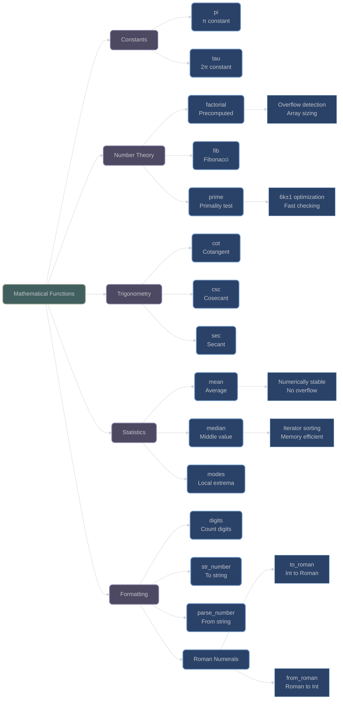

# Mathematical Functions and Constants

## Overview

XIEITE provides a comprehensive collection of mathematical functions including constants, number theory, trigonometry, statistics, and number formatting utilities. All functions emphasize compile-time computation, type safety, and numerical stability.

## Mathematical Constants

### Pi and Tau

**`xieite::pi<Arith>`** - π constant:
```cpp
template<xieite::is_arith Arith = double>
constexpr Arith pi = std::numbers::pi_v<Arith>;

// Specialization for integral types
template<std::integral Int>
constexpr Int pi<Int> = static_cast<Int>(std::numbers::pi);
```

**`xieite::tau<Arith>`** - τ (2π) constant:
```cpp
template<xieite::is_arith Arith = double>
constexpr Arith tau = xieite::pi<Arith> * 2;
```

Usage examples:
```cpp
constexpr double circle_area = xieite::pi<double> * radius * radius;
constexpr float half_rotation = xieite::tau<float> / 2;
constexpr int pi_int = xieite::pi<int>;  // 3

// Tau is useful for radians
constexpr double quarter_turn = xieite::tau<> / 4;  // π/2
```

## Number Theory Functions

### Factorial

**`xieite::factorial<Arith>`** - Precomputed factorial array:
```cpp
template<xieite::is_arith Arith>
constexpr auto factorial = /* compile-time computed array */;
```

Features:
- Compile-time computation of all factorials that fit in type
- Uses overflow detection to determine array size
- Zero-runtime cost access

```cpp
// Access precomputed factorials
constexpr auto fact_10 = xieite::factorial<int>[10];      // 3628800
constexpr auto fact_20 = xieite::factorial<long long>[20]; // 2432902008176640000

// Array contains all factorials that fit
constexpr auto max_factorial = xieite::factorial<int>.size() - 1;
// For int32: typically 12! is max (479001600)
```

### Fibonacci Sequence

**`xieite::fib<Arith>`** - Precomputed Fibonacci array:
```cpp
template<xieite::is_arith Arith>
constexpr auto fib = /* compile-time computed array */;
```

Features:
- All Fibonacci numbers that fit in type
- Compile-time generation with overflow detection
- Instant access to any Fibonacci number

```cpp
// Access Fibonacci numbers
constexpr auto fib_10 = xieite::fib<int>[10];  // 55
constexpr auto fib_45 = xieite::fib<long long>[45];  // 1134903170

// Find how many Fibonacci numbers fit in type
constexpr auto fib_count = xieite::fib<std::uint32_t>.size();
```

### Prime Testing

**`xieite::prime(x)`** - Optimized primality test:
```cpp
template<std::integral Int>
[[nodiscard]] constexpr bool prime(Int x) noexcept;
```

Implementation uses 6k±1 optimization:
- Special cases for 2 and 3
- Eliminates multiples of 2 and 3
- Only checks divisors of form 6k±1

```cpp
static_assert(xieite::prime(17));     // Compile-time prime checking
static_assert(!xieite::prime(18));

// Runtime prime checking
if (xieite::prime(large_number)) {
    // Handle prime case
}

// Find primes in range
std::vector<int> primes;
for (int i = 2; i <= 100; ++i) {
    if (xieite::prime(i)) {
        primes.push_back(i);
    }
}
```

## Trigonometric Functions

### Extended Trigonometry

**`xieite::cot(theta)`** - Cotangent:
```cpp
[[nodiscard]] constexpr auto cot(xieite::is_arith auto theta) noexcept;
// Returns: cos(theta) / sin(theta)
```

**`xieite::csc(theta)`** - Cosecant:
```cpp
[[nodiscard]] constexpr auto csc(xieite::is_arith auto theta) noexcept;
// Returns: 1 / sin(theta)
```

**`xieite::sec(theta)`** - Secant:
```cpp
[[nodiscard]] constexpr auto sec(xieite::is_arith auto theta) noexcept;
// Returns: 1 / cos(theta)
```

Usage examples:
```cpp
double angle = xieite::pi<> / 4;  // 45 degrees

auto cotangent = xieite::cot(angle);  // 1.0
auto cosecant = xieite::csc(angle);   // √2
auto secant = xieite::sec(angle);     // √2

// Complete trigonometric calculations
double hypotenuse = side_length * xieite::csc(angle);
```

## Statistical Functions

### Central Tendency

**`xieite::mean(range)`** - Arithmetic mean with overflow prevention:
```cpp
template<xieite::is_fwd_sized_range Range, typename Result = std::common_type_t<...>>
[[nodiscard]] constexpr Result mean(Range&& range) noexcept;
```

Features:
- Numerically stable algorithm
- Avoids intermediate overflow
- Handles integral remainders correctly

**`xieite::median(range)`** - Statistical median:
```cpp
template<std::ranges::forward_range Range, typename Result = std::common_type_t<...>>
[[nodiscard]] constexpr Result median(Range&& range) noexcept;
```

Features:
- Sorts iterators, not values (memory efficient)
- Averages middle elements for even-sized ranges
- Works with any forward range

**`xieite::modes(range, cmp)`** - Find local extrema:
```cpp
template<std::ranges::forward_range Range, xieite::is_invoc<bool(...)> Fn = std::greater<>>
[[nodiscard]] constexpr std::vector<std::ranges::iterator_t<Range>> modes(Range& range, Fn&& cmp = {}) noexcept;
```

Features:
- Returns iterators to local maxima/minima
- Configurable comparison function
- Useful for peak detection

```cpp
std::vector<double> data = {1.5, 2.7, 3.1, 2.8, 3.9, 1.2};

// Statistical analysis
auto avg = xieite::mean(data);        // 2.533...
auto med = xieite::median(data);      // 2.75
auto peaks = xieite::modes(data);     // Iterators to local maxima

// Custom comparison for local minima
auto valleys = xieite::modes(data, std::less<>{});
```

## Number Formatting and Parsing

### Digit Counting

**`xieite::digits(x, radix)`** - Count digits in any base:
```cpp
template<std::integral Int>
[[nodiscard]] constexpr std::size_t digits(Int x, Int radix = 10) noexcept;

template<std::floating_point Float>
[[nodiscard]] constexpr std::size_t digits(Float x, Float radix = 10) noexcept;
```

```cpp
constexpr auto dec_digits = xieite::digits(12345);      // 5 (base 10)
constexpr auto bin_digits = xieite::digits(255, 2);     // 8 (base 2)
constexpr auto hex_digits = xieite::digits(0xABCD, 16); // 4 (base 16)
```

### Number String Conversion

**`xieite::str_number(x, radix, config, pad)`** - Convert to string:
```cpp
template<xieite::is_arith Arith>
[[nodiscard]] constexpr std::string str_number(
    Arith x,
    std::conditional_t<std::floating_point<Arith>, xieite::ssize_t, Arith> radix = 10,
    const xieite::number_str_config& config = {},
    std::size_t pad = 0
) noexcept;
```

**`xieite::parse_number<Arith>(str, idx, radix, config)`** - Parse from string:
```cpp
template<xieite::is_arith Arith>
[[nodiscard]] constexpr Arith parse_number(
    std::string_view strv,
    std::size_t& idx,
    std::conditional_t<std::floating_point<Arith>, xieite::ssize_t, Arith> radix = 10,
    const xieite::number_str_config& config = {}
) noexcept;
```

Features:
- Arbitrary radix support (including negative radix)
- Configurable digit sets
- Floating-point precision control
- Exponential notation support

```cpp
// Convert to different bases
auto binary = xieite::str_number(42, 2);    // "101010"
auto hex = xieite::str_number(255, 16);     // "ff"

// Custom digit set
xieite::number_str_config config;
config.digits = "0123456789ABCDEF";
auto upper_hex = xieite::str_number(255, 16, config);  // "FF"

// Parse numbers
std::size_t idx = 0;
auto value = xieite::parse_number<int>("123abc", idx);  // 123, idx = 3
auto float_val = xieite::parse_number<double>("3.14e2", idx);  // 314.0
```

### Roman Numeral Conversion

**`xieite::to_roman(x)`** - Convert to Roman numerals:
```cpp
template<xieite::is_char Char = char, typename Traits = std::char_traits<Char>>
[[nodiscard]] constexpr std::basic_string<Char, Traits> to_roman(std::integral auto x) noexcept;
```

**`xieite::from_roman(str)`** - Parse Roman numerals:
```cpp
template<std::integral Int = xieite::ssize_t, xieite::is_char Char>
[[nodiscard]] constexpr Int from_roman(std::basic_string_view<Char> strv) noexcept;
```

Features:
- Supports numbers 1-3999
- Handles subtractive notation (IV, IX, XL, etc.)
- Returns "N" for zero (nulla)

```cpp
// Convert to Roman
auto roman_42 = xieite::to_roman(42);      // "XLII"
auto roman_1984 = xieite::to_roman(1984);  // "MCMLXXXIV"
auto roman_zero = xieite::to_roman(0);     // "N"

// Parse Roman numerals
auto value1 = xieite::from_roman("XLII");      // 42
auto value2 = xieite::from_roman("MCMXCIV");   // 1994
```

## Architecture Diagram



## Performance Characteristics

### Compile-Time Features
- **Precomputed Arrays**: `factorial` and `fib` have zero runtime cost
- **Constant Access**: All constants are compile-time values
- **Constexpr Functions**: Most functions can be evaluated at compile-time

### Runtime Performance
- **Prime Testing**: O(√n) with 6k±1 optimization
- **Statistical Functions**: O(n log n) for median (sorting), O(n) for mean
- **Number Conversion**: O(log n) for digit operations
- **Roman Numerals**: O(n) where n is string length

## Best Practices

1. **Use Precomputed Values**:
   ```cpp
   // Good: Direct array access
   auto fact = xieite::factorial<int>[10];

   // Avoid: Runtime computation
   auto fact = compute_factorial(10);
   ```

2. **Choose Appropriate Types**:
   ```cpp
   // Use larger types for bigger values
   auto big_fib = xieite::fib<std::uint64_t>[90];

   // Use floating-point for precision
   auto precise_pi = xieite::pi<long double>;
   ```

3. **Leverage Compile-Time**:
   ```cpp
   // Compile-time prime checking
   template<int N>
   requires(xieite::prime(N))
   struct PrimeOnly {};
   ```

4. **Handle Edge Cases**:
   ```cpp
   // Roman numerals have limited range
   if (value >= 1 && value <= 3999) {
       auto roman = xieite::to_roman(value);
   }
   ```

---

*Next: [Division and Rounding Operations](division_rounding.md)*
