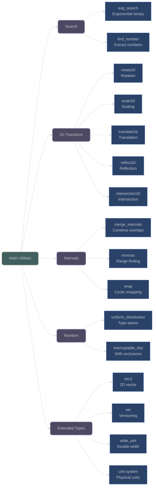

# Search, Transformation, and Utility Functions

## Overview

XIEITE provides advanced search algorithms, 2D geometric transformations, interval operations, random distributions, and comprehensive utility types including physical units, versioning, and extended integer types.

## Search and Optimization

### Exponential Search

**`xieite::exp_search(cond, min, max)`** - Exponential binary search:
```cpp
template<xieite::is_arith Arith, xieite::is_invoc<bool(Arith)> Fn>
[[nodiscard]] constexpr Arith exp_search(Fn&& cond, Arith min, std::type_identity_t<Arith> max);

// Automatic bounds detection
template<xieite::is_arith Arith, xieite::is_invoc<bool(Arith)> Fn>
[[nodiscard]] constexpr Arith exp_search(Fn&& cond);
```

Combines exponential and binary search for efficient boundary finding:

```cpp
// Find first power of 2 greater than 1000
auto power = xieite::exp_search([](int x) {
    return x > 1000;
}, 1, INT_MAX);  // Returns 1024

// Auto-detect bounds
auto value = xieite::exp_search([](double x) {
    return x * x > 100.0;
});  // Automatically finds search range
```

### Number Finding

**`xieite::find_number(str, radix, config)`** - Extract numbers from text:
```cpp
template<xieite::is_arith Arith>
[[nodiscard]] constexpr std::string_view find_number(
    std::string_view str,
    std::conditional_t<std::floating_point<Arith>, xieite::ssize_t, Arith> radix = 10,
    const xieite::number_str_config& config = {}
);
```

```cpp
// Extract numbers from text
std::string text = "Price: $42.99 (was $59.99)";
auto price = xieite::find_number<double>(text);  // "42.99"

// Find hexadecimal numbers
std::string hex_text = "Address: 0xDEADBEEF";
auto addr = xieite::find_number<int>(hex_text, 16);  // "DEADBEEF"
```

## 2D Geometric Transformations

### Rotation

**`xieite::rotate2d(object, angle, pivot)`** - Rotate 2D objects:
```cpp
template<typename Arith = double>
[[nodiscard]] constexpr xieite::point2d<Arith> rotate2d(
    xieite::point2d<Arith> point,
    std::common_type_t<Arith, double> angle,
    xieite::point2d<Arith> pivot = {}
);
```

Uses standard rotation matrix:

---
```math
x' = cos(θ) × (x - pivot.x) - sin(θ) × (y - pivot.y) + pivot.x
```
```math
y' = sin(θ) × (x - pivot.x) + cos(θ) × (y - pivot.y) + pivot.y
```
---

```cpp
// Rotate point 90 degrees around origin
xieite::point2d point{1.0, 0.0};
auto rotated = xieite::rotate2d(point, xieite::pi<> / 2);  // {0.0, 1.0}

// Rotate around custom pivot
xieite::point2d pivot{5.0, 5.0};
auto rotated_pivot = xieite::rotate2d(point, xieite::pi<> / 4, pivot);

// Rotate entire polygon
xieite::polygon2d<> poly{{{0, 0}, {1, 0}, {1, 1}, {0, 1}}};
auto rotated_poly = xieite::rotate2d(poly, 0.5);
```

### Scaling

**`xieite::scale2d(object, factor, origin)`** - Scale 2D objects:
```cpp
template<typename Arith = double>
[[nodiscard]] constexpr xieite::point2d<Arith> scale2d(
    xieite::point2d<Arith> point,
    std::common_type_t<Arith, double> scale,
    xieite::point2d<Arith> origin = {}
);
```

```cpp
// Double size from origin
xieite::point2d point{3.0, 4.0};
auto scaled = xieite::scale2d(point, 2.0);  // {6.0, 8.0}

// Scale from custom origin
auto scaled_custom = xieite::scale2d(point, 0.5, {10.0, 10.0});
```

### Translation

**`xieite::translate2d(object, offset)`** - Move 2D objects:
```cpp
template<typename Arith = double>
[[nodiscard]] constexpr xieite::point2d<Arith> translate2d(
    xieite::point2d<Arith> point,
    xieite::point2d<Arith> diff
);
```

```cpp
// Move point by offset
xieite::point2d point{5.0, 3.0};
xieite::point2d offset{2.0, -1.0};
auto moved = xieite::translate2d(point, offset);  // {7.0, 2.0}
```

### Reflection

**`xieite::reflect2d(object, mirror)`** - Reflect across line:
```cpp
template<typename Arith = double, xieite::is_linear2d<Arith> Line>
[[nodiscard]] constexpr xieite::point2d<Arith> reflect2d(
    xieite::point2d<Arith> point,
    const Line& mirror
);
```

```cpp
// Reflect across y-axis (vertical line at x=0)
xieite::point2d point{3.0, 4.0};
xieite::line2d<> y_axis{{0, 0}, {0, 1}};
auto reflected = xieite::reflect2d(point, y_axis);  // {-3.0, 4.0}
```

### Intersection Detection

**`xieite::intersection2d(...)`** - Find 2D intersections:
```cpp
template<typename Arith = double, xieite::is_linear2d<Arith> Line0, xieite::is_linear2d<Arith> Line1>
[[nodiscard]] constexpr std::vector<xieite::point2d<Arith>> intersection2d(
    const Line0& line0,
    const Line1& line1
);
```

```cpp
// Find line intersection
xieite::line2d<> line1{{0, 0}, {1, 1}};
xieite::line2d<> line2{{0, 1}, {1, 0}};
auto points = xieite::intersection2d(line1, line2);  // [{0.5, 0.5}]

// Check polygon intersections
xieite::polygon2d<> poly1{{{0, 0}, {2, 0}, {2, 2}, {0, 2}}};
xieite::polygon2d<> poly2{{{1, 1}, {3, 1}, {3, 3}, {1, 3}}};
auto intersections = xieite::intersection2d(poly1, poly2);
```

## Interval and Range Operations

### Interval Merging

**`xieite::merge_intervals(intervals)`** - Merge overlapping intervals:
```cpp
template<xieite::is_arith Arith, std::ranges::input_range Range>
[[nodiscard]] constexpr std::vector<xieite::interval<Arith>> merge_intervals(Range&& intervals);
```

```cpp
std::vector<xieite::interval<int>> intervals{
    {1, 3}, {2, 5}, {7, 10}, {8, 12}
};
auto merged = xieite::merge_intervals(intervals);
// Result: [{1, 5}, {7, 12}]
```

### MinMax Operations

**`xieite::minmax(...)`** - Find min and max values:
```cpp
[[nodiscard]] constexpr auto minmax(xieite::is_arith auto first, xieite::is_arith auto... rest);
```

**`xieite::minmax_magnitude(...)`** - MinMax by magnitude:
```cpp
[[nodiscard]] constexpr auto minmax_magnitude(xieite::is_arith auto first, xieite::is_arith auto... rest);
```

```cpp
auto range = xieite::minmax(5, -3, 8, 1, -7);  // interval{-7, 8}
auto mag_range = xieite::minmax_magnitude(-10, 3, -5, 8);  // interval{3, -10}
```

### Value Wrapping

**`xieite::wrap(x, min, max)`** - Wrap value in range:
```cpp
template<xieite::is_arith Arith>
[[nodiscard]] constexpr Arith wrap(Arith x, Arith limit0, Arith limit1);
```

```cpp
// Wrap angle to [0, 360)
double angle = 450.0;
auto wrapped = xieite::wrap(angle, 0.0, 360.0);  // 90.0

// Wrap to [-180, 180]
auto wrapped2 = xieite::wrap(angle, -180.0, 180.0);  // 90.0
```

## Random Number Generation

### Uniform Distribution Selection

**`xieite::uniform_distribution<T>`** - Type-aware distribution:
```cpp
template<xieite::is_arith Arith>
using uniform_distribution = /* appropriate distribution for type */;
```

Automatically selects:
- `std::uniform_real_distribution` for floating-point
- `std::uniform_int_distribution` for integers
- `std::bernoulli_distribution` for bool

### Interruptable Distribution

**`xieite::uniform_interruptable_distribution`** - Distribution with exclusions:
```cpp
template<xieite::is_arith Arith>
struct uniform_interruptable_distribution {
    template<std::ranges::input_range Range>
    uniform_interruptable_distribution(xieite::interval<Arith> interval, Range&& interruptions);

    template<std::uniform_random_bit_generator Generator>
    Arith operator()(Generator& generator);
};
```

```cpp
// Generate random numbers excluding certain ranges
xieite::interval<int> range{1, 100};
std::vector<xieite::interval<int>> exclude{{20, 30}, {70, 80}};

xieite::uniform_interruptable_distribution<int> dist(range, exclude);
std::mt19937 gen;
auto value = dist(gen);  // Never returns 20-30 or 70-80
```

## Extended Types

### 2D Vector

**`xieite::vec2<Arith>`** - Complete 2D vector:
```cpp
template<xieite::is_arith Arith>
struct vec2 {
    Arith x, y;

    // Full arithmetic operators: +, -, *, /, %
    // Component-wise and scalar operations
};
```

```cpp
xieite::vec2<double> v1{3.0, 4.0};
xieite::vec2<double> v2{1.0, 2.0};

auto sum = v1 + v2;        // {4.0, 6.0}
auto scaled = v1 * 2.0;    // {6.0, 8.0}
auto component = v1 * v2;  // {3.0, 8.0}
```

### Version Management

**`xieite::ver`** - Semantic versioning:
```cpp
struct ver {
    std::size_t major, minor, patch;
    std::string label;

    [[nodiscard]] constexpr std::strong_ordering operator<=>(const ver& other) const;
    [[nodiscard]] constexpr std::string str() const;
};
```

```cpp
xieite::ver current{1, 2, 3, "beta"};
xieite::ver required{1, 0, 0};

if (current >= required) {
    // Version check passed
}

std::string version_str = current.str();  // "v1.2.3-beta"
```

### Wide Unsigned Integer

**`xieite::wide_uint<UInt>`** - Double-width unsigned:
```cpp
template<std::unsigned_integral UInt>
struct wide_uint {
    UInt lo, hi;

    // Complete arithmetic and bitwise operations
};
```

```cpp
// 128-bit from two 64-bit values
xieite::wide_uint<std::uint64_t> big{0xFFFFFFFFFFFFFFFF, 0x1};

// Arithmetic operations
auto doubled = big * xieite::wide_uint<std::uint64_t>{2};
auto shifted = big << 16;
```

## Physical Units System

**`xieite::unit`** - Comprehensive unit conversions:
```cpp
namespace xieite::unit {
    // Metric lengths with all SI prefixes
    using qm = base_unit<"qm", /* conversion factors */>;  // quectometer (10^-30)
    using m = base_unit<"m">;                               // meter
    using Qm = base_unit<"Qm", /* conversion factors */>;   // quettameter (10^30)

    // Imperial/US units
    using in = base_unit<"in", /* inch conversions */>;
    using ft = base_unit<"ft", /* foot conversions */>;
    using mi = base_unit<"mi", /* mile conversions */>;

    // Temperature with proper conversions
    using K = base_unit<"K">;   // Kelvin
    using C = base_unit<"C", /* C to K */, /* K to C */>;
    using F = base_unit<"F", /* F to K */, /* K to F */>;
}
```

```cpp
// Automatic unit conversions
xieite::unit::m distance{100};
xieite::unit::km km_distance = distance;  // 0.1 km

xieite::unit::C celsius{25};
xieite::unit::F fahrenheit = celsius;  // 77°F

// Complex conversions
xieite::unit::mi miles{1};
xieite::unit::m meters = miles;  // 1609.344 m
```

## Utility Functions

### Duration Casting

**`xieite::duration_cast<...>(duration)`** - Multi-target cast:
```cpp
template<xieite::is_duration... Durations>
[[nodiscard]] constexpr std::tuple<Durations...> duration_cast(xieite::is_duration auto duration);
```

```cpp
auto duration = std::chrono::seconds{7265};
auto [hours, mins, secs] = xieite::duration_cast<
    std::chrono::hours,
    std::chrono::minutes,
    std::chrono::seconds
>(duration);  // {2h, 1min, 5s}
```

### Number Reversal

**`xieite::reverse_number(x, radix)`** - Reverse digits:
```cpp
template<std::integral Int>
[[nodiscard]] constexpr Int reverse_number(Int x, Int radix = 10);
```

```cpp
auto reversed = xieite::reverse_number(12345);     // 54321
auto rev_hex = xieite::reverse_number(0xABC, 16);  // 0xCBA
```

### XOR Shift

**`xieite::xor_shift(x, bits)`** - XOR shift operation:
```cpp
template<std::integral Int>
[[nodiscard]] constexpr Int xor_shift(Int x, std::size_t bits);
```

Common in hash functions and PRNGs:
```cpp
std::uint32_t hash = value;
hash = xieite::xor_shift(hash, 13);
hash = xieite::xor_shift(hash, 17);
hash = xieite::xor_shift(hash, 5);
```

## Architecture Diagram



## Performance and Best Practices

1. **Use Compile-Time When Possible**: Most functions are constexpr
2. **Leverage Type Safety**: Units prevent mixing incompatible values
3. **Choose Appropriate Precision**: Use `vec2<float>` for graphics, `vec2<double>` for science
4. **Batch Transformations**: Combine multiple 2D operations when possible
5. **Profile Random Distributions**: Interruptable distributions have overhead

---

*Next: Category Overview - [Math Module Summary](index.md)*
