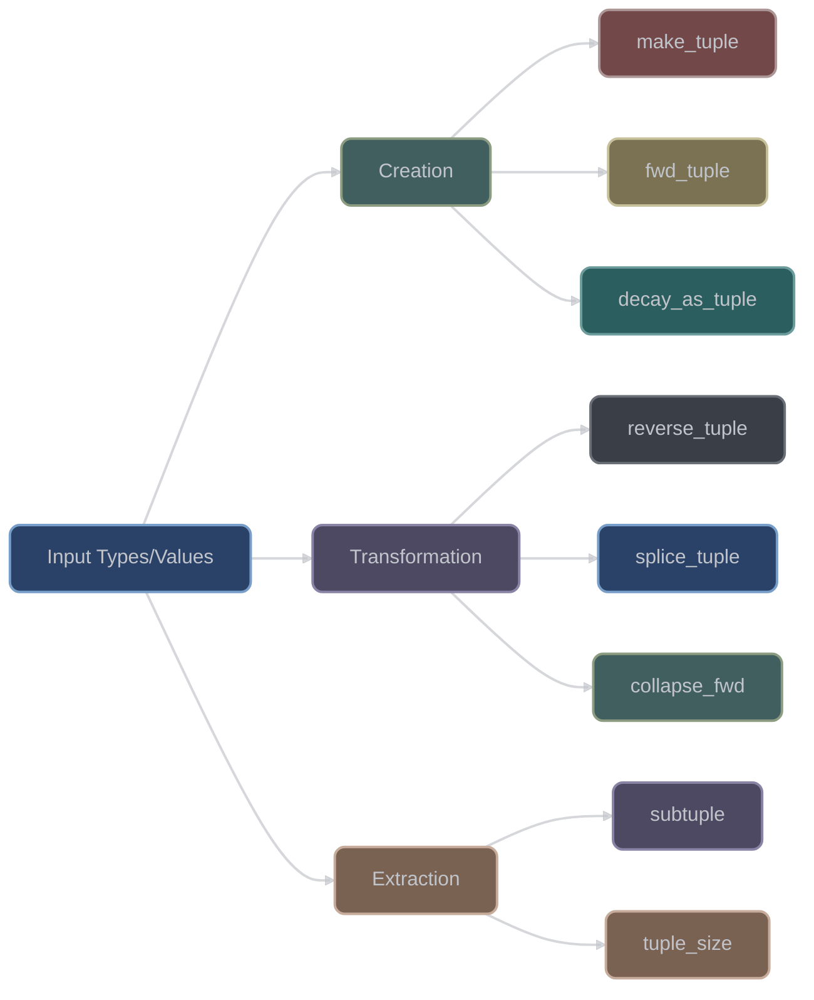
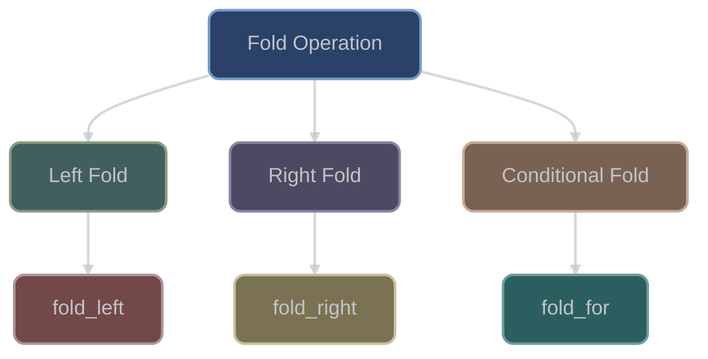

# Template Metaprogramming Utilities (`meta/`)

The `meta/` category provides advanced template metaprogramming utilities for compile-time computation. With 28 headers, it offers sequence generation, tuple manipulation, type introspection, and compile-time state management.

## Overview

```mermaid
---
config:
    theme: 'base'
    curve: 'straight'
    themeVariables:
        darkMode: true
        clusterBkg: '#22272f62'
        clusterBorder: '#6a6f77ff'
        clusterTextColor: '#6a6f77ff'
        lineColor: '#C1C4CAAA'
        background: '#262B33'
        primaryColor: '#2b4268ff'
        primaryTextColor: '#C1C4CAff'
        primaryBorderColor: '#6a6f77ff'
        primaryLabelBkg: '#262B33'
        secondaryColor: '#425f5fff'
        secondaryBorderColor: '#8c9c81ff'
        secondaryTextColor: '#C1C4CAff'
        tertiaryColor: '#4d4962ff'
        tertiaryBorderColor: '#8983a5ff'
        tertiaryTextColor: '#eeeeee55'
        nodeTextColor: '#C1C4CA'
        defaultLinkColor: '#C1C4CA'
        edgeLabelBackground: '#262B33'
        edgeLabelBorderColor: '#C1C4CA'
        labelTextColor: '#C1C4CA'
        errorBkgColor: '#724848ff'
        errorTextColor: '#C1C4CA'
---
graph LR
    Meta[meta/]

    Meta --> Seq[Sequences]
    Meta --> Tuple[Tuple Operations]
    Meta --> Type[Type Utilities]
    Meta --> Compile[Compile-Time]
    Meta --> Fold[Fold Operations]

    Seq --> make_seq[make_seq.hpp]
    Seq --> seq[seq.hpp]
    Seq --> seq_for[seq_for.hpp]

    Tuple --> make_tuple[make_tuple.hpp]
    Tuple --> reverse_tuple[reverse_tuple.hpp]
    Tuple --> subtuple[subtuple.hpp]
    Tuple --> splice_tuple[splice_tuple.hpp]
    Tuple --> fwd_tuple[fwd_tuple.hpp]

    Type --> type_list[type_list.hpp]
    Type --> type_id[type_id.hpp]
    Type --> type_name[type_name.hpp]
    Type --> type_counter[type_counter.hpp]

    Compile --> make_cxpr[make_cxpr.hpp]
    Compile --> state[state.hpp]
    Compile --> enum_size[enum_size.hpp]

    Fold --> fold[fold.hpp]
    Fold --> fold_for[fold_for.hpp]
    Fold --> any[any.hpp]

linkStyle default stroke:#C1C4CAaa,stroke-width:2px,color:#C1C4CAaa

style Meta fill:#2b4268ff,stroke:#779DC9ff,stroke-width:2px,color:#C1C4CA,rx:8,ry:8
style Seq fill:#425f5fff,stroke:#8c9c81ff,stroke-width:2px,color:#C1C4CA,rx:8,ry:8
style Tuple fill:#4d4962ff,stroke:#8983a5ff,stroke-width:2px,color:#C1C4CA,rx:8,ry:8
style Type fill:#7a6253ff,stroke:#c7ac9bff,stroke-width:2px,color:#C1C4CA,rx:8,ry:8
style Compile fill:#724848ff,stroke:#ac9696ff,stroke-width:2px,color:#C1C4CA,rx:8,ry:8
style Fold fill:#7a7253ff,stroke:#c7c19bff,stroke-width:2px,color:#C1C4CA,rx:8,ry:8
style make_seq fill:#2b5f5fff,stroke:#6d9c9cff,stroke-width:2px,color:#C1C4CA,rx:8,ry:8
style seq fill:#3a3f47ff,stroke:#6a6f77ff,stroke-width:2px,color:#C1C4CA,rx:8,ry:8
style seq_for fill:#2b4268ff,stroke:#779DC9ff,stroke-width:2px,color:#C1C4CA,rx:8,ry:8
style make_tuple fill:#425f5fff,stroke:#8c9c81ff,stroke-width:2px,color:#C1C4CA,rx:8,ry:8
style reverse_tuple fill:#4d4962ff,stroke:#8983a5ff,stroke-width:2px,color:#C1C4CA,rx:8,ry:8
style subtuple fill:#7a6253ff,stroke:#c7ac9bff,stroke-width:2px,color:#C1C4CA,rx:8,ry:8
style splice_tuple fill:#724848ff,stroke:#ac9696ff,stroke-width:2px,color:#C1C4CA,rx:8,ry:8
style fwd_tuple fill:#7a7253ff,stroke:#c7c19bff,stroke-width:2px,color:#C1C4CA,rx:8,ry:8
style type_list fill:#2b5f5fff,stroke:#6d9c9cff,stroke-width:2px,color:#C1C4CA,rx:8,ry:8
style type_id fill:#3a3f47ff,stroke:#6a6f77ff,stroke-width:2px,color:#C1C4CA,rx:8,ry:8
style type_name fill:#2b4268ff,stroke:#779DC9ff,stroke-width:2px,color:#C1C4CA,rx:8,ry:8
style type_counter fill:#425f5fff,stroke:#8c9c81ff,stroke-width:2px,color:#C1C4CA,rx:8,ry:8
style make_cxpr fill:#4d4962ff,stroke:#8983a5ff,stroke-width:2px,color:#C1C4CA,rx:8,ry:8
style state fill:#7a6253ff,stroke:#c7ac9bff,stroke-width:2px,color:#C1C4CA,rx:8,ry:8
style enum_size fill:#724848ff,stroke:#ac9696ff,stroke-width:2px,color:#C1C4CA,rx:8,ry:8
style fold fill:#7a7253ff,stroke:#c7c19bff,stroke-width:2px,color:#C1C4CA,rx:8,ry:8
style fold_for fill:#2b5f5fff,stroke:#6d9c9cff,stroke-width:2px,color:#C1C4CA,rx:8,ry:8
style any fill:#3a3f47ff,stroke:#6a6f77ff,stroke-width:2px,color:#C1C4CA,rx:8,ry:8
```



## Integer Sequences

### Core Sequence Types

#### `seq<i...>`
Integer sequence container:
```cpp
#include <xieite/meta/seq.hpp>

// Define a sequence
using my_seq = xieite::seq<0, 1, 2, 3, 4>;

// All elements must be same type
using indices = xieite::seq<0, 1, 2>;  // OK
// xieite::seq<0, 1u, 2>;  // Error: mixed types
```

#### `make_seq<N>`
Generate integer sequence:
```cpp
#include <xieite/meta/make_seq.hpp>

// Generate sequence [0, N)
constexpr auto seq5 = xieite::make_seq<5>;
// seq5 is xieite::seq<0, 1, 2, 3, 4>

// Use in parameter pack expansion
template<std::size_t N>
void process() {
    []<auto... i>(xieite::seq<i...>) {
        ((std::cout << i << " "), ...);
    }(xieite::make_seq<N>);
}
```

#### `seq_for<Start, End>`
Range-based sequence generation:
```cpp
#include <xieite/meta/seq_for.hpp>

// Generate sequence [Start, End)
constexpr auto range = xieite::seq_for<3, 7>;
// range is xieite::seq<3, 4, 5, 6>

// Custom step
constexpr auto evens = xieite::seq_for<0, 10, 2>;
// evens is xieite::seq<0, 2, 4, 6, 8>
```

## Tuple Manipulation

### Tuple Creation and Transformation



#### Making Tuples
```cpp
#include <xieite/meta/make_tuple.hpp>
#include <xieite/meta/fwd_tuple.hpp>

// Create tuple with perfect forwarding
template<typename... Args>
auto create_tuple(Args&&... args) {
    return xieite::make_tuple(std::forward<Args>(args)...);
}

// Forward as tuple preserving value category
template<typename... Args>
auto forward_as_tuple(Args&&... args) {
    return xieite::fwd_tuple(std::forward<Args>(args)...);
}
```

#### Reversing Tuples
```cpp
#include <xieite/meta/reverse_tuple.hpp>

auto original = std::make_tuple(1, 2.0, "three");
auto reversed = xieite::reverse_tuple(original);
// reversed is tuple<const char*, double, int>("three", 2.0, 1)
```

#### Extracting Subtuples
```cpp
#include <xieite/meta/subtuple.hpp>

auto tuple = std::make_tuple(1, 2, 3, 4, 5);
auto sub = xieite::subtuple<1, 3>(tuple);
// sub is tuple<int, int, int>(2, 3, 4)
```

#### Splicing Tuples
```cpp
#include <xieite/meta/splice_tuple.hpp>

auto t1 = std::make_tuple(1, 2);
auto t2 = std::make_tuple(3.0, 4.0);
auto spliced = xieite::splice_tuple(t1, t2);
// spliced is tuple<int, int, double, double>(1, 2, 3.0, 4.0)
```

## Type List Operations

### Type List Container

```cpp
#include <xieite/meta/type_list.hpp>

// Define a type list
using types = xieite::type_list<int, double, std::string>;

// Query properties
constexpr std::size_t count = types::size;  // 3

// Check if all types satisfy condition
constexpr bool all_arithmetic = types::all<std::is_arithmetic>;  // false

// Check if any type satisfies condition
constexpr bool has_integral = types::any<std::is_integral>;  // true

// Check if list contains type
constexpr bool has_string = types::has<std::string>;  // true
```

### Type List Algorithms

```cpp
#include <xieite/meta/type_list.hpp>

// Filter types
template<typename List>
using integral_types = typename List::template filter<std::is_integral>;

// Map transformation
template<typename List>
using pointer_types = typename List::template map<std::add_pointer>;

// Find first matching type
template<typename List>
using first_integral = typename List::template find<std::is_integral>;
```

## Type Introspection

### Type Identification

```cpp
#include <xieite/meta/type_id.hpp>
#include <xieite/meta/type_name.hpp>

// Get unique type ID
constexpr auto int_id = xieite::type_id<int>;
constexpr auto double_id = xieite::type_id<double>;
static_assert(int_id != double_id);

// Get human-readable type name
constexpr auto name = xieite::type_name<std::vector<int>>();
// name might be "std::vector<int>" (compiler-dependent)
```

### Type Counter

```cpp
#include <xieite/meta/type_counter.hpp>

// Stateful metaprogramming counter
template<typename Tag>
struct counter {
    static constexpr std::size_t next() {
        return xieite::type_counter<Tag>::next();
    }
};

constexpr auto a = counter<struct A>::next();  // 0
constexpr auto b = counter<struct A>::next();  // 1
constexpr auto c = counter<struct B>::next();  // 0
```

## Fold Operations

### Basic Fold



```cpp
#include <xieite/meta/fold.hpp>

// Fold over parameter pack
template<typename... Types>
constexpr std::size_t total_size = xieite::fold(
    [](std::size_t acc, auto type) {
        return acc + sizeof(type);
    },
    0,
    xieite::type_list<Types...>{}
);

// Usage
constexpr auto size = total_size<int, double, char>;  // 13 (typically)
```

### Conditional Fold

```cpp
#include <xieite/meta/fold_for.hpp>

// Fold with early termination
template<typename... Types>
constexpr std::size_t count_until_float = xieite::fold_for(
    [](std::size_t acc, auto type) {
        if constexpr (std::is_same_v<decltype(type), float>) {
            return xieite::end(acc);  // Stop folding
        }
        return acc + 1;
    },
    0,
    xieite::type_list<Types...>{}
);
```

## Compile-Time Utilities

### Making Constexpr

```cpp
#include <xieite/meta/make_cxpr.hpp>

// Force compile-time evaluation
template<int N>
constexpr auto factorial = xieite::make_cxpr([] {
    int result = 1;
    for (int i = 2; i <= N; ++i) {
        result *= i;
    }
    return result;
});

constexpr int fact5 = factorial<5>;  // 120
```

### Compile-Time State

```cpp
#include <xieite/meta/state.hpp>

// Stateful metaprogramming
template<typename Tag, int Initial = 0>
struct state {
    static constexpr int value = xieite::state<Tag, Initial>::value;

    static constexpr void set(int new_value) {
        xieite::state<Tag, Initial>::set(new_value);
    }
};

// Usage (compile-time mutable state)
constexpr auto v1 = state<struct MyTag>::value;  // 0
state<struct MyTag>::set(42);
constexpr auto v2 = state<struct MyTag>::value;  // 42
```

### Enum Size Detection

```cpp
#include <xieite/meta/enum_size.hpp>

enum class Color { Red, Green, Blue };

// Automatically detect enum size
constexpr std::size_t color_count = xieite::enum_size<Color>;  // 3

// Works with non-contiguous enums
enum class Status {
    OK = 0,
    Warning = 10,
    Error = 20
};
constexpr std::size_t status_count = xieite::enum_size<Status>;  // 3
```

## Advanced Features

### Perfect Forwarding Utilities

```cpp
#include <xieite/meta/collapse_fwd.hpp>
#include <xieite/meta/collapse_fwd_as_tuple.hpp>

// Collapse and forward arguments
template<typename... Args>
auto process(Args&&... args) {
    // Forward all args, collapsing nested tuples
    return xieite::collapse_fwd(
        [](auto&&... values) {
            return (... + values);
        },
        std::forward<Args>(args)...
    );
}

// Forward as flattened tuple
auto flat = xieite::collapse_fwd_as_tuple(
    std::make_tuple(1, 2),
    3,
    std::make_tuple(4, 5)
);  // tuple<int, int, int, int, int>(1, 2, 3, 4, 5)
```

### Decay Utilities

```cpp
#include <xieite/meta/decay_as_tuple.hpp>

// Decay all types and create tuple
template<typename... Args>
auto decay_all(Args&&... args) {
    return xieite::decay_as_tuple(std::forward<Args>(args)...);
}

int& ref = value;
const int& cref = value;
auto decayed = decay_all(ref, cref, 42);
// All elements are decayed to int
```

### Parenthesis Utilities

```cpp
#include <xieite/meta/paren.hpp>

// Handle types that require parentheses
using func_ptr = xieite::paren<void(int, double)>;
// Allows: func_ptr* ptr; instead of void(*ptr)(int, double);

template<typename T>
using array_10 = xieite::paren<T[10]>;
// Allows: array_10<int>* ptr; instead of int(*ptr)[10];
```

### Function Arity Detection

```cpp
#include <xieite/meta/arity.hpp>

// Get function parameter count
constexpr std::size_t lambda_arity = xieite::arity<
    decltype([](int, double, char) {})
>;  // 3

void func(int a, int b);
constexpr std::size_t func_arity = xieite::arity<decltype(func)>;  // 2
```

### Name Demangling

```cpp
#include <xieite/meta/demangle.hpp>

// Get demangled type name (runtime)
std::string name = xieite::demangle(typeid(std::vector<int>).name());
// Returns human-readable "std::vector<int>"
```

### Value Identification

```cpp
#include <xieite/meta/value_id.hpp>
#include <xieite/meta/value_name.hpp>

// Get unique ID for compile-time value
constexpr auto id_42 = xieite::value_id<42>;
constexpr auto id_43 = xieite::value_id<43>;
static_assert(id_42 != id_43);

// Get string representation of value
constexpr auto name = xieite::value_name<42>();  // "42"
```

## Design Patterns

### Recursive Template Instantiation

```cpp
// Using fold for recursive operations
template<typename... Types>
struct max_size {
    static constexpr std::size_t value = xieite::fold(
        [](std::size_t acc, auto type_wrapper) {
            using T = typename decltype(type_wrapper)::type;
            return std::max(acc, sizeof(T));
        },
        0,
        xieite::type_list<Types...>{}
    );
};
```

### Compile-Time Lookup Tables

```cpp
// Generate lookup table at compile-time
template<std::size_t N>
constexpr auto make_sqrt_table = xieite::make_cxpr([] {
    std::array<double, N> table{};
    for (std::size_t i = 0; i < N; ++i) {
        table[i] = std::sqrt(static_cast<double>(i));
    }
    return table;
});

constexpr auto sqrt_table = make_sqrt_table<100>;
```

## Performance Characteristics

- **Zero runtime cost**: All operations happen at compile-time
- **Increased compile time**: Complex metaprograms may slow compilation
- **Binary size**: Can increase due to template instantiations
- **Memory efficiency**: No runtime memory allocation
- **Type safety**: Compile-time type checking

## Design Philosophy

The meta/ category follows these principles:

1. **Compile-time computation**: Maximize work done at compile-time
2. **Type safety**: Strong typing with no runtime checks
3. **Zero overhead**: No runtime cost for abstractions
4. **Composability**: Small utilities that combine well
5. **Standard compatibility**: Works with STL metaprogramming

## See Also

- [Type Traits](../trait/README.md) - Type introspection and concepts
- [Preprocessor](../pp/README.md) - Macro-based metaprogramming
- [Functional Utilities](../fn/README.md) - Higher-order functions
- [Data Structures](../data/README.md) - Compile-time containers
