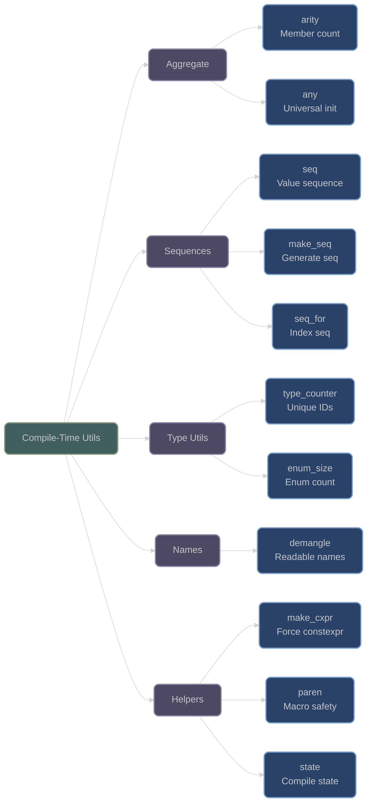

# Compile-Time Utilities

## Overview

XIEITE provides utilities for compile-time computation, including aggregate inspection, sequence generation, type counting, and name demangling. These utilities enable powerful compile-time introspection and code generation.

## Aggregate Inspection

### arity

**`xieite::arity<T>`** - Determine number of aggregate members:
```cpp
template<typename T>
constexpr std::size_t arity = /* member count */;
```

This utility uses sophisticated compile-time techniques to determine the number of members in an aggregate or tuple-like type:

```cpp
// Simple aggregate
struct Point {
    double x;
    double y;
};
static_assert(xieite::arity<Point> == 2);

// Nested aggregate
struct Color { uint8_t r, g, b; };
struct Pixel {
    Point position;
    Color color;
    float alpha;
};
static_assert(xieite::arity<Pixel> == 3);

// Works with arrays
struct Data {
    int values[10];
    char name[32];
};
static_assert(xieite::arity<Data> == 2);

// Tuple-like types
static_assert(xieite::arity<std::tuple<int, double, char>> == 3);
static_assert(xieite::arity<std::pair<int, double>> == 2);
static_assert(xieite::arity<std::array<int, 5>> == 5);
```

### any

**`xieite::any`** - Universal aggregate initializer:
```cpp
struct any {
    template<typename T>
    constexpr operator T() const noexcept;
};
```

Used internally for aggregate inspection:

```cpp
// Can initialize any type
struct Widget {
    int id;
    std::string name;
    double value;
};

// Used in aggregate detection
Widget w{xieite::any{}, xieite::any{}, xieite::any{}};

// Enables arity detection algorithm
template<typename T>
constexpr bool is_aggregate_constructible() {
    return requires { T{xieite::any{}}; };
}
```

## Sequence Generation

### seq / make_seq

**`xieite::seq<values...>`** - Value sequence container:
```cpp
template<auto... i>
struct seq {};

template<auto start, auto end, auto step = 1>
using make_seq = /* generated sequence */;
```

```cpp
// Manual sequence
using indices = xieite::seq<0, 1, 2, 3, 4>;

// Generated sequence
using range = xieite::make_seq<0, 10>;  // seq<0,1,2,3,4,5,6,7,8,9>
using evens = xieite::make_seq<0, 10, 2>;  // seq<0,2,4,6,8>
using countdown = xieite::make_seq<10, 0, -1>;  // seq<10,9,8,7,6,5,4,3,2,1>

// Use in template expansion
template<auto... i>
void process_sequence(xieite::seq<i...>) {
    ((std::cout << i << ' '), ...);
}

process_sequence(xieite::make_seq<1, 6>{});  // Prints: 1 2 3 4 5
```

### seq_for

**`xieite::seq_for<N>`** - Generate index sequence:
```cpp
template<std::size_t N>
using seq_for = xieite::seq<0, 1, ..., N-1>;
```

```cpp
// Index sequence generation
using indices = xieite::seq_for<5>;  // seq<0,1,2,3,4>

// Tuple unpacking
template<typename Tuple, auto... i>
void print_tuple_impl(const Tuple& t, xieite::seq<i...>) {
    ((std::cout << std::get<i>(t) << ' '), ...);
}

template<typename... Ts>
void print_tuple(const std::tuple<Ts...>& t) {
    print_tuple_impl(t, xieite::seq_for<sizeof...(Ts)>{});
}
```

## Type Utilities

### type_counter

**`xieite::type_counter`** - Compile-time type counter:
```cpp
template<typename Tag = void>
struct type_counter {
    template<auto id = []{}>
    static constexpr std::size_t next() noexcept;
};
```

Generates unique compile-time IDs:

```cpp
// Generate unique type IDs
struct MyTag {};
using counter = xieite::type_counter<MyTag>;

constexpr auto id1 = counter::next();  // 0
constexpr auto id2 = counter::next();  // 1
constexpr auto id3 = counter::next();  // 2

// Different tags have independent counters
struct OtherTag {};
using other_counter = xieite::type_counter<OtherTag>;
constexpr auto other_id = other_counter::next();  // 0

// Use for compile-time registration
template<typename T>
struct RegisterType {
    static constexpr auto type_id = counter::next();
};
```

### enum_size

**`xieite::enum_size<E>`** - Get enum value count:
```cpp
template<typename Enum>
constexpr std::size_t enum_size = /* number of enum values */;
```

```cpp
enum class Color {
    Red,
    Green, 
    Blue,
    _SIZE_  // Sentinel value
};

// Requires sentinel or max value
static_assert(xieite::enum_size<Color> == 3);

enum class Status : uint8_t {
    Idle = 0,
    Running = 1,
    Paused = 2,
    Stopped = 3,
    Error = 255
};

// Works with sparse enums
constexpr auto status_count = xieite::enum_size<Status>;
```

## Name Utilities

### demangle

**`xieite::demangle(name)`** - Demangle C++ type names:
```cpp
[[nodiscard]] inline std::string demangle(std::string_view name) noexcept;
```

Converts mangled names to human-readable form:

```cpp
// Get demangled type name
const char* mangled = typeid(std::vector<int>).name();
auto readable = xieite::demangle(mangled);
// "std::vector<int, std::allocator<int>>"

// Function signatures
template<typename T>
void debug_type() {
    auto name = xieite::demangle(typeid(T).name());
    std::cout << "Type: " << name << '\n';
}

debug_type<std::map<std::string, int>>();
// Prints: "Type: std::map<std::string, int, ...>"

// Works with complex templates
using complex_t = std::function<void(std::vector<std::unique_ptr<int>>)>;
auto complex_name = xieite::demangle(typeid(complex_t).name());
```

## Compile-Time Helpers

### make_cxpr

**`xieite::make_cxpr`** - Force compile-time evaluation:
```cpp
template<auto value>
inline constexpr auto make_cxpr = value;
```

```cpp
// Force compile-time computation
template<int N>
constexpr int factorial() {
    int result = 1;
    for (int i = 2; i <= N; ++i) {
        result *= i;
    }
    return result;
}

// Ensure compile-time evaluation
constexpr auto fact_10 = xieite::make_cxpr<factorial<10>()>;
static_assert(fact_10 == 3628800);

// Use in template parameters
template<auto Value>
struct Holder {
    static constexpr auto value = Value;
};

using holder = Holder<xieite::make_cxpr<fibonacci(20)>>;
```

### paren

**`xieite::paren`** - Parenthesis wrapper for macro safety:
```cpp
template<typename T>
struct paren {
    T value;
};
```

```cpp
// Protect comma in macros
#define CALL_WITH(func, arg) func(arg)

// Problem: comma is interpreted as macro argument separator
// CALL_WITH(process, std::pair<int, double>{1, 2.0});  // Error!

// Solution: wrap in paren
CALL_WITH(process, xieite::paren{std::pair<int, double>{1, 2.0}});

// Extract value
template<typename T>
void process(xieite::paren<T> p) {
    auto value = p.value;  // Original pair
}
```

### state

**`xieite::state`** - Compile-time state machine:
```cpp
template<typename Tag = void>
struct state {
    template<auto id = []{}>
    static constexpr auto get() noexcept;
    
    template<auto id = []{}, auto value>
    static constexpr void set() noexcept;
};
```

```cpp
// Compile-time mutable state
struct MyState {};
using state = xieite::state<MyState>;

// Set and get state
state::set<[](){}, 42>();
constexpr auto value = state::get<[](){}>();  // 42

// Different IDs for different states
state::set<[](){}, 100>();  // Different lambda, different state

// Use in compile-time algorithms
template<int N>
struct Fibonacci {
    static constexpr int value = [] {
        state::set<[](){}, 1>();  // F(0)
        state::set<[](){}, 1>();  // F(1)
        
        for (int i = 2; i <= N; ++i) {
            auto prev1 = state::get<[](){}>();
            auto prev2 = state::get<[](){}>();
            state::set<[](){}, prev1 + prev2>();
        }
        
        return state::get<[](){}>();
    }();
};
```

## Architecture Diagram



## Performance Considerations

- **Compile-Time Only**: All utilities execute at compile-time
- **Template Depth**: Recursive algorithms may hit compiler limits
- **Instantiation Cost**: Complex metaprograms increase compile time
- **Zero Runtime**: No runtime overhead for any utility

## Best Practices

1. **Use arity for generic aggregate handling**:
   ```cpp
   template<typename T>
   void process_aggregate(const T& obj) {
       constexpr auto size = xieite::arity<T>;
       // Handle based on member count
   }
   ```

2. **Generate sequences for expansion**:
   ```cpp
   template<typename... Ts>
   void expand(xieite::seq<i...>) {
       ((process<i>()), ...);
   }
   ```

3. **Use type_counter for registration**:
   ```cpp
   template<typename T>
   struct Register {
       inline static const auto id = counter::next();
   };
   ```

4. **Leverage demangle for debugging**:
   ```cpp
   template<typename T>
   void debug() {
       std::cerr << xieite::demangle(typeid(T).name()) << '\n';
   }
   ```

---

*Next: [Metaprogramming Module Summary](index.md)*