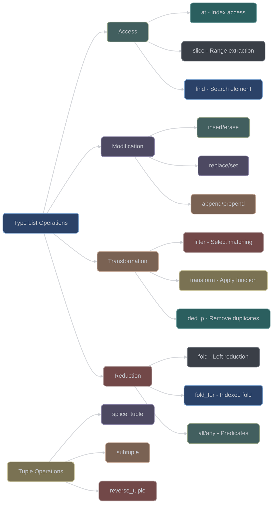

# Type List Operations

## Overview

XIEITE's type list operations provide comprehensive compile-time manipulation capabilities for type lists, tuples, and parameter packs. These operations form the foundation for advanced template metaprogramming and compile-time data structure manipulation.

## Core Operation Categories

### Structural Operations
- **Splice**: Insert/remove/replace elements in type lists and tuples
- **Reverse**: Reverse the order of elements
- **Slice**: Extract subsequences from lists
- **Concatenate**: Join multiple lists or tuples

### Transformation Operations
- **Transform**: Apply metafunctions to elements
- **Filter**: Select elements matching predicates
- **Fold**: Reduce sequences to single values
- **Map**: Transform each element independently

## Type List Manipulation

### Slicing and Splicing
```cpp
// Type list slicing
using types = xieite::type_list<int, double, char, float, bool>;

// Extract subsequence [1, 3)
using middle = types::slice<1, 3>;  // type_list<double, char>

// Extract from index 2 to end
using tail = types::slice<2>;  // type_list<char, float, bool>

// Replace elements [1, 3) with new types
using replaced = types::replace<1, 3, std::string, long>;
// type_list<int, std::string, long, float, bool>
```

### Element Access and Modification
```cpp
// Access by index
using third = types::at<2>;  // char

// Set element at index
using modified = types::set<1, std::string>;
// type_list<int, std::string, char, float, bool>

// Swap elements
using swapped = types::swap<0, 4>;
// type_list<bool, double, char, float, int>

// Swap slices
using slice_swapped = types::swap_slices<0, 2, 3, 5>;
// Swaps [0,2) with [3,5)
```

### Insertion and Removal
```cpp
// Insert elements at position
using inserted = types::insert<2, void*, int*>;
// type_list<int, double, void*, int*, char, float, bool>

// Insert type list at position
using list_inserted = types::insert_range<1,
    xieite::type_list<short, long>>;
// type_list<int, short, long, double, char, float, bool>

// Erase range [1, 3)
using erased = types::erase<1, 3>;
// type_list<int, float, bool>
```

## Tuple Operations

### Tuple Splicing
```cpp
template<std::size_t start, std::size_t end,
         typename Tuple1, typename Tuple2>
auto splice_tuple(Tuple1&& t1, Tuple2&& t2);

// Example usage
auto t1 = std::make_tuple(1, 2.0, 'a', 4, 5);
auto t2 = std::make_tuple("hello", true);

// Replace elements [1, 3) with t2
auto spliced = xieite::splice_tuple<1, 3>(t1, t2);
// tuple<int, const char*, bool, int, int>
// Values: (1, "hello", true, 4, 5)
```

### Subtuple Extraction
```cpp
template<typename Tuple, std::size_t... Indices>
auto subtuple(Tuple&& t);

// Extract specific elements
auto original = std::make_tuple(1, 2.0, 'a', "hello", true);
auto sub = xieite::subtuple<0, 2, 4>(original);
// tuple<int, char, bool> with values (1, 'a', true)
```

### Tuple Reversal
```cpp
template<typename Tuple>
auto reverse_tuple(Tuple&& t);

// Reverse tuple elements
auto original = std::make_tuple(1, 2.0, 'a');
auto reversed = xieite::reverse_tuple(original);
// tuple<char, double, int> with values ('a', 2.0, 1)
```

## Advanced Transformations

### Type List Filtering
```cpp
// Filter based on predicate
template<typename T>
concept integral_type = std::integral<T>;

using numbers = types::filter<integral_type>;
// Keeps only integral types

// Custom predicate
constexpr auto is_pointer = []<typename T> {
    return std::is_pointer_v<T>;
};

using pointers = types::filter<is_pointer>;
```

### Type List Transformation
```cpp
// Transform with metafunction
constexpr auto add_pointer = []<typename... Ts> {
    return xieite::type_list<Ts*...>{};
};

// Single-element transform
using ptr_types = types::transform<1, add_pointer>;
// type_list<int*, double*, char*, float*, bool*>

// Multi-element transform (pairs)
using pairs = types::transform<2, []<typename A, typename B> {
    return xieite::type_id<std::pair<A, B>>{};
}>;
```

### Type List Deduplication
```cpp
// Remove duplicates
using with_dups = xieite::type_list<int, double, int, char, double>;
using unique = with_dups::dedup<>;
// type_list<int, double, char>

// Custom comparison
constexpr auto size_cmp = []<typename A, typename B> {
    return sizeof(A) == sizeof(B);
};

using by_size = with_dups::dedup<size_cmp>;
// Removes types with duplicate sizes
```

## Fold Operations

### Basic Fold
```cpp
// Count specific types
constexpr auto count_integrals = []<typename Acc, typename T> {
    if constexpr (std::integral<T>) {
        return xieite::type_id<
            std::integral_constant<int, Acc::value + 1>
        >{};
    } else {
        return xieite::type_id<Acc>{};
    }
};

using result = xieite::fold<
    count_integrals,
    std::integral_constant<int, 0>,
    int, double, char, float
>;
// result::value = 2 (int and char)
```

### Indexed Fold
```cpp
// Build compile-time map
constexpr auto make_pair = []<typename Map, auto idx> {
    using key = std::integral_constant<std::size_t, idx>;
    using value = types::at<idx>;
    return typename Map::template append<
        std::pair<key, value>
    >{};
};

using indexed_map = xieite::fold_for<
    make_pair,
    xieite::type_list<>,
    types::size
>;
// type_list<pair<0, int>, pair<1, double>, ...>
```

## Functional Operations

### Zip Operations
```cpp
// Zip two type lists
using list1 = xieite::type_list<int, char, bool>;
using list2 = xieite::type_list<float, double, long>;

using zipped = list1::zip<float, double, long>;
// type_list<
//   type_list<int, float>,
//   type_list<char, double>,
//   type_list<bool, long>
// >

// Zip with range
using zipped_range = list1::zip_range<list2>;
```

### Arrangement Operations
```cpp
// Rearrange by indices
using original = xieite::type_list<A, B, C, D, E>;
using rearranged = original::arrange<4, 0, 3, 1, 2>;
// type_list<E, A, D, B, C>

// Repeat sequence
using repeated = types::repeat<3>;
// Repeats the entire type list 3 times
```

### Cartesian Product
```cpp
// Generate all combinations
template<typename List1, typename List2>
struct cartesian_product {
    template<typename A, typename B>
    using pair_t = std::pair<A, B>;

    using type = /* all pairs (A, B) where A ∈ List1, B ∈ List2 */;
};

using colors = xieite::type_list<Red, Green, Blue>;
using sizes = xieite::type_list<Small, Medium, Large>;
using products = cartesian_product<colors, sizes>::type;
// 9 pairs: (Red,Small), (Red,Medium), ... (Blue,Large)
```

## Performance Optimizations

### Lazy Evaluation
```cpp
// Avoid unnecessary instantiations
template<typename List>
struct lazy_operation {
    // Defer computation until needed
    template<bool condition>
    using apply = std::conditional_t<
        condition,
        typename List::template filter<predicate>,
        List
    >;
};
```

### Batch Operations
```cpp
// Combine multiple operations
template<typename List>
using efficient = List
    ::template filter<pred1>
    ::template transform<1, func1>
    ::template dedup<>;

// vs separate operations (less efficient)
template<typename List>
using inefficient = typename typename typename List
    ::template filter<pred1>::type
    ::template transform<1, func1>::type
    ::template dedup<>::type;
```

## Common Patterns

### Type List as Set
```cpp
template<typename List>
struct type_set {
    // Ensure uniqueness
    using types = typename List::template dedup<>;

    // Set operations
    template<typename Other>
    using union_with = typename types
        ::template append_range<Other>
        ::template dedup<>;

    template<typename Other>
    using intersect_with = typename types
        ::template filter<[]<typename T> {
            return Other::template has<T>;
        }>;
};
```

### Type List Sorting
```cpp
// Sort by size
template<typename List>
struct sort_by_size {
    // Implementation using fold to build sorted list
    constexpr auto insert_sorted = []<typename SortedList, typename T> {
        // Find insertion point and insert
        return /* sorted list with T inserted */;
    };

    using type = xieite::fold<insert_sorted,
                              xieite::type_list<>,
                              /* list elements */>;
};
```

## Best Practices

1. **Use appropriate operations** - Choose right abstraction level
2. **Minimize instantiations** - Batch operations when possible
3. **Cache intermediate results** - Avoid recomputation
4. **Document invariants** - Clear preconditions/postconditions
5. **Test edge cases** - Empty lists, single elements

## Common Pitfalls

1. **Index out of bounds** - Check list size before access
2. **Type mismatch in zip** - Ensure equal sizes
3. **Recursive depth limits** - Large lists hit template limits
4. **Order dependencies** - Operations may not commute

## Mermaid Diagram



## See Also

- [Template Manipulation](./templates.md)
- [Compile-Time Sequences](./sequences.md)
- [Metaprogramming API](../../reference/api/meta.md)
- [Type Traits](../trait/README.md)
