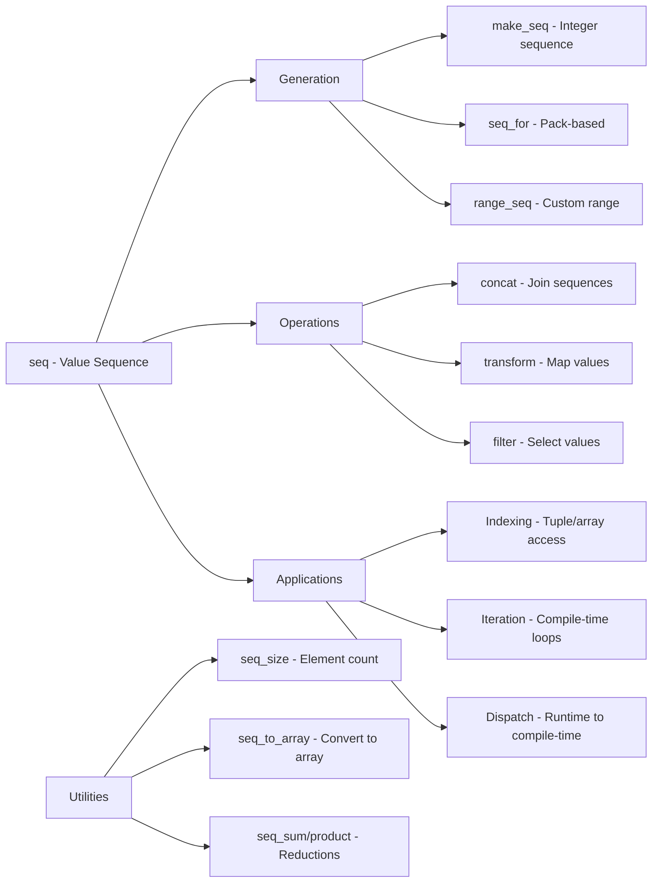

# Compile-Time Sequences

## Overview

XIEITE's compile-time sequence utilities provide powerful tools for generating and manipulating value sequences at compile time. These utilities enable compile-time iteration, index generation, and sequence-based metaprogramming patterns.

## Core Components

### Basic Sequence
```cpp
template<auto... values>
requires(is_same<decltype(values)...>)
struct seq {};
```

### Sequence Generation
```cpp
// Make integer sequence
template<auto count>
constexpr auto make_seq = /* generates seq<0, 1, ..., count-1> */;

// Sequence for parameter pack
template<typename... Ts>
constexpr auto seq_for = make_seq<sizeof...(Ts)>;
```

## Integer Sequences

### Basic Generation
```cpp
// Generate sequence of N integers
auto indices = xieite::make_seq<5>;  // seq<0, 1, 2, 3, 4>

// Generate for parameter pack
template<typename... Args>
void process(Args... args) {
    auto seq = xieite::seq_for<Args...>;  // seq<0, 1, ..., sizeof...(Args)-1>
}
```

### Custom Sequences
```cpp
// Direct sequence construction
using my_seq = xieite::seq<1, 3, 5, 7, 9>;

// Sequence from values
template<int... Values>
using int_seq = xieite::seq<Values...>;

// Character sequence
using char_seq = xieite::seq<'a', 'b', 'c'>;
```

## Sequence Operations

### Sequence Concatenation
```cpp
template<typename Seq1, typename Seq2>
struct concat_seq;

template<auto... v1, auto... v2>
struct concat_seq<xieite::seq<v1...>, xieite::seq<v2...>> {
    using type = xieite::seq<v1..., v2...>;
};

// Usage
using seq1 = xieite::seq<1, 2, 3>;
using seq2 = xieite::seq<4, 5, 6>;
using combined = concat_seq<seq1, seq2>::type;  // seq<1, 2, 3, 4, 5, 6>
```

### Sequence Transformation
```cpp
template<typename Seq, template<auto> class Transform>
struct transform_seq;

template<auto... values, template<auto> class Transform>
struct transform_seq<xieite::seq<values...>, Transform> {
    using type = xieite::seq<Transform<values>::value...>;
};

// Double each value
template<auto N>
struct double_value {
    static constexpr auto value = N * 2;
};

using doubled = transform_seq<
    xieite::seq<1, 2, 3>,
    double_value
>::type;  // seq<2, 4, 6>
```

### Sequence Filtering
```cpp
template<typename Seq, template<auto> class Predicate>
struct filter_seq {
    // Implementation filters values based on predicate
};

// Keep even values
template<auto N>
struct is_even {
    static constexpr bool value = (N % 2) == 0;
};

using evens = filter_seq<
    xieite::seq<1, 2, 3, 4, 5>,
    is_even
>::type;  // seq<2, 4>
```

## Index-Based Operations

### Tuple Indexing
```cpp
template<typename Tuple, typename Seq>
struct select_tuple_elements;

template<typename... Ts, std::size_t... Is>
struct select_tuple_elements<
    std::tuple<Ts...>,
    xieite::seq<Is...>
> {
    using type = std::tuple<
        std::tuple_element_t<Is, std::tuple<Ts...>>...
    >;
};

// Select elements at indices 0, 2, 4
using original = std::tuple<int, char, float, double, bool>;
using selected = select_tuple_elements<
    original,
    xieite::seq<0, 2, 4>
>::type;  // tuple<int, float, bool>
```

### Array Initialization
```cpp
template<typename T, std::size_t N>
constexpr std::array<T, N> make_array(T value) {
    return [value]<std::size_t... Is>(xieite::seq<Is...>) {
        return std::array<T, N>{ ((void)Is, value)... };
    }(xieite::make_seq<N>);
}

// Create array with all elements = 42
constexpr auto arr = make_array<int, 5>(42);
// array{42, 42, 42, 42, 42}
```

### Parameter Pack Expansion
```cpp
template<typename... Args>
void print_with_indices(Args... args) {
    auto print = [](auto value, std::size_t idx) {
        std::cout << idx << ": " << value << '\n';
    };

    [&]<std::size_t... Is>(xieite::seq<Is...>) {
        (print(args, Is), ...);
    }(xieite::seq_for<Args...>);
}

// Usage
print_with_indices("hello", 42, 3.14);
// Output:
// 0: hello
// 1: 42
// 2: 3.14
```

## Compile-Time Loops

### Unrolled Loops
```cpp
template<std::size_t N>
constexpr auto factorial() {
    return []<std::size_t... Is>(xieite::seq<Is...>) {
        std::size_t result = 1;
        ((result *= (Is + 1)), ...);
        return result;
    }(xieite::make_seq<N>);
}

static_assert(factorial<5>() == 120);
```

### Compile-Time Iteration
```cpp
template<std::size_t N, typename Func>
constexpr void for_each_index(Func f) {
    [&]<std::size_t... Is>(xieite::seq<Is...>) {
        (f(std::integral_constant<std::size_t, Is>{}), ...);
    }(xieite::make_seq<N>);
}

// Usage
for_each_index<5>([](auto idx) {
    constexpr std::size_t i = decltype(idx)::value;
    // Process compile-time index
});
```

## Advanced Patterns

### Sequence-Based Dispatch
```cpp
template<std::size_t N>
struct dispatcher {
    template<typename Func>
    static auto dispatch(std::size_t runtime_idx, Func f) {
        return [&]<std::size_t... Is>(xieite::seq<Is...>) {
            using handler_t = void(*)(Func&);
            handler_t handlers[] = {
                [](Func& fn) { fn(std::integral_constant<std::size_t, Is>{}); }...
            };
            if (runtime_idx < N) {
                handlers[runtime_idx](f);
            }
        }(xieite::make_seq<N>);
    }
};

// Convert runtime index to compile-time
dispatcher<10>::dispatch(runtime_idx, [](auto idx) {
    constexpr std::size_t i = decltype(idx)::value;
    // Use compile-time index
});
```

### Cartesian Product
```cpp
template<std::size_t M, std::size_t N>
struct cartesian_product {
    template<typename Func>
    static void apply(Func f) {
        []<std::size_t... Is>(xieite::seq<Is...>) {
            ([]<std::size_t... Js>(xieite::seq<Js...>, auto& func) {
                (func(Is, Js), ...);
            }(xieite::make_seq<N>, f), ...);
        }(xieite::make_seq<M>);
    }
};

// Generate all pairs (i, j) for i < M, j < N
cartesian_product<3, 4>::apply([](auto i, auto j) {
    std::cout << "(" << i << ", " << j << ") ";
});
// Output: (0,0) (0,1) (0,2) (0,3) (1,0) (1,1) ...
```

### Compile-Time Range
```cpp
template<int Start, int End, int Step = 1>
struct range_seq {
private:
    static constexpr std::size_t count = (End - Start + Step - 1) / Step;

    template<std::size_t... Is>
    static auto make(xieite::seq<Is...>) {
        return xieite::seq<(Start + Is * Step)...>{};
    }

public:
    using type = decltype(make(xieite::make_seq<count>));
};

// Generate sequence from 10 to 20 with step 2
using range = range_seq<10, 20, 2>::type;  // seq<10, 12, 14, 16, 18>
```

## Sequence Utilities

### Sequence Size
```cpp
template<typename Seq>
struct seq_size;

template<auto... values>
struct seq_size<xieite::seq<values...>> {
    static constexpr std::size_t value = sizeof...(values);
};

constexpr auto size = seq_size<xieite::seq<1, 2, 3>>::value;  // 3
```

### Sequence to Array
```cpp
template<typename Seq>
struct seq_to_array;

template<auto... values>
struct seq_to_array<xieite::seq<values...>> {
    static constexpr auto array = std::array{values...};
};

constexpr auto arr = seq_to_array<xieite::seq<1, 2, 3>>::array;
```

### Sequence Algorithms
```cpp
// Sum of sequence
template<typename Seq>
struct seq_sum;

template<auto... values>
struct seq_sum<xieite::seq<values...>> {
    static constexpr auto value = (... + values);
};

// Product of sequence
template<typename Seq>
struct seq_product;

template<auto... values>
struct seq_product<xieite::seq<values...>> {
    static constexpr auto value = (... * values);
};

// Usage
constexpr auto sum = seq_sum<xieite::seq<1, 2, 3, 4>>::value;      // 10
constexpr auto prod = seq_product<xieite::seq<2, 3, 4>>::value;     // 24
```

## Performance Considerations

### Instantiation Overhead
```cpp
// Avoid deep recursion
template<std::size_t N>
using bad_seq = /* recursive generation */;  // O(N) instantiations

// Prefer built-in generation
template<std::size_t N>
using good_seq = decltype(xieite::make_seq<N>);  // O(log N) typically
```

### Compile-Time Limits
```cpp
// Be aware of compiler limits
constexpr std::size_t max_seq_size = 10000;  // Typical safe limit

template<std::size_t N>
requires(N <= max_seq_size)
using safe_seq = decltype(xieite::make_seq<N>);
```

## Common Use Cases

### Matrix Operations
```cpp
template<typename T, std::size_t Rows, std::size_t Cols>
class matrix {
    T data[Rows][Cols];

    template<std::size_t... Rs, std::size_t... Cs>
    void init_impl(T value, xieite::seq<Rs...>, xieite::seq<Cs...>) {
        ((data[Rs][Cs] = value, ...), ...);
    }

public:
    void initialize(T value) {
        init_impl(value,
                 xieite::make_seq<Rows>,
                 xieite::make_seq<Cols>);
    }
};
```

### Compile-Time String Processing
```cpp
template<std::size_t N>
struct string_literal {
    char data[N];

    constexpr string_literal(const char (&str)[N]) {
        []<std::size_t... Is>(xieite::seq<Is...>, auto& dst, auto& src) {
            ((dst[Is] = src[Is]), ...);
        }(xieite::make_seq<N>, data, str);
    }
};
```

## Best Practices

1. **Use make_seq for generation** - Optimized by compiler
2. **Prefer seq_for with packs** - Automatic size deduction
3. **Avoid deep recursion** - Use iterative approaches
4. **Cache sequence results** - Reuse generated sequences
5. **Document sequence invariants** - Clear constraints

## Common Pitfalls

1. **Type mismatch in sequences** - All values must have same type
2. **Exceeding template depth** - Large sequences hit limits
3. **Runtime vs compile-time** - Sequences are compile-time only
4. **Pack expansion order** - Evaluation is unspecified

## Mermaid Diagram



## See Also

- [Template Manipulation](./templates.md)
- [Type List Operations](./operations.md)
- [Metaprogramming API](../../reference/api/meta.md)
- [Compile-Time Computation](../../architecture/compile_time.md)
