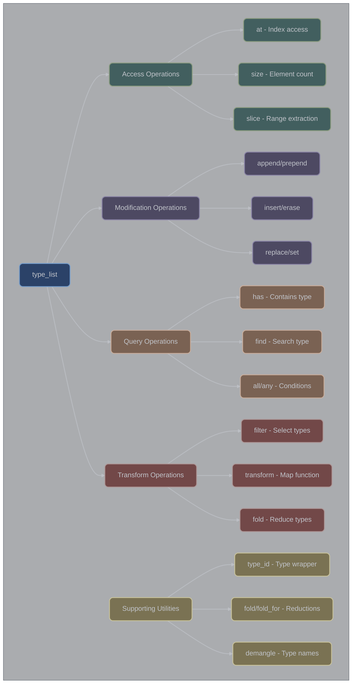

# Template Manipulation

## Overview

XIEITE's template manipulation utilities provide powerful compile-time metaprogramming tools for manipulating types, type lists, and template parameters. These utilities form the foundation for advanced template metaprogramming patterns.

## Core Components

### Type List
The fundamental building block for template manipulation:
```cpp
template<typename... Ts>
struct type_list {
    static constexpr std::size_t size = sizeof...(Ts);

    template<std::size_t idx>
    using at = /* type at index */;

    template<typename... Us>
    using append = type_list<Ts..., Us...>;

    template<auto cond>
    using filter = /* filtered type list */;
};
```

### Type Identity
Type wrapper for metaprogramming:
```cpp
template<typename T>
struct type_id {
    using type = T;
};
```

## Type List Operations

### Basic Access
```cpp
// Create a type list
using types = xieite::type_list<int, double, char, std::string>;

// Access by index
using second = types::at<1>;  // double

// Get size
constexpr auto count = types::size;  // 4

// Check conditions
constexpr bool all_trivial = types::all<std::is_trivial>;
constexpr bool has_string = types::has<std::string>;
```

### Modification Operations
```cpp
// Append types
using extended = types::append<float, long>;

// Prepend types
using prefixed = types::prepend<bool, short>;

// Insert at position
using inserted = types::insert<2, void*>;

// Erase elements
using erased = types::erase<1, 3>;  // Remove indices 1-2

// Replace elements
using replaced = types::replace<1, 2, float, double>;
```

### Advanced Transformations
```cpp
// Filter types
template<typename T>
using is_integral = std::integral<T>;

using integers = types::filter<is_integral>;

// Remove duplicates
using unique = types::dedup<>;

// Reverse order
using reversed = types::reverse<>;

// Slice operations
using middle = types::slice<1, 3>;  // Elements 1-2
```

## Fold Operations

### Left Fold
```cpp
// Fold metafunction
template<auto fn, typename Init, typename... Types>
using fold = /* implementation */;

// Example: Count pointer types
constexpr auto count_ptrs = []<typename Acc, typename T> {
    if constexpr (std::is_pointer_v<T>) {
        return xieite::type_id<std::integral_constant<int, Acc::value + 1>>{};
    } else {
        return xieite::type_id<Acc>{};
    }
};

using result = xieite::fold<count_ptrs,
                           std::integral_constant<int, 0>,
                           int*, double, char*, void*>;
// result::value = 3
```

### Indexed Fold
```cpp
template<auto fn, typename Init, std::size_t count>
using fold_for = /* fold with index */;

// Example: Create tuple of N integers
constexpr auto make_int = []<typename List, auto i> {
    return typename List::template append<
        std::integral_constant<int, i>
    >{};
};

using int_seq = xieite::fold_for<make_int,
                                 xieite::type_list<>,
                                 5>;
// type_list<int_c<0>, int_c<1>, int_c<2>, int_c<3>, int_c<4>>
```

## Template Utilities

### Arity Detection
```cpp
template<typename F>
struct arity {
    static constexpr std::size_t value = /* deduce arity */;
};

// Usage
auto lambda = [](int, double, char) {};
constexpr auto params = xieite::arity<decltype(lambda)>::value;  // 3
```

### Tuple Operations
```cpp
// Forward as tuple
template<typename... Args>
auto fwd_tuple(Args&&... args)
    -> std::tuple<Args&&...>;

// Reverse tuple
template<typename Tuple>
using reverse_tuple = /* reversed tuple type */;

// Subtuple extraction
template<typename Tuple, std::size_t... Indices>
using subtuple = /* tuple with selected elements */;

// Splice tuples
template<typename Tuple1, typename Tuple2>
using splice_tuple = /* concatenated tuple */;
```

### Make Utilities
```cpp
// Make constexpr
template<auto value>
struct make_cxpr {
    static constexpr auto val = value;
};

// Make sequence
template<typename T, T... values>
using make_seq = std::integer_sequence<T, values...>;

// Make tuple
template<typename... Ts>
auto make_tuple(Ts&&... args)
    -> std::tuple<std::decay_t<Ts>...>;
```

## Type Name Utilities

### Demangling
```cpp
template<typename T>
std::string demangle() {
    return /* demangled type name */;
}

// Usage
std::string name = xieite::demangle<std::vector<int>>();
// "std::vector<int, std::allocator<int>>"
```

### Type Names
```cpp
template<typename T>
constexpr std::string_view type_name() noexcept {
    return /* compile-time type name */;
}

template<auto value>
constexpr std::string_view value_name() noexcept {
    return /* compile-time value name */;
}

// Usage
constexpr auto int_name = xieite::type_name<int>();     // "int"
constexpr auto val_name = xieite::value_name<42>();      // "42"
```

## State Management

### Compile-Time State
```cpp
template<typename Tag, typename T = void>
struct state {
    using type = T;

    template<typename U>
    using set = state<Tag, U>;

    template<typename U>
    using get = typename state<Tag, T>::type;
};

// Usage
using initial = xieite::state<struct Counter, int>;
using updated = initial::set<double>;
using value = updated::get<void>;  // double
```

### Type Counter
```cpp
template<typename Tag>
struct type_counter {
    static constexpr std::size_t value = /* current count */;

    static constexpr std::size_t next() {
        return /* increment and return */;
    }
};

// Usage
constexpr auto id1 = xieite::type_counter<void>::next();  // 0
constexpr auto id2 = xieite::type_counter<void>::next();  // 1
```

## Enum Utilities

### Enum Size
```cpp
template<typename Enum>
requires std::is_enum_v<Enum>
struct enum_size {
    static constexpr std::size_t value = /* enum value count */;
};

// Usage
enum class Color { Red, Green, Blue };
constexpr auto colors = xieite::enum_size<Color>::value;  // 3
```

## Advanced Patterns

### Type List Algorithms
```cpp
// Zip type lists
using list1 = xieite::type_list<int, char, bool>;
using list2 = xieite::type_list<float, double, long>;
using zipped = list1::zip<float, double, long>;
// type_list<type_list<int, float>,
//           type_list<char, double>,
//           type_list<bool, long>>

// Transform type list
constexpr auto add_ptr = []<typename... Ts> {
    return xieite::type_list<Ts*...>{};
};
using pointers = types::transform<1, add_ptr>;
// type_list<int*, double*, char*, std::string*>

// Arrange by indices
using reordered = types::arrange<3, 0, 2, 1>;
// type_list<std::string, int, char, double>
```

### Conditional Types
```cpp
// Find type matching condition
template<typename T>
concept arithmetic = std::integral<T> || std::floating_point<T>;

using first_arithmetic = types::find<arithmetic>;  // int

// Find index of type
constexpr auto idx = types::idx_of<double>;  // 1

// Check if satisfies
constexpr bool ok = types::satisfies</* concept */>;
```

### Template Application
```cpp
// Apply types to template
template<typename...>
struct my_template {};

using applied = types::to<my_template>;
// my_template<int, double, char, std::string>

// Convert to function type
using func = types::as_fn<void>;
// void(int, double, char, std::string)
```

## Performance Considerations

### Compile-Time Complexity
```cpp
// O(1) operations
using first = types::at<0>;           // Direct access
constexpr auto sz = types::size;      // Stored value

// O(N) operations
using filtered = types::filter<cond>; // Iterate all
using unique = types::dedup<>;        // Check each

// O(N²) potential
using sorted = /* custom sort */;     // Comparison-based
```

### Instantiation Reduction
```cpp
// Minimize instantiations
template<typename List>
using process = List::template filter<cond1>
                   ::template filter<cond2>;  // Two passes

// Better: Single pass
constexpr auto both_conds = []<typename T> {
    return cond1<T> && cond2<T>;
};
template<typename List>
using process_opt = List::template filter<both_conds>;
```

## Common Use Cases

### Variant Generation
```cpp
// Generate variant from type list
using types = xieite::type_list<int, double, std::string>;
using variant_t = types::to<std::variant>;
// std::variant<int, double, std::string>
```

### Tuple Manipulation
```cpp
// Filter tuple elements
template<typename Tuple>
using filter_tuple = /* implementation */;

using input = std::tuple<int, std::string, double, char>;
using numbers = filter_tuple<input, std::is_arithmetic>;
// std::tuple<int, double, char>
```

### Interface Generation
```cpp
// Generate interface from type list
template<typename... Methods>
class interface {
    using methods = xieite::type_list<Methods...>;

    template<std::size_t I>
    using method = methods::template at<I>;

    static constexpr auto count = methods::size;
};
```

## Best Practices

1. **Use type_list for collections** - Central abstraction
2. **Prefer fold for reductions** - Efficient and general
3. **Cache complex results** - Avoid recomputation
4. **Document template requirements** - Clear constraints
5. **Test with static_assert** - Compile-time validation

## Common Pitfalls

1. **Recursive instantiation depth** - Compiler limits
2. **Missing SFINAE guards** - Hard errors vs soft failures
3. **Pack expansion ordering** - Left-to-right evaluation
4. **Template argument deduction** - Explicit specification needed

## Integration Examples

### With Concepts
```cpp
template<typename List>
concept all_arithmetic = List::template all<std::is_arithmetic>;

template<all_arithmetic auto list>
struct numeric_processor {
    // Process only arithmetic type lists
};
```

### With Fold Expressions
```cpp
template<typename... Ts>
constexpr bool all_default_constructible() {
    return (... && std::is_default_constructible_v<Ts>);
}

// Using type list
template<typename List>
constexpr bool check = List::template apply(
    []<typename... Ts> {
        return all_default_constructible<Ts...>();
    }
);
```

# Hierarchy Diagram


## See Also

- [Metaprogramming API](../../reference/api/meta.md)
- [Type Traits](../trait/)
- [Compile-Time Sequences](./sequences.md)
- [Type List Operations](./operations.md)
