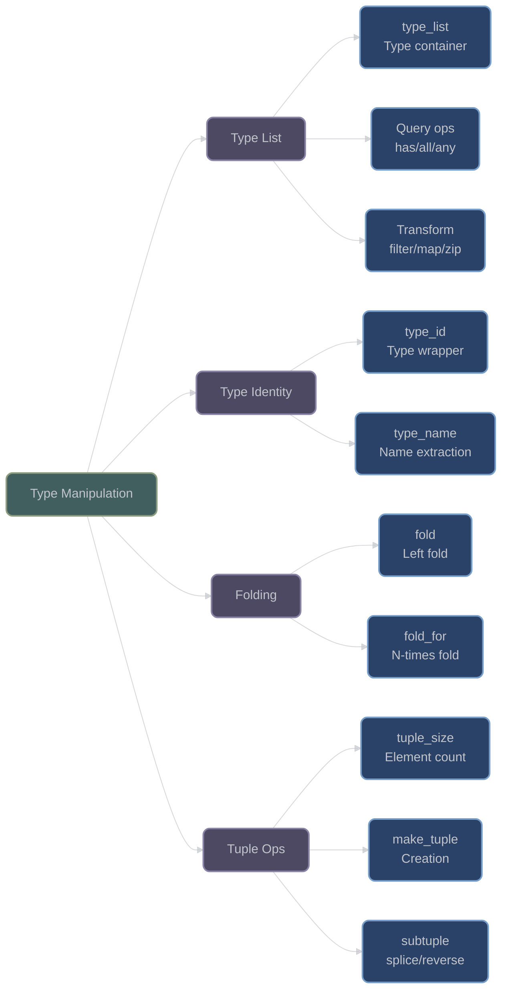

# Type List and Manipulation Utilities

## Overview

XIEITE provides a comprehensive type list system and type manipulation utilities that enable compile-time type operations, transformations, and queries. These utilities form the foundation for advanced template metaprogramming patterns.

## Type List

### type_list

**`xieite::type_list<Ts...>`** - Compile-time type container with extensive operations:
```cpp
template<typename... Ts>
struct type_list {
    static constexpr std::size_t size = sizeof...(Ts);
    
    // Query operations
    template<auto cond> static constexpr bool all;
    template<auto cond> static constexpr bool any;
    template<typename T, auto cmp> static constexpr bool has;
    
    // Access operations
    template<std::size_t idx> using at = /* type at index */;
    template<auto cond> using find = /* first matching type */;
    
    // Transformation operations
    template<typename... Us> using append;
    template<typename... Us> using prepend;
    template<> using reverse;
    template<auto cond> using filter;
    template<auto cmp> using dedup;
    
    // Advanced operations
    template<std::size_t arity, auto fn> using transform;
    template<typename... Us> using zip;
};
```

#### Core Operations

```cpp
using types = xieite::type_list<int, double, char, int>;

// Size and queries
static_assert(types::size == 4);
static_assert(types::has<double>);
static_assert(types::all<std::is_arithmetic>);

// Access by index
using second = types::at<1>;  // double
static_assert(std::same_as<second, double>);

// Find operations
static_assert(types::idx_of<char> == 2);
using first_integral = types::find<std::is_integral>;  // int

// Append and prepend
using extended = types::append<float, bool>;
// type_list<int, double, char, int, float, bool>

using prefixed = types::prepend<void>;
// type_list<void, int, double, char, int>
```

#### Transformation Operations

```cpp
// Reverse types
using reversed = types::reverse<>;
// type_list<int, char, double, int>

// Filter types
using integers = types::filter<std::is_integral>;
// type_list<int, char, int>

// Remove duplicates
using unique = types::dedup<>;
// type_list<int, double, char>

// Slice operations
using middle = types::slice<1, 3>;
// type_list<double, char>

// Replace types
using replaced = types::replace<1, 2, float, long>;
// type_list<int, float, long, char, int>
```

#### Advanced Transformations

```cpp
// Transform types
template<typename T>
using add_pointer_t = xieite::type_id<T*>;

using pointers = types::transform<1, 
    []<typename T> { return add_pointer_t<T>{}; }
>;
// type_list<int*, double*, char*, int*>

// Zip with another list
using values = xieite::type_list<1, 2.0, 'a', 4>;
using pairs = types::zip<int, double, char, int>;
// type_list<type_list<int, int>, 
//           type_list<double, double>,
//           type_list<char, char>,
//           type_list<int, int>>

// Apply function to types
auto result = types::apply(
    []<typename... Ts> { return sizeof...(Ts); }
);  // Returns 4
```

## Type Identification

### type_id

**`xieite::type_id<T>`** - Type wrapper for compile-time type manipulation:
```cpp
template<typename T>
struct type_id {
    using type = T;
};
```

```cpp
// Use for type passing
template<typename T>
auto make_type() { return xieite::type_id<T>{}; }

// Extract type
using extracted = decltype(make_type<int>())::type;  // int

// Type transformation
template<typename T>
auto add_const(xieite::type_id<T>) -> xieite::type_id<const T>;

using const_int = decltype(add_const(xieite::type_id<int>{}))::type;
// const int
```

### type_name / value_name

**`xieite::type_name<T>()`** - Get human-readable type name:
```cpp
template<typename T>
[[nodiscard]] constexpr std::string_view type_name() noexcept;

template<auto value>
[[nodiscard]] constexpr std::string_view value_name() noexcept;
```

```cpp
// Get type names
auto int_name = xieite::type_name<int>();  // "int"
auto vec_name = xieite::type_name<std::vector<double>>();  
// "std::vector<double, std::allocator<double>>"

// Get value names
constexpr int x = 42;
auto val_name = xieite::value_name<x>();  // "42"

// Useful for debugging
template<typename T>
void debug_type() {
    std::cout << "Type: " << xieite::type_name<T>() << '\n';
}
```

## Folding Operations

### fold

**`xieite::fold<fn, init, Ts...>`** - Left fold over types:
```cpp
template<auto fn, typename T, typename... Ts>
using fold = /* folded result type */;
```

```cpp
// Sum type sizes
template<typename Acc, typename T>
struct add_size {
    using type = std::integral_constant<
        std::size_t, 
        Acc::value + sizeof(T)
    >;
};

using total_size = xieite::fold<
    []<typename Acc, typename T> { 
        return add_size<Acc, T>{}; 
    },
    std::integral_constant<std::size_t, 0>,
    int, double, char
>;  // integral_constant<size_t, 13>

// Build nested templates
template<typename T, typename U>
using make_pair = std::pair<T, U>;

using nested = xieite::fold<
    []<typename Acc, typename T> {
        return xieite::type_id<std::pair<Acc, T>>{};
    },
    int,
    double, char, bool
>;  // pair<pair<pair<int, double>, char>, bool>
```

### fold_for

**`xieite::fold_for<fn, init, N>`** - Fold N times:
```cpp
template<auto fn, typename T, std::size_t N>
using fold_for = /* result after N applications */;
```

```cpp
// Apply transformation N times
template<typename T>
using add_pointer = xieite::type_id<T*>;

using triple_pointer = xieite::fold_for<
    []<typename T, auto> { return add_pointer<T>{}; },
    int,
    3
>;  // int***

// Generate type sequence
template<typename List, auto i>
using append_index = typename List::template append<
    std::integral_constant<std::size_t, i>
>;

using indices = xieite::fold_for<
    append_index,
    xieite::type_list<>,
    5
>;  // type_list<integral_constant<0>, ..., integral_constant<4>>
```

## Tuple Operations

### tuple_size

**`xieite::tuple_size<T>`** - Get tuple size at compile-time:
```cpp
template<typename T>
constexpr std::size_t tuple_size = /* tuple element count */;
```

```cpp
using tuple_t = std::tuple<int, double, char>;
static_assert(xieite::tuple_size<tuple_t> == 3);

using array_t = std::array<int, 10>;
static_assert(xieite::tuple_size<array_t> == 10);

// Works with pair
using pair_t = std::pair<int, double>;
static_assert(xieite::tuple_size<pair_t> == 2);
```

### make_tuple / fwd_tuple

**`xieite::make_tuple`** - Enhanced tuple creation:
```cpp
template<typename... Ts>
[[nodiscard]] constexpr auto make_tuple(Ts&&... values);

template<typename... Ts>
[[nodiscard]] constexpr auto fwd_tuple(Ts&&... values);
```

```cpp
// Regular tuple creation
auto t1 = xieite::make_tuple(1, 2.0, 'a');
// std::tuple<int, double, char>

// Forward as tuple (preserves references)
int x = 42;
auto t2 = xieite::fwd_tuple(x, 3.14);
// std::tuple<int&, double>

// Decay as tuple
auto t3 = xieite::decay_as_tuple(x, "hello");
// std::tuple<int, const char*>
```

### subtuple / splice_tuple

**`xieite::subtuple`** - Extract tuple subset:
```cpp
template<std::size_t start, std::size_t end, typename Tuple>
[[nodiscard]] constexpr auto subtuple(Tuple&& t);

template<std::size_t idx, typename... Tuples>
[[nodiscard]] constexpr auto splice_tuple(Tuples&&... tuples);
```

```cpp
auto t = std::make_tuple(1, 2.0, 'a', true, 5L);

// Extract middle elements
auto sub = xieite::subtuple<1, 4>(t);
// tuple<double, char, bool>

// Splice tuples together
auto t1 = std::make_tuple(1, 2);
auto t2 = std::make_tuple('a', 'b');
auto t3 = std::make_tuple(3.14);

auto spliced = xieite::splice_tuple(t1, t2, t3);
// tuple<int, int, char, char, double>
```

### reverse_tuple

**`xieite::reverse_tuple`** - Reverse tuple elements:
```cpp
template<typename Tuple>
[[nodiscard]] constexpr auto reverse_tuple(Tuple&& t);
```

```cpp
auto original = std::make_tuple(1, 2.0, 'a', true);
auto reversed = xieite::reverse_tuple(original);
// tuple<bool, char, double, int>

// Values are preserved
assert(std::get<0>(reversed) == true);
assert(std::get<3>(reversed) == 1);
```

## Architecture Diagram



## Performance Considerations

- **Compile-Time**: All operations are evaluated at compile-time
- **Zero Runtime Cost**: Type operations generate no runtime code
- **Template Instantiation**: Deep recursion may increase compilation time
- **Compiler Limits**: Very large type lists may hit template depth limits

## Best Practices

1. **Use type_list for compile-time collections**:
   ```cpp
   using supported_types = xieite::type_list<int, float, double>;
   static_assert(supported_types::has<float>);
   ```

2. **Leverage fold for type transformations**:
   ```cpp
   using result = xieite::fold<transformer, init, Types...>;
   ```

3. **Prefer compile-time operations**:
   ```cpp
   // Good: Compile-time filtering
   using filtered = types::filter<predicate>;
   ```

4. **Use type_id for type passing**:
   ```cpp
   template<typename T>
   auto process(xieite::type_id<T>) { /* ... */ }
   ```

---

*Next: [Compile-Time Utilities](compile_time_utilities.md)*