# Advanced Preprocessor Utilities

## Overview

Building on the core preprocessor foundation, XIEITE provides advanced utilities for string manipulation, function calls, type conversion, debugging support, and sophisticated C++ integration patterns.

## String and Token Manipulation

### String Conversion

**`XIEITE_STR(...)`** - Stringify with evaluation:
```cpp
#define XIEITE_STR(...) XIEITE_PSTR(__VA_ARGS__)
#define XIEITE_PSTR(...) #__VA_ARGS__
```

This provides controlled stringification with proper macro expansion handling.

#### Usage Examples

**Debug Macro Generation**:
```cpp
#define DEBUG_PRINT(expr) \
    std::cout << XIEITE_STR(expr) << " = " << (expr) << std::endl

int value = 42;
DEBUG_PRINT(value * 2);  // Output: "value * 2 = 84"
```

**Compile-Time String Generation**:
```cpp
#define MAKE_ENUM_STRING(name) \
    case name: return XIEITE_STR(name);

enum class Color { Red, Green, Blue };

const char* to_string(Color c) {
    switch(c) {
        MAKE_ENUM_STRING(Color::Red)
        MAKE_ENUM_STRING(Color::Green)
        MAKE_ENUM_STRING(Color::Blue)
    }
}
```

### Comma Generation

**`XIEITE_COMMA(...)`** - Generate comma token:
```cpp
#define XIEITE_COMMA(...) ,
```

This utility enables dynamic comma insertion in macro expansions.

#### Comma Usage Examples

**Conditional Parameter Lists**:
```cpp
#define OPTIONAL_PARAM(condition, param) \
    XIEITE_IF(condition)(param XIEITE_COMMA())()

template<typename T OPTIONAL_PARAM(1, typename U)>
class Container { /* ... */ };
```

## Function Call and Invocation

### Dynamic Call System

**`XIEITE_CALL(...)`** - Conditional function invocation:
```cpp
#define XIEITE_CALL(...) __VA_ARGS__ DETAIL_XIEITE_CALL_##__VA_OPT__(1)

#define DETAIL_XIEITE_CALL_(...) __VA_ARGS__      // Empty args: pass through
#define DETAIL_XIEITE_CALL_1(...) (__VA_ARGS__)   // Non-empty: wrap in parentheses
```

This sophisticated macro automatically handles parentheses for function calls based on argument presence.

#### Call System Implementation

The call system uses `__VA_OPT__` to detect argument presence:
- Empty arguments → No parentheses added
- Non-empty arguments → Parentheses automatically added

#### Call Examples

**Conditional Function Invocation**:
```cpp
#define MAYBE_CALL(func, ...) \
    XIEITE_IF(XIEITE_COUNT(__VA_ARGS__))(func XIEITE_CALL(__VA_ARGS__))(func())

MAYBE_CALL(initialize);           // Expands to: initialize()
MAYBE_CALL(setup, config, true);  // Expands to: setup(config, true)
```

**Generic Wrapper Generation**:
```cpp
#define MAKE_WRAPPER(name, target) \
    auto name = [](auto&&... args) { \
        return target XIEITE_CALL(std::forward<decltype(args)>(args)...); \
    };
```

### Argument Existence Detection

**`XIEITE_ANY(...)`** - Check for argument presence:
```cpp
#define XIEITE_ANY(...) DETAIL_XIEITE_ANY_##__VA_OPT__(1)

#define DETAIL_XIEITE_ANY_ 0    // No arguments
#define DETAIL_XIEITE_ANY_1 1   // Has arguments
```

#### Any Usage Examples

**Conditional Compilation**:
```cpp
#define CONFIG_PARAMS

#if XIEITE_ANY(CONFIG_PARAMS)
    // Configuration parameters provided
#else
    // Use default configuration
#endif
```

## Type Conversion and Forwarding

### Perfect Forwarding

**`XIEITE_FWD(...)`** - Universal reference forwarding:
```cpp
#define XIEITE_FWD(...) static_cast<decltype(__VA_ARGS__)&&>(__VA_ARGS__)
```

**`XIEITE_FWD_PRVALUE(...)`** - Prvalue-aware forwarding:
```cpp
#define XIEITE_FWD_PRVALUE(...) DETAIL_XIEITE_FWD_PRVALUE(, __VA_ARGS__)
#define XIEITE_FWD_PRVALUE_LOCAL(...) DETAIL_XIEITE_FWD_PRVALUE(&, __VA_ARGS__)

#define DETAIL_XIEITE_FWD_PRVALUE(_capture, ...) \
    ([_capture]<bool castable = !std::is_reference_v<decltype((__VA_ARGS__))> && \
                               std::same_as<decltype(__VA_ARGS__), decltype(__VA_ARGS__)>, \
               typename type = decltype(__VA_ARGS__)> -> decltype(auto) { \
        if constexpr (castable) { \
            return static_cast<type>(__VA_ARGS__); \
        } else { \
            return (__VA_ARGS__); \
        } \
    })()
```

The prvalue forwarding macros handle complex scenarios where simple forwarding might not preserve value categories correctly.

### Type Casting Integration

**`XIEITE_AS(...)`** - Operator-based casting:
```cpp
#define XIEITE_AS(...) ->*DETAIL_XIEITE::AS::impl<__VA_ARGS__>()

namespace DETAIL_XIEITE::AS {
    template<typename T>
    struct impl {
        [[nodiscard]] friend constexpr auto operator->*(auto&& x, impl<T>)
            XIEITE_ARROW(static_cast<T>(XIEITE_FWD(x)))
    };
}
```

This creates a syntax for casting using the `->*` operator.

#### Forwarding Examples

**Generic Factory Function**:
```cpp
template<typename T, typename... Args>
constexpr auto make_value(Args&&... args) -> T {
    return T{XIEITE_FWD(args)...};
}

// Usage
auto vec = make_value<std::vector<int>>(1, 2, 3, 4, 5);
```

**Perfect Forwarding in Macros**:
```cpp
#define FORWARD_TO_MEMBER(member, ...) \
    member(XIEITE_FWD(__VA_ARGS__))

class Processor {
    auto process(auto&& value) { return handle(XIEITE_FWD(value)); }
public:
    auto operator()(auto&& value) {
        return FORWARD_TO_MEMBER(process, value);
    }
};
```

**Type Casting Syntax**:
```cpp
int value = 42;
double result = value XIEITE_AS(double);  // Equivalent to static_cast<double>(value)

// Can be chained
auto final = getValue() XIEITE_AS(int) XIEITE_AS(double);
```

## Debugging and Development Support

### Debug Mode Detection

**`XIEITE_DEBUG`** - Comprehensive debug detection:
```cpp
#if defined(DEBUG) || !defined(NDEBUG) || defined(_DEBUG) || defined(QT_DEBUG)
    #define XIEITE_DEBUG 1
#else
    #define XIEITE_DEBUG 0
#endif
```

This macro provides unified debug mode detection across different build systems and frameworks.

#### Debug Examples

**Conditional Debug Code**:
```cpp
#if XIEITE_DEBUG
    #define DBG_PRINT(msg) std::cout << "[DEBUG] " << msg << std::endl
    #define DBG_ASSERT(cond) assert(cond)
#else
    #define DBG_PRINT(msg) ((void)0)
    #define DBG_ASSERT(cond) ((void)0)
#endif

void process_data(const std::vector<int>& data) {
    DBG_PRINT("Processing " << data.size() << " elements");
    DBG_ASSERT(!data.empty());

    // Processing logic...
}
```

**Debug-Only Class Members**:
```cpp
class NetworkConnection {
private:
    std::string address;

#if XIEITE_DEBUG
    mutable std::chrono::steady_clock::time_point last_activity;
    mutable size_t packet_count = 0;
#endif

public:
    void send(const std::string& data) {
#if XIEITE_DEBUG
        last_activity = std::chrono::steady_clock::now();
        ++packet_count;
#endif
        // Send implementation...
    }
};
```

## Advanced Pattern Integration

### Macro Composition Diagram

```mermaid
---
config:
    theme: 'base'
    themeVariables:
        darkMode: true
        background: '#262B33'
        primaryColor: '#2b4268ff'
        primaryTextColor: '#C1C4CA'
        primaryBorderColor: '#779DC9ff'
        lineColor: '#C1C4CAAA'
        secondaryColor: '#425f5fff'
        tertiaryColor: '#4d4962ff'
        quaternaryColor: '#7a6253ff'
        clusterBkg: '#22272f62'
        clusterBorder: '#8c9c81ff'
        edgeLabelBackground: '#262B33'
        nodeTextColor: '#C1C4CA'
---
flowchart TD
    Input[Source Code] --> String{String Ops}
    Input --> Call{Function Calls}
    Input --> Forward{Forwarding}
    Input --> Debug{Debug Mode}

    String --> Stringify[XIEITE_STR<br/>Stringification]
    String --> Comma[XIEITE_COMMA<br/>Token generation]

    Call --> CallMacro[XIEITE_CALL<br/>Conditional invocation]
    Call --> AnyCheck[XIEITE_ANY<br/>Argument detection]

    Forward --> BasicFwd[XIEITE_FWD<br/>Universal reference]
    Forward --> PrvalueFwd[XIEITE_FWD_PRVALUE<br/>Value category aware]
    Forward --> CastOp[XIEITE_AS<br/>Operator casting]

    Debug --> DebugDetect[XIEITE_DEBUG<br/>Multi-framework detection]

    Stringify --> DebugPrint[Debug printing]
    Stringify --> EnumString[Enum stringification]

    CallMacro --> ConditionalCall[Conditional invocation]
    CallMacro --> WrapperGen[Wrapper generation]

    AnyCheck --> OptionalParams[Optional parameters]
    AnyCheck --> ConditionalComp[Conditional compilation]

    BasicFwd --> GenericFactory[Generic factories]
    PrvalueFwd --> ComplexForward[Complex forwarding]
    CastOp --> ChainedCast[Chained casting]

    DebugDetect --> ConditionalDebug[Debug-only code]
    DebugDetect --> AssertMacros[Assertion macros]

    style Input fill:#425f5fff,stroke:#8c9c81ff,stroke-width:2px,color:#C1C4CA,rx:8,ry:8
    style String fill:#4d4962ff,stroke:#8983a5ff,stroke-width:2px,color:#C1C4CA,rx:8,ry:8
    style Call fill:#4d4962ff,stroke:#8983a5ff,stroke-width:2px,color:#C1C4CA,rx:8,ry:8
    style Forward fill:#4d4962ff,stroke:#8983a5ff,stroke-width:2px,color:#C1C4CA,rx:8,ry:8
    style Debug fill:#4d4962ff,stroke:#8983a5ff,stroke-width:2px,color:#C1C4CA,rx:8,ry:8
    style Stringify fill:#2b4268ff,stroke:#779DC9ff,stroke-width:2px,color:#C1C4CA,rx:8,ry:8
    style Comma fill:#2b4268ff,stroke:#779DC9ff,stroke-width:2px,color:#C1C4CA,rx:8,ry:8
    style CallMacro fill:#2b4268ff,stroke:#779DC9ff,stroke-width:2px,color:#C1C4CA,rx:8,ry:8
    style AnyCheck fill:#2b4268ff,stroke:#779DC9ff,stroke-width:2px,color:#C1C4CA,rx:8,ry:8
    style BasicFwd fill:#2b4268ff,stroke:#779DC9ff,stroke-width:2px,color:#C1C4CA,rx:8,ry:8
    style PrvalueFwd fill:#2b4268ff,stroke:#779DC9ff,stroke-width:2px,color:#C1C4CA,rx:8,ry:8
    style CastOp fill:#2b4268ff,stroke:#779DC9ff,stroke-width:2px,color:#C1C4CA,rx:8,ry:8
    style DebugDetect fill:#2b4268ff,stroke:#779DC9ff,stroke-width:2px,color:#C1C4CA,rx:8,ry:8
    style DebugPrint fill:#7a6253ff,stroke:#c7ac9bff,stroke-width:2px,color:#C1C4CA,rx:8,ry:8
    style EnumString fill:#7a6253ff,stroke:#c7ac9bff,stroke-width:2px,color:#C1C4CA,rx:8,ry:8
    style ConditionalCall fill:#7a6253ff,stroke:#c7ac9bff,stroke-width:2px,color:#C1C4CA,rx:8,ry:8
    style WrapperGen fill:#7a6253ff,stroke:#c7ac9bff,stroke-width:2px,color:#C1C4CA,rx:8,ry:8
    style OptionalParams fill:#7a6253ff,stroke:#c7ac9bff,stroke-width:2px,color:#C1C4CA,rx:8,ry:8
    style ConditionalComp fill:#7a6253ff,stroke:#c7ac9bff,stroke-width:2px,color:#C1C4CA,rx:8,ry:8
    style GenericFactory fill:#7a6253ff,stroke:#c7ac9bff,stroke-width:2px,color:#C1C4CA,rx:8,ry:8
    style ComplexForward fill:#7a6253ff,stroke:#c7ac9bff,stroke-width:2px,color:#C1C4CA,rx:8,ry:8
    style ChainedCast fill:#7a6253ff,stroke:#c7ac9bff,stroke-width:2px,color:#C1C4CA,rx:8,ry:8
    style ConditionalDebug fill:#7a6253ff,stroke:#c7ac9bff,stroke-width:2px,color:#C1C4CA,rx:8,ry:8
    style AssertMacros fill:#7a6253ff,stroke:#c7ac9bff,stroke-width:2px,color:#C1C4CA,rx:8,ry:8
```



## Advanced Integration Patterns

### Template Metaprogramming Integration

XIEITE's preprocessor utilities integrate seamlessly with template metaprogramming:

```cpp
template<typename... Args>
constexpr auto make_tuple_if_multiple(Args&&... args) {
    if constexpr (sizeof...(args) > 1) {
        return std::make_tuple(XIEITE_FWD(args)...);
    } else {
        return (XIEITE_FWD(args), ...);  // Return single value
    }
}
```

### Concept Integration

Preprocessor utilities work within concept definitions:

```cpp
template<typename T>
concept ForwardableType = requires(T&& t) {
    { XIEITE_FWD(t) } -> std::same_as<T&&>;
};

template<ForwardableType T>
constexpr auto process(T&& value) {
    return handle(XIEITE_FWD(value));
}
```

### Constexpr Context Usage

Many utilities work in constexpr contexts:

```cpp
constexpr auto compile_time_string = XIEITE_STR(COMPILE_TIME_VALUE);

constexpr bool has_debug = XIEITE_DEBUG;

template<int N>
constexpr auto factorial() {
    if constexpr (N == 0) {
        return 1;
    } else {
        return N * factorial<N-1>();
    }
}
```

## Performance and Best Practices

### Compilation Performance

- **Minimize Deep Nesting**: Avoid excessive macro composition
- **Use Template Alternative**: For complex logic, consider template metaprogramming
- **Profile Build Times**: Monitor compilation impact of heavy macro usage

### Integration Guidelines

1. **Consistent Usage**: Use XIEITE forwarding macros consistently throughout a codebase
2. **Clear Documentation**: Document macro usage in API interfaces
3. **Testing**: Test macro expansions with different argument patterns
4. **Debugging**: Use compiler flags to examine macro expansions during development

### Modern C++ Integration

XIEITE's advanced utilities leverage and enhance modern C++ features:
- Perfect forwarding with universal references
- `__VA_OPT__` for robust variadic handling
- Concepts for template constraints
- `constexpr` for compile-time evaluation
- SFINAE-friendly design patterns

---

*Next: [Preprocessor Pattern Examples](examples.md)*
