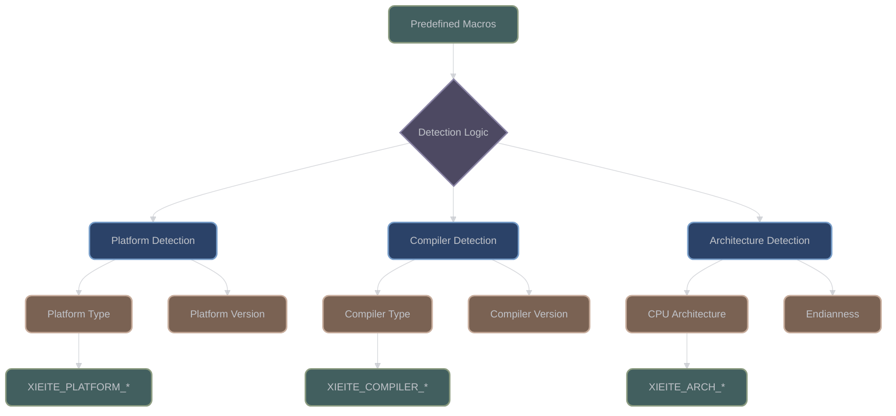

# Conditional Compilation Macros

## Overview

XIEITE's conditional compilation system provides comprehensive platform, compiler, and feature detection capabilities. Located primarily in `include/xieite/pp/platform.hpp` and `include/xieite/pp/compiler.hpp`, these macros enable portable code across diverse environments.

## Architecture



## Platform Detection System

### Comprehensive Platform Support

**Source**: `include/xieite/pp/platform.hpp`

XIEITE detects over 200 platforms, each with:
- Type flag: `XIEITE_PLATFORM_TYPE_*`
- Major version: `XIEITE_PLATFORM_MAJOR_*`
- Minor version: `XIEITE_PLATFORM_MINOR_*`
- Patch version: `XIEITE_PLATFORM_PATCH_*`

### Major Platform Categories

| Category | Detection Macro | Platforms Included |
|----------|----------------|-------------------|
| Windows | `XIEITE_PLATFORM_TYPE_WINDOWS` | Windows, Cygwin, MinGW |
| Unix-like | `XIEITE_PLATFORM_TYPE_UNIX` | Linux, BSD variants, macOS |
| Embedded | Various specific | Arduino, ESP32, STM32 |
| Mobile | Various specific | Android, iOS, Windows Phone |
| Game Consoles | Various specific | PlayStation, Xbox, Nintendo |

### Platform Detection Pattern

```cpp
// Each platform follows this structure:
#define XIEITE_PLATFORM_TYPE_LINUX 0
#define XIEITE_PLATFORM_MAJOR_LINUX 0
#define XIEITE_PLATFORM_MINOR_LINUX 0
#define XIEITE_PLATFORM_PATCH_LINUX 0

// When Linux is detected:
#ifdef __linux__
    #undef XIEITE_PLATFORM_TYPE_LINUX
    #define XIEITE_PLATFORM_TYPE_LINUX 1
    // Version extraction logic...
#endif
```

### Common Platform Usage

```cpp
#if XIEITE_PLATFORM_TYPE_WINDOWS
    // Windows-specific code
    #include <windows.h>
    using native_handle = HANDLE;
#elif XIEITE_PLATFORM_TYPE_LINUX
    // Linux-specific code
    #include <unistd.h>
    using native_handle = int;
#elif XIEITE_PLATFORM_TYPE_MACOS
    // macOS-specific code
    #include <mach/mach.h>
    using native_handle = mach_port_t;
#else
    #error "Unsupported platform"
#endif
```

## Compiler Detection System

### Comprehensive Compiler Support

**Source**: `include/xieite/pp/compiler.hpp`

XIEITE detects over 100 compilers with version information:

| Compiler | Detection Macro | Version Macros |
|----------|----------------|----------------|
| GCC | `XIEITE_COMPILER_TYPE_GCC` | MAJOR, MINOR, PATCH |
| Clang | `XIEITE_COMPILER_TYPE_CLANG` | MAJOR, MINOR, PATCH |
| MSVC | `XIEITE_COMPILER_TYPE_MSVC` | MAJOR, MINOR, PATCH |
| Intel C++ | `XIEITE_COMPILER_TYPE_ICC` | MAJOR, MINOR, PATCH |
| Apple Clang | `XIEITE_COMPILER_TYPE_APPLE_CLANG` | MAJOR, MINOR, PATCH |

### Compiler Detection Pattern

```cpp
// Base definition
#define XIEITE_COMPILER_TYPE_GCC 0
#define XIEITE_COMPILER_MAJOR_GCC 0
#define XIEITE_COMPILER_MINOR_GCC 0
#define XIEITE_COMPILER_PATCH_GCC 0

// Detection logic
#ifdef __GNUC__
    #ifndef __clang__  // GCC, not Clang
        #undef XIEITE_COMPILER_TYPE_GCC
        #define XIEITE_COMPILER_TYPE_GCC 1
        #undef XIEITE_COMPILER_MAJOR_GCC
        #define XIEITE_COMPILER_MAJOR_GCC __GNUC__
        #undef XIEITE_COMPILER_MINOR_GCC
        #define XIEITE_COMPILER_MINOR_GCC __GNUC_MINOR__
        #undef XIEITE_COMPILER_PATCH_GCC
        #define XIEITE_COMPILER_PATCH_GCC __GNUC_PATCHLEVEL__
    #endif
#endif
```

### Compiler-Specific Features

```cpp
// Enable specific optimizations
#if XIEITE_COMPILER_TYPE_GCC
    #define XIEITE_LIKELY(x) __builtin_expect(!!(x), 1)
    #define XIEITE_UNLIKELY(x) __builtin_expect(!!(x), 0)
    #define XIEITE_RESTRICT __restrict__
#elif XIEITE_COMPILER_TYPE_MSVC
    #define XIEITE_LIKELY(x) (x)
    #define XIEITE_UNLIKELY(x) (x)
    #define XIEITE_RESTRICT __restrict
#endif
```

## Architecture Detection

### CPU Architecture

**Source**: `include/xieite/pp/arch.hpp`

```cpp
// Architecture detection macros
#define XIEITE_ARCH_TYPE_X86 0
#define XIEITE_ARCH_TYPE_X86_64 0
#define XIEITE_ARCH_TYPE_ARM 0
#define XIEITE_ARCH_TYPE_ARM64 0
#define XIEITE_ARCH_TYPE_MIPS 0
#define XIEITE_ARCH_TYPE_POWERPC 0
#define XIEITE_ARCH_TYPE_RISCV 0
#define XIEITE_ARCH_TYPE_WASM 0
```

### Architecture-Specific Code

```cpp
#if XIEITE_ARCH_TYPE_X86_64
    // x86-64 specific optimizations
    #include <immintrin.h>
    using simd_type = __m256;
#elif XIEITE_ARCH_TYPE_ARM64
    // ARM64 NEON optimizations
    #include <arm_neon.h>
    using simd_type = float32x4_t;
#endif
```

## Endianness Detection

**Source**: `include/xieite/pp/endian.hpp`

```cpp
#define XIEITE_ENDIAN_LITTLE 0
#define XIEITE_ENDIAN_BIG 0
#define XIEITE_ENDIAN_PDP 0

// Detection logic
#if defined(__BYTE_ORDER__)
    #if __BYTE_ORDER__ == __ORDER_LITTLE_ENDIAN__
        #undef XIEITE_ENDIAN_LITTLE
        #define XIEITE_ENDIAN_LITTLE 1
    #elif __BYTE_ORDER__ == __ORDER_BIG_ENDIAN__
        #undef XIEITE_ENDIAN_BIG
        #define XIEITE_ENDIAN_BIG 1
    #endif
#endif
```

## Feature Detection

### Language Features

**Source**: `include/xieite/pp/lang.hpp`

```cpp
// C++ standard detection
#define XIEITE_LANG_CPP98 0
#define XIEITE_LANG_CPP11 0
#define XIEITE_LANG_CPP14 0
#define XIEITE_LANG_CPP17 0
#define XIEITE_LANG_CPP20 0
#define XIEITE_LANG_CPP23 0

#ifdef __cplusplus
    #if __cplusplus >= 202002L
        #define XIEITE_LANG_CPP20 1
    #endif
    #if __cplusplus >= 202302L
        #define XIEITE_LANG_CPP23 1
    #endif
#endif
```

### Attribute Detection

**Source**: `include/xieite/pp/has_attr.hpp`

```cpp
// Check for attribute support
#ifdef __has_cpp_attribute
    #define XIEITE_HAS_ATTR(attr) __has_cpp_attribute(attr)
#else
    #define XIEITE_HAS_ATTR(attr) 0
#endif

// Usage
#if XIEITE_HAS_ATTR(nodiscard)
    #define XIEITE_NODISCARD [[nodiscard]]
#else
    #define XIEITE_NODISCARD
#endif
```

## Conditional Macro Utilities

### XIEITE_IF

**Source**: `include/xieite/pp/if.hpp`

```cpp
#define XIEITE_IF(cond) XIEITE_CAT(DETAIL_XIEITE_IF_, cond)
#define DETAIL_XIEITE_IF_0(then_)(else_) else_
#define DETAIL_XIEITE_IF_1(then_)(else_) then_

// Usage
XIEITE_IF(XIEITE_PLATFORM_TYPE_WINDOWS)(
    windows_implementation()
)(
    unix_implementation()
)
```

### Boolean Operations

**Source**: `include/xieite/pp/and.hpp`, `or.hpp`, `not.hpp`

```cpp
#define XIEITE_AND(a, b) XIEITE_IF(a)(XIEITE_IF(b)(1)(0))(0)
#define XIEITE_OR(a, b) XIEITE_IF(a)(1)(XIEITE_IF(b)(1)(0))
#define XIEITE_NOT(x) XIEITE_IF(x)(0)(1)

// Complex conditions
#if XIEITE_AND(XIEITE_PLATFORM_TYPE_LINUX, XIEITE_ARCH_TYPE_X86_64)
    // Linux on x86-64
#endif
```

## Platform Groups

### Unix Detection

**Source**: `include/xieite/pp/unix.hpp`

```cpp
#define XIEITE_UNIX \
    XIEITE_OR( \
        XIEITE_OR(XIEITE_PLATFORM_TYPE_LINUX, XIEITE_PLATFORM_TYPE_BSD), \
        XIEITE_OR(XIEITE_PLATFORM_TYPE_MACOS, XIEITE_PLATFORM_TYPE_SOLARIS) \
    )
```

### Mobile Detection

```cpp
#define XIEITE_MOBILE \
    XIEITE_OR( \
        XIEITE_OR(XIEITE_PLATFORM_TYPE_ANDROID, XIEITE_PLATFORM_TYPE_IOS), \
        XIEITE_PLATFORM_TYPE_WINDOWS_PHONE \
    )
```

## Version Comparison

### Version Macros

```cpp
// Check minimum version
#define XIEITE_VERSION_AT_LEAST(maj, min, pat) \
    ((XIEITE_PLATFORM_MAJOR > maj) || \
     (XIEITE_PLATFORM_MAJOR == maj && XIEITE_PLATFORM_MINOR > min) || \
     (XIEITE_PLATFORM_MAJOR == maj && XIEITE_PLATFORM_MINOR == min && \
      XIEITE_PLATFORM_PATCH >= pat))

// Usage
#if XIEITE_PLATFORM_TYPE_WINDOWS && XIEITE_VERSION_AT_LEAST(10, 0, 0)
    // Windows 10 or later
#endif
```

## Standard Library Detection

**Source**: `include/xieite/pp/stdlib.hpp`

```cpp
#define XIEITE_STDLIB_LIBSTDCXX 0  // GNU libstdc++
#define XIEITE_STDLIB_LIBCXX 0     // LLVM libc++
#define XIEITE_STDLIB_MSVC 0       // Microsoft STL

#ifdef __GLIBCXX__
    #undef XIEITE_STDLIB_LIBSTDCXX
    #define XIEITE_STDLIB_LIBSTDCXX 1
#elif defined(_LIBCPP_VERSION)
    #undef XIEITE_STDLIB_LIBCXX
    #define XIEITE_STDLIB_LIBCXX 1
#elif defined(_MSC_VER)
    #undef XIEITE_STDLIB_MSVC
    #define XIEITE_STDLIB_MSVC 1
#endif
```

## Diagnostic Control

**Source**: `include/xieite/pp/diagnostic.hpp`

```cpp
// Push/pop diagnostic state
#if XIEITE_COMPILER_TYPE_GCC || XIEITE_COMPILER_TYPE_CLANG
    #define XIEITE_DIAGNOSTIC_PUSH() _Pragma("GCC diagnostic push")
    #define XIEITE_DIAGNOSTIC_POP() _Pragma("GCC diagnostic pop")
    #define XIEITE_DIAGNOSTIC_IGNORE(warning) \
        _Pragma(XIEITE_STR(GCC diagnostic ignored warning))
#elif XIEITE_COMPILER_TYPE_MSVC
    #define XIEITE_DIAGNOSTIC_PUSH() __pragma(warning(push))
    #define XIEITE_DIAGNOSTIC_POP() __pragma(warning(pop))
    #define XIEITE_DIAGNOSTIC_IGNORE(warning) __pragma(warning(disable: warning))
#endif

// Usage
XIEITE_DIAGNOSTIC_PUSH()
XIEITE_DIAGNOSTIC_IGNORE("-Wunused-variable")
int unused = 42;  // No warning
XIEITE_DIAGNOSTIC_POP()
```

## Best Practices

1. **Always Check Before Use**: Verify platform/compiler macros are defined
2. **Use Groups When Possible**: Prefer `XIEITE_UNIX` over individual checks
3. **Version Checking**: Always check versions for feature availability
4. **Fallback Implementation**: Provide generic fallback for unknown platforms
5. **Document Requirements**: Clearly state platform/compiler requirements

## Common Patterns

### Platform-Specific Implementation

```cpp
namespace detail {
    #if XIEITE_PLATFORM_TYPE_WINDOWS
        inline auto impl() { return windows_impl(); }
    #elif XIEITE_PLATFORM_TYPE_LINUX
        inline auto impl() { return linux_impl(); }
    #elif XIEITE_PLATFORM_TYPE_MACOS
        inline auto impl() { return macos_impl(); }
    #else
        inline auto impl() { return generic_impl(); }
    #endif
}
```

### Compiler Optimization Hints

```cpp
template<typename T>
auto process(T value) {
    #if XIEITE_COMPILER_TYPE_GCC || XIEITE_COMPILER_TYPE_CLANG
        if (XIEITE_LIKELY(value > 0)) {
            // Hot path
        } else {
            // Cold path
        }
    #else
        if (value > 0) {
            // Standard path
        }
    #endif
}
```

## Performance Impact

| Detection Type | Compile-Time Cost | Runtime Cost |
|---------------|-------------------|--------------|
| Platform | Negligible | Zero |
| Compiler | Negligible | Zero |
| Architecture | Negligible | Zero |
| Feature | Minimal | Zero |
| Version | Minimal | Zero |

All detection happens at preprocessing time with zero runtime overhead.

---

*Next: [Platform Detection Details](platform.md)*