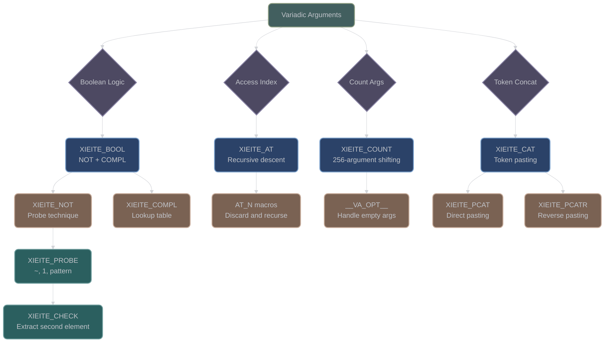

# Core Preprocessor Utilities

## Overview

XIEITE's preprocessor category provides a comprehensive metaprogramming foundation built on advanced C++ macro techniques. These utilities enable compile-time computation, logical operations, token manipulation, and variadic argument processing that rival the capabilities of template metaprogramming while operating purely at the preprocessor level.

## Fundamental Building Blocks

### Token Concatenation System

**`XIEITE_CAT(x, ...)`** - Token concatenation with evaluation:
```cpp
#define XIEITE_CAT(_x, ...) XIEITE_PCAT(_x, __VA_ARGS__)
#define XIEITE_PCAT(_x, ...) _x##__VA_ARGS__
```

**`XIEITE_CATR(x, ...)`** - Reverse token concatenation:
```cpp
#define XIEITE_CATR(_x, ...) XIEITE_PCATR(_x, __VA_ARGS__)
#define XIEITE_PCATR(_x, ...) __VA_ARGS__##_x
```

**Advanced Concatenation Utilities**:
```cpp
#define XIEITE_CAT_A(_x) XIEITE_PCAT(_x,    // Incomplete concatenation for deferred expansion
#define XIEITE_CAT_B(_x) XIEITE_PCATR(_x,   // Incomplete reverse concatenation
```

#### Usage Examples

**Dynamic Symbol Generation**:
```cpp
#define DECLARE_GETTER(type, name) \
    type XIEITE_CAT(get_, name)() const { return XIEITE_CAT(m_, name); }

DECLARE_GETTER(int, value)        // Expands to: int get_value() const { return m_value; }
DECLARE_GETTER(std::string, id)   // Expands to: std::string get_id() const { return m_id; }
```

**Conditional Symbol Creation**:
```cpp
#define API_VERSION 2

#define API_FUNCTION(name) XIEITE_CAT(XIEITE_CAT(api_v, API_VERSION), XIEITE_CAT(_, name))

API_FUNCTION(initialize)  // Expands to: api_v2_initialize
```

### Boolean Logic System

The preprocessor boolean system provides compile-time logical operations through sophisticated macro composition.

**`XIEITE_BOOL(x)`** - Convert to preprocessor boolean:
```cpp
#define XIEITE_BOOL(_x) XIEITE_COMPL(XIEITE_NOT(_x))

// Dependencies:
#define XIEITE_COMPL(_b) XIEITE_PCAT(DETAIL_XIEITE_COMPL_, _b)
#define DETAIL_XIEITE_COMPL_0 1
#define DETAIL_XIEITE_COMPL_1 0
```

**`XIEITE_NOT(x)`** - Logical negation using probe technique:
```cpp
#define XIEITE_NOT(_x) XIEITE_CHECK(XIEITE_PCAT(DETAIL_XIEITE_NOT_, _x))
#define DETAIL_XIEITE_NOT_0 XIEITE_PROBE(~)

// The probe technique:
#define XIEITE_PROBE(_x) _x, 1,
#define XIEITE_CHECK(...) XIEITE_AT_1(__VA_ARGS__, 0,)
```

**`XIEITE_AND(...)`** - Logical AND operation:
```cpp
#define XIEITE_AND(...) XIEITE_IF(__VA_ARGS__)(XIEITE_BOOL)(0)
```

**`XIEITE_OR(...)`** - Logical OR operation:
```cpp
#define XIEITE_OR(...) XIEITE_IF(__VA_ARGS__)(1)(XIEITE_BOOL)
```

#### Logic System Implementation Details

The boolean logic system uses several sophisticated techniques:

1. **Probe Detection**: `XIEITE_NOT` uses a probe pattern where `DETAIL_XIEITE_NOT_0` expands to `XIEITE_PROBE(~)`, which becomes `~, 1,`. The `XIEITE_CHECK` macro then extracts the second element.

2. **Complement Lookup**: `XIEITE_COMPL` uses token concatenation to create lookup tables for bit flipping.

3. **Conditional Evaluation**: `XIEITE_AND` and `XIEITE_OR` leverage the conditional system to short-circuit evaluation.

#### Logic Examples

**Conditional Compilation**:
```cpp
#define HAS_FEATURE_A 1
#define HAS_FEATURE_B 0

#if XIEITE_AND(HAS_FEATURE_A, HAS_FEATURE_B)
    // Both features available
#elif XIEITE_OR(HAS_FEATURE_A, HAS_FEATURE_B)
    // At least one feature available
#else
    // No features available
#endif
```

**Macro Validation**:
```cpp
#define VALIDATE_ARGS(a, b, c) XIEITE_AND(XIEITE_AND(a, b), c)

#if VALIDATE_ARGS(1, 1, 0)
    #error "Validation failed"
#endif
```

### Argument Indexing and Counting

XIEITE provides sophisticated variadic argument manipulation through recursive macro patterns.

**`XIEITE_AT(n)`** - Access nth argument (0-based indexing):
```cpp
#define XIEITE_AT(_n) XIEITE_PCAT(XIEITE_AT_, _n)

// Recursive pattern up to 256 arguments:
#define XIEITE_AT_0(_x, ...) _x
#define XIEITE_AT_1(_, ...) XIEITE_AT_0(__VA_ARGS__)
#define XIEITE_AT_2(_, ...) XIEITE_AT_1(__VA_ARGS__)
// ... continues to XIEITE_AT_256
```

**`XIEITE_COUNT(...)`** - Count variadic arguments:
```cpp
#define XIEITE_COUNT(...) DETAIL_XIEITE_COUNT(__VA_OPT__(,) __VA_ARGS__, 256, 255, 254, /* ... */, 2, 1, 0)

// Uses argument shifting to determine count:
#define DETAIL_XIEITE_COUNT(_0, _1, _2, /* ... */, _256, _n, ...) _n
```

#### Indexing Implementation Details

The indexing system uses a recursive descent pattern where each `XIEITE_AT_N` macro:
1. Discards the first argument with `_`
2. Recursively calls `XIEITE_AT_(N-1)` with the remaining arguments
3. Eventually reaches `XIEITE_AT_0` which returns the target argument

The counting system leverages the C++20 `__VA_OPT__` feature to handle empty argument lists correctly.

#### Indexing Examples

**Variadic Function Generation**:
```cpp
#define MAKE_FUNCTION(name, ...) \
    auto name() { \
        return std::make_tuple( \
            XIEITE_AT(0)(__VA_ARGS__), \
            XIEITE_AT(1)(__VA_ARGS__), \
            XIEITE_AT(2)(__VA_ARGS__) \
        ); \
    }

MAKE_FUNCTION(get_values, getValue1(), getValue2(), getValue3())
```

**Argument Count Validation**:
```cpp
#define MAX_ARGS 5
#define VALIDATE_ARG_COUNT(...) \
    static_assert(XIEITE_COUNT(__VA_ARGS__) <= MAX_ARGS, "Too many arguments")

VALIDATE_ARG_COUNT(a, b, c)        // OK: 3 <= 5
VALIDATE_ARG_COUNT(a, b, c, d, e, f) // Error: 6 > 5
```

**Dynamic Template Specialization**:
```cpp
#define SPECIALIZE_FOR_COUNT(count, ...) \
    template<> \
    struct handler<count> { \
        using type = std::tuple<XIEITE_AT(0)(__VA_ARGS__)>; \
    };

SPECIALIZE_FOR_COUNT(1, int)
SPECIALIZE_FOR_COUNT(2, int, double)
```

## Preprocessor Architecture Diagram



## Advanced Patterns and Techniques

### Deferred Expansion

XIEITE's macro system supports deferred expansion for complex metaprogramming scenarios:

```cpp
// Macro that generates another macro
#define MAKE_ACCESSOR(type, name) \
    #define XIEITE_CAT(GET_, name)() type { return XIEITE_CAT(m_, name); }

// Usage in class definition
class MyClass {
private:
    int m_value;
    std::string m_id;

public:
    MAKE_ACCESSOR(int, value)
    MAKE_ACCESSOR(std::string, id)
};
```

### Recursive Computation

Complex computations can be performed through recursive macro expansion:

```cpp
// Factorial computation (simplified example)
#define FACTORIAL(n) XIEITE_IF(n)(XIEITE_CAT(FACTORIAL_, n))(1)
#define FACTORIAL_1 1
#define FACTORIAL_2 2
#define FACTORIAL_3 6
#define FACTORIAL_4 24
// ... and so on
```

### Error Handling

The preprocessor system includes error detection capabilities:

```cpp
#define SAFE_AT(n, ...) \
    XIEITE_IF(XIEITE_BOOL(XIEITE_COUNT(__VA_ARGS__) > n))( \
        XIEITE_AT(n)(__VA_ARGS__) \
    )( \
        static_assert(false, "Index out of bounds") \
    )
```

## Performance Considerations

- **Compile-Time Only**: All operations occur during preprocessing with zero runtime cost
- **Expansion Limits**: Some compilers limit macro recursion depth (typically 256-1024 levels)
- **Memory Usage**: Complex macro expansions can increase compilation memory usage
- **Build Time**: Extensive macro processing may impact compilation speed

## Best Practices

1. **Avoid Deep Recursion**: Stay within compiler macro recursion limits
2. **Use Clear Naming**: Prefix implementation details with `DETAIL_XIEITE_`
3. **Document Dependencies**: Complex macros should document their requirements
4. **Test Edge Cases**: Verify behavior with empty arguments, maximum counts, etc.
5. **Consider Alternatives**: For complex logic, template metaprogramming may be clearer

## Integration with C++20/23

XIEITE's preprocessor utilities leverage modern C++ features:
- `__VA_OPT__` for proper empty argument handling
- `__VA_ARGS__` for variadic macro support
- Compatible with concepts and constexpr contexts
- Works seamlessly with template metaprogramming

---

*Next: [Advanced Preprocessor Patterns](advanced_patterns.md)*
