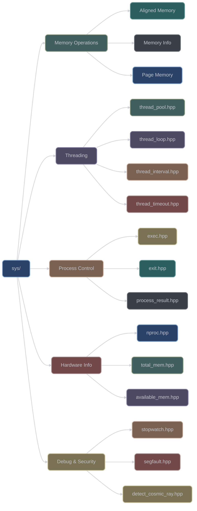
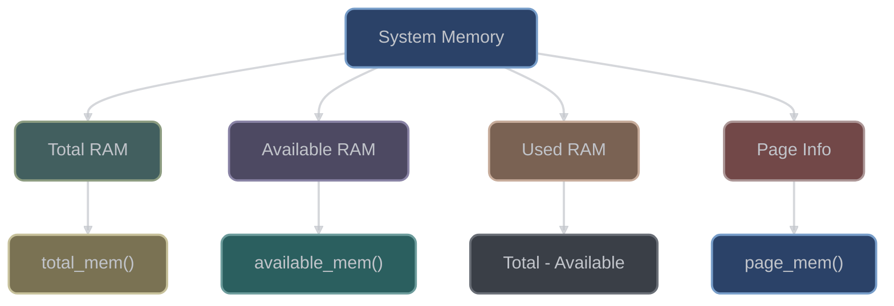

# System Utilities (`sys/`)

The `sys/` category provides low-level system interaction utilities. With 21 headers, it offers memory operations, threading utilities, process management, and hardware introspection capabilities.

## Overview



## Memory Operations

### Aligned Memory Functions

```cpp
#include <xieite/sys/aligned_memcpy.hpp>
#include <xieite/sys/aligned_memmove.hpp>
#include <xieite/sys/aligned_memset.hpp>
#include <xieite/sys/aligned_bzero.hpp>

// Aligned memory copy (optimized for alignment)
alignas(64) char src[1024];
alignas(64) char dst[1024];
xieite::aligned_memcpy(dst, src, 1024);

// Aligned memory move (handles overlapping)
xieite::aligned_memmove(dst + 100, dst, 500);

// Aligned memory set
xieite::aligned_memset(dst, 0xFF, 1024);

// Aligned zero memory
xieite::aligned_bzero(dst, 1024);
```

### Memory Information

```cpp
#include <xieite/sys/total_mem.hpp>
#include <xieite/sys/available_mem.hpp>
#include <xieite/sys/page_mem.hpp>

// Get total system memory
std::size_t total = xieite::total_mem();
std::cout << "Total memory: " << total / (1024*1024) << " MB\n";

// Get available memory
std::size_t available = xieite::available_mem();
std::cout << "Available: " << available / (1024*1024) << " MB\n";

// Get page size
std::size_t page_size = xieite::page_mem();
std::cout << "Page size: " << page_size << " bytes\n";
```

### Secure Memory Operations

```cpp
#include <xieite/sys/shredder.hpp>

// Secure memory erasure
class SecureData {
    char sensitive[1024];
    xieite::shredder<char[1024]> shred{&sensitive};

    // Memory is securely overwritten on destruction
};

// Manual secure wipe
{
    std::vector<std::byte> password(128);
    xieite::shredder shred(&password);
    // password is securely wiped when shred destructs
}
```

## Threading Utilities

### Thread Pool


```cpp
#include <xieite/sys/thread_pool.hpp>

// Create thread pool with hardware concurrency
xieite::thread_pool pool;

// Submit tasks
auto future1 = pool.submit([] {
    return compute_result();
});

auto future2 = pool.submit([](int x, int y) {
    return x + y;
}, 10, 20);

// Get results
auto result1 = future1.get();
auto result2 = future2.get();  // 30

// Adjust thread count
pool.set_threads(8);
```

### Thread Loop

```cpp
#include <xieite/sys/thread_loop.hpp>

// Create periodic task loop
xieite::thread_loop loop(
    std::chrono::seconds(1),  // Interval
    [] {
        update_metrics();
        return true;  // Continue looping
    }
);

// Stop loop
loop.stop();
```

### Thread Interval

```cpp
#include <xieite/sys/thread_interval.hpp>

// Execute at regular intervals
xieite::thread_interval interval(
    std::chrono::milliseconds(100),
    [] {
        poll_sensor();
    }
);

// Pause/resume
interval.pause();
process_data();
interval.resume();
```

### Thread Timeout

```cpp
#include <xieite/sys/thread_timeout.hpp>

// Execute with timeout
auto result = xieite::thread_timeout(
    std::chrono::seconds(5),
    [] {
        return long_computation();
    }
);

if (result) {
    use_value(*result);
} else {
    handle_timeout();
}
```

### Thread ID

```cpp
#include <xieite/sys/thread_id.hpp>

// Get numeric thread ID
std::size_t id = xieite::thread_id();
std::cout << "Thread ID: " << id << "\n";

// Use for thread-local storage indexing
thread_local_data[id] = value;
```

## Process Management

### Process Execution

```cpp
#include <xieite/sys/exec.hpp>
#include <xieite/sys/process_result.hpp>

// Execute command and capture output
xieite::process_result result = xieite::exec("ls -la");

std::cout << "Output: " << result.output() << "\n";
std::cout << "Exit code: " << result.exit_code() << "\n";

if (result.success()) {
    process_output(result.output());
}
```

### Process Status

```cpp
#include <xieite/sys/process_status.hpp>

// Check process exit status
xieite::process_status status = get_child_status();

if (status.exited()) {
    std::cout << "Exit code: " << status.exit_code() << "\n";
} else if (status.signaled()) {
    std::cout << "Killed by signal: " << status.signal() << "\n";
}
```

### Process Termination

```cpp
#include <xieite/sys/exit.hpp>

// Clean exit with status code
xieite::exit(0);  // Success

// Exit with error
xieite::exit(1, "Error message");

// Emergency exit (no cleanup)
xieite::quick_exit(2);
```

## Hardware Information

### CPU Information

```cpp
#include <xieite/sys/nproc.hpp>

// Get number of processors
std::size_t cpu_count = xieite::nproc();
std::cout << "CPU cores: " << cpu_count << "\n";

// Configure thread pool based on CPU count
thread_pool.set_threads(xieite::nproc());
```

### Memory Statistics



## Performance Monitoring

### Stopwatch

```cpp
#include <xieite/sys/stopwatch.hpp>

// Create stopwatch
xieite::stopwatch<std::chrono::high_resolution_clock> timer;

// Start timing
timer.start();

perform_operation();

// Get elapsed time
auto elapsed = timer.elapsed<std::chrono::milliseconds>();
std::cout << "Operation took: " << elapsed.count() << " ms\n";

// Lap timing
timer.start();
for (int i = 0; i < 10; ++i) {
    process_item(i);
    auto lap = timer.lap<std::chrono::microseconds>();
    std::cout << "Item " << i << ": " << lap.count() << " μs\n";
}

// Stop and get total
timer.stop();
auto total = timer.total<std::chrono::seconds>();
```

## Debug and Security

### Segmentation Fault Handler

```cpp
#include <xieite/sys/segfault.hpp>

// Install segfault handler
xieite::install_segfault_handler([]() {
    save_crash_dump();
    notify_crash_reporter();
});

// Trigger segfault for testing (debug builds only)
#ifdef DEBUG
xieite::segfault();  // Deliberate crash
#endif
```

### Cosmic Ray Detection

```cpp
#include <xieite/sys/detect_cosmic_ray.hpp>

// Detect bit flips in critical data
struct CriticalData {
    int value;
    int checksum;
};

bool verify_integrity(const CriticalData& data) {
    return !xieite::detect_cosmic_ray(
        data.value,
        data.checksum
    );
}

// Periodic integrity check
if (xieite::detect_cosmic_ray(memory_region)) {
    log_error("Possible bit flip detected!");
    reload_from_backup();
}
```

## Platform-Specific Features

### Memory Alignment

```cpp
// Platform-optimal alignment
constexpr std::size_t cache_line = xieite::cache_line_size;

alignas(cache_line) struct OptimizedData {
    std::atomic<int> counter;
    char padding[cache_line - sizeof(std::atomic<int>)];
};

// SIMD-friendly alignment
alignas(32) float vector_data[1024];
xieite::aligned_memcpy(dst, vector_data, sizeof(vector_data));
```

### System Limits

```cpp
// Check system constraints
if (xieite::available_mem() < required_memory) {
    reduce_cache_size();
}

if (xieite::nproc() >= 8) {
    enable_parallel_processing();
}

// Page-aligned allocation
std::size_t allocation_size =
    round_up_to_multiple(data_size, xieite::page_mem());
```

## Integration Examples

### Resource Monitor

```cpp
class ResourceMonitor {
    xieite::stopwatch<std::chrono::steady_clock> uptime;
    xieite::thread_interval monitor;

public:
    ResourceMonitor()
    : monitor(std::chrono::seconds(60), [this] {
        log_metrics();
    }) {
        uptime.start();
    }

    void log_metrics() {
        std::cout << "Uptime: "
                  << uptime.elapsed<std::chrono::hours>().count()
                  << " hours\n";
        std::cout << "Memory: "
                  << xieite::available_mem() / (1024*1024)
                  << " MB available\n";
        std::cout << "CPU cores: " << xieite::nproc() << "\n";
    }
};
```

### Parallel Task Processor

```cpp
class TaskProcessor {
    xieite::thread_pool pool{xieite::nproc()};
    xieite::stopwatch timer;

public:
    template<typename Range, typename Fn>
    void process_parallel(Range&& items, Fn&& fn) {
        timer.reset();
        timer.start();

        std::vector<std::future<void>> futures;
        for (auto& item : items) {
            futures.push_back(
                pool.submit(fn, std::ref(item))
            );
        }

        for (auto& f : futures) {
            f.wait();
        }

        timer.stop();
        std::cout << "Processed " << items.size()
                  << " items in "
                  << timer.total<std::chrono::milliseconds>().count()
                  << " ms\n";
    }
};
```

## Performance Characteristics

- **Thread Pool**: Work-stealing queue, minimal contention
- **Aligned Memory**: SIMD-optimized, cache-friendly
- **Stopwatch**: High-resolution timing, minimal overhead
- **Process Execution**: Efficient pipe handling
- **Memory Info**: Cached where possible

## Design Philosophy

The sys/ category follows these principles:

1. **Platform abstraction**: Hide OS-specific details
2. **Zero-overhead**: Minimal abstraction cost
3. **Resource safety**: RAII for all resources
4. **Thread safety**: Lock-free where possible
5. **Error handling**: Clear failure modes

## See Also

- [I/O Utilities](../io/README.md) - File and stream operations
- [Threading](../fn/README.md) - Functional threading utilities
- [Data Structures](../data/README.md) - Thread-safe containers
- [Math Functions](../math/README.md) - Hardware intrinsics
