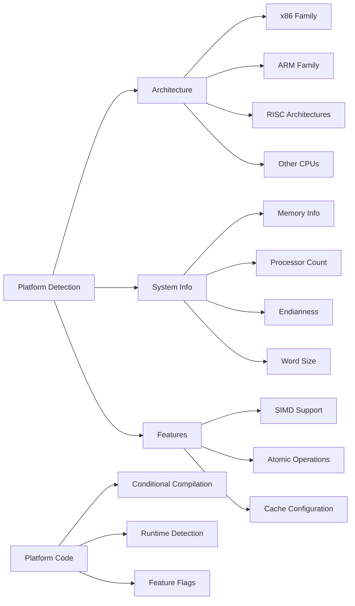

# Platform Detection

## Overview

XIEITE's platform detection system provides comprehensive compile-time identification of operating systems, architectures, compilers, and hardware characteristics. This enables portable code that adapts to different platforms automatically.

## Architecture Detection

### Supported Architectures
XIEITE detects over 50 different processor architectures:
```cpp
// Primary architectures
#if XIEITE_ARCH_TYPE_X86_64
    // 64-bit x86 code
#elif XIEITE_ARCH_TYPE_X86_32
    // 32-bit x86 code
#elif XIEITE_ARCH_TYPE_AARCH64
    // 64-bit ARM code
#elif XIEITE_ARCH_TYPE_AARCH32
    // 32-bit ARM code
#endif
```

### Architecture Version Detection
```cpp
// Check specific architecture versions
#if XIEITE_ARCH_VER(AARCH64, >=, 9, 0)
    // ARMv9 or later features
#elif XIEITE_ARCH_VER(AARCH64, >=, 8, 2)
    // ARMv8.2 or later features
#endif

// Version components
constexpr auto major = XIEITE_ARCH_MAJOR_X86_64;
constexpr auto minor = XIEITE_ARCH_MINOR_X86_64;
constexpr auto patch = XIEITE_ARCH_PATCH_X86_64;
```

### Architecture Categories
```cpp
// x86 Family
XIEITE_ARCH_TYPE_X86_32     // i386, i486, i586, i686
XIEITE_ARCH_TYPE_X86_64     // AMD64, x86-64, Intel 64

// ARM Family
XIEITE_ARCH_TYPE_AARCH32    // ARM 32-bit (ARMv2-ARMv7)
XIEITE_ARCH_TYPE_AARCH64    // ARM 64-bit (ARMv8+)

// PowerPC Family
XIEITE_ARCH_TYPE_POWERPC    // PowerPC, POWER
XIEITE_ARCH_TYPE_RS_6000    // IBM RS/6000

// MIPS Family
XIEITE_ARCH_TYPE_MIPS       // MIPS I-V, MIPS32, MIPS64

// RISC-V
XIEITE_ARCH_TYPE_RISC_V     // RISC-V 32/64-bit

// Other Architectures
XIEITE_ARCH_TYPE_SPARC      // SPARC v1-v9
XIEITE_ARCH_TYPE_IA64       // Intel Itanium
XIEITE_ARCH_TYPE_ALPHA      // DEC Alpha
XIEITE_ARCH_TYPE_PA_RISC    // HP PA-RISC
```

## System Information

### Processor Detection
```cpp
// Get number of processors
std::size_t nproc() noexcept;

// Usage
auto cpu_count = xieite::nproc();
std::cout << "System has " << cpu_count << " processors\n";

// Parallel processing
std::vector<std::thread> threads;
threads.reserve(xieite::nproc());
```

### Memory Information
```cpp
// Total system memory
std::size_t total_mem() noexcept;

// Available memory
std::size_t available_mem() noexcept;

// Page size
std::size_t page_mem() noexcept;

// Usage
auto total = xieite::total_mem();
auto available = xieite::available_mem();
auto page_size = xieite::page_mem();

std::cout << "Memory: " << available << "/" << total << " bytes\n";
std::cout << "Page size: " << page_size << " bytes\n";
```

### Thread Management
```cpp
// Get current thread ID
auto thread_id() noexcept;

// Thread pool for parallel execution
template<typename Func>
class thread_pool {
    explicit thread_pool(std::size_t threads = nproc());

    template<typename... Args>
    auto enqueue(Func&& f, Args&&... args);

    void wait_all();
};

// Usage
xieite::thread_pool pool(xieite::nproc());
for (int i = 0; i < tasks; ++i) {
    pool.enqueue([i] {
        process_task(i);
    });
}
pool.wait_all();
```

## Endianness Detection

### Compile-Time Endianness
```cpp
#include <xieite/pp/endian.hpp>

#if XIEITE_ENDIAN_LITTLE
    // Little-endian system
#elif XIEITE_ENDIAN_BIG
    // Big-endian system
#elif XIEITE_ENDIAN_PDP
    // PDP-endian (rare)
#endif

// Runtime check
constexpr bool is_little_endian() {
    constexpr std::uint32_t test = 1;
    return *reinterpret_cast<const std::uint8_t*>(&test) == 1;
}
```

### Word Size Detection
```cpp
#include <xieite/pp/word.hpp>

// Pointer size in bits
constexpr auto word_size = XIEITE_WORD;  // 32 or 64

#if XIEITE_WORD == 64
    using native_int = std::int64_t;
#else
    using native_int = std::int32_t;
#endif
```

## System Utilities

### Process Execution
```cpp
// Execute external process
struct process_result {
    int exit_code;
    std::string stdout;
    std::string stderr;
};

process_result exec(const std::string& command);

// Usage
auto result = xieite::exec("ls -la");
if (result.exit_code == 0) {
    std::cout << result.stdout;
} else {
    std::cerr << result.stderr;
}
```

### Process Control
```cpp
// Exit process
[[noreturn]] void exit(int code = 0);

// Force segmentation fault (for testing)
[[noreturn]] void segfault();

// Get process status
enum class process_status {
    running,
    stopped,
    zombie
};

process_status get_process_status(pid_t pid);
```

### Memory Operations
```cpp
// Aligned memory operations
void aligned_memcpy(void* dst, const void* src,
                   std::size_t size, std::size_t align);

void aligned_memset(void* dst, int value,
                   std::size_t size, std::size_t align);

void aligned_memmove(void* dst, const void* src,
                    std::size_t size, std::size_t align);

void aligned_bzero(void* dst, std::size_t size, std::size_t align);

// Secure memory erasure
template<typename T>
void shredder(T& data) {
    // Securely overwrite memory
    volatile auto* ptr = &data;
    std::memset(const_cast<T*>(ptr), 0, sizeof(T));
}
```

## Performance Monitoring

### Stopwatch Utility
```cpp
class stopwatch {
public:
    stopwatch() : start(now()) {}

    void reset() { start = now(); }

    template<typename Duration = std::chrono::milliseconds>
    auto elapsed() const {
        return std::chrono::duration_cast<Duration>(now() - start);
    }

private:
    using clock = std::chrono::high_resolution_clock;
    clock::time_point start;
    static auto now() { return clock::now(); }
};

// Usage
xieite::stopwatch timer;
expensive_operation();
auto ms = timer.elapsed<std::chrono::milliseconds>().count();
std::cout << "Operation took " << ms << "ms\n";
```

### Thread Timing
```cpp
// Execute function at intervals
template<typename Func, typename Duration>
class thread_interval {
    thread_interval(Func f, Duration interval);
    void stop();
};

// Execute with timeout
template<typename Func, typename Duration>
auto thread_timeout(Func f, Duration timeout)
    -> std::optional<decltype(f())>;

// Continuous loop
template<typename Func>
class thread_loop {
    thread_loop(Func f);
    void pause();
    void resume();
    void stop();
};

// Usage
xieite::thread_interval heartbeat([] {
    send_ping();
}, std::chrono::seconds(30));

auto result = xieite::thread_timeout([] {
    return compute_result();
}, std::chrono::seconds(5));

if (result) {
    use_result(*result);
} else {
    handle_timeout();
}
```

## Cosmic Ray Detection

### Hardware Error Detection
```cpp
// Detect potential bit flips
bool detect_cosmic_ray() {
    // Implementation uses redundant computation
    // and checksums to detect hardware errors
}

// Usage in critical systems
void critical_computation() {
    auto result1 = compute();
    auto result2 = compute();

    if (result1 != result2 || xieite::detect_cosmic_ray()) {
        // Potential hardware error detected
        retry_or_failover();
    }
}
```

## Platform-Specific Code

### Conditional Compilation
```cpp
// Architecture-specific optimizations
#if XIEITE_ARCH_TYPE_X86_64
    #include <immintrin.h>  // SIMD intrinsics

    void process_data(float* data, std::size_t size) {
        // Use AVX instructions
        for (std::size_t i = 0; i < size; i += 8) {
            __m256 vec = _mm256_load_ps(&data[i]);
            vec = _mm256_sqrt_ps(vec);
            _mm256_store_ps(&data[i], vec);
        }
    }
#elif XIEITE_ARCH_TYPE_AARCH64
    #include <arm_neon.h>

    void process_data(float* data, std::size_t size) {
        // Use NEON instructions
        for (std::size_t i = 0; i < size; i += 4) {
            float32x4_t vec = vld1q_f32(&data[i]);
            vec = vsqrtq_f32(vec);
            vst1q_f32(&data[i], vec);
        }
    }
#else
    void process_data(float* data, std::size_t size) {
        // Fallback implementation
        for (std::size_t i = 0; i < size; ++i) {
            data[i] = std::sqrt(data[i]);
        }
    }
#endif
```

### Feature Detection
```cpp
// CPU feature flags
constexpr bool has_sse2 = XIEITE_ARCH_TYPE_X86_64 ||
                          (XIEITE_ARCH_TYPE_X86_32 &&
                           XIEITE_ARCH_MAJOR_X86_32 >= 6);

constexpr bool has_neon = XIEITE_ARCH_TYPE_AARCH64 ||
                          (XIEITE_ARCH_TYPE_AARCH32 &&
                           XIEITE_ARCH_MAJOR_AARCH32 >= 7);

template<typename T>
void optimize_based_on_features(T* data, std::size_t size) {
    if constexpr (has_sse2) {
        process_with_sse2(data, size);
    } else if constexpr (has_neon) {
        process_with_neon(data, size);
    } else {
        process_generic(data, size);
    }
}
```

## Cross-Platform Abstractions

### Unified Memory Model
```cpp
// Platform-agnostic memory allocation
template<std::size_t Alignment = alignof(std::max_align_t)>
class aligned_allocator {
    void* allocate(std::size_t size);
    void deallocate(void* ptr);
};

// Cache line size detection
constexpr std::size_t cache_line_size() {
    #if XIEITE_ARCH_TYPE_X86_64 || XIEITE_ARCH_TYPE_X86_32
        return 64;
    #elif XIEITE_ARCH_TYPE_AARCH64
        return 128;
    #else
        return 64;  // Common default
    #endif
}

// Aligned data structure
template<typename T>
struct alignas(cache_line_size()) cache_aligned {
    T data;
};
```

## Best Practices

1. **Use compile-time detection** when possible
2. **Provide fallbacks** for unsupported platforms
3. **Test on multiple architectures** regularly
4. **Document platform requirements** clearly
5. **Avoid platform-specific code** unless necessary

## Common Pitfalls

1. **Assuming endianness** - Always check or use portable code
2. **Hard-coding sizes** - Use sizeof and alignof
3. **Missing feature detection** - Check capabilities
4. **Incomplete platform coverage** - Test edge cases

## Mermaid Diagram



## See Also

- [Preprocessor Utilities](../pp/README.md)
- [Architecture Detection](../pp/arch.md)
- [System API](../../reference/api/sys.md)
- [Cross-Platform Development](../../advanced/cross_platform.md)
