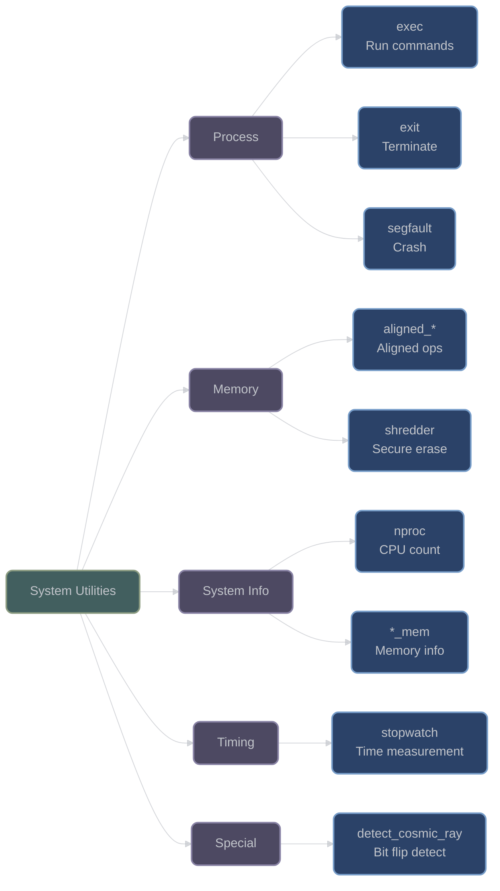

# System and Process Utilities

## Overview

XIEITE provides cross-platform system utilities for process execution, memory management, timing, and system information queries. These utilities abstract platform-specific operations behind consistent interfaces.

## Process Execution

### exec

**`xieite::exec(cmd)`** - Execute system command and capture output:
```cpp
[[nodiscard]] inline process_result exec(const std::string& cmd) noexcept;

struct process_result {
    std::string output;
    process_status status;
};

struct process_status {
    int code;
    bool success() const noexcept;
};
```

Executes commands and captures their output:

```cpp
// Execute simple command
auto result = xieite::exec("ls -la");
if (result.status.success()) {
    std::cout << "Files:\n" << result.output;
} else {
    std::cerr << "Command failed with code: " << result.status.code << '\n';
}

// Run with arguments
auto grep_result = xieite::exec("grep -r 'pattern' /path/to/search");

// Check Python version
auto py_version = xieite::exec("python --version");
std::cout << "Python: " << py_version.output;

// Pipeline commands
auto piped = xieite::exec("ps aux | grep chrome | wc -l");
int chrome_processes = std::stoi(piped.output);
```

### exit

**`xieite::exit(code)`** - Enhanced program termination:
```cpp
[[noreturn]] inline void exit(int code = 0) noexcept;
```

Provides consistent exit behavior:

```cpp
// Normal exit
xieite::exit(0);  // Success

// Error exit
if (critical_error) {
    xieite::exit(1);  // Error code
}

// Custom exit codes
enum ExitCode {
    SUCCESS = 0,
    INVALID_ARGS = 1,
    FILE_NOT_FOUND = 2,
    PERMISSION_DENIED = 3
};

xieite::exit(ExitCode::FILE_NOT_FOUND);
```

### segfault

**`xieite::segfault()`** - Intentionally trigger segmentation fault:
```cpp
[[noreturn]] inline void segfault() noexcept;
```

Useful for testing crash handlers:

```cpp
// Test crash handler
void test_crash_handler() {
    install_crash_handler();
    
    if (test_mode) {
        xieite::segfault();  // Trigger SIGSEGV
    }
}

// Debug assertion
#ifdef DEBUG
    if (invariant_violated) {
        xieite::segfault();  // Immediate crash for debugging
    }
#endif
```

## Memory Operations

### aligned_memcpy / aligned_memmove

**Aligned memory operations** for performance:
```cpp
template<std::size_t alignment>
void aligned_memcpy(void* dst, const void* src, std::size_t n) noexcept;

template<std::size_t alignment>
void aligned_memmove(void* dst, const void* src, std::size_t n) noexcept;
```

```cpp
// Aligned copy for SIMD operations
alignof(std::max_align_t) float src[1024];
alignof(std::max_align_t) float dst[1024];

xieite::aligned_memcpy<32>(dst, src, sizeof(src));

// Overlapping memory regions
char buffer[256];
xieite::aligned_memmove<16>(
    buffer + 64,
    buffer,
    128
);  // Safe for overlap
```

### aligned_memset / aligned_bzero

**Aligned memory initialization**:
```cpp
template<std::size_t alignment>
void aligned_memset(void* dst, int c, std::size_t n) noexcept;

template<std::size_t alignment>
void aligned_bzero(void* dst, std::size_t n) noexcept;
```

```cpp
// Initialize aligned buffer
alignof(64) char cache_line[64];
xieite::aligned_memset<64>(cache_line, 0xFF, sizeof(cache_line));

// Clear sensitive data
struct Credentials {
    alignof(16) char password[128];
};

Credentials creds;
xieite::aligned_bzero<16>(creds.password, sizeof(creds.password));
```

### shredder

**`xieite::shredder`** - Secure memory erasure:
```cpp
template<typename T>
struct shredder {
    T value;
    
    ~shredder() noexcept {
        // Secure overwrite of memory
    }
};
```

Automatically overwrites sensitive data:

```cpp
// Automatic secure erasure
{
    xieite::shredder<std::string> password;
    password.value = get_password();
    
    authenticate(password.value);
    
}  // Memory securely overwritten

// Array of sensitive data
xieite::shredder<std::array<uint8_t, 256>> key;
generate_key(key.value.data(), key.value.size());
// Key automatically shredded when out of scope
```

## System Information

### nproc

**`xieite::nproc()`** - Get processor count:
```cpp
[[nodiscard]] inline std::size_t nproc() noexcept;
```

```cpp
// Get CPU count
auto cpu_count = xieite::nproc();
std::cout << "CPUs: " << cpu_count << '\n';

// Configure thread pool
thread_pool pool(xieite::nproc());

// Parallel algorithm setup
auto num_workers = std::min(
    xieite::nproc(),
    work_items.size()
);
```

### total_mem / available_mem / page_mem

**Memory information queries**:
```cpp
[[nodiscard]] inline std::size_t total_mem() noexcept;
[[nodiscard]] inline std::size_t available_mem() noexcept;
[[nodiscard]] inline std::size_t page_mem() noexcept;
```

```cpp
// System memory info
auto total = xieite::total_mem();
auto available = xieite::available_mem();
auto page_size = xieite::page_mem();

std::cout << "Memory:\n"
          << "  Total: " << (total / (1024*1024)) << " MB\n"
          << "  Available: " << (available / (1024*1024)) << " MB\n"
          << "  Page size: " << page_size << " bytes\n";

// Adaptive buffer sizing
std::size_t buffer_size = std::min(
    xieite::available_mem() / 4,  // Use 25% of available
    1024 * 1024 * 1024  // Max 1GB
);

// Align to page boundaries
std::size_t aligned_size = 
    (buffer_size / xieite::page_mem()) * xieite::page_mem();
```

## Timing Utilities

### stopwatch

**`xieite::stopwatch<Clock>`** - High-precision timing:
```cpp
template<is_clock Clock = std::chrono::steady_clock>
struct stopwatch {
    void start() noexcept;
    void stop() noexcept;
    void reset() noexcept;
    
    template<is_duration Duration>
    Duration lap() const noexcept;
    
    template<is_duration Duration>
    Duration total() const noexcept;
};
```

Measure execution time:

```cpp
// Basic timing
xieite::stopwatch<> timer;

timer.start();
expensive_operation();
timer.stop();

auto elapsed = timer.total<std::chrono::milliseconds>();
std::cout << "Took " << elapsed.count() << " ms\n";

// Lap timing
xieite::stopwatch<> lap_timer;
lap_timer.start();

for (int i = 0; i < 10; ++i) {
    process_batch(i);
    auto lap = lap_timer.lap<std::chrono::microseconds>();
    std::cout << "Batch " << i << ": " << lap.count() << " μs\n";
}

auto total = lap_timer.total<std::chrono::seconds>();
std::cout << "Total: " << total.count() << " seconds\n";

// High-resolution timing
xieite::stopwatch<std::chrono::high_resolution_clock> hr_timer;
hr_timer.start();
short_operation();
auto nanos = hr_timer.total<std::chrono::nanoseconds>();
```

## Special Utilities

### detect_cosmic_ray

**`xieite::detect_cosmic_ray(bytes)`** - Bit flip detection:
```cpp
inline void detect_cosmic_ray(std::size_t bytes) noexcept;
```

Detects memory bit flips (cosmic ray events):

```cpp
// Monitor for bit flips
void integrity_monitor() {
    // Allocates zero-initialized memory and
    // continuously checks for non-zero values
    xieite::detect_cosmic_ray(1024 * 1024);  // 1MB monitor
    
    // If this returns, a bit flip was detected
    log_error("Memory corruption detected!");
    xieite::exit(99);
}

// Run in separate thread
std::thread monitor(integrity_monitor);
monitor.detach();
```

## Architecture Diagram



## Performance Considerations

- **Process Execution**: Fork/exec overhead on Unix, CreateProcess on Windows
- **Aligned Operations**: Can be significantly faster on aligned boundaries
- **Memory Queries**: Cached by OS, low overhead
- **Stopwatch**: Uses high-resolution clocks, minimal overhead
- **Shredder**: Multiple overwrites for security, some performance cost

## Best Practices

1. **Check process results**:
   ```cpp
   auto result = xieite::exec(cmd);
   if (!result.status.success()) {
       handle_error(result.status.code);
   }
   ```

2. **Use aligned operations for performance**:
   ```cpp
   // Align critical buffers
   alignof(64) char buffer[4096];
   xieite::aligned_memcpy<64>(dst, src, size);
   ```

3. **Secure sensitive data**:
   ```cpp
   xieite::shredder<SecretKey> key;
   // Automatically erased
   ```

4. **Time critical sections**:
   ```cpp
   xieite::stopwatch timer;
   timer.start();
   // Critical code
   auto elapsed = timer.total<std::chrono::microseconds>();
   ```

---

*Next: [Threading Utilities](threading_utilities.md)*