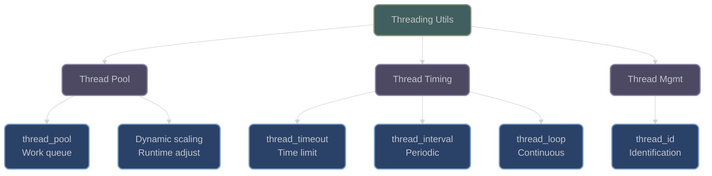

# Threading and Concurrency Utilities

## Overview

XIEITE provides advanced threading utilities including thread pools, timed execution, and thread management. These utilities simplify concurrent programming and provide robust patterns for parallel execution.

## Thread Pool

### thread_pool

**`xieite::thread_pool`** - Scalable work queue with dynamic thread management:
```cpp
struct thread_pool {
    explicit thread_pool(std::size_t threads = std::thread::hardware_concurrency());

    void set_threads(std::size_t threads) noexcept;
    std::size_t get_threads() const noexcept;

    template<std::invocable<> Fn>
    std::future<void> enqueue(Fn&& fn) noexcept;
};
```

Key features:
- **Dynamic scaling**: Add/remove threads at runtime
- **Work stealing**: Efficient task distribution
- **Future-based**: Return futures for synchronization
- **RAII cleanup**: Automatic thread joining

```cpp
// Create pool with optimal thread count
xieite::thread_pool pool;

// Enqueue simple task
auto future = pool.enqueue([] {
    std::cout << "Task executing on thread "
              << std::this_thread::get_id() << '\n';
});

// Wait for completion
future.wait();

// Parallel processing
std::vector<std::future<void>> futures;
for (int i = 0; i < 100; ++i) {
    futures.push_back(
        pool.enqueue([i] {
            process_item(i);
        })
    );
}

// Wait for all tasks
for (auto& f : futures) {
    f.wait();
}

// Dynamic scaling
if (heavy_load) {
    pool.set_threads(xieite::nproc() * 2);  // Double threads
} else {
    pool.set_threads(2);  // Reduce to 2 threads
}
```

#### Advanced Usage

```cpp
// Result-returning tasks (via shared state)
struct ResultPool {
    xieite::thread_pool pool;

    template<typename Fn>
    auto enqueue(Fn&& fn) -> std::future<decltype(fn())> {
        auto task = std::make_shared<
            std::packaged_task<decltype(fn())()>
        >(std::forward<Fn>(fn));

        auto future = task->get_future();
        pool.enqueue([task] { (*task)(); });
        return future;
    }
};

ResultPool rpool;
auto result = rpool.enqueue([] {
    return compute_value();
});
int value = result.get();

// Map-reduce pattern
template<typename Container, typename Mapper>
auto parallel_map(Container& data, Mapper mapper) {
    xieite::thread_pool pool;
    std::vector<std::future<void>> futures;

    for (auto& item : data) {
        futures.push_back(
            pool.enqueue([&item, mapper] {
                item = mapper(item);
            })
        );
    }

    for (auto& f : futures) {
        f.wait();
    }
}
```

## Thread Timing

### thread_timeout

**`xieite::thread_timeout`** - Execute with timeout:
```cpp
template<typename Fn>
struct thread_timeout {
    thread_timeout(Fn&& fn, std::chrono::milliseconds timeout);

    bool completed() const noexcept;
    void cancel() noexcept;
};
```

```cpp
// Run with timeout
xieite::thread_timeout task(
    [] {
        long_running_operation();
    },
    std::chrono::seconds(30)
);

// Check completion
if (!task.completed()) {
    std::cerr << "Operation timed out\n";
    task.cancel();
}

// Timeout with retry
bool success = false;
for (int attempt = 0; attempt < 3 && !success; ++attempt) {
    xieite::thread_timeout download(
        [&success] {
            success = download_file();
        },
        std::chrono::seconds(10)
    );

    if (!download.completed()) {
        std::cout << "Attempt " << attempt + 1 << " timed out\n";
    }
}
```

### thread_interval

**`xieite::thread_interval`** - Periodic execution:
```cpp
template<typename Fn>
struct thread_interval {
    thread_interval(Fn&& fn, std::chrono::milliseconds interval);

    void start() noexcept;
    void stop() noexcept;
    void set_interval(std::chrono::milliseconds interval) noexcept;
};
```

```cpp
// Periodic task
xieite::thread_interval heartbeat(
    [] {
        send_heartbeat();
        check_connection();
    },
    std::chrono::seconds(5)
);

heartbeat.start();

// Monitoring task
struct Monitor {
    xieite::thread_interval checker;

    Monitor() : checker(
        [this] { check_system(); },
        std::chrono::seconds(1)
    ) {
        checker.start();
    }

    void check_system() {
        auto mem = xieite::available_mem();
        if (mem < threshold) {
            alert_low_memory();
        }
    }
};

// Dynamic interval adjustment
auto sampler = xieite::thread_interval(
    collect_metrics,
    std::chrono::milliseconds(100)
);

if (high_precision_mode) {
    sampler.set_interval(std::chrono::milliseconds(10));
} else {
    sampler.set_interval(std::chrono::seconds(1));
}
```

### thread_loop

**`xieite::thread_loop`** - Continuous execution:
```cpp
template<typename Fn>
struct thread_loop {
    thread_loop(Fn&& fn);

    void start() noexcept;
    void stop() noexcept;
    bool running() const noexcept;
};
```

```cpp
// Event processing loop
xieite::thread_loop event_processor(
    [] {
        if (auto event = poll_event()) {
            handle_event(*event);
        } else {
            std::this_thread::yield();
        }
    }
);

event_processor.start();

// Producer-consumer pattern
std::queue<Task> task_queue;
std::mutex queue_mutex;

xieite::thread_loop consumer(
    [&] {
        std::unique_lock lock(queue_mutex);
        if (!task_queue.empty()) {
            auto task = task_queue.front();
            task_queue.pop();
            lock.unlock();

            process_task(task);
        }
    }
);

consumer.start();
```

## Thread Management

### thread_id

**`xieite::thread_id`** - Enhanced thread identification:
```cpp
struct thread_id {
    thread_id() noexcept;  // Current thread
    thread_id(const std::thread& t) noexcept;

    std::size_t hash() const noexcept;
    std::string str() const noexcept;

    bool operator==(const thread_id&) const noexcept;
};
```

```cpp
// Get current thread ID
xieite::thread_id current;
std::cout << "Thread: " << current.str() << '\n';

// Thread-local storage with ID
std::unordered_map<xieite::thread_id, ThreadData> tls;

void thread_function() {
    xieite::thread_id id;
    tls[id] = ThreadData{...};

    // Use thread-specific data
    auto& data = tls[id];
}

// Thread naming/tracking
struct ThreadRegistry {
    std::map<xieite::thread_id, std::string> names;

    void register_thread(const std::string& name) {
        names[xieite::thread_id()] = name;
    }

    std::string current_name() {
        return names[xieite::thread_id()];
    }
};
```

## Usage Patterns

### Task Parallelization

```cpp
template<typename It, typename Fn>
void parallel_for_each(It begin, It end, Fn fn) {
    xieite::thread_pool pool;
    std::vector<std::future<void>> futures;

    for (auto it = begin; it != end; ++it) {
        futures.push_back(
            pool.enqueue([it, fn] { fn(*it); })
        );
    }

    for (auto& f : futures) {
        f.wait();
    }
}

// Usage
std::vector<Data> dataset;
parallel_for_each(dataset.begin(), dataset.end(),
    [](Data& d) { d.process(); }
);
```

### Pipeline Processing

```cpp
class Pipeline {
    xieite::thread_pool pool;

    template<typename In, typename Out, typename Fn>
    std::future<Out> stage(std::future<In> input, Fn fn) {
        auto task = std::make_shared<std::packaged_task<Out()>>(
            [input = std::move(input), fn] {
                return fn(input.get());
            }
        );

        auto output = task->get_future();
        pool.enqueue([task] { (*task)(); });
        return output;
    }

public:
    template<typename T>
    auto process(T input) {
        auto stage1 = std::async(std::launch::deferred,
            [input] { return preprocess(input); }
        );

        auto stage2 = stage(std::move(stage1), transform);
        auto stage3 = stage(std::move(stage2), postprocess);

        return stage3;
    }
};
```

## Architecture Diagram



## Performance Considerations

- **Thread Pool**: Reuses threads, avoids creation overhead
- **Work Stealing**: Balances load across threads
- **Futures**: Lightweight synchronization
- **Interval/Loop**: Efficient sleep/wake cycles
- **Thread ID**: Cached for performance

## Best Practices

1. **Size thread pools appropriately**:
   ```cpp
   // CPU-bound tasks
   xieite::thread_pool cpu_pool(xieite::nproc());

   // I/O-bound tasks
   xieite::thread_pool io_pool(xieite::nproc() * 2);
   ```

2. **Handle timeouts gracefully**:
   ```cpp
   xieite::thread_timeout task(long_op, timeout);
   if (!task.completed()) {
       fallback_action();
   }
   ```

3. **Clean shutdown for intervals**:
   ```cpp
   class Service {
       xieite::thread_interval monitor;

       ~Service() {
           monitor.stop();  // Clean shutdown
       }
   };
   ```

4. **Use appropriate timing utilities**:
   ```cpp
   // One-shot with timeout: thread_timeout
   // Repeated execution: thread_interval
   // Continuous processing: thread_loop
   ```

---

*Next: [System Module Summary](index.md)*
