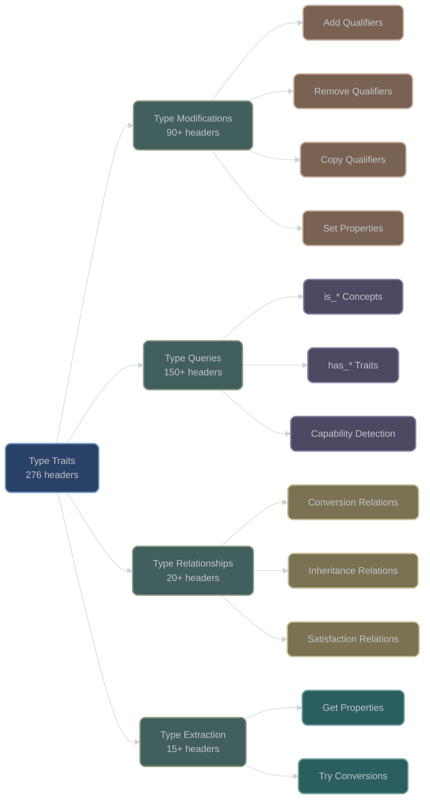

# Type Traits (trait/)

## Overview

The type traits category is the largest component of XIEITE with 276 header files, providing an extensive collection of C++20 concepts, type transformations, and metaprogramming utilities. This comprehensive trait system extends and enhances the standard library's type traits with more expressive concepts and powerful type manipulation capabilities.

## Directory Structure

```
include/xieite/trait/
├── Type Modifications (90+ headers)
│   ├── add_*.hpp     # Add qualifiers/references
│   ├── rm_*.hpp      # Remove qualifiers/references
│   ├── cp_*.hpp      # Copy qualifiers/references
│   └── set_*.hpp     # Set qualifiers/references
├── Type Queries (150+ headers)
│   ├── is_*.hpp      # Type property checks
│   ├── has_*.hpp     # Feature detection
│   └── maybe_*.hpp   # Conditional types
├── Type Relationships (20+ headers)
│   ├── Conversion traits
│   ├── Inheritance traits
│   └── Satisfaction traits
└── Type Extraction (15+ headers)
    ├── get_*.hpp     # Extract type properties
    └── try_*.hpp     # Safe type conversions
```

## Core Design Principles

### 1. Concept-First Approach

All type queries are implemented as C++20 concepts for maximum expressiveness:

```cpp
// Traditional type trait
template<typename T>
struct is_integral : std::bool_constant<...> {};

// XIEITE concept approach
template<typename T>
concept is_int = std::integral<T>;  // Direct and composable
```

### 2. Comprehensive Coverage

XIEITE provides traits for every combination of CV-qualifiers and references:

| Base | const | volatile | const volatile |
|------|-------|----------|----------------|
| T | const T | volatile T | const volatile T |
| T& | const T& | volatile T& | const volatile T& |
| T&& | const T&& | volatile T&& | const volatile T&& |

### 3. Referent Operations

Unique to XIEITE, referent operations modify the referred-to type:

```cpp
// Standard: adds const to the reference itself
using type1 = std::add_const_t<int&>;  // int& (no change)

// XIEITE: adds const to the referent
using type2 = xieite::add_c_referent<int&>;  // const int&
```

## Trait Categories Visualization



## Major Trait Groups

### 1. Type Modification Traits (add_*, rm_*, cp_*, set_*)

#### Adding Qualifiers and References

| Trait | Purpose | Example |
|-------|---------|---------|
| `add_c<T>` | Add const | `int` → `const int` |
| `add_v<T>` | Add volatile | `int` → `volatile int` |
| `add_cv<T>` | Add const volatile | `int` → `const volatile int` |
| `add_lref<T>` | Add lvalue reference | `int` → `int&` |
| `add_rref<T>` | Add rvalue reference | `int` → `int&&` |
| `add_ptr<T>` | Add pointer level | `int` → `int*` |

#### Referent Modifiers (Unique to XIEITE)

| Trait | Purpose | Example |
|-------|---------|---------|
| `add_c_referent<T>` | Add const to referent | `int&` → `const int&` |
| `add_v_referent<T>` | Add volatile to referent | `int&` → `volatile int&` |
| `add_lref_referent<T>` | Convert referent to lvalue ref | `int*&` → `int&` |
| `add_rref_referent<T>` | Convert referent to rvalue ref | `int*&` → `int&&` |
| `add_noex_referent<T>` | Add noexcept to function referent | `void(&)()` → `void(&)() noexcept` |

#### Removing Qualifiers

| Trait | Purpose | Example |
|-------|---------|---------|
| `rm_c<T>` | Remove const | `const int` → `int` |
| `rm_v<T>` | Remove volatile | `volatile int` → `int` |
| `rm_cv<T>` | Remove const volatile | `const volatile int` → `int` |
| `rm_ref<T>` | Remove reference | `int&` → `int` |
| `rm_ptr<T>` | Remove pointer | `int*` → `int` |

#### Copying Qualifiers

| Trait | Purpose | Example |
|-------|---------|---------|
| `cp_cv<From, To>` | Copy CV qualifiers | `const int, float` → `const float` |
| `cp_ref<From, To>` | Copy reference type | `int&, float` → `float&` |
| `cp_ptr<From, To>` | Copy pointer levels | `int**, float` → `float**` |

### 2. Type Query Concepts (is_*)

#### Fundamental Type Checks

**Source**: `include/xieite/trait/is_*.hpp`

| Concept | Checks For | Implementation |
|---------|------------|----------------|
| `is_arith` | Arithmetic types | `std::integral<T> \|\| std::floating_point<T>` |
| `is_int` | Integer types | `std::integral<T>` |
| `is_char` | Character types | `std::same_as<T, char> \|\| ...` |
| `is_bool_testable` | Boolean convertible | `requires(T t) { static_cast<bool>(t); }` |
| `is_void` | Void type | `std::same_as<std::remove_cv_t<T>, void>` |

#### Container and Range Concepts

| Concept | Checks For | Standard Equivalent |
|---------|------------|---------------------|
| `is_range` | Range type | `std::ranges::range<T>` |
| `is_sized_range` | Sized range | `std::ranges::sized_range<T>` |
| `is_input_range` | Input iterator range | `std::ranges::input_range<T>` |
| `is_fwd_range` | Forward range | `std::ranges::forward_range<T>` |
| `is_bidirect_range` | Bidirectional range | `std::ranges::bidirectional_range<T>` |
| `is_random_access_range` | Random access | `std::ranges::random_access_range<T>` |
| `is_contig_range` | Contiguous range | `std::ranges::contiguous_range<T>` |

#### Stream Concepts

**Source**: `include/xieite/trait/is_streamable_*.hpp`

```cpp
template<typename T>
concept is_streamable_out = requires(T x, std::ostream os) {
    { os << x } -> std::convertible_to<std::ostream&>;
};

template<typename T>
concept is_streamable_in = requires(T x, std::istream is) {
    { is >> x } -> std::convertible_to<std::istream&>;
};
```

#### Advanced Type Properties

| Concept | Checks For | Use Case |
|---------|------------|----------|
| `is_complete<T>` | Complete type | Template validation |
| `is_decayed<T>` | Already decayed | Perfect forwarding |
| `is_specialization<T, Template>` | Template instance | Template detection |
| `is_clock<T>` | Clock type | Chrono validation |
| `is_duration<T>` | Duration type | Time utilities |
| `is_ratio<T>` | Ratio type | Compile-time fractions |

### 3. Capability Detection (has_*)

#### Constructor Detection

| Trait | Detects | Example Usage |
|-------|---------|---------------|
| `has_default_ctor<T>` | Default constructor | Container requirements |
| `has_cp_ctor<T>` | Copy constructor | Value semantics |
| `has_mv_ctor<T>` | Move constructor | Move semantics |
| `has_ctor<T, Args...>` | Specific constructor | Factory patterns |
| `has_brace_ctor<T, Args...>` | Brace initialization | Aggregate detection |

#### Assignment Detection

| Trait | Detects | Example Usage |
|-------|---------|---------------|
| `has_cp_assign<T>` | Copy assignment | Container elements |
| `has_mv_assign<T>` | Move assignment | Performance optimization |
| `has_noex_mv_assign<T>` | Noexcept move assignment | Strong guarantee |

#### Destructor Properties

| Trait | Detects | Example Usage |
|-------|---------|---------------|
| `has_dtor<T>` | Has destructor | RAII validation |
| `has_noex_dtor<T>` | Noexcept destructor | Exception safety |
| `has_trivial_dtor<T>` | Trivial destructor | Optimization |
| `has_virtual_dtor<T>` | Virtual destructor | Polymorphic base |

### 4. Type Relationships

#### Conversion Relations

**Source**: `include/xieite/trait/is_conv_*.hpp`

```cpp
template<typename From, typename To>
concept is_conv_to = std::convertible_to<From, To>;

template<typename From, typename To>
concept is_noex_conv_to = is_conv_to<From, To> &&
    requires { requires noexcept(static_cast<To>(std::declval<From>())); };
```

#### Inheritance Relations

| Concept | Checks | Example |
|---------|--------|---------|
| `is_base<Base, Derived>` | Base class of | Polymorphism |
| `is_derived_from<D, B>` | Derived from | Type hierarchies |
| `is_derived_from_any<D, Bs...>` | Any base | Multiple inheritance |

#### Satisfaction Relations

**Source**: `include/xieite/trait/is_satisf*.hpp`

```cpp
// Check if type satisfies a callable constraint
template<auto fn, typename... Ts>
concept is_satisfied = requires {
    fn.template operator()<Ts...>();
};

// Check multiple constraints
template<typename T, auto... fns>
concept is_satisfies = (... && is_satisfied<fns, T>);
```

### 5. Special Traits

#### Composite Reference Types

XIEITE introduces composite reference qualifiers:

| Trait | Meaning | Example |
|-------|---------|---------|
| `is_clref<T>` | const lvalue ref | `const T&` |
| `is_vlref<T>` | volatile lvalue ref | `volatile T&` |
| `is_cvlref<T>` | const volatile lvalue ref | `const volatile T&` |
| `is_crref<T>` | const rvalue ref | `const T&&` |
| `is_vrref<T>` | volatile rvalue ref | `volatile T&&` |
| `is_cvrref<T>` | const volatile rvalue ref | `const volatile T&&` |

#### Template Detection

```cpp
template<typename T, template<typename...> class Tmpl>
concept is_template = /* implementation */;

template<typename T, template<typename...> class... Tmpls>
concept is_template_any = (... || is_template<T, Tmpls>);
```

## Implementation Patterns

### Pattern 1: Concept Definitions

Most traits are implemented as concepts for composability:

```cpp
// Simple concept
template<typename T>
concept is_integral = std::integral<T>;

// Composite concept
template<typename T>
concept is_signed_integral = is_integral<T> && std::signed_integral<T>;

// Constraint-based concept
template<typename T>
concept is_printable = requires(T t) {
    { std::cout << t } -> std::same_as<std::ostream&>;
};
```

### Pattern 2: Type Aliases

Type transformations use alias templates:

```cpp
template<typename T>
using add_const = T const;

template<typename T>
using remove_ref = std::remove_reference_t<T>;
```

### Pattern 3: SFINAE-Friendly Detection

All detection traits are SFINAE-friendly:

```cpp
template<typename T>
concept has_size = requires(T t) {
    { t.size() } -> std::convertible_to<std::size_t>;
};

// Usage in SFINAE context
template<typename T>
auto process(T&& t) -> std::enable_if_t<has_size<T>, size_t> {
    return t.size();
}
```

### Pattern 4: Referent Operations

Unique pattern for operating on referred-to types:

```cpp
template<typename T>
struct add_const_referent {
    using type = T;
};

template<typename T>
struct add_const_referent<T&> {
    using type = const T&;
};

template<typename T>
struct add_const_referent<T&&> {
    using type = const T&&;
};
```

## Usage Examples

### Basic Type Queries

```cpp
#include <xieite/trait/is_arith.hpp>
#include <xieite/trait/is_streamable_out.hpp>

template<typename T>
    requires xieite::is_arith<T>
auto square(T value) {
    return value * value;
}

template<typename T>
    requires xieite::is_streamable_out<T>
void print(const T& value) {
    std::cout << value << '\n';
}
```

### Type Modification

```cpp
#include <xieite/trait/add_c_referent.hpp>
#include <xieite/trait/cp_cv.hpp>

// Add const to what reference points to
using const_ref = xieite::add_c_referent<int&>;  // const int&

// Copy CV qualifiers
using copied = xieite::cp_cv<const volatile int, float>;  // const volatile float
```

### Advanced Detection

```cpp
#include <xieite/trait/has_noex_mv_ctor.hpp>
#include <xieite/trait/is_satisfies.hpp>

template<typename T>
    requires xieite::has_noex_mv_ctor<T>
class OptimizedContainer {
    // Can provide strong exception guarantee
};

// Multiple constraint checking
auto constraint1 = []<typename T> requires std::integral<T> {};
auto constraint2 = []<typename T> requires (sizeof(T) == 4) {};

template<typename T>
    requires xieite::is_satisfies<T, constraint1, constraint2>
void process(T value) {
    // T must be integral AND 4 bytes
}
```

## Performance Characteristics

| Operation | Cost | Notes |
|-----------|------|-------|
| Concept evaluation | Compile-time only | Zero runtime overhead |
| Type alias resolution | Compile-time only | No code generation |
| SFINAE detection | Compile-time only | May increase compile time |
| Referent operations | Compile-time only | Pure type manipulation |

## Compiler Requirements

| Feature | Minimum Standard | Compiler Support |
|---------|------------------|------------------|
| Concepts | C++20 | GCC 10+, Clang 12+, MSVC 19.29+ |
| Alias templates | C++11 | All modern compilers |
| Variable templates | C++14 | All modern compilers |
| Fold expressions | C++17 | Used in variadic traits |

## Best Practices

1. **Prefer Concepts over Type Traits**: Use `xieite::is_integral<T>` in requires clauses
2. **Use Referent Operations for References**: Modify what references point to, not references themselves
3. **Compose Concepts**: Build complex requirements from simple concepts
4. **SFINAE-Friendly Code**: All traits work in SFINAE contexts
5. **Avoid Unnecessary Detection**: Don't check properties guaranteed by other constraints

## Common Pitfalls

1. **Reference Collapse**: Be aware of reference collapsing rules
2. **CV-Qualification of References**: References themselves can't be CV-qualified
3. **Decay vs Remove**: Understand the difference between decay and remove operations
4. **Concept Subsumption**: Order constraints from most to least specific

## Advanced Features

### Satisfaction Checking

The satisfaction system allows runtime-like constraint checking at compile time:

```cpp
auto is_small = []<typename T> requires (sizeof(T) <= 8) {};
auto is_trivial = []<typename T> requires std::is_trivial_v<T> {};

static_assert(xieite::is_satisfied<is_small, int>);
static_assert(xieite::is_satisfies<int, is_small, is_trivial>);
```

### Type List Operations

Though primarily in meta/, traits support type list operations:

```cpp
template<typename T>
concept is_any_of = xieite::is_same_any<T, int, float, double>;
```

### Enum Validation

```cpp
template<typename E>
concept is_enum_value = xieite::is_enum<E> && requires(E e) {
    requires (static_cast<std::underlying_type_t<E>>(e) >= 0);
};
```

## Integration with Standard Library

XIEITE traits seamlessly integrate with standard library traits:

```cpp
// Combining XIEITE and standard traits
template<typename T>
concept my_concept =
    xieite::is_arith<T> &&           // XIEITE concept
    std::is_trivially_copyable_v<T> && // Standard trait
    xieite::has_noex_dtor<T>;        // XIEITE trait
```

## Migration from Standard Traits

| Standard Library | XIEITE Equivalent | Benefits |
|------------------|-------------------|----------|
| `std::is_arithmetic` | `xieite::is_arith` | Concept, composable |
| `std::add_const` | `xieite::add_c` | Shorter name, referent version |
| `std::is_convertible` | `xieite::is_conv_to` | Concept, noexcept version |
| `std::has_virtual_destructor` | `xieite::has_virtual_dtor` | Consistent naming |

---

*Next: [Type Modification Traits](modification.md)*
