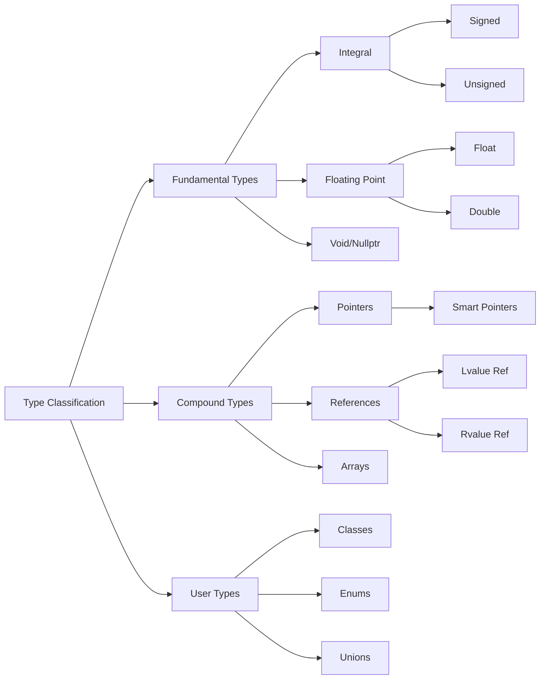

# Type Classification

## Overview

XIEITE's type classification traits provide comprehensive type categorization beyond the standard library, enabling precise type discrimination for template metaprogramming and compile-time decision making.

## Classification Categories

### Fundamental Type Classification

XIEITE extends std:: traits with more granular classification:

```cpp
// Standard library provides
static_assert(std::is_integral_v<int>);
static_assert(std::is_floating_point_v<double>);

// XIEITE adds finer distinctions
static_assert(xieite::is_signed_integral_v<int>);
static_assert(xieite::is_unsigned_integral_v<unsigned>);
static_assert(xieite::is_character_v<char>);
static_assert(xieite::is_byte_v<std::byte>);
```

### Extended Type Categories

#### Smart Pointer Classification
```cpp
template<typename T>
concept is_unique_ptr = xieite::is_unique_ptr_v<T>;

template<typename T>
concept is_shared_ptr = xieite::is_shared_ptr_v<T>;

template<typename T>
concept is_weak_ptr = xieite::is_weak_ptr_v<T>;

template<typename T>
concept is_smart_ptr = is_unique_ptr<T> || is_shared_ptr<T> || is_weak_ptr<T>;
```

#### Container Classification
```cpp
template<typename T>
concept is_sequence_container = xieite::is_vector_v<T> ||
                                xieite::is_deque_v<T> ||
                                xieite::is_list_v<T>;

template<typename T>
concept is_associative_container = xieite::is_set_v<T> ||
                                   xieite::is_map_v<T> ||
                                   xieite::is_multiset_v<T> ||
                                   xieite::is_multimap_v<T>;

template<typename T>
concept is_unordered_container = xieite::is_unordered_set_v<T> ||
                                 xieite::is_unordered_map_v<T>;
```

#### String Type Classification
```cpp
static_assert(xieite::is_string_v<std::string>);
static_assert(xieite::is_string_view_v<std::string_view>);
static_assert(xieite::is_c_string_v<const char*>);
static_assert(xieite::is_string_like_v<std::string>);  // Any string type
```

## Implementation Patterns

### Primary Template Pattern
```cpp
template<typename T>
struct is_vector : std::false_type {};

template<typename T, typename Alloc>
struct is_vector<std::vector<T, Alloc>> : std::true_type {};

template<typename T>
inline constexpr bool is_vector_v = is_vector<T>::value;
```

### Concept-Based Classification
```cpp
template<typename T>
concept is_range = requires(T t) {
    std::begin(t);
    std::end(t);
};

template<typename T>
concept is_sized_range = is_range<T> && requires(T t) {
    std::size(t);
};
```

### SFINAE Detection
```cpp
template<typename T, typename = void>
struct is_complete : std::false_type {};

template<typename T>
struct is_complete<T, std::void_t<decltype(sizeof(T))>> : std::true_type {};
```

## Numeric Type Classification

### Integer Subtypes
```cpp
template<typename T>
concept is_int8 = std::same_as<T, int8_t> || std::same_as<T, uint8_t>;

template<typename T>
concept is_int16 = std::same_as<T, int16_t> || std::same_as<T, uint16_t>;

template<typename T>
concept is_int32 = std::same_as<T, int32_t> || std::same_as<T, uint32_t>;

template<typename T>
concept is_int64 = std::same_as<T, int64_t> || std::same_as<T, uint64_t>;
```

### Floating-Point Subtypes
```cpp
template<typename T>
concept is_binary_float = std::is_floating_point_v<T> &&
                          std::numeric_limits<T>::is_iec559;

template<typename T>
concept is_extended_float = std::is_same_v<T, long double> &&
                            sizeof(long double) > sizeof(double);
```

## Function Type Classification

### Callable Classification
```cpp
template<typename T>
concept is_function_pointer = std::is_pointer_v<T> &&
                              std::is_function_v<std::remove_pointer_t<T>>;

template<typename T>
concept is_member_function_pointer = std::is_member_function_pointer_v<T>;

template<typename T>
concept is_functor = requires(T t) {
    &T::operator();  // Has operator()
};

template<typename T>
concept is_callable = is_function_pointer<T> ||
                      is_member_function_pointer<T> ||
                      is_functor<T>;
```

### Lambda Detection
```cpp
template<typename T>
concept is_lambda = is_functor<T> &&
                   !std::is_function_v<T> &&
                   !std::is_member_function_pointer_v<T>;

template<typename T>
concept is_generic_lambda = is_lambda<T> && requires {
    typename T::template operator()<int>;
    typename T::template operator()<double>;
};
```

## Memory Layout Classification

### Trivial Type Categories
```cpp
template<typename T>
concept is_trivially_copyable = std::is_trivially_copyable_v<T>;

template<typename T>
concept is_standard_layout = std::is_standard_layout_v<T>;

template<typename T>
concept is_pod = is_trivially_copyable<T> && is_standard_layout<T>;

template<typename T>
concept is_aggregate = std::is_aggregate_v<T>;
```

### Alignment Classification
```cpp
template<typename T>
concept is_overaligned = alignof(T) > alignof(std::max_align_t);

template<typename T>
concept is_cache_aligned = alignof(T) >= std::hardware_destructive_interference_size;
```

## CV-Qualifier Classification

### Extended CV Detection
```cpp
template<typename T>
concept is_const_qualified = std::is_const_v<std::remove_reference_t<T>>;

template<typename T>
concept is_volatile_qualified = std::is_volatile_v<std::remove_reference_t<T>>;

template<typename T>
concept is_cv_qualified = is_const_qualified<T> || is_volatile_qualified<T>;

template<typename T>
concept is_mutable = !is_const_qualified<T>;
```

## Reference Classification

### Reference Categories
```cpp
template<typename T>
concept is_lvalue_reference = std::is_lvalue_reference_v<T>;

template<typename T>
concept is_rvalue_reference = std::is_rvalue_reference_v<T>;

template<typename T>
concept is_forwarding_reference =
    is_rvalue_reference<T> &&
    !std::is_const_v<std::remove_reference_t<T>>;
```

## Composite Classifications

### Complex Type Categories
```cpp
template<typename T>
concept is_arithmetic_like = std::is_arithmetic_v<T> ||
                             requires(T a, T b) {
                                 { a + b } -> std::convertible_to<T>;
                                 { a - b } -> std::convertible_to<T>;
                                 { a * b } -> std::convertible_to<T>;
                                 { a / b } -> std::convertible_to<T>;
                             };

template<typename T>
concept is_string_convertible = requires(T t) {
    { std::to_string(t) } -> std::convertible_to<std::string>;
} || requires(T t) {
    { std::string(t) } -> std::convertible_to<std::string>;
};
```

## Usage Examples

### Template Specialization
```cpp
template<typename T>
class serializer {
    void serialize(const T& value) {
        if constexpr (xieite::is_trivially_copyable<T>) {
            // Direct memory copy
            write_bytes(&value, sizeof(T));
        } else if constexpr (xieite::is_container_v<T>) {
            // Serialize container elements
            serialize_container(value);
        } else {
            // Custom serialization
            value.serialize(*this);
        }
    }
};
```

### Concept Constraints
```cpp
template<typename T>
    requires xieite::is_numeric_v<T> && !xieite::is_bool_v<T>
auto safe_divide(T a, T b) -> T {
    if (b == 0) throw std::domain_error("Division by zero");
    return a / b;
}
```

### SFINAE Selection
```cpp
template<typename T, std::enable_if_t<xieite::is_string_like_v<T>>* = nullptr>
void process(const T& str) {
    // String processing
}

template<typename T, std::enable_if_t<xieite::is_container_v<T>>* = nullptr>
void process(const T& container) {
    // Container processing
}
```

## Advanced Classification

### Nested Type Detection
```cpp
template<typename T>
using has_value_type = typename T::value_type;

template<typename T>
concept has_nested_value_type = requires {
    typename T::value_type;
};

template<typename T>
concept has_iterator = requires {
    typename T::iterator;
    typename T::const_iterator;
};
```

### Operation-Based Classification
```cpp
template<typename T>
concept is_incrementable = requires(T t) {
    { ++t } -> std::same_as<T&>;
    { t++ } -> std::convertible_to<T>;
};

template<typename T>
concept is_comparable = requires(T a, T b) {
    { a == b } -> std::convertible_to<bool>;
    { a != b } -> std::convertible_to<bool>;
    { a < b } -> std::convertible_to<bool>;
    { a <= b } -> std::convertible_to<bool>;
    { a > b } -> std::convertible_to<bool>;
    { a >= b } -> std::convertible_to<bool>;
};
```

## Performance Considerations

### Compile-Time Cost
- Type classification is purely compile-time
- No runtime overhead
- Complex classifications may increase compilation time
- Use concept subsumption to optimize constraint checking

### Binary Size Impact
- Traits are not instantiated in binary
- Only affects template selection
- May reduce binary size through better specialization

## Common Pitfalls

### Reference Handling
```cpp
// Be careful with references
template<typename T>
void check() {
    // Wrong: doesn't work with references
    static_assert(std::is_const_v<T>);

    // Correct: remove reference first
    static_assert(std::is_const_v<std::remove_reference_t<T>>);
}
```

### Decay vs Raw Types
```cpp
template<typename T>
void process(T&& value) {
    // T might be T&, T&&, const T&, etc.
    using DecayedT = std::decay_t<T>;

    if constexpr (xieite::is_string_v<DecayedT>) {
        // Process string
    }
}
```

## Best Practices

1. **Use concepts over traits** when possible for better error messages
2. **Remove CV-qualifiers and references** before classification
3. **Combine classifications** for precise type matching
4. **Document classification requirements** in templates
5. **Test edge cases** like arrays, functions, and incomplete types

## Mermaid Diagram



## See Also

- [Type Traits API](../../reference/api/trait.md)
- [Type Queries](./queries.md)
- [Concepts Documentation](./concepts.md)
- [SFINAE Helpers](./sfinae_helpers.md)
