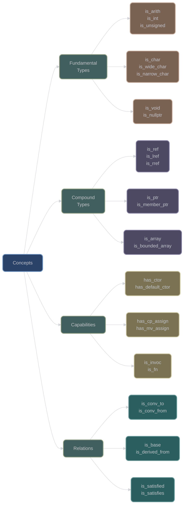
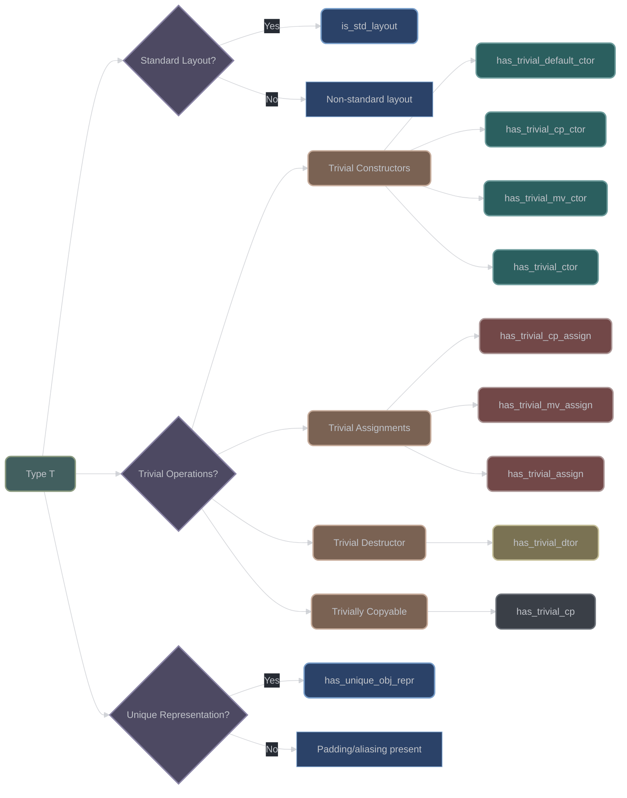
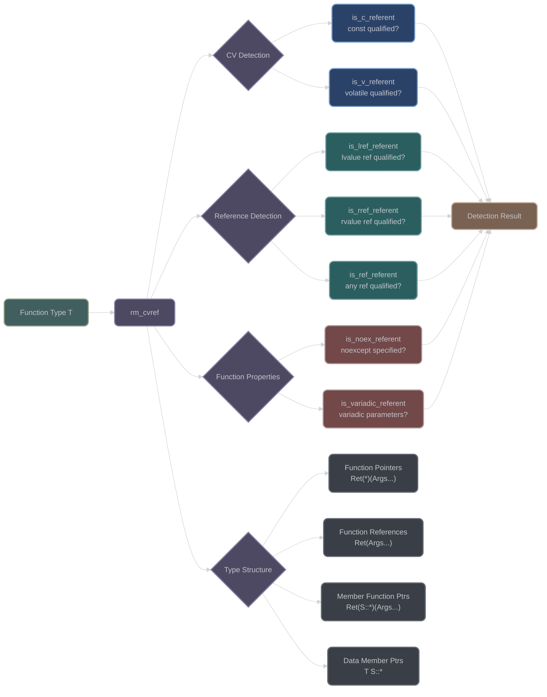
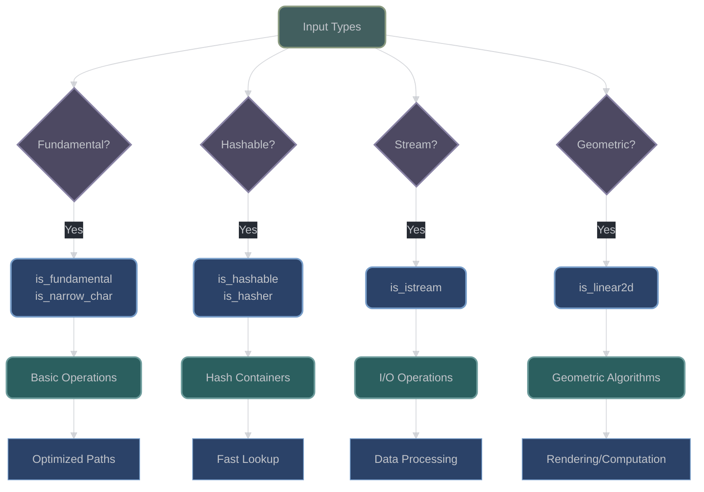
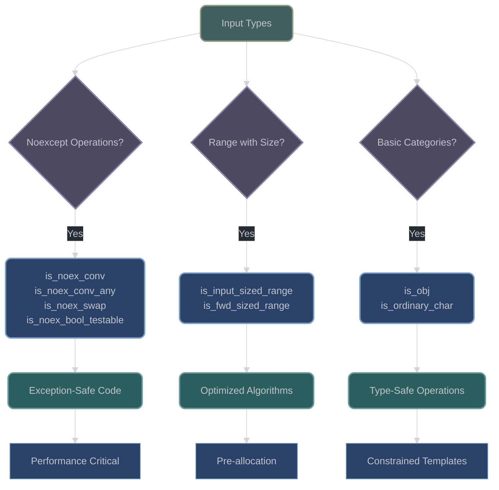

# Type Traits Concepts Library

## Overview

XIEITE's concepts library provides 150+ concept definitions that extend C++20's standard concepts with domain-specific type requirements. All concepts follow consistent naming patterns and are designed for composition.

## Concept Categories



## Fundamental Type Concepts

### Arithmetic Types

**Source**: `include/xieite/trait/is_arith.hpp`

```cpp
template<typename T>
concept is_arith = std::integral<T> || std::floating_point<T>;
```

**Source**: `include/xieite/trait/is_numeric.hpp`

```cpp
template<typename T>
concept is_numeric = is_arith<T> || /* complex number types */;
```

### Character Type Concepts

**Source**: `include/xieite/trait/is_char.hpp`, `is_wide_char.hpp`, `is_narrow_char.hpp`

```cpp
template<typename T>
concept is_char = std::same_as<std::remove_cv_t<T>, char> ||
                  std::same_as<std::remove_cv_t<T>, wchar_t> ||
                  std::same_as<std::remove_cv_t<T>, char8_t> ||
                  std::same_as<std::remove_cv_t<T>, char16_t> ||
                  std::same_as<std::remove_cv_t<T>, char32_t>;

template<typename T>
concept is_narrow_char = std::same_as<std::remove_cv_t<T>, char> ||
                         std::same_as<std::remove_cv_t<T>, char8_t>;

template<typename T>
concept is_wide_char = is_char<T> && !is_narrow_char<T>;
```

## Fundamental Type Classification Concepts

**Source**: `include/xieite/trait/is_*.hpp`

XIEITE provides concept wrappers around standard library type traits for cleaner template constraints:

### Class Type Concepts

```cpp
// Abstract class detection
template<typename T>
concept is_abstract = std::is_abstract_v<T>;

// Aggregate type detection
template<typename T>
concept is_aggregate = std::is_aggregate_v<T>;

// Class type detection
template<typename T>
concept is_class = std::is_class_v<T>;

// Usage examples:
static_assert(is_abstract<std::iostream>);
static_assert(is_aggregate<struct { int x; }>);
static_assert(is_class<std::string>);
```

### Array Type Concepts

```cpp
// Array type detection
template<typename T>
concept is_array = std::is_array_v<T>;

// Bounded array detection (has known size)
template<typename T>
concept is_bounded_array = std::is_bounded_array_v<T>;

// Unbounded array detection (unknown size)
template<typename T>
concept is_unbounded_array = std::is_unbounded_array_v<T>;

// Usage examples:
static_assert(is_array<int[5]>);
static_assert(is_bounded_array<int[5]>);
static_assert(is_unbounded_array<int[]>);
```

### CV-Qualifier Concepts

**Source**: `include/xieite/trait/is_c.hpp`, `is_v.hpp`, `is_cv.hpp`

```cpp
// Const detection (reference-aware)
template<typename T>
concept is_c = std::is_const_v<xieite::rm_ref<T>>;

// Volatile detection (reference-aware)
template<typename T>
concept is_v = std::is_volatile_v<xieite::rm_ref<T>>;

// Const volatile detection
template<typename T>
concept is_cv = is_c<T> && is_v<T>;

// Usage examples:
static_assert(is_c<const int>);
static_assert(is_c<const int&>);      // Reference-aware
static_assert(!is_c<int&>);           // Reference itself not const
static_assert(is_v<volatile float>);
static_assert(is_cv<const volatile double>);
```

## Compile-Time Type Capability Queries

**Source**: `include/xieite/trait/has_*.hpp`

XIEITE provides comprehensive capability detection concepts for compile-time type queries:

### Constructor Capability Concepts

```cpp
// Default constructor detection
template<typename T>
concept has_default_ctor = std::is_default_constructible_v<T>;

// Copy constructor detection
template<typename T>
concept has_cp_ctor = std::is_copy_constructible_v<T>;

// Move constructor detection
template<typename T>
concept has_mv_ctor = std::is_move_constructible_v<T>;

// Brace constructor detection (aggregate initialization)
template<typename T, typename... Args>
concept has_brace_ctor = requires(Args... args) { T { args... }; };

// Usage examples:
static_assert(has_default_ctor<int>);
static_assert(has_cp_ctor<std::string>);
static_assert(has_mv_ctor<std::unique_ptr<int>>);
static_assert(has_brace_ctor<std::pair<int, float>, int, float>);
```

### Assignment Capability Concepts

```cpp
// Copy assignment detection
template<typename T>
concept has_cp_assign = std::is_copy_assignable_v<T>;

// Move assignment detection
template<typename T>
concept has_mv_assign = std::is_move_assignable_v<T>;

// General assignment detection
template<typename T>
concept has_assign = has_cp_assign<T> || has_mv_assign<T>;

// Usage examples:
static_assert(has_cp_assign<std::vector<int>>);
static_assert(has_mv_assign<std::string>);
static_assert(!has_cp_assign<std::unique_ptr<int>>);  // Move-only type
```

### Destructor Capability Concepts

```cpp
// Destructor detection
template<typename T>
concept has_dtor = std::is_destructible_v<T>;

// Virtual destructor detection
template<typename T>
concept has_virtual_dtor = std::has_virtual_destructor_v<T>;

// Usage examples:
static_assert(has_dtor<std::string>);
static_assert(has_virtual_dtor<std::iostream>);
```

### Noexcept Capability Concepts

**Source**: `include/xieite/trait/has_noex_*.hpp`

```cpp
// Noexcept default constructor
template<typename T>
concept has_noex_default_ctor = std::is_nothrow_default_constructible_v<T>;

// Noexcept copy constructor
template<typename T>
concept has_noex_cp_ctor = std::is_nothrow_copy_constructible_v<T>;

// Noexcept move constructor
template<typename T>
concept has_noex_mv_ctor = std::is_nothrow_move_constructible_v<T>;

// Noexcept copy assignment
template<typename T>
concept has_noex_cp_assign = std::is_nothrow_copy_assignable_v<T>;

// Noexcept move assignment
template<typename T>
concept has_noex_mv_assign = std::is_nothrow_move_assignable_v<T>;

// Noexcept destructor
template<typename T>
concept has_noex_dtor = std::is_nothrow_destructible_v<T>;

// Noexcept brace constructor
template<typename T, typename... Args>
concept has_noex_brace_ctor = requires(Args... args) {
    { T { args... } } noexcept;
};

// Usage examples:
static_assert(has_noex_default_ctor<int>);
static_assert(has_noex_mv_ctor<std::unique_ptr<int>>);
static_assert(!has_noex_cp_ctor<std::vector<int>>);  // May throw
```

## Advanced SFINAE Helper Concepts

**Source**: `include/xieite/trait/is_*_testable.hpp`, `is_conv_*.hpp`

XIEITE provides sophisticated concepts for advanced template metaprogramming and SFINAE:

### Boolean Testability Concepts

```cpp
// Boolean testable concept (C++20 boolean-testable requirement)
template<typename T>
concept is_bool_testable = requires(T&& x) {
    static_cast<bool>(XIEITE_FWD(x));
    static_cast<bool>(!XIEITE_FWD(x));
    static_cast<void(*)(bool)>(nullptr)(XIEITE_FWD(x));
    static_cast<void(*)(bool)>(nullptr)(!XIEITE_FWD(x));
};

// Noexcept boolean testable concept
template<typename T>
concept is_noex_bool_testable = requires(T&& x) {
    { static_cast<bool>(XIEITE_FWD(x)) } noexcept;
    { static_cast<bool>(!XIEITE_FWD(x)) } noexcept;
};

// Usage examples:
static_assert(is_bool_testable<bool>);
static_assert(is_bool_testable<int>);
static_assert(is_bool_testable<std::optional<int>>);
static_assert(is_noex_bool_testable<bool>);
```

### Conversion Capability Concepts

```cpp
// Convertible from multiple types
template<typename T, typename... Us>
concept is_conv_from = (... && std::convertible_to<Us, T>);

// Convertible to multiple types
template<typename T, typename... Us>
concept is_conv_to = (... && std::convertible_to<T, Us>);

// Convertible from any of the types
template<typename T, typename... Us>
concept is_conv_from_any = (... || std::convertible_to<Us, T>);

// Convertible to any of the types
template<typename T, typename... Us>
concept is_conv_to_any = (... || std::convertible_to<T, Us>);

// Usage examples:
static_assert(is_conv_from<double, int, float>);     // double from int AND float
static_assert(is_conv_to<int, double, float>);       // int to double AND float
static_assert(is_conv_from_any<double, int, std::string>);  // double from int OR string
static_assert(is_conv_to_any<int, double, std::string>);    // int to double OR string
```

### Noexcept Conversion Concepts

```cpp
// Noexcept convertible concepts
template<typename T, typename... Us>
concept is_noex_conv_from = (... && std::is_nothrow_convertible_v<Us, T>);

template<typename T, typename... Us>
concept is_noex_conv_to = (... && std::is_nothrow_convertible_v<T, Us>);

template<typename T, typename... Us>
concept is_noex_conv_from_any = (... || std::is_nothrow_convertible_v<Us, T>);

template<typename T, typename... Us>
concept is_noex_conv_to_any = (... || std::is_nothrow_convertible_v<T, Us>);

// Usage examples:
static_assert(is_noex_conv_from<int, char, short>);
static_assert(!is_noex_conv_from<std::string, const char*>);  // May throw
```

## Compound Type Concepts

### Reference Concepts with Qualifiers

**Source**: `include/xieite/trait/is_*ref.hpp`

| Concept | Matches | Example |
|---------|---------|---------|
| `is_ref<T>` | Any reference | `T&` or `T&&` |
| `is_lref<T>` | Lvalue reference | `T&` |
| `is_rref<T>` | Rvalue reference | `T&&` |
| `is_clref<T>` | Const lvalue reference | `const T&` |
| `is_vlref<T>` | Volatile lvalue reference | `volatile T&` |
| `is_cvlref<T>` | Const volatile lvalue ref | `const volatile T&` |
| `is_crref<T>` | Const rvalue reference | `const T&&` |
| `is_vrref<T>` | Volatile rvalue reference | `volatile T&&` |
| `is_cvrref<T>` | Const volatile rvalue ref | `const volatile T&&` |

### Pointer Concepts

**Source**: `include/xieite/trait/is_ptr.hpp`, `is_member_*_ptr.hpp`

```cpp
template<typename T>
concept is_ptr = std::is_pointer_v<T>;

template<typename T>
concept is_member_fn_ptr = std::is_member_function_pointer_v<T>;

template<typename T>
concept is_member_obj_ptr = std::is_member_object_pointer_v<T>;
```

## Capability Detection Concepts

### Constructor Capabilities

**Source**: `include/xieite/trait/has_*ctor.hpp`

```cpp
template<typename T>
concept has_default_ctor = std::default_initializable<T>;

template<typename T>
concept has_cp_ctor = std::copy_constructible<T>;

template<typename T>
concept has_mv_ctor = std::move_constructible<T>;

template<typename T, typename... Args>
concept has_ctor = std::constructible_from<T, Args...>;

template<typename T, typename... Args>
concept has_brace_ctor = requires { T{std::declval<Args>()...}; };
```

### Noexcept Capabilities

**Source**: `include/xieite/trait/has_noex_*.hpp`

```cpp
template<typename T>
concept has_noex_default_ctor = has_default_ctor<T> &&
    requires { requires noexcept(T{}); };

template<typename T>
concept has_noex_mv_ctor = has_mv_ctor<T> &&
    std::is_nothrow_move_constructible_v<T>;

template<typename T>
concept has_noex_dtor = std::is_nothrow_destructible_v<T>;
```

### Invocability Concepts

**Source**: `include/xieite/trait/is_invoc.hpp`, `is_noex_invoc.hpp`

```cpp
template<typename F, typename... Args>
concept is_invoc = std::invocable<F, Args...>;

template<typename F, typename... Args>
concept is_noex_invoc = is_invoc<F, Args...> &&
    requires { requires noexcept(std::invoke(std::declval<F>(),
                                             std::declval<Args>()...)); };
```

## Range and Iterator Concepts

### Range Hierarchy

**Source**: `include/xieite/trait/is_*_range.hpp`

```cpp
template<typename T>
concept is_range = std::ranges::range<T>;

template<typename T>
concept is_sized_range = std::ranges::sized_range<T>;

template<typename T>
concept is_input_range = std::ranges::input_range<T>;

template<typename T>
concept is_fwd_range = std::ranges::forward_range<T>;

template<typename T>
concept is_bidirect_range = std::ranges::bidirectional_range<T>;

template<typename T>
concept is_random_access_range = std::ranges::random_access_range<T>;

template<typename T>
concept is_contig_range = std::ranges::contiguous_range<T>;
```

### Special Range Concepts

```cpp
template<typename T>
concept is_borrowed_range = std::ranges::borrowed_range<T>;

template<typename T>
concept is_common_range = std::ranges::common_range<T>;

template<typename T>
concept is_viewable_range = std::ranges::viewable_range<T>;

template<typename T>
concept is_read_only_range = is_range<T> &&
    std::is_const_v<std::remove_reference_t<
        std::ranges::range_reference_t<T>>>;
```

## Stream Concepts

**Source**: `include/xieite/trait/is_stream*.hpp`

```cpp
template<typename T>
concept is_istream = std::derived_from<T, std::istream>;

template<typename T>
concept is_ostream = std::derived_from<T, std::ostream>;

template<typename T>
concept is_stream = is_istream<T> || is_ostream<T>;

template<typename T>
concept is_streamable_out = requires(T x, std::ostream os) {
    { os << x } -> std::convertible_to<std::ostream&>;
};

template<typename T>
concept is_streamable_in = requires(T x, std::istream is) {
    { is >> x } -> std::convertible_to<std::istream&>;
};
```

## Conversion and Relationship Concepts

### Conversion Concepts

**Source**: `include/xieite/trait/is_conv_*.hpp`

```cpp
template<typename From, typename To>
concept is_conv_to = std::convertible_to<From, To>;

template<typename To, typename From>
concept is_conv_from = is_conv_to<From, To>;

template<typename From, typename... Tos>
concept is_conv_to_any = (... || is_conv_to<From, Tos>);

template<typename To, typename... Froms>
concept is_conv_from_any = (... || is_conv_from<To, Froms>);

// Noexcept versions
template<typename From, typename To>
concept is_noex_conv_to = is_conv_to<From, To> &&
    requires { requires noexcept(static_cast<To>(std::declval<From>())); };
```

### Inheritance Concepts

**Source**: `include/xieite/trait/is_base.hpp`, `is_derived_from.hpp`

```cpp
template<typename Base, typename Derived>
concept is_base = std::is_base_of_v<Base, Derived>;

template<typename Derived, typename Base>
concept is_derived_from = std::derived_from<Derived, Base>;

template<typename Derived, typename... Bases>
concept is_derived_from_any = (... || is_derived_from<Derived, Bases>);

template<typename Base, typename... Deriveds>
concept is_base_any = (... || is_base<Base, Deriveds>);
```

## Satisfaction Concepts

**Source**: `include/xieite/trait/is_satisf*.hpp`

```cpp
// Check if a type satisfies a callable constraint
template<auto fn, typename... Ts>
concept is_satisfied = requires {
    fn.template operator()<Ts...>();
};

// Check if a type satisfies all constraints
template<typename T, auto... fns>
concept is_satisfies = (... && is_satisfied<fns, T>);

// Check if any constraint is satisfied
template<typename T, auto... fns>
concept is_satisfies_any = (... || is_satisfied<fns, T>);

// Dissatisfaction concepts (negated versions)
template<auto fn, typename... Ts>
concept is_dissatisfied = !is_satisfied<fn, Ts...>;

template<auto fn, typename... Ts>
concept is_dissatisfied_all = !is_satisfied_any<fn, Ts...>;

template<auto fn, typename... Ts>
concept is_dissatisfied_any = !is_satisfied_all<fn, Ts...>;
```

### Satisfaction and Dissatisfaction Examples

**Basic Constraint Testing**:
```cpp
auto is_small = []<typename T> requires (sizeof(T) <= 8) {};
auto is_trivial = []<typename T> requires std::is_trivial_v<T> {};
auto has_value_type = []<typename T> requires requires {
    typename T::value_type;
} {};

template<typename T>
    requires xieite::is_satisfies<T, is_small, is_trivial>
class SmallTrivialStorage {
    // Optimized for small, trivial types
};

template<typename Container>
    requires xieite::is_satisfied<has_value_type, Container>
using value_t = typename Container::value_type;

// Dissatisfaction examples
template<typename T>
    requires xieite::is_dissatisfied<is_trivial, T>
class ComplexTypeHandler {
    // Specialized for non-trivial types requiring careful handling
};

template<typename T>
    requires xieite::is_dissatisfied_all<is_small, T> // NOT small
void use_heap_allocation(T&& obj) {
    // Use dynamic allocation for large objects
}

template<typename T>
    requires xieite::is_dissatisfied_any<is_small, T> // Either not small OR not trivial
void careful_handling(T&& obj) {
    // Requires careful handling if either condition fails
}
```

## Template Detection Concepts

**Source**: `include/xieite/trait/is_template*.hpp`

```cpp
template<typename T, template<typename...> class Tmpl>
concept is_template = /* checks if T is instance of Tmpl */;

template<typename T, template<typename...> class... Tmpls>
concept is_template_any = (... || is_template<T, Tmpls>);

// Example usage
static_assert(xieite::is_template<std::vector<int>, std::vector>);
static_assert(xieite::is_template_any<std::optional<int>,
                                      std::optional, std::variant>);
```

## Special Type Concepts

### Complete Type Detection

**Source**: `include/xieite/trait/is_complete.hpp`

```cpp
template<typename T>
concept is_complete = requires { sizeof(T); };
```

### Aggregate and Special Types

```cpp
template<typename T>
concept is_aggregate = std::is_aggregate_v<T>;

template<typename T>
concept is_final = std::is_final_v<T>;

template<typename T>
concept is_abstract = std::is_abstract_v<T>;

template<typename T>
concept is_polymorphic = std::is_polymorphic_v<T>;
```

### Standard Layout and Triviality

**Source**: `include/xieite/trait/has_trivial_*.hpp`, `has_unique_obj_repr.hpp`

XIEITE provides comprehensive trivial type detection concepts that wrap standard library traits for cleaner constraint syntax:

#### Basic Triviality Detection

```cpp
template<typename T>
concept is_std_layout = std::is_standard_layout_v<T>;

template<typename T>
concept has_trivial_cp = std::is_trivially_copyable_v<T>;

template<typename T>
concept has_unique_obj_repr = std::has_unique_object_representations_v<T>;
```

#### Trivial Constructor Concepts

**Source**: `include/xieite/trait/has_trivial_*ctor.hpp`

```cpp
// Generic trivial constructor with arguments
template<typename T, typename... Args>
concept has_trivial_ctor = std::is_trivially_constructible_v<T, Args...>;

// Specific trivial constructors
template<typename T>
concept has_trivial_default_ctor = std::is_trivially_default_constructible_v<T>;

template<typename T>
concept has_trivial_cp_ctor = std::is_trivially_copy_constructible_v<T>;

template<typename T>
concept has_trivial_mv_ctor = std::is_trivially_move_constructible_v<T>;
```

#### Trivial Assignment Concepts

**Source**: `include/xieite/trait/has_trivial_*assign.hpp`

```cpp
// Generic trivial assignment
template<typename T, typename U>
concept has_trivial_assign = std::is_trivially_assignable_v<T, U>;

// Specific trivial assignments
template<typename T>
concept has_trivial_cp_assign = std::is_trivially_copy_assignable_v<T>;

template<typename T>
concept has_trivial_mv_assign = std::is_trivially_move_assignable_v<T>;
```

#### Trivial Destructor Concept

**Source**: `include/xieite/trait/has_trivial_dtor.hpp`

```cpp
template<typename T>
concept has_trivial_dtor = std::is_trivially_destructible_v<T>;
```

#### Combined Triviality Analysis



#### Usage Examples

**Performance Optimization with Trivial Types**:
```cpp
template<typename T>
void fast_copy(const T& source, T& dest) {
    if constexpr (has_trivial_cp<T>) {
        std::memcpy(&dest, &source, sizeof(T));  // Bit-wise copy
    } else {
        dest = source;  // Use copy assignment
    }
}

template<typename T>
    requires has_trivial_default_ctor<T> && has_trivial_dtor<T>
class fast_vector {
    // Can skip constructor/destructor calls for elements
    // Can use realloc for resizing
};
```

**Template Constraints**:
```cpp
template<typename T>
concept pod_like = has_trivial_default_ctor<T> &&
                   has_trivial_cp_ctor<T> &&
                   has_trivial_cp_assign<T> &&
                   has_trivial_dtor<T> &&
                   is_std_layout<T>;

template<pod_like T>
void serialize_binary(const T& obj, std::ostream& out) {
    out.write(reinterpret_cast<const char*>(&obj), sizeof(T));
}
```

**Memory Layout Analysis**:
```cpp
template<typename T>
constexpr bool is_bitwise_comparable() {
    return has_unique_obj_repr<T> && has_trivial_cp<T>;
}

template<typename T>
    requires is_bitwise_comparable<T>()
bool fast_equal(const T& a, const T& b) {
    return std::memcmp(&a, &b, sizeof(T)) == 0;
}
```

#### Constructor Capability Matrix

| Type Property | `has_ctor` | `has_trivial_ctor` | Performance Implication |
|---------------|------------|-------------------|------------------------|
| **POD types** | ✓ | ✓ | Zero-cost construction |
| **Simple classes** | ✓ | ✓ | Optimizable by compiler |
| **Virtual classes** | ✓ | ✗ | Vtable initialization required |
| **Complex classes** | ✓ | ✗ | Full constructor execution |

#### Assignment Capability Matrix

| Type Property | `has_trivial_assign` | `has_trivial_cp_assign` | Optimization |
|---------------|---------------------|-------------------------|--------------|
| **POD types** | ✓ | ✓ | `memcpy` eligible |
| **Simple classes** | ✓ | ✓ | Compiler optimizable |
| **Reference members** | ✗ | ✗ | Not assignable |
| **Virtual classes** | varies | ✗ | Virtual dispatch |

## Referent Detection Concepts

**XIEITE provides sophisticated referent detection concepts** that analyze what references and function types "refer to" rather than their direct type properties. These complement the comprehensive referent modification system documented in [Type Modification Traits](modification.md).

### Understanding Referents vs Direct Types

The key insight is the difference between direct type properties and referent properties:

```cpp
// Direct type analysis (standard approach)
static_assert(!std::is_const_v<const int&>);  // false - reference itself isn't const!

// Referent analysis (XIEITE approach)
static_assert(xieite::is_c_referent<const int&>);  // true - what it refers to IS const
```

### Function Type Referent Detection

**Source**: `include/xieite/trait/is_*_referent.hpp`

#### CV-Qualification Referent Detection

```cpp
// Const referent detection - include/xieite/trait/is_c_referent.hpp
template<typename T>
concept is_c_referent = /* detects const-qualified function types and const pointers */;

// Volatile referent detection - include/xieite/trait/is_v_referent.hpp
template<typename T>
concept is_v_referent = /* detects volatile-qualified function types and volatile pointers */;

// Usage examples:
static_assert(is_c_referent<const int*>);                    // const pointer
static_assert(is_c_referent<void() const>);                  // const member function
static_assert(is_c_referent<int(Class::*)() const>);         // const member function pointer
static_assert(is_v_referent<volatile float*>);               // volatile pointer
static_assert(is_v_referent<void() volatile>);               // volatile member function
```

#### Reference Qualification Referent Detection

```cpp
// Lvalue reference referent - include/xieite/trait/is_lref_referent.hpp
template<typename T>
concept is_lref_referent = /* detects lvalue reference qualified functions */;

// Rvalue reference referent - include/xieite/trait/is_rref_referent.hpp
template<typename T>
concept is_rref_referent = /* detects rvalue reference qualified functions */;

// Any reference referent - include/xieite/trait/is_ref_referent.hpp
template<typename T>
concept is_ref_referent = is_lref_referent<T> || is_rref_referent<T>;

// Usage examples:
static_assert(is_lref_referent<void() &>);                   // lvalue ref qualified
static_assert(is_rref_referent<void() &&>);                  // rvalue ref qualified
static_assert(is_ref_referent<int(Class::*)() const &>);     // any ref qualified
```

#### Function Property Referent Detection

```cpp
// Noexcept referent detection - include/xieite/trait/is_noex_referent.hpp
template<typename T>
concept is_noex_referent = /* detects noexcept function types */;

// Variadic referent detection - include/xieite/trait/is_variadic_referent.hpp
template<typename T>
concept is_variadic_referent = /* detects variadic function types */;

// Usage examples:
static_assert(is_noex_referent<void() noexcept>);            // noexcept function
static_assert(is_noex_referent<int(*)(float) noexcept>);     // noexcept function pointer
static_assert(is_variadic_referent<void(int, ...)>);         // variadic function
static_assert(is_variadic_referent<int(Class::*)(char, ...) const>); // variadic member
```

### Implementation Architecture



### Advanced Usage Patterns

#### Template Metaprogramming with Referent Analysis

```cpp
template<typename Func>
concept pure_function = is_noex_referent<Func> &&
                       !is_variadic_referent<Func> &&
                       !is_v_referent<Func>;

template<pure_function F>
auto optimize_call(F&& func) {
    // Safe to optimize - no exceptions, no variadic args, no volatile
}

template<typename MemberFunc>
    requires is_c_referent<MemberFunc> && is_lref_referent<MemberFunc>
void safe_const_call(MemberFunc mf) {
    // Guaranteed const lvalue qualified member function
}
```

#### Function Signature Analysis

```cpp
template<typename Signature>
struct signature_analyzer {
    static constexpr bool is_const_qualified = is_c_referent<Signature>;
    static constexpr bool is_noexcept_safe = is_noex_referent<Signature>;
    static constexpr bool is_lvalue_qualified = is_lref_referent<Signature>;
    static constexpr bool accepts_variadic = is_variadic_referent<Signature>;

    static constexpr bool is_safe_to_cache =
        is_const_qualified && is_noexcept_safe && !accepts_variadic;
};

// Usage:
using analyzer = signature_analyzer<int(Class::*)(float) const noexcept>;
static_assert(analyzer::is_safe_to_cache);
```

#### Integration with Type Modification System

The referent detection concepts work seamlessly with XIEITE's type modification system:

```cpp
template<typename Source, typename Target>
    requires is_c_referent<Source>
auto copy_const_referent(Target&& target) {
    using result = cp_c_referent<Source, std::decay_t<Target>>;
    return static_cast<result>(target);
}

template<typename Func>
void process_by_properties(Func&& func) {
    if constexpr (is_noex_referent<Func>) {
        // Handle noexcept functions efficiently
    } else {
        // Exception-safe handling
    }

    if constexpr (is_variadic_referent<Func>) {
        // Special variadic processing
    }
}
```

### Error Handling and Edge Cases

```cpp
// Non-function types return false for all referent concepts
static_assert(!is_c_referent<int>);
static_assert(!is_noex_referent<std::string>);
static_assert(!is_variadic_referent<double*>);

// Pointer types only match CV-qualification concepts
static_assert(is_c_referent<const float*>);      // const pointer
static_assert(!is_lref_referent<const float*>);  // not a function reference
static_assert(!is_noex_referent<const float*>);  // not a function

// Complex combinations work correctly
static_assert(is_c_referent<int(Class::*)() const volatile && noexcept>);
static_assert(is_v_referent<int(Class::*)() const volatile && noexcept>);
static_assert(is_rref_referent<int(Class::*)() const volatile && noexcept>);
static_assert(is_noex_referent<int(Class::*)() const volatile && noexcept>);
```

## Boolean Testing Concepts

**Source**: `include/xieite/trait/is_bool_testable.hpp`

```cpp
template<typename T>
concept is_bool_testable = requires(T t) {
    { static_cast<bool>(t) } -> std::same_as<bool>;
};

template<typename T>
concept is_noex_bool_testable = is_bool_testable<T> &&
    requires(T t) { requires noexcept(static_cast<bool>(t)); };
```

## Enum Concepts

**Source**: `include/xieite/trait/is_*enum*.hpp`

```cpp
template<typename T>
concept is_enum = std::is_enum_v<T>;

template<typename T>
concept is_scoped_enum = is_enum<T> &&
    !std::is_convertible_v<T, std::underlying_type_t<T>>;

template<typename T>
concept is_unscoped_enum = is_enum<T> && !is_scoped_enum<T>;

template<auto E>
concept is_enum_value = is_enum<decltype(E)>;
```

## Template Specialization Detection

**Source**: `include/xieite/trait/is_template.hpp`, `is_template_any.hpp`, `is_special.hpp`

XIEITE provides sophisticated template specialization detection concepts:

```cpp
// Template specialization detection for single types
template<template<typename...> typename Template, typename... Ts>
concept is_template = (... && xieite::is_special<Ts, Template>);

// Template specialization detection for any type in a pack
template<template<typename...> typename Template, typename... Ts>
concept is_template_any = (... || xieite::is_template<Template, Ts>);

// Core specialization detection (implements std::specialization_of<> behavior)
template<typename T, template<typename...> typename... Templates>
concept is_special = (... && requires {
    ([]<typename... Args>(xieite::type_id<Templates<Args...>>) {})
        (xieite::type_id<xieite::rm_cv<T>>());
});

// Usage examples:
static_assert(is_template<std::vector, std::vector<int>>);
static_assert(is_template_any<std::vector, int, std::vector<int>, float>);
static_assert(is_special<std::vector<int>, std::vector>);
static_assert(is_special<const std::map<int, std::string>, std::map>);
```

## Member Pointer Classification

**Source**: `include/xieite/trait/is_member_*_ptr.hpp`

```cpp
// Member function pointer detection
template<typename T>
concept is_member_fn_ptr = std::is_member_function_pointer_v<T>;

// Member object pointer detection
template<typename T>
concept is_member_obj_ptr = std::is_member_object_pointer_v<T>;

// Usage examples:
struct Example {
    int value;
    void method() {}
};

static_assert(is_member_fn_ptr<decltype(&Example::method)>);
static_assert(is_member_obj_ptr<decltype(&Example::value)>);
static_assert(!is_member_fn_ptr<int*>);
static_assert(!is_member_obj_ptr<void(*)()>);
```

## Assignment and Relationship Concepts

**Source**: `include/xieite/trait/is_assign_to.hpp`, `is_base_any.hpp`

```cpp
// Assignment capability (reverse of std::assignable_from)
template<typename T, typename U>
concept is_assign_to = std::assignable_from<U, T>;

// Base class relationship with any type in pack
template<typename T, typename... Us>
concept is_base_any = (... || xieite::is_base<T, Us>);

// Usage examples:
static_assert(is_assign_to<int, int&>);
static_assert(is_assign_to<std::string, std::string&>);

class Base {};
class Derived1 : public Base {};
class Derived2 : public Base {};
class Unrelated {};

static_assert(is_base_any<Base, Derived1, Derived2>);
static_assert(!is_base_any<Base, Unrelated, int>);
```

## Specialized Type Detection

**Source**: `include/xieite/trait/is_bitset_ref.hpp`

```cpp
// std::bitset<>::reference concept (for bitset proxy references)
template<typename T>
concept is_bitset_ref = requires(T x) {
    x.~T();
    { x = true } -> std::same_as<T&>;
    { x = x } -> std::same_as<T&>;
    x.operator bool();
    { ~x } -> std::same_as<bool>;
    { x.flip() } -> std::same_as<T&>;
};

// Usage example:
std::bitset<8> bits;
auto ref = bits[0];
static_assert(is_bitset_ref<decltype(ref)>);
```

## Range Concepts with Value Type Constraints

**Source**: `include/xieite/trait/is_*_range.hpp`, `is_satisfied.hpp`

XIEITE extends C++20 range concepts with optional value type constraints using the `is_satisfied` utility:

### Core Range Concepts

```cpp
// Universal satisfaction checker for lambda predicates
template<auto fn, typename... Ts>
concept is_satisfied = requires { fn.template operator()<Ts...>(); };

// Basic range with optional value type constraint
template<typename T, auto fn = []<typename> {}>
concept is_range = std::ranges::range<T> &&
    xieite::is_satisfied<fn, std::ranges::range_value_t<T>>;

// Bidirectional range with value type constraint
template<typename T, auto fn = []<typename> {}>
concept is_bidirect_range = std::ranges::bidirectional_range<T> &&
    xieite::is_satisfied<fn, std::ranges::range_value_t<T>>;

// Sized range with value type constraint
template<typename T, auto fn = []<typename> {}>
concept is_sized_range = std::ranges::sized_range<T> &&
    xieite::is_satisfied<fn, std::ranges::range_value_t<T>>;

// Viewable range with value type constraint
template<typename T, auto fn = []<typename> {}>
concept is_viewable_range = std::ranges::viewable_range<T> &&
    xieite::is_satisfied<fn, std::ranges::range_value_t<T>>;
```

### Usage Examples

```cpp
// Basic range constraint
template<xieite::is_range Range>
void process_any_range(Range&& r) { /* accepts any range */ }

// Range with numeric value type constraint
constexpr auto numeric_constraint = []<typename T> {
    static_assert(std::is_arithmetic_v<T>);
};

template<xieite::is_range<numeric_constraint> Range>
void process_numeric_range(Range&& r) {
    // Only accepts ranges of arithmetic types
}

// Complex value type constraints
constexpr auto string_like = []<typename T> {
    static_assert(std::convertible_to<T, std::string_view>);
};

template<xieite::is_bidirect_range<string_like> Range>
void process_string_range(Range&& r) {
    // Bidirectional range of string-convertible types
}

// Usage examples:
std::vector<int> numbers = {1, 2, 3};
std::list<std::string> words = {"hello", "world"};

process_any_range(numbers);           // OK - any range
process_numeric_range(numbers);       // OK - range of arithmetic types
process_string_range(words);          // OK - bidirectional range of strings
// process_numeric_range(words);      // ERROR - strings not arithmetic
```

## Stream I/O Concepts

**Source**: `include/xieite/trait/is_stream*.hpp`

```cpp
// Input stream compatibility
template<typename T>
concept is_streamable_in = requires(T x, std::istream istream) {
    { istream >> x } -> std::convertible_to<std::istream&>;
};

// Output stream compatibility
template<typename T>
concept is_streamable_out = requires(T x, std::ostream ostream) {
    { ostream << x } -> std::convertible_to<std::ostream&>;
};

// Either input or output stream
template<typename T>
concept is_stream = xieite::is_istream<T> || xieite::is_ostream<T>;

// Usage examples:
template<is_streamable_out T>
void debug_print(const T& value) {
    std::cout << "Debug: " << value << std::endl;
}

template<is_streamable_in T>
T read_from_stream(std::istream& in) {
    T value;
    in >> value;
    return value;
}

// Serializable type concept
template<typename T>
concept serializable =
    is_streamable_in<T> &&
    is_streamable_out<T> &&
    std::default_initializable<T>;
```

## Invocation Concepts

**Source**: `include/xieite/trait/is_invoc.hpp`, `is_noex_invoc.hpp`

XIEITE provides advanced invocation concepts using signature-based constraints:

```cpp
// Invocable with specific signature
template<typename T, typename Sig = void()>
concept is_invoc = ([]<typename Ret, typename... Args>(xieite::type_id<Ret(Args...)>) {
    return std::is_invocable_r_v<Ret, T, Args...>;
})(xieite::type_id<Sig>());

// Nothrow invocable with specific signature
template<typename T, typename Sig = void()>
concept is_noex_invoc = ([]<typename Ret, typename... Args>(xieite::type_id<Ret(Args...)>) {
    return std::is_nothrow_invocable_r_v<Ret, T, Args...>;
})(xieite::type_id<Sig>());

// Usage examples:
auto lambda = [](int x, float y) -> double { return x + y; };
auto throwing_func = [](int x) -> int {
    if (x < 0) throw std::invalid_argument("negative");
    return x * 2;
};

static_assert(is_invoc<decltype(lambda), double(int, float)>);
static_assert(!is_invoc<decltype(lambda), void(int)>);  // Wrong signature

static_assert(is_invoc<decltype(throwing_func), int(int)>);
static_assert(!is_noex_invoc<decltype(throwing_func), int(int)>);  // Can throw

// Function pointer examples:
int add(int a, int b) noexcept { return a + b; }
static_assert(is_noex_invoc<decltype(&add), int(int, int)>);
```

## Noexcept Capability Concepts

**Source**: `include/xieite/trait/has_noex_*.hpp`

XIEITE extends capability concepts with noexcept guarantees:

### Noexcept Constructor Concepts

```cpp
// Nothrow default constructible
template<typename T>
concept has_noex_default_ctor = std::is_nothrow_default_constructible_v<T>;

// Nothrow copy constructible
template<typename T>
concept has_noex_cp_ctor = std::is_nothrow_copy_constructible_v<T>;

// Nothrow move constructible
template<typename T>
concept has_noex_mv_ctor = std::is_nothrow_move_constructible_v<T>;

// Nothrow brace constructible (aggregate initialization)
template<typename T, typename... Args>
concept has_noex_brace_ctor = requires(Args... args) {
    requires(noexcept(T { args... }));
};

// General nothrow constructible
template<typename T, typename... Args>
concept has_noex_ctor = std::is_nothrow_constructible_v<T, Args...>;
```

### Noexcept Assignment Concepts

```cpp
// Nothrow copy assignable
template<typename T>
concept has_noex_cp_assign = std::is_nothrow_copy_assignable_v<T>;

// Nothrow move assignable
template<typename T>
concept has_noex_mv_assign = std::is_nothrow_move_assignable_v<T>;

// General nothrow assignable
template<typename T, typename U>
concept has_noex_assign = std::is_nothrow_assignable_v<T, U>;
```

### Noexcept Destructor Concept

```cpp
// Nothrow destructible
template<typename T>
concept has_noex_dtor = std::is_nothrow_destructible_v<T>;
```

### Usage Examples

```cpp
// Exception-safe container requirements
template<typename T>
concept exception_safe =
    has_noex_default_ctor<T> &&
    has_noex_mv_ctor<T> &&
    has_noex_mv_assign<T> &&
    has_noex_dtor<T>;

// Strong exception safety for algorithms
template<exception_safe T>
void safe_swap(T& a, T& b) noexcept {
    // Can guarantee no exceptions
    T temp = std::move(a);
    a = std::move(b);
    b = std::move(temp);
}

// POD-like types with noexcept operations
template<typename T>
concept noexcept_pod =
    std::is_trivially_copyable_v<T> &&
    has_noex_default_ctor<T> &&
    has_noex_cp_ctor<T> &&
    has_noex_cp_assign<T> &&
    has_noex_dtor<T>;

// Performance-critical code requiring strong guarantees
template<noexcept_pod T>
class HighPerformanceBuffer {
    // All operations guaranteed noexcept
    static_assert(has_noex_brace_ctor<T>);
};
```

## Fundamental Type Classification

**Source**: `include/xieite/trait/is_arith.hpp`, `is_numeric.hpp`, `is_int.hpp`, `is_unsigned.hpp`

XIEITE provides refined numeric type classification beyond standard library concepts:

### Arithmetic Type Concepts

```cpp
// Arithmetic types (integral or floating-point, extends std::is_arithmetic)
template<typename T>
concept is_arith = std::integral<T> || std::floating_point<T>;

// Numeric types (arithmetic excluding bool)
template<typename T>
concept is_numeric = xieite::is_arith<T> && !std::same_as<std::remove_cv_t<T>, bool>;

// Integer types (integral excluding bool)
template<typename T>
concept is_int = std::integral<T> && !std::same_as<std::remove_cv_t<T>, bool>;

// Unsigned integer types (excluding bool)
template<typename T>
concept is_unsigned = std::unsigned_integral<T> && !std::same_as<xieite::rm_cv<T>, bool>;

// Usage examples:
static_assert(is_arith<int>);
static_assert(is_arith<float>);
static_assert(is_arith<bool>);           // bool is arithmetic

static_assert(is_numeric<int>);
static_assert(is_numeric<double>);
static_assert(!is_numeric<bool>);        // bool excluded from numeric

static_assert(is_int<int>);
static_assert(is_int<char>);
static_assert(!is_int<bool>);            // bool excluded from integers

static_assert(is_unsigned<unsigned int>);
static_assert(is_unsigned<std::size_t>);
static_assert(!is_unsigned<bool>);       // bool excluded despite being unsigned
```

## Array Type Classification

**Source**: `include/xieite/trait/is_array.hpp`, `is_bounded_array.hpp`

```cpp
// Array type detection
template<typename T>
concept is_array = std::is_array_v<T>;

// Bounded array with optional length constraint
template<typename T, std::size_t length = -1uz>
concept is_bounded_array = ((length == -1uz) ?
    std::is_bounded_array_v<T> :
    requires { ([]<typename U>(xieite::type_id<U[length]>) {})
                (xieite::type_id<T>()); });

// Usage examples:
static_assert(is_array<int[10]>);
static_assert(is_array<char[]>);
static_assert(!is_array<std::vector<int>>);

static_assert(is_bounded_array<int[10]>);
static_assert(!is_bounded_array<int[]>);      // Unbounded array

// Length-specific bounded array checks:
static_assert(is_bounded_array<int[5], 5>);   // Exactly 5 elements
static_assert(!is_bounded_array<int[3], 5>);  // Wrong size
```

## Class Type Classification

**Source**: `include/xieite/trait/is_class.hpp`, `is_abstract.hpp`, `is_aggregate.hpp`

```cpp
// Class type detection
template<typename T>
concept is_class = std::is_class_v<T>;

// Abstract class detection
template<typename T>
concept is_abstract = std::is_abstract_v<T>;

// Aggregate type detection
template<typename T>
concept is_aggregate = std::is_aggregate_v<T>;

// Usage examples:
struct SimpleStruct { int x; float y; };
class SimpleClass { public: int value; };
class AbstractBase { public: virtual void func() = 0; };

static_assert(is_class<SimpleStruct>);      // structs are classes in C++
static_assert(is_class<SimpleClass>);
static_assert(is_class<std::string>);

static_assert(!is_abstract<SimpleStruct>);
static_assert(!is_abstract<SimpleClass>);
static_assert(is_abstract<AbstractBase>);

static_assert(is_aggregate<SimpleStruct>);  // No user-defined constructors
static_assert(!is_aggregate<std::string>); // Has constructors
```

## Conversion and Compatibility Concepts

**Source**: `include/xieite/trait/is_conv_from.hpp`, `is_clock.hpp`

```cpp
// Convertible from multiple types (variadic fold)
template<typename T, typename... Us>
concept is_conv_from = (... && std::convertible_to<Us, T>);

// C++20 clock concept wrapper
template<typename T>
concept is_clock = std::chrono::is_clock_v<T>;

// Usage examples:
static_assert(is_conv_from<double, int, float>);       // double convertible from both
static_assert(!is_conv_from<int, std::string, bool>);  // int not convertible from string

static_assert(is_clock<std::chrono::system_clock>);
static_assert(is_clock<std::chrono::high_resolution_clock>);
static_assert(!is_clock<int>);

// Practical example: Function accepting multiple convertible types
template<typename T, typename... Args>
    requires is_conv_from<T, Args...>
T make_from_any(Args... args) {
    // All arguments are convertible to T
    return T{args...};
}

auto result = make_from_any<double>(1, 2.5f, 3.14);  // All convert to double
```

## Type Relationship Patterns

XIEITE's type classification follows consistent patterns:

### Exclusion Patterns
- **bool exclusion**: `is_numeric`, `is_int`, `is_unsigned` exclude `bool` for cleaner numeric constraints
- **CV-qualification handling**: Concepts consistently handle const/volatile qualifiers
- **Reference stripping**: Appropriate use of `remove_cv_t` and custom `rm_cv`

### Composition Patterns
```cpp
// Building hierarchical concepts
template<typename T>
concept numeric_not_bool = is_numeric<T>;  // Already excludes bool

template<typename T>
concept signed_integer = is_int<T> && std::signed_integral<T>;

template<typename T>
concept floating_or_big_int = std::floating_point<T> ||
    (is_int<T> && sizeof(T) >= sizeof(long long));
```

## CV-Qualifier and Reference Detection

**Source**: `include/xieite/trait/is_c.hpp`, `is_v.hpp`, `is_cv.hpp`, `is_*ref.hpp`

XIEITE provides systematic CV-qualifier and reference detection that properly handles reference stripping:

### CV-Qualifier Concepts

```cpp
// Const qualification detection (reference-aware)
template<typename T>
concept is_c = std::is_const_v<xieite::rm_ref<T>>;

// Volatile qualification detection (reference-aware)
template<typename T>
concept is_v = std::is_volatile_v<xieite::rm_ref<T>>;

// Both const and volatile qualifications
template<typename T>
concept is_cv = xieite::is_c<T> && xieite::is_v<T>;

// Usage examples:
static_assert(is_c<const int>);
static_assert(is_c<const int&>);         // Reference stripped before check
static_assert(is_c<const int&&>);        // Reference stripped before check
static_assert(!is_c<int&>);              // Not const after stripping reference

static_assert(is_v<volatile float>);
static_assert(is_v<volatile float&>);    // Reference stripped
static_assert(!is_v<const float>);       // Const but not volatile

static_assert(is_cv<const volatile int>);
static_assert(is_cv<const volatile int&>); // Reference stripped
static_assert(!is_cv<const int>);        // Only const, not volatile
```

### Reference Type Concepts

```cpp
// Lvalue reference detection
template<typename T>
concept is_lref = std::is_lvalue_reference_v<T>;

// Rvalue reference detection
template<typename T>
concept is_rref = std::is_rvalue_reference_v<T>;

// Any reference type detection
template<typename T>
concept is_ref = xieite::is_lref<T> || xieite::is_rref<T>;

// Usage examples:
static_assert(is_lref<int&>);
static_assert(is_lref<const int&>);
static_assert(!is_lref<int>);            // Not a reference

static_assert(is_rref<int&&>);
static_assert(is_rref<const int&&>);
static_assert(!is_rref<int&>);           // Lvalue reference, not rvalue

static_assert(is_ref<int&>);
static_assert(is_ref<int&&>);
static_assert(!is_ref<int>);             // Not a reference
```

### Combined CV-Reference Concepts

```cpp
// Const volatile lvalue reference
template<typename T>
concept is_cvlref = xieite::is_cv<T> && xieite::is_lref<T>;

// Const volatile rvalue reference
template<typename T>
concept is_cvrref = xieite::is_cv<T> && xieite::is_rref<T>;

// Any const volatile reference
template<typename T>
concept is_cvref = xieite::is_cvlref<T> || xieite::is_cvrref<T>;

// Usage examples:
static_assert(is_cvlref<const volatile int&>);
static_assert(!is_cvlref<const int&>);     // Missing volatile
static_assert(!is_cvlref<const volatile int>); // Not a reference

static_assert(is_cvrref<const volatile int&&>);
static_assert(!is_cvrref<const volatile int&>); // Lvalue reference

static_assert(is_cvref<const volatile int&>);
static_assert(is_cvref<const volatile int&&>);
static_assert(!is_cvref<const int&>);      // Missing volatile
```

### Practical Applications

```cpp
// Template constraints for mutable references
template<typename T>
    requires is_lref<T> && !is_c<T>
void modify_in_place(T&& value) {
    // Only accepts non-const lvalue references
    value = {};  // Safe to modify
}

// Perfect forwarding with qualification detection
template<typename T>
void process_with_qualification_info(T&& value) {
    if constexpr (is_c<T>) {
        // Handle const types specially
        read_only_operation(std::forward<T>(value));
    } else {
        // Handle mutable types
        read_write_operation(std::forward<T>(value));
    }

    if constexpr (is_rref<T>) {
        // Rvalue - can potentially move
        consume_value(std::move(value));
    }
}

// Type-safe qualifier manipulation checking
template<typename T>
concept can_add_const = !is_c<T>;  // Only add const if not already const

template<typename T>
concept can_make_lref = !is_ref<T>; // Only make lref if not already reference
```

### Design Patterns

XIEITE's CV and reference concepts follow consistent patterns:

- **Reference Stripping**: CV-qualifier concepts strip references before checking qualifications
- **Compositional Design**: Complex concepts built from atomic concepts (e.g., `is_cv` from `is_c` and `is_v`)
- **Orthogonal Detection**: CV-qualifiers and references detected independently, then combined
- **Perfect Forwarding Support**: Designed to work correctly with forwarding references

## Pointer Type Classification

**Source**: `include/xieite/trait/is_ptr.hpp`, `is_nullptr.hpp`

XIEITE provides advanced pointer detection with depth analysis:

### Pointer Concepts

```cpp
// Pointer detection with optional depth parameter
template<typename T, std::size_t depth = 0>
concept is_ptr = std::is_pointer_v<xieite::rm_ptr<T, depth>>;

// Null pointer type detection
template<typename T>
concept is_nullptr = std::is_null_pointer_v<T>;

// Usage examples:
static_assert(is_ptr<int*>);           // Basic pointer
static_assert(is_ptr<int**>);          // Double pointer
static_assert(is_ptr<int***, 0>);      // Triple pointer (depth 0 = no removal)
static_assert(is_ptr<int***, 1>);      // Check if int** after removing 1 level
static_assert(is_ptr<int***, 2>);      // Check if int* after removing 2 levels
static_assert(!is_ptr<int***, 3>);     // int after removing 3 levels (not pointer)

static_assert(is_nullptr<std::nullptr_t>);
static_assert(is_nullptr<decltype(nullptr)>);
static_assert(!is_nullptr<void*>);     // void* is not nullptr_t

// Practical applications:
template<std::size_t N>
concept N_level_pointer = is_ptr<T, 0> && !is_ptr<T, N>;

// Smart pointer-like detection
template<typename T>
concept pointer_like = is_ptr<T> || requires(T t) {
    { t.operator->() } -> is_ptr;
    { *t };
};
```

## Class Property Classification

**Source**: `include/xieite/trait/is_final.hpp`, `is_polymorphic.hpp`, `is_empty.hpp`, `has_virtual_dtor.hpp`

```cpp
// Final class detection
template<typename T>
concept is_final = std::is_final_v<T>;

// Polymorphic class detection (has virtual functions)
template<typename T>
concept is_polymorphic = std::is_polymorphic_v<T>;

// Empty class detection (no non-static data members)
template<typename T>
concept is_empty = std::is_empty_v<T>;

// Virtual destructor detection
template<typename T>
concept has_virtual_dtor = std::has_virtual_destructor_v<T>;

// Usage examples:
class Base {
public:
    virtual ~Base() = default;
    virtual void func() = 0;
};

class Derived final : public Base {
public:
    void func() override {}
};

class Empty {};

class NonEmpty {
    int value;
};

static_assert(is_final<Derived>);
static_assert(!is_final<Base>);

static_assert(is_polymorphic<Base>);
static_assert(is_polymorphic<Derived>);
static_assert(!is_polymorphic<Empty>);

static_assert(is_empty<Empty>);
static_assert(!is_empty<NonEmpty>);
static_assert(!is_empty<Base>);        // Has virtual functions

static_assert(has_virtual_dtor<Base>);
static_assert(has_virtual_dtor<Derived>);
static_assert(!has_virtual_dtor<Empty>);
```

## Function Type Classification

**Source**: `include/xieite/trait/is_fn.hpp`

```cpp
// Function type detection
template<typename T>
concept is_fn = std::is_function_v<T>;

// Usage examples:
void func();
auto lambda = [](){};

static_assert(is_fn<decltype(func)>);    // Function type
static_assert(!is_fn<decltype(&func)>);  // Function pointer type
static_assert(!is_fn<decltype(lambda)>); // Lambda type (callable but not function)

// Practical applications:
template<typename T>
concept callable = is_fn<T> || requires(T t) { t(); };

template<typename T>
concept function_pointer = is_ptr<T> && requires {
    typename std::remove_pointer_t<T>;
    requires is_fn<std::remove_pointer_t<T>>;
};
```

## Specialized Type Detection

**Source**: `include/xieite/trait/is_duration.hpp`

XIEITE provides sophisticated detection for standard library types using `type_id` patterns:

```cpp
// std::chrono::duration detection with template parameter validation
template<typename T>
concept is_duration = requires {
    ([]<xieite::is_arith Arith0, xieite::is_ratio Arith1>
        (xieite::type_id<std::chrono::duration<Arith0, Arith1>>) {})
            (xieite::type_id<xieite::rm_cv<T>>());
};

// Usage examples:
static_assert(is_duration<std::chrono::seconds>);
static_assert(is_duration<std::chrono::milliseconds>);
static_assert(is_duration<std::chrono::duration<int, std::ratio<1, 1000>>>);
static_assert(!is_duration<int>);
static_assert(!is_duration<std::chrono::time_point<std::chrono::system_clock>>);

// Practical applications:
template<is_duration Duration>
void sleep_for(Duration d) {
    std::this_thread::sleep_for(d);
}

template<typename T>
concept time_type = is_duration<T> || requires {
    typename T::duration;
    requires is_duration<typename T::duration>;
};
```

### Advanced Type Detection Patterns

XIEITE uses sophisticated template metaprogramming for specialized type detection:

1. **`type_id` Lambda Pattern**: Used in `is_duration` for template specialization matching
2. **Depth-Aware Operations**: `is_ptr` with configurable pointer indirection levels
3. **Composition-Based Detection**: Building complex concepts from atomic traits
4. **Requirements-Based Validation**: Using `requires` clauses for structural compatibility

```cpp
// Example: Building hierarchical class concepts
template<typename T>
concept abstract_base =
    is_class<T> &&
    is_abstract<T> &&
    is_polymorphic<T> &&
    has_virtual_dtor<T>;

template<typename T>
concept final_implementation =
    is_class<T> &&
    is_final<T> &&
    !is_abstract<T>;

template<typename T>
concept optimizable_empty =
    is_class<T> &&
    is_empty<T> &&
    !is_polymorphic<T>;  // Can use EBO
```

## Type Completeness and Derivation

**Source**: `include/xieite/trait/is_complete.hpp`, `is_derived_from.hpp`, `is_decayed.hpp`

XIEITE provides advanced type state and relationship detection:

```cpp
// Complete type detection (can determine sizeof)
template<typename T, auto = [] {}>
concept is_complete = requires {
    ([]<typename U, auto = sizeof(U)> {}).template operator()<T>();
};

// Derived from multiple base classes (all must be bases)
template<typename T, typename... Us>
concept is_derived_from = (... && std::derived_from<T, Us>);

// Decayed type detection (type equals its decayed form)
template<typename T>
concept is_decayed = std::same_as<T, std::decay_t<T>>;

// Usage examples:
class Forward;  // Forward declaration - incomplete
class Complete { int x; };  // Complete type

static_assert(is_complete<Complete>);
static_assert(!is_complete<Forward>);    // Incomplete type

class Base1 {};
class Base2 {};
class Derived : public Base1, public Base2 {};

static_assert(is_derived_from<Derived, Base1>);
static_assert(is_derived_from<Derived, Base1, Base2>);  // Both bases
static_assert(!is_derived_from<Base1, Derived>);        // Wrong direction

static_assert(is_decayed<int>);
static_assert(!is_decayed<int&>);        // Reference not decayed
static_assert(!is_decayed<const int>);   // CV-qualified not decayed
static_assert(!is_decayed<int[]>);       // Array not decayed
```

## Extended CV-Reference Combinations

**Source**: `include/xieite/trait/is_clref.hpp`, `is_cref.hpp`, `is_crref.hpp`, etc.

XIEITE provides comprehensive CV-reference combination concepts beyond the basic ones:

```cpp
// Const lvalue reference
template<typename T>
concept is_clref = xieite::is_c<T> && xieite::is_lref<T>;

// Const reference (any reference)
template<typename T>
concept is_cref = xieite::is_c<T> && xieite::is_ref<T>;

// Const rvalue reference
template<typename T>
concept is_crref = xieite::is_c<T> && xieite::is_rref<T>;

// Volatile lvalue reference
template<typename T>
concept is_vlref = xieite::is_v<T> && xieite::is_lref<T>;

// Volatile reference (any reference)
template<typename T>
concept is_vref = xieite::is_v<T> && xieite::is_ref<T>;

// Volatile rvalue reference
template<typename T>
concept is_vrref = xieite::is_v<T> && xieite::is_rref<T>;

// Usage examples:
static_assert(is_clref<const int&>);
static_assert(!is_clref<const int>);      // Not a reference
static_assert(!is_clref<int&>);           // Not const

static_assert(is_cref<const int&>);
static_assert(is_cref<const int&&>);
static_assert(!is_cref<const int>);       // Not a reference

// Template specialization based on qualification patterns
template<typename T>
    requires is_clref<T>
void handle_const_lvalue(T&& value) {
    // Handle const lvalue references specifically
}

template<typename T>
    requires is_crref<T>
void handle_const_rvalue(T&& value) {
    // Handle const rvalue references specifically
}
```

## Extended Range Concepts

**Source**: `include/xieite/trait/is_*_range.hpp` (additional range types)

```cpp
// Borrowed range (C++20 ranges concept)
template<typename T, auto fn = []<typename> {}>
concept is_borrowed_range = std::ranges::borrowed_range<T> &&
    xieite::is_satisfied<fn, std::ranges::range_value_t<T>>;

// Contiguous range with value constraints
template<typename T, auto fn = []<typename> {}>
concept is_contiguous_range = std::ranges::contiguous_range<T> &&
    xieite::is_satisfied<fn, std::ranges::range_value_t<T>>;

// Common range (iterator and sentinel have same type)
template<typename T, auto fn = []<typename> {}>
concept is_common_range = std::ranges::common_range<T> &&
    xieite::is_satisfied<fn, std::ranges::range_value_t<T>>;

// Forward range with value constraints
template<typename T, auto fn = []<typename> {}>
concept is_fwd_range = std::ranges::forward_range<T> &&
    xieite::is_satisfied<fn, std::ranges::range_value_t<T>>;

// Usage examples:
template<is_contiguous_range Range>
void process_contiguous(Range&& r) {
    // Can use std::data() for direct memory access
    auto* ptr = std::data(r);
    auto size = std::size(r);
}

// Range with numeric constraint
constexpr auto numeric_only = []<typename T> {
    static_assert(std::is_arithmetic_v<T>);
};

template<is_contiguous_range<numeric_only> Range>
void vectorized_operation(Range&& r) {
    // Contiguous numeric data - suitable for SIMD
}
```

## Satisfaction and Dissatisfaction Concepts

**Source**: `include/xieite/trait/is_dissatisfies.hpp`, `is_satisfies_*.hpp`

XIEITE provides negation and combination patterns for satisfaction concepts:

```cpp
// Dissatisfies any of the given predicates
template<typename T, auto... fns>
concept is_dissatisfies = !xieite::is_satisfies_any<T, fns...>;

// Dissatisfies all of the given predicates
template<typename T, auto... fns>
concept is_dissatisfies_all = !xieite::is_satisfies<T, fns...>;

// Satisfies any of the given predicates
template<typename T, auto... fns>
concept is_satisfies_any = (... || xieite::is_satisfied<fns, T>);

// Usage examples:
constexpr auto numeric_pred = []<typename T> {
    static_assert(std::is_arithmetic_v<T>);
};

constexpr auto pointer_pred = []<typename T> {
    static_assert(std::is_pointer_v<T>);
};

// Type must not be numeric or pointer
template<typename T>
    requires is_dissatisfies<T, numeric_pred, pointer_pred>
void handle_non_numeric_non_pointer(T&& value) {
    // Neither arithmetic nor pointer type
}

// Type must satisfy at least one predicate
template<typename T>
    requires is_satisfies_any<T, numeric_pred, pointer_pred>
void handle_numeric_or_pointer(T&& value) {
    // Either arithmetic or pointer type
}
```

## Enum Classification

**Source**: `include/xieite/trait/is_enum.hpp`, `is_enum_value.hpp`, `is_scoped_enum.hpp`, `is_unscoped_enum.hpp`

```cpp
// Basic enum detection
template<typename T>
concept is_enum = std::is_enum_v<T>;

// Enum value detection (for non-type template parameters)
template<auto E>
concept is_enum_value = is_enum<decltype(E)>;

// Scoped enum (enum class) detection
template<typename T>
concept is_scoped_enum = is_enum<T> &&
    !std::is_convertible_v<T, std::underlying_type_t<T>>;

// Unscoped enum detection
template<typename T>
concept is_unscoped_enum = is_enum<T> && !is_scoped_enum<T>;

// Usage examples:
enum OldStyle { VALUE1, VALUE2 };
enum class NewStyle { VALUE1, VALUE2 };

static_assert(is_enum<OldStyle>);
static_assert(is_enum<NewStyle>);

static_assert(is_enum_value<VALUE1>);
static_assert(is_enum_value<NewStyle::VALUE1>);

static_assert(!is_scoped_enum<OldStyle>);    // Unscoped
static_assert(is_scoped_enum<NewStyle>);     // Scoped

static_assert(is_unscoped_enum<OldStyle>);
static_assert(!is_unscoped_enum<NewStyle>);

// Template constraints for different enum types
template<is_scoped_enum E>
void handle_scoped_enum(E value) {
    // Type-safe enum class handling
    static_assert(!std::is_convertible_v<E, int>);
}

template<is_unscoped_enum E>
void handle_unscoped_enum(E value) {
    // Traditional enum handling (implicitly convertible)
    int int_value = static_cast<int>(value);
}
```

## Advanced Type Relationship Concepts

**Source**: `include/xieite/trait/is_base.hpp`, `is_derivable.hpp`, `is_derived_from_any.hpp`

```cpp
// Base class relationship (reverse of derived_from)
template<typename T, typename U>
concept is_base = std::derived_from<U, T>;

// Type can be used as a base class (not final)
template<typename T>
concept is_derivable = !std::is_final_v<T> && std::is_class_v<T>;

// Derived from any of the given bases
template<typename T, typename... Us>
concept is_derived_from_any = (... || std::derived_from<T, Us>);

// Usage examples:
class Base {};
class Derived : public Base {};
class Final final {};

static_assert(is_base<Base, Derived>);
static_assert(!is_base<Derived, Base>);

static_assert(is_derivable<Base>);
static_assert(!is_derivable<Final>);       // Final class
static_assert(!is_derivable<int>);         // Not a class

class Base1 {};
class Base2 {};
class Multi : public Base1, public Base2 {};

static_assert(is_derived_from_any<Multi, Base1, Base2>);
static_assert(is_derived_from_any<Multi, Base1>);       // Just one base
static_assert(!is_derived_from_any<Base1, Multi>);      // Wrong direction
```

## Concept Composition

### Building Complex Requirements

```cpp
// Combining multiple concepts
template<typename T>
concept serializable =
    xieite::is_streamable_out<T> &&
    xieite::is_streamable_in<T> &&
    xieite::has_default_ctor<T> &&
    std::is_standard_layout_v<T>;

// Hierarchical concepts
template<typename T>
concept container =
    xieite::is_range<T> &&
    requires(T t) {
        typename T::value_type;
        typename T::size_type;
        { t.size() } -> std::convertible_to<typename T::size_type>;
        { t.empty() } -> std::same_as<bool>;
    };

template<typename T>
concept sequence_container =
    container<T> &&
    requires(T t, typename T::value_type v) {
        { t.push_back(v) };
        { t.pop_back() };
    };
```

## Concept Subsumption

XIEITE concepts are designed with proper subsumption:

```cpp
template<typename T>
concept base_concept = std::integral<T>;

template<typename T>
concept derived_concept = base_concept<T> && std::signed_integral<T>;

// derived_concept subsumes base_concept
template<base_concept T>
void func(T) { /* general */ }

template<derived_concept T>
void func(T) { /* specialized - preferred for signed integers */ }
```

## Type Introspection Utilities (`get_*`)

**XIEITE provides powerful type introspection utilities** that extract specific properties from complex types, especially useful for template metaprogramming with functions, pointers, and member pointers.

### Function Type Introspection

#### Function Argument Extraction

**Source**: `include/xieite/trait/get_fn_args.hpp`

Extracts function argument types as a `std::tuple`, supporting all function types including member functions with CV-qualifiers and ref-qualifiers:

```cpp
template<typename T>
using get_fn_args = /* Extract arguments as std::tuple<Args...> */;

// Supported function types:
static_assert(std::same_as<get_fn_args<void(int, float)>, std::tuple<int, float>>);
static_assert(std::same_as<get_fn_args<int(*)(char, double)>, std::tuple<char, double>>);
static_assert(std::same_as<get_fn_args<void(Class::*)(int) const>, std::tuple<int>>);
static_assert(std::same_as<get_fn_args<void(int, ...)>, std::tuple<int>>); // Variadic support
```

**Comprehensive Template Specializations**:
```cpp
namespace DETAIL_XIEITE::get_fn_args {
    template<typename T>
    struct impl : xieite::type_id<T> {}; // Default: return original type

    // Function pointers
    template<typename Ret, typename... Args, bool noex>
    struct impl<Ret(*)(Args...) noexcept(noex)> : xieite::type_id<std::tuple<Args...>> {};

    // Function pointers with variadic arguments
    template<typename Ret, typename... Args, bool noex>
    struct impl<Ret(*)(Args..., ...) noexcept(noex)> : xieite::type_id<std::tuple<Args...>> {};

    // Function types with all CV-ref combinations
    template<typename Ret, typename... Args, bool noex>
    struct impl<Ret(Args...) const volatile && noexcept(noex)> : xieite::type_id<std::tuple<Args...>> {};

    // Member function pointers with all qualifiers
    template<typename Ret, typename S, typename... Args, bool noex>
    struct impl<Ret(S::*)(Args...) const volatile && noexcept(noex)> : xieite::type_id<std::tuple<Args...>> {};

    // ... (extensive specializations for all combinations)
}
```

#### Function Return Type Extraction

**Source**: `include/xieite/trait/get_fn_ret.hpp`

Extracts return types from all function-like types with identical specialization patterns:

```cpp
template<typename T>
using get_fn_ret = /* Extract return type */;

// Usage examples:
static_assert(std::same_as<get_fn_ret<int(float, double)>, int>);
static_assert(std::same_as<get_fn_ret<void(*)(char)>, void>);
static_assert(std::same_as<get_fn_ret<bool(Class::*)() const>, bool>);
static_assert(std::same_as<get_fn_ret<std::string()>, std::string>);
```

### Pointer Type Introspection

#### Pointer Depth Calculation

**Source**: `include/xieite/trait/get_ptr.hpp`

Recursively calculates pointer indirection depth using modern C++ features:

```cpp
template<typename T>
constexpr std::size_t get_ptr = ([]<typename U = std::remove_reference_t<T>>(this auto self) -> std::size_t {
    if constexpr (std::is_pointer_v<U>) {
        return 1 + self.template operator()<std::remove_pointer_t<U>>();
    } else {
        return 0;
    }
})();

// Usage examples:
static_assert(get_ptr<int> == 0);
static_assert(get_ptr<int*> == 1);
static_assert(get_ptr<int**> == 2);
static_assert(get_ptr<const int***> == 3);
static_assert(get_ptr<int*&> == 1); // Reference stripped first
```

**Implementation Features**:
- **Recursive Lambda**: Uses deducing `this` for self-reference (C++23 feature)
- **Reference Handling**: Strips references before counting pointers
- **Constexpr Evaluation**: Computed at compile time
- **Template Recursion**: Unfolds pointer levels iteratively

### Member Pointer Introspection

#### Class Extraction from Member Pointers

**Source**: `include/xieite/trait/get_member_ptr_class.hpp`

Extracts the class type from member pointers (both data and function members):

```cpp
template<typename T>
using get_member_ptr_class = /* Extract class type S from T S::* */;

// Data member pointers:
static_assert(std::same_as<get_member_ptr_class<int Class::*>, Class>);
static_assert(std::same_as<get_member_ptr_class<std::string Derived::*>, Derived>);

// Member function pointers:
static_assert(std::same_as<get_member_ptr_class<void(Class::*)()>, Class>);
static_assert(std::same_as<get_member_ptr_class<int(Base::*)(float) const>, Base>);
static_assert(std::same_as<get_member_ptr_class<bool(Derived::*)(int, char) noexcept>, Derived>);
```

**Supported Member Pointer Types**:
```cpp
namespace DETAIL_XIEITE::get_member_ptr_class {
    template<typename T>
    struct impl : xieite::type_id<T> {}; // Default: return original type

    // Data member pointers
    template<typename T, typename S>
    struct impl<T S::*> : xieite::type_id<S> {};

    // Member function pointers with all qualifiers
    template<typename Ret, typename S, typename... Args, bool noex>
    struct impl<Ret(S::*)(Args...) const volatile && noexcept(noex)> : xieite::type_id<S> {};

    // Member function pointers with variadic arguments
    template<typename Ret, typename S, typename... Args, bool noex>
    struct impl<Ret(S::*)(Args..., ...) const volatile && noexcept(noex)> : xieite::type_id<S> {};
}
```

### Advanced Introspection Patterns

#### Function Signature Analysis

```cpp
template<typename Func>
struct function_analyzer {
    using args = get_fn_args<Func>;
    using return_type = get_fn_ret<Func>;

    static constexpr std::size_t arity = std::tuple_size_v<args>;

    template<std::size_t I>
    using arg_type = std::tuple_element_t<I, args>;
};

// Usage:
using analyzer = function_analyzer<void(int, float, std::string)>;
static_assert(analyzer::arity == 3);
static_assert(std::same_as<analyzer::arg_type<0>, int>);
static_assert(std::same_as<analyzer::arg_type<1>, float>);
static_assert(std::same_as<analyzer::return_type, void>);
```

#### Member Function Analysis

```cpp
template<typename MemberFunc>
struct member_function_analyzer {
    using class_type = get_member_ptr_class<MemberFunc>;
    using args = get_fn_args<MemberFunc>;
    using return_type = get_fn_ret<MemberFunc>;
};

// Example:
class Service {
public:
    int process(std::string, double) const;
};

using analyzer = member_function_analyzer<decltype(&Service::process)>;
static_assert(std::same_as<analyzer::class_type, Service>);
static_assert(std::same_as<analyzer::return_type, int>);
static_assert(std::same_as<analyzer::args, std::tuple<std::string, double>>);
```

#### Pointer Type Decomposition

```cpp
template<typename T>
struct pointer_analyzer {
    static constexpr std::size_t depth = get_ptr<T>;
    using base_type = /* Extract base type after removing all pointers */;

    static constexpr bool is_pointer = depth > 0;
    static constexpr bool is_multi_pointer = depth > 1;
};

// Usage:
using analyzer = pointer_analyzer<const int***>;
static_assert(analyzer::depth == 3);
static_assert(analyzer::is_multi_pointer);
```

### Integration with Type Modification

The `get_*` utilities integrate seamlessly with XIEITE's type modification system:

```cpp
// Reconstruct function with modified signature
template<typename OriginalFunc, typename NewReturn>
using change_return_type = /* Use get_fn_args + NewReturn to build new signature */;

// Copy pointer depth to different type
template<typename Source, typename Target>
using copy_pointer_depth = add_ptr<Target, get_ptr<Source>>;

// Extract and apply member class context
template<typename MemberPtr, typename NewMember>
using change_member_type = /* Reconstruct member pointer with new member type */;
```

### Compile-Time Function Validation

```cpp
template<typename Func>
concept valid_callback = requires {
    typename get_fn_ret<Func>;
    typename get_fn_args<Func>;
    requires std::tuple_size_v<get_fn_args<Func>> <= 3; // Max 3 arguments
    requires std::same_as<get_fn_ret<Func>, void>; // Must return void
};

template<valid_callback Callback>
void register_callback(Callback cb) {
    // Only accepts functions matching the criteria
}
```

### Implementation Philosophy

The `get_*` utilities follow key design principles:

1. **Exhaustive Coverage**: Support all possible function/pointer type combinations
2. **Consistent Interface**: All utilities use similar template specialization patterns
3. **Type Safety**: Invalid types return the original type (SFINAE-friendly)
4. **Modern C++**: Leverage C++20/23 features like deducing `this`
5. **Recursive Processing**: Handle arbitrarily complex nested types
6. **Compile-Time Evaluation**: All operations resolved at compile time

### Error Handling and Edge Cases

```cpp
// Non-function types return themselves
static_assert(std::same_as<get_fn_args<int>, int>);
static_assert(std::same_as<get_fn_ret<std::string>, std::string>);

// Non-member-pointer types return themselves
static_assert(std::same_as<get_member_ptr_class<float>, float>);

// Pointer depth of non-pointers is 0
static_assert(get_ptr<std::vector<int>> == 0);

// CV-ref qualifiers are handled correctly
static_assert(get_ptr<const int* const&> == 1); // Reference stripped, const preserved
```

## Fundamental Type Concepts

### Basic Type Classification

XIEITE provides enhanced fundamental type detection that extends the standard library's type traits with C++20 concept syntax and additional character type handling.

#### Core Concepts

**`is_fundamental<T>`** - Detects C++ fundamental types:
```cpp
template<typename T>
concept is_fundamental = std::is_fundamental_v<T>;
```

**`is_narrow_char<T>`** - Detects narrow character types (ordinary char types + char8_t):
```cpp
template<typename T>
concept is_narrow_char = xieite::is_ordinary_char<T> || std::same_as<xieite::rm_cv<T>, char8_t>;
```

#### Implementation Details

The fundamental type concepts serve as C++20 concept wrappers around standard library type traits, providing better error messages and enabling cleaner template constraints.

```cpp
// Fundamental type detection
static_assert(is_fundamental<int>);
static_assert(is_fundamental<double>);
static_assert(is_fundamental<char>);
static_assert(!is_fundamental<std::string>);

// Enhanced character type detection
static_assert(is_narrow_char<char>);
static_assert(is_narrow_char<signed char>);
static_assert(is_narrow_char<unsigned char>);
static_assert(is_narrow_char<char8_t>);
static_assert(!is_narrow_char<char16_t>);
static_assert(!is_narrow_char<wchar_t>);
```

## Hash and Stream Concepts

### Hash Function Detection

XIEITE provides sophisticated concepts for detecting hashable types and hash function objects, essential for generic programming with hash-based containers.

#### Hash Concepts

**`is_hashable<T, Hasher>`** - Detects types that can be hashed:
```cpp
template<typename T, typename Hasher = std::hash<T>>
concept is_hashable = xieite::is_invoc<Hasher, std::size_t(T)>;
```

**`is_hasher<T, Arg>`** - Detects hash function objects:
```cpp
template<typename T, typename Arg>
concept is_hasher = xieite::is_invoc<T, std::size_t(Arg)>;
```

#### Stream Concepts

**`is_istream<T>`** - Detects input stream types:
```cpp
template<typename T>
concept is_istream = std::same_as<std::remove_cv_t<T>, std::istream> ||
                     std::derived_from<std::remove_cv_t<T>, std::istream>;
```

**`is_ostream<T>`** - Detects output stream types:
```cpp
template<typename T>
concept is_ostream = std::same_as<std::remove_cv_t<T>, std::ostream> ||
                     std::derived_from<std::remove_cv_t<T>, std::ostream>;
```

#### Usage Examples

**Hash Function Validation**:
```cpp
template<typename T>
    requires is_hashable<T>
class hash_set {
    std::unordered_set<T> data;
public:
    void insert(const T& value) { data.insert(value); }
};

// Custom hasher validation
struct custom_hasher {
    std::size_t operator()(int x) const { return x * 2654435761u; }
};

static_assert(is_hasher<custom_hasher, int>);
static_assert(is_hashable<int, custom_hasher>);
```

**Stream Processing**:
```cpp
template<typename Stream>
    requires is_istream<Stream>
auto read_data(Stream& stream) {
    std::string line;
    std::getline(stream, line);
    return line;
}

// Works with any input stream type
std::ifstream file("data.txt");
std::istringstream string_stream("test data");
auto data1 = read_data(file);
auto data2 = read_data(string_stream);
```

## Geometric Type Concepts

### 2D Linear Geometry

XIEITE includes concepts for detecting geometric types, particularly 2D linear constructs like lines, rays, and segments.

#### Linear Geometry Concepts

**`is_linear2d<T, Arith>`** - Detects 2D linear geometric types:
```cpp
template<typename T, typename Arith = double>
concept is_linear2d = xieite::is_same_any<
    std::remove_cv_t<T>,
    xieite::line2d<Arith>,
    xieite::ray2d<Arith>,
    xieite::segment2d<Arith>
>;
```

This concept works with XIEITE's geometric types:
- `xieite::line2d<Arith>` - Infinite line in 2D space
- `xieite::ray2d<Arith>` - Semi-infinite ray in 2D space
- `xieite::segment2d<Arith>` - Finite line segment in 2D space

#### Usage Examples

**Generic Geometric Algorithms**:
```cpp
template<typename Linear>
    requires is_linear2d<Linear>
auto get_direction_vector(const Linear& linear) {
    // Generic algorithm that works with lines, rays, and segments
    return linear.direction();
}

template<typename Linear1, typename Linear2>
    requires is_linear2d<Linear1> && is_linear2d<Linear2>
auto intersect(const Linear1& a, const Linear2& b) {
    // Generic intersection algorithm
    return compute_intersection(a, b);
}

// Usage with different geometric types
xieite::line2d<float> line{/*...*/};
xieite::ray2d<float> ray{/*...*/};
xieite::segment2d<float> segment{/*...*/};

auto dir1 = get_direction_vector(line);
auto dir2 = get_direction_vector(ray);
auto intersection = intersect(line, segment);
```

**Type-Safe Geometric Operations**:
```cpp
template<typename T>
concept is_2d_geometry = is_linear2d<T> || /* other 2D geometric concepts */;

template<typename Geom>
    requires is_2d_geometry<Geom>
class geometric_renderer {
public:
    void render(const Geom& geometry) {
        if constexpr (is_linear2d<Geom>) {
            render_linear(geometry);
        }
        // Handle other geometric types...
    }
};
```

### Concept Integration Diagram



## Noexcept Operation Concepts

### Exception Safety Detection

XIEITE provides comprehensive concepts for detecting operations that are guaranteed to be noexcept, essential for exception-safe generic programming and performance optimization.

#### Core Noexcept Concepts

**`is_noex_conv<T, Us...>`** - Detects noexcept convertible types:
```cpp
template<typename T, typename... Us>
concept is_noex_conv = (... && (
    std::is_nothrow_convertible_v<T, Us>
    && requires { { static_cast<Us>(std::declval<T>()) } noexcept; }
));
```

**`is_noex_conv_any<T, Us...>`** - Detects noexcept conversion to any of the types:
```cpp
template<typename T, typename... Us>
concept is_noex_conv_any = (... || xieite::is_noex_conv<T, Us>);
```

**`is_noex_swap<T>`** - Detects noexcept swappable types:
```cpp
template<typename T>
concept is_noex_swap = std::is_nothrow_swappable_v<T>;
```

**`is_noex_bool_testable<T>`** - Detects noexcept boolean testable types:
```cpp
template<typename T>
concept is_noex_bool_testable = requires(T&& x) {
    { static_cast<bool>(XIEITE_FWD(x)) } noexcept;
    { static_cast<bool>(!XIEITE_FWD(x)) } noexcept;
    { static_cast<void(*)(bool) noexcept>(nullptr)(XIEITE_FWD(x)) } noexcept;
    { static_cast<void(*)(bool) noexcept>(nullptr)(!XIEITE_FWD(x)) } noexcept;
};
```

**`is_noex_conv_from<T, Us...>`** - Detects noexcept conversion from multiple types:
```cpp
template<typename T, typename... Us>
concept is_noex_conv_from = (... && xieite::is_noex_conv<Us, T>);
```

**`is_noex_iter<T>`** - Comprehensive noexcept iterator concept:
```cpp
template<typename T>
concept is_noex_iter = std::input_or_output_iterator<T>
    && xieite::has_noex_mv_ctor<T>
    && xieite::has_noex_dtor<T>
    && xieite::has_noex_mv_assign<T>
    && xieite::is_noex_swap<T>
    && requires(T i0) {
        { ++i0 } noexcept;
        { i0++ } noexcept;
        { *i0 } noexcept;
    }
    // ... extensive additional requirements for forward/bidirectional/random access iterators
    ;
```

This is the most comprehensive iterator concept in XIEITE, verifying noexcept guarantees for all iterator operations across all iterator categories (input, output, forward, bidirectional, random access).

#### Usage Examples

**Exception-Safe Generic Programming**:
```cpp
template<typename T, typename U>
    requires is_noex_conv<T, U>
constexpr U safe_convert(T&& value) noexcept {
    return static_cast<U>(std::forward<T>(value));
}

template<typename T>
    requires is_noex_swap<T>
constexpr void safe_swap(T& a, T& b) noexcept {
    std::swap(a, b);  // Guaranteed noexcept
}
```

**Performance-Critical Conditional Logic**:
```cpp
template<typename Predicate>
    requires is_noex_bool_testable<Predicate>
constexpr auto fast_conditional_logic(Predicate&& pred) noexcept {
    if (pred) {  // Guaranteed no exceptions
        return perform_fast_path();
    } else {
        return perform_alternative_path();
    }
}
```

**Type-Safe Variant Conversion**:
```cpp
template<typename T, typename... Variants>
    requires is_noex_conv_any<T, Variants...>
constexpr auto try_convert_to_variant(T&& value) noexcept {
    if constexpr (is_noex_conv<T, std::string>) {
        return std::variant<Variants...>{std::string{std::forward<T>(value)}};
    } else if constexpr (is_noex_conv<T, int>) {
        return std::variant<Variants...>{static_cast<int>(std::forward<T>(value))};
    }
    // ... other conversions
}
```

## Enhanced Range Concepts

### Sized Range Detection

XIEITE extends the standard library's range concepts with enhanced sized range detection that includes custom satisfaction predicates.

#### Sized Range Concepts

**`is_input_sized_range<T, fn>`** - Detects input ranges with size information:
```cpp
template<typename T, auto fn = []<typename> {}>
concept is_input_sized_range = std::ranges::input_range<T> &&
                               std::ranges::sized_range<T> &&
                               xieite::is_satisfied<fn, std::ranges::range_value_t<T>>;
```

**`is_fwd_sized_range<T, fn>`** - Detects forward ranges with size information:
```cpp
template<typename T, auto fn = []<typename> {}>
concept is_fwd_sized_range = std::ranges::forward_range<T> &&
                             std::ranges::sized_range<T> &&
                             xieite::is_satisfied<fn, std::ranges::range_value_t<T>>;
```

#### Advanced Range Features

These concepts combine multiple standard concepts with custom satisfaction predicates:

1. **Range Category**: Input vs Forward iterator requirements
2. **Size Information**: Efficient O(1) size queries via `std::ranges::sized_range`
3. **Value Type Constraints**: Custom predicates via `is_satisfied` concept
4. **Flexible Validation**: Optional lambda predicates for additional constraints

#### Usage Examples

**Algorithm Selection Based on Range Properties**:
```cpp
template<typename Range>
    requires is_input_sized_range<Range>
auto process_with_size_hint(Range&& range) {
    auto size = std::ranges::size(range);
    // Pre-allocate based on known size
    std::vector<std::ranges::range_value_t<Range>> result;
    result.reserve(size);

    for (auto&& element : range) {
        result.push_back(process_element(element));
    }
    return result;
}

template<typename Range>
    requires is_fwd_sized_range<Range>
auto multi_pass_algorithm(Range&& range) {
    auto size = std::ranges::size(range);

    // First pass: analyze
    for (auto&& element : range) {
        analyze(element);
    }

    // Second pass: transform (forward range allows multiple passes)
    for (auto&& element : range) {
        transform(element);
    }
}
```

**Type-Constrained Range Processing**:
```cpp
// Constrain to numeric ranges
template<typename Range>
    requires is_fwd_sized_range<Range, []<typename T> {
        return std::is_arithmetic_v<T>;
    }>
auto compute_statistics(Range&& range) {
    using ValueType = std::ranges::range_value_t<Range>;

    auto size = std::ranges::size(range);
    ValueType sum{};
    ValueType min_val = std::numeric_limits<ValueType>::max();
    ValueType max_val = std::numeric_limits<ValueType>::lowest();

    for (auto value : range) {
        sum += value;
        min_val = std::min(min_val, value);
        max_val = std::max(max_val, value);
    }

    return std::tuple{sum / size, min_val, max_val}; // mean, min, max
}
```

## Basic Object and Character Concepts

### Fundamental Category Detection

XIEITE provides enhanced detection for basic C++ categories with improved ergonomics and extended character type support.

#### Object and Character Concepts

**`is_obj<T>`** - Detects object types:
```cpp
template<typename T>
concept is_obj = std::is_object_v<T>;
```

**`is_ordinary_char<T>`** - Detects ordinary character types:
```cpp
template<typename T>
concept is_ordinary_char = xieite::is_same_any<xieite::rm_cv<T>, char, unsigned char, signed char>;
```

#### Implementation Notes

These concepts provide C++20 concept wrappers around fundamental type classification:

- **`is_obj`**: Detects object types (not functions, references, or void)
- **`is_ordinary_char`**: Specifically targets the three ordinary character types as defined by the C++ standard, excluding extended character types like `char16_t`, `char32_t`, `wchar_t`, and `char8_t`

#### Usage Examples

**Template Constraints for Object Types**:
```cpp
template<typename T>
    requires is_obj<T>
class storage_container {
    T data;
public:
    constexpr const T& get() const noexcept { return data; }
    constexpr T& get() noexcept { return data; }
};

// Won't compile with function types, references, or void
// storage_container<int&> invalid;     // Error: reference not object
// storage_container<void> invalid;     // Error: void not object
storage_container<int> valid;           // OK: int is object type
```

**Character Type Processing**:
```cpp
template<typename CharType>
    requires is_ordinary_char<CharType>
constexpr auto char_to_numeric(CharType c) {
    if constexpr (std::same_as<CharType, char>) {
        return static_cast<int>(c);
    } else if constexpr (std::same_as<CharType, unsigned char>) {
        return static_cast<unsigned int>(c);
    } else {  // signed char
        return static_cast<signed int>(c);
    }
}

// Works with ordinary character types
auto val1 = char_to_numeric('A');           // char
auto val2 = char_to_numeric(static_cast<unsigned char>('B'));  // unsigned char
auto val3 = char_to_numeric(static_cast<signed char>('C'));    // signed char

// Won't compile with extended character types
// auto invalid = char_to_numeric(L'D');    // Error: wchar_t not ordinary char
// auto invalid = char_to_numeric(u'E');    // Error: char16_t not ordinary char
```

### Concept Relationships Diagram



## Advanced Type Concepts

### Ordering and Structure Detection

XIEITE provides sophisticated concepts for detecting advanced C++20/23 features like comparison ordering types and structured binding compatibility.

#### Advanced Detection Concepts

**`is_order<T>`** - Detects C++20 comparison ordering types:
```cpp
template<typename T>
concept is_order = xieite::is_same_any<std::remove_cv_t<T>,
                                       std::strong_ordering,
                                       std::weak_ordering,
                                       std::partial_ordering>;
```

**`is_pair_like<T>`** - Detects pair-like types with exactly 2 elements:
```cpp
template<typename T>
concept is_pair_like = xieite::is_tuple_like<T> && (xieite::arity<T> == 2);
```

#### Implementation Details

These concepts leverage XIEITE's metaprogramming utilities:

- **`is_order`**: Detects the three standard comparison ordering types introduced in C++20
- **`is_pair_like`**: Builds on `is_tuple_like` concept to specifically detect types with exactly 2 elements, enabling structured binding with `auto [a, b] = value;`

#### Usage Examples

**Generic Comparison Result Handling**:
```cpp
template<typename Comparator, typename T, typename U>
    requires std::invocable<Comparator, T, U> &&
             is_order<std::invoke_result_t<Comparator, T, U>>
constexpr auto compare_and_process(Comparator comp, const T& lhs, const U& rhs) {
    auto result = comp(lhs, rhs);

    if constexpr (std::same_as<decltype(result), std::strong_ordering>) {
        return handle_strong_ordering(result);
    } else if constexpr (std::same_as<decltype(result), std::weak_ordering>) {
        return handle_weak_ordering(result);
    } else {  // std::partial_ordering
        return handle_partial_ordering(result);
    }
}
```

**Pair-like Type Processing**:
```cpp
template<typename PairLike>
    requires is_pair_like<PairLike>
constexpr auto process_pair(const PairLike& p) {
    auto [first, second] = p;  // Guaranteed to work with structured binding

    return std::make_tuple(
        process_first_element(first),
        process_second_element(second)
    );
}

// Works with various pair-like types
auto result1 = process_pair(std::pair{1, 2.0});
auto result2 = process_pair(std::tuple{3, "hello"});
auto result3 = process_pair(std::array{4, 5});  // Only if size == 2
```

**Advanced Template Constraints**:
```cpp
template<typename Container>
    requires std::ranges::range<Container> &&
             is_pair_like<std::ranges::range_value_t<Container>>
auto extract_keys_and_values(const Container& container) {
    std::vector<std::tuple_element_t<0, std::ranges::range_value_t<Container>>> keys;
    std::vector<std::tuple_element_t<1, std::ranges::range_value_t<Container>>> values;

    for (const auto& [key, value] : container) {
        keys.push_back(key);
        values.push_back(value);
    }

    return std::make_pair(std::move(keys), std::move(values));
}
```

## Specialized Standard Library Concepts

### Ratio and Reference Detection

XIEITE provides specialized concepts for detecting C++ standard library types and advanced reference relationships.

#### Standard Library Type Concepts

**`is_ratio<T>`** - Detects std::ratio types:
```cpp
template<typename T>
concept is_ratio = requires {
    ([]<std::intmax_t numer, std::intmax_t denom>(xieite::type_id<std::ratio<numer, denom>>) {})
    (xieite::type_id<xieite::rm_cv<T>>());
};
```

**`is_same_any<T, Us...>`** - Variadic same-type detection:
```cpp
template<typename... Ts>
concept is_same_any = /* implementation varies based on argument count */;

// Usage: is_same_any<T, U, V, W> checks if T is same as any of U, V, or W
```

#### Reference and Pointer Concepts

**`is_ref_to<T, U>`** - Reference target detection:
```cpp
template<typename T, typename U>
concept is_ref_to = std::same_as<xieite::rm_ref<T>, U>;
```

**`is_ptr_interconv_base<T, U>`** - Pointer interconvertible base detection:
```cpp
template<typename T, typename U>
concept is_ptr_interconv_base = std::is_pointer_interconvertible_base_of_v<T, U>;
```

#### Satisfaction Concepts

**`is_satisfied_all<fn, Ts...>`** - Universal satisfaction:
```cpp
template<auto fn, typename... Ts>
concept is_satisfied_all = (... && xieite::is_satisfied<fn, Ts>);
```

**`is_satisfied_any<fn, Ts...>`** - Existential satisfaction:
```cpp
template<auto fn, typename... Ts>
concept is_satisfied_any = (... || xieite::is_satisfied<fn, Ts>);
```

These concepts provide powerful metaprogramming tools for template constraint composition and type relationship detection.

#### Usage Examples

**Generic Ratio Processing**:
```cpp
template<typename R>
    requires is_ratio<R>
constexpr auto ratio_to_double() {
    return static_cast<double>(R::num) / static_cast<double>(R::den);
}

// Works with any std::ratio
constexpr auto half = ratio_to_double<std::ratio<1, 2>>();
constexpr auto third = ratio_to_double<std::ratio<1, 3>>();
```

**Reference Type Validation**:
```cpp
template<typename RefType>
    requires is_ref_to<RefType, int>
void process_int_reference(RefType&& ref) {
    // Guaranteed that RefType is a reference to int
    static_assert(std::same_as<std::remove_reference_t<RefType>, int>);
}

int value = 42;
process_int_reference(value);  // int&
process_int_reference(std::move(value));  // int&&
```

**Advanced Template Constraints**:
```cpp
template<typename... Types>
    requires is_satisfied_all<[]<typename T> { return std::is_arithmetic_v<T>; }, Types...>
constexpr auto sum_all(Types... values) {
    return (values + ...);  // All types guaranteed arithmetic
}

template<typename... Types>
    requires is_satisfied_any<[]<typename T> { return std::is_pointer_v<T>; }, Types...>
void process_with_at_least_one_pointer(Types... args) {
    // At least one argument is a pointer
}
```

## Complete Trait Concept Ecosystem

### Integration Summary

XIEITE's trait system provides a comprehensive ecosystem of C++20/23 concepts covering:

1. **Type Modification**: Copy qualifiers, remove types, add references
2. **Type Detection**: Fundamental types, containers, iterators, ranges
3. **Operation Safety**: Noexcept guarantees, exception safety
4. **Advanced Features**: C++20 ordering, structured binding, satisfaction predicates
5. **Standard Library Integration**: Ratio types, stream types, hash functions
6. **Performance Optimization**: Trivial operations, compile-time evaluation

This creates a powerful foundation for modern C++ template metaprogramming with excellent compile-time performance and clear error messages.

## Performance Considerations

- **Zero Runtime Cost**: All concepts are evaluated at compile time
- **Compile Time Impact**: Complex concepts may increase compilation time
- **Error Messages**: Well-designed concepts provide clearer error messages
- **SFINAE Friendliness**: All concepts work in SFINAE contexts

## Best Practices

1. **Name Consistently**: Use `is_` prefix for properties, `has_` for capabilities
2. **Keep Simple**: Atomic concepts are easier to understand and compose
3. **Document Requirements**: Complex concepts should have clear documentation
4. **Test Subsumption**: Ensure proper ordering for overload resolution
5. **Avoid Negation**: Prefer positive concepts over negated ones

---

*Next: [Type Modification Traits](modification.md)*
