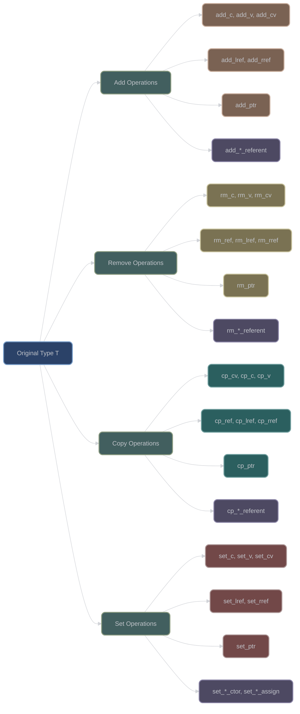
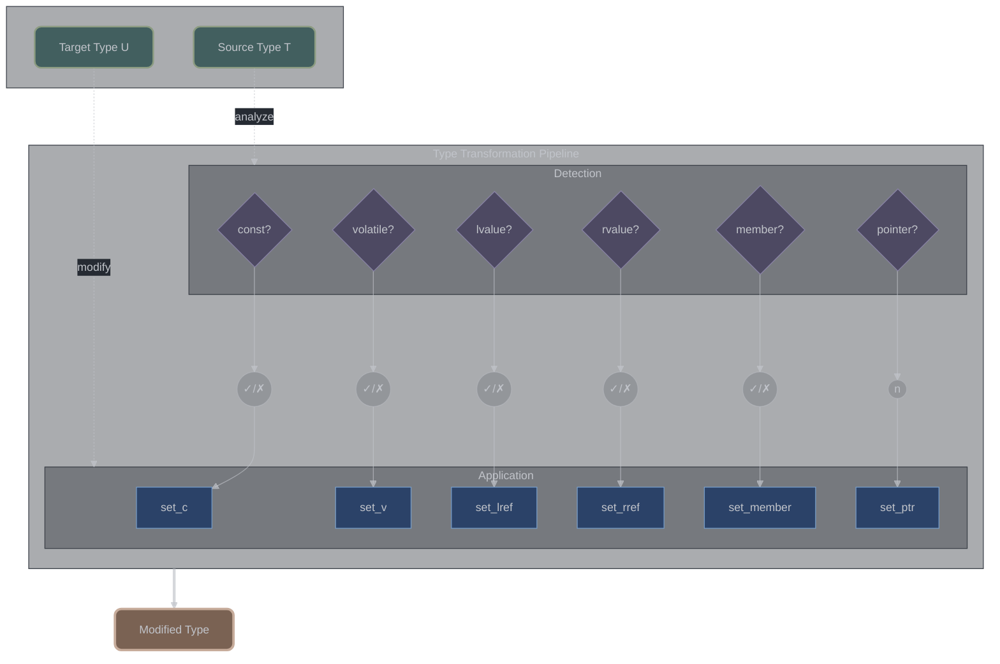

# Type Modification Traits

## Overview

XIEITE provides comprehensive type modification traits organized into four operations: **add**, **remove**, **copy**, and **set**. These traits extend the standard library with more granular control, especially for reference and CV-qualifier manipulation.

## Modification Operations Matrix



## Add Operations

### Adding CV-Qualifiers

**Source**: `include/xieite/trait/add_c.hpp`, `add_v.hpp`, `add_cv.hpp`

```cpp
template<typename T>
using add_c = T const;

template<typename T>
using add_v = T volatile;

template<typename T>
using add_cv = add_c<add_v<T>>;  // const volatile T
```

**Usage Examples**:

| Input Type | `add_c` | `add_v` | `add_cv` |
|------------|---------|---------|----------|
| `int` | `const int` | `volatile int` | `const volatile int` |
| `int&` | `int&` | `int&` | `int&` |
| `const int` | `const int` | `const volatile int` | `const volatile int` |

### Adding References

**Source**: `include/xieite/trait/add_lref.hpp`, `add_rref.hpp`, `add_ref.hpp`

```cpp
template<typename T>
using add_lref = std::add_lvalue_reference_t<T>;

template<typename T>
using add_rref = std::add_rvalue_reference_t<T>;

template<typename T>
using add_ref = add_lref<T>;  // Default to lvalue reference
```

### Adding Composite References

**Source**: `include/xieite/trait/add_*ref.hpp`

```cpp
template<typename T>
using add_cref = add_lref<add_c<T>>;  // const T&

template<typename T>
using add_vref = add_lref<add_v<T>>;  // volatile T&

template<typename T>
using add_cvref = add_lref<add_cv<T>>;  // const volatile T&

template<typename T>
using add_clref = add_cref<T>;  // Alias for const T&

template<typename T>
using add_crref = add_rref<add_c<T>>;  // const T&&

template<typename T>
using add_vrref = add_rref<add_v<T>>;  // volatile T&&

template<typename T>
using add_cvrref = add_rref<add_cv<T>>;  // const volatile T&&
```

### Adding Pointers

**Source**: `include/xieite/trait/add_ptr.hpp`

```cpp
template<typename T>
using add_ptr = std::add_pointer_t<T>;
```

## Referent Operations (Unique to XIEITE)

### Understanding Referent vs Reference

The referent is what a reference refers to. XIEITE provides unique operations to modify the referent:

```cpp
// Standard library behavior
using type1 = std::add_const_t<int&>;  // int& (no change!)

// XIEITE referent operation
using type2 = xieite::add_c_referent<int&>;  // const int&
```

### Adding Qualifiers to Referent

**Source**: `include/xieite/trait/add_*_referent.hpp`

```cpp
template<typename T>
struct add_c_referent { using type = T; };

template<typename T>
struct add_c_referent<T&> { using type = const T&; };

template<typename T>
struct add_c_referent<T&&> { using type = const T&&; };

template<typename T>
using add_c_referent_t = typename add_c_referent<T>::type;
```

**Complete Referent Operations**:

| Operation | Purpose | Example |
|-----------|---------|---------|
| `add_c_referent` | Add const to referent | `int&` → `const int&` |
| `add_v_referent` | Add volatile to referent | `int&` → `volatile int&` |
| `add_cv_referent` | Add const volatile | `int&` → `const volatile int&` |
| `add_lref_referent` | Make referent lvalue ref | `int*&` → `int&` |
| `add_rref_referent` | Make referent rvalue ref | `int*&` → `int&&` |
| `add_ptr_referent` | Add pointer to referent | `int&` → `int*&` |

### Generic Reference Addition

**Source**: `include/xieite/trait/add_ref.hpp`

```cpp
// Add reference based on second type's reference category
template<typename T, typename U>
using add_ref = xieite::cp_lref<T, xieite::cp_rref<T, U>>;

// Usage examples:
static_assert(std::is_same_v<add_ref<int, float&>, int&>);      // lvalue ref
static_assert(std::is_same_v<add_ref<int, float&&>, int&&>);    // rvalue ref
static_assert(std::is_same_v<add_ref<int, float>, int>);        // no ref
```

### Composite Reference Addition

**Source**: `include/xieite/trait/add_*ref.hpp`

```cpp
// Add const + lvalue reference
template<typename T>
using add_clref = xieite::add_c<xieite::add_lref<T>>;

// Add const + rvalue reference
template<typename T>
using add_crref = xieite::add_c<xieite::add_rref<T>>;

// Add const volatile + lvalue reference
template<typename T>
using add_cvlref = xieite::add_cv<xieite::add_lref<T>>;

// Add const + generic reference
template<typename T, typename U>
using add_cref = xieite::add_c<xieite::add_ref<T, U>>;

// Add const volatile + generic reference
template<typename T, typename U>
using add_cvref = xieite::add_cv<xieite::add_ref<T, U>>;

// Add volatile + lvalue reference
template<typename T>
using add_vlref = xieite::add_v<xieite::add_lref<T>>;

// Add volatile + rvalue reference
template<typename T>
using add_vrref = xieite::add_v<xieite::add_rref<T>>;

// Add volatile + generic reference
template<typename T, typename U>
using add_vref = xieite::add_v<xieite::add_ref<T, U>>;

// Add const volatile + rvalue reference
template<typename T>
using add_cvrref = xieite::add_cv<xieite::add_rref<T>>;
```

### Generic Reference Referent Addition

**Source**: `include/xieite/trait/add_ref_referent.hpp`

```cpp
// Add reference to referent based on source type's reference category
template<typename T, typename U>
using add_ref_referent = std::conditional_t<
    xieite::is_lref_referent<T>,
    xieite::add_lref_referent<U>,
    std::conditional_t<
        xieite::is_rref_referent<T>,
        xieite::add_rref_referent<U>,
        U
    >
>;

// This utility copies reference categories at the referent level
// Useful for function type transformations
```

### Function Referent Modifiers

**Source**: `include/xieite/trait/add_noex_referent.hpp`, `add_variadic_referent.hpp`

```cpp
// Add noexcept to function referent
template<typename T>
struct add_noex_referent { using type = T; };

template<typename R, typename... Args>
struct add_noex_referent<R(&)(Args...)> {
    using type = R(&)(Args...) noexcept;
};

// Add variadic args to function referent - comprehensive implementation
template<typename T>
using add_variadic_referent = xieite::cp_cvref<T, /* variadic transformation */>;

// Supports all function types:
// - Function pointers: void(*)(int) → void(*)(int, ...)
// - Member functions: void(Class::*)(int) → void(Class::*)(int, ...)
// - Function references: void(&)(int) → void(&)(int, ...)
// - All CV and ref qualifiers preserved
```

## Casting Utilities

**Source**: `include/xieite/trait/as_*.hpp`

XIEITE provides functional casting utilities that apply CV-qualifiers using `const_cast`:

```cpp
// Cast to const
inline constexpr auto as_c = []<typename T>(T&& x) noexcept {
    return const_cast<xieite::add_c<T&&>>(x);
};

// Cast to const volatile
inline constexpr auto as_cv = []<typename T>(T&& x) noexcept {
    return const_cast<xieite::add_cv<T&&>>(x);
};

// Cast to volatile
inline constexpr auto as_v = []<typename T>(T&& x) noexcept {
    return const_cast<xieite::add_v<T&&>>(x);
};

// Remove const
inline constexpr auto as_not_c = []<typename T>(T&& x) noexcept {
    return const_cast<xieite::rm_c<T&&>>(x);
};

// Remove const volatile
inline constexpr auto as_not_cv = []<typename T>(T&& x) noexcept {
    return const_cast<xieite::rm_cv<T&&>>(x);
};

// Remove volatile
inline constexpr auto as_not_v = []<typename T>(T&& x) noexcept {
    return const_cast<xieite::rm_v<T&&>>(x);
};

// Usage examples:
const int x = 42;
auto& mutable_x = xieite::as_not_c(x);    // int&
auto& volatile_x = xieite::as_v(x);       // const volatile int&
```

## Copy Operations

Copy operations transfer qualifiers from a source type to a target type, providing conditional type modification based on the source type's characteristics.

### Copying CV-Qualifiers

**Source**: `include/xieite/trait/cp_c.hpp`, `cp_v.hpp`, `cp_cv.hpp`

```cpp
// Copy const qualifier from T to U
template<typename T, typename U>
using cp_c = xieite::set_c<xieite::is_c<T>, U>;

// Copy volatile qualifier from T to U
template<typename T, typename U>
using cp_v = std::conditional_t<xieite::is_v<T>, xieite::add_v<U>, xieite::rm_v<U>>;

// Copy both const and volatile qualifiers from T to U
template<typename T, typename U>
using cp_cv = xieite::cp_c<T, xieite::cp_v<T, U>>;

// Usage examples:
static_assert(std::is_same_v<cp_c<const int, float>, const float>);
static_assert(std::is_same_v<cp_c<int, const float>, float>);
static_assert(std::is_same_v<cp_v<volatile int, float>, volatile float>);
static_assert(std::is_same_v<cp_cv<const volatile int, float>, const volatile float>);
```

### Copying References

**Source**: `include/xieite/trait/cp_lref.hpp`, `cp_rref.hpp`, `cp_ref.hpp`

```cpp
// Copy lvalue reference from T to U
template<typename T, typename U>
using cp_lref = xieite::set_lref<xieite::is_lref<T>, U>;

// Copy rvalue reference from T to U
template<typename T, typename U>
using cp_rref = xieite::set_rref<xieite::is_rref<T>, U>;

// Copy any reference category from T to U
template<typename T, typename U>
using cp_ref = /* implementation depends on reference type of T */;

// Usage examples:
static_assert(std::is_same_v<cp_lref<int&, float>, float&>);
static_assert(std::is_same_v<cp_lref<int, float&>, float>);
static_assert(std::is_same_v<cp_rref<int&&, float>, float&&>);
static_assert(std::is_same_v<cp_rref<int, float&&>, float>);
```

### Composite Copy Operations

**Source**: `include/xieite/trait/cp_*ref.hpp`

```cpp
// Copy const + lvalue reference from T to U
template<typename T, typename U>
using cp_clref = xieite::cp_c<T, xieite::cp_lref<T, U>>;

// Copy const + generic reference from T to U
template<typename T, typename U>
using cp_cref = xieite::cp_c<T, xieite::cp_ref<T, U>>;

// Copy const + rvalue reference from T to U
template<typename T, typename U>
using cp_crref = xieite::cp_c<T, xieite::cp_rref<T, U>>;

// Copy const volatile + lvalue reference from T to U
template<typename T, typename U>
using cp_cvlref = xieite::cp_cv<T, xieite::cp_lref<T, U>>;

// Copy const volatile + generic reference from T to U
template<typename T, typename U>
using cp_cvref = xieite::cp_cv<T, xieite::cp_ref<T, U>>;

// Copy const volatile + rvalue reference from T to U
template<typename T, typename U>
using cp_cvrref = xieite::cp_cv<T, xieite::cp_rref<T, U>>;

// Usage examples:
static_assert(std::is_same_v<cp_clref<const int&, float>, const float&>);
static_assert(std::is_same_v<cp_clref<int, const float&>, float>);
static_assert(std::is_same_v<cp_cvref<const volatile int&, float>, const volatile float&>);
```

### Reference Collapse Utilities

**Source**: `include/xieite/trait/collapse_ref.hpp`

```cpp
// Implements reference collapsing rules for forwarding
template<typename T, typename U>
using collapse_ref = xieite::cp_cvlref<T, xieite::add_rref<U>>;

// This utility is particularly useful for perfect forwarding scenarios
// where reference categories need to be preserved correctly
```

## Remove Operations

### Removing CV-Qualifiers

**Source**: `include/xieite/trait/rm_c.hpp`, `rm_v.hpp`, `rm_cv.hpp`

```cpp
template<typename T>
using rm_c = std::remove_const_t<T>;

template<typename T>
using rm_v = std::remove_volatile_t<T>;

template<typename T>
using rm_cv = std::remove_cv_t<T>;
```

### Removing References

**Source**: `include/xieite/trait/rm_ref.hpp`, `rm_lref.hpp`, `rm_rref.hpp`

```cpp
template<typename T>
using rm_ref = std::remove_reference_t<T>;

// Remove only if lvalue reference
template<typename T>
struct rm_lref { using type = T; };

template<typename T>
struct rm_lref<T&> { using type = T; };

// Remove only if rvalue reference
template<typename T>
struct rm_rref { using type = T; };

template<typename T>
struct rm_rref<T&&> { using type = T; };
```

### Removing Composite Types

**Source**: `include/xieite/trait/rm_*ref.hpp`

```cpp
template<typename T>
using rm_cvref = rm_cv<rm_ref<T>>;

template<typename T>
using rm_cref = rm_ref<rm_c<T>>;

template<typename T>
using rm_vref = rm_ref<rm_v<T>>;
```

### Removing Pointers

**Source**: `include/xieite/trait/rm_ptr.hpp`

```cpp
template<typename T>
struct rm_ptr { using type = T; };

template<typename T>
struct rm_ptr<T*> { using type = T; };

template<typename T>
using rm_ptr_t = typename rm_ptr<T>::type;
```

### Removing from Referent

**Source**: `include/xieite/trait/rm_*_referent.hpp`

```cpp
template<typename T>
struct rm_c_referent { using type = T; };

template<typename T>
struct rm_c_referent<const T&> { using type = T&; };

template<typename T>
struct rm_c_referent<const T&&> { using type = T&&; };
```

## Copy Operations

### Copying CV-Qualifiers

**Source**: `include/xieite/trait/cp_cv.hpp`, `cp_c.hpp`, `cp_v.hpp`

```cpp
template<typename From, typename To>
struct cp_cv {
    using type = To;
};

template<typename From, typename To>
    requires std::is_const_v<From>
struct cp_cv<From, To> {
    using type = add_c<typename cp_v<From, To>::type>;
};

template<typename From, typename To>
    requires std::is_volatile_v<From>
struct cp_v {
    using type = add_v<To>;
};
```

**Usage Example**:
```cpp
using source = const volatile int;
using target = float;
using result = xieite::cp_cv<source, target>;  // const volatile float
```

### Copying References

**Source**: `include/xieite/trait/cp_ref.hpp`, `cp_lref.hpp`, `cp_rref.hpp`

```cpp
template<typename From, typename To>
struct cp_ref {
    using type = To;
};

template<typename From, typename To>
struct cp_ref<From&, To> {
    using type = To&;
};

template<typename From, typename To>
struct cp_ref<From&&, To> {
    using type = To&&;
};
```

### Copying Complex Qualifiers

**Source**: `include/xieite/trait/cp_cvref.hpp`

```cpp
template<typename From, typename To>
using cp_cvref = cp_ref<From, cp_cv<rm_ref<From>, To>>;
```

**Example**:
```cpp
using source = const int&;
using target = float;
using result = xieite::cp_cvref<source, target>;  // const float&
```

### Copying Special Member Functions

**Source**: `include/xieite/trait/cp_*_ctor.hpp`, `cp_*_assign.hpp`

These traits copy constructibility/assignability properties between types (implementation-specific).

## Set Operations

### Setting CV-Qualifiers

**Source**: `include/xieite/trait/set_c.hpp`, `set_v.hpp`, `set_cv.hpp`

```cpp
template<typename T, bool Const>
using set_c = std::conditional_t<Const, add_c<T>, rm_c<T>>;

template<typename T, bool Volatile>
using set_v = std::conditional_t<Volatile, add_v<T>, rm_v<T>>;

template<typename T, bool Const, bool Volatile>
using set_cv = set_c<set_v<T, Volatile>, Const>;
```

### Setting References

**Source**: `include/xieite/trait/set_lref.hpp`, `set_rref.hpp`

```cpp
template<typename T, bool AddRef>
using set_lref = std::conditional_t<AddRef, add_lref<T>, T>;

template<typename T, bool AddRef>
using set_rref = std::conditional_t<AddRef, add_rref<T>, T>;
```

### Setting Special Member Functions

**Source**: `include/xieite/trait/set_*_ctor.hpp`, `set_*_assign.hpp`

These traits enable/disable special member functions (compiler-specific implementation).

## Advanced Type Transformations

### Collapse Operations

**Source**: `include/xieite/trait/collapse_ref.hpp`

```cpp
// Collapse reference-to-reference (follows reference collapsing rules)
template<typename T>
struct collapse_ref { using type = T; };

template<typename T>
struct collapse_ref<T&> { using type = T&; };

template<typename T>
struct collapse_ref<T&&> { using type = T&&; };

template<typename T>
struct collapse_ref<T&&&> { using type = T&; };  // & + && = &

template<typename T>
struct collapse_ref<T&&&&> { using type = T&&; }; // && + && = &&
```

### Conditional Type Selection

```cpp
// As operations - conditional conversion
template<typename T, typename U>
using as_c = std::conditional_t<std::is_const_v<U>, add_c<T>, T>;

template<typename T, typename U>
using as_v = std::conditional_t<std::is_volatile_v<U>, add_v<T>, T>;

template<typename T, typename U>
using as_cv = as_c<as_v<T, U>, U>;
```

### Safe Conversions

**Source**: `include/xieite/trait/try_signed.hpp`, `try_unsigned.hpp`

```cpp
template<typename T>
struct try_signed {
    using type = std::conditional_t<
        std::is_integral_v<T> && !std::is_same_v<T, bool>,
        std::make_signed_t<T>,
        T
    >;
};

template<typename T>
struct try_unsigned {
    using type = std::conditional_t<
        std::is_integral_v<T> && !std::is_same_v<T, bool>,
        std::make_unsigned_t<T>,
        T
    >;
};
```

## Type Extraction

### Getting Function Properties

**Source**: `include/xieite/trait/get_fn_*.hpp`

```cpp
// Extract function return type
template<typename T>
struct get_fn_ret;

template<typename R, typename... Args>
struct get_fn_ret<R(Args...)> {
    using type = R;
};

// Extract function arguments
template<typename T>
struct get_fn_args;

template<typename R, typename... Args>
struct get_fn_args<R(Args...)> {
    using type = std::tuple<Args...>;
};
```

### Getting Pointer Properties

**Source**: `include/xieite/trait/get_ptr.hpp`, `get_member_ptr_class.hpp`

```cpp
// Extract pointed-to type
template<typename T>
struct get_ptr { using type = T; };

template<typename T>
struct get_ptr<T*> { using type = T; };

// Extract class from member pointer
template<typename T>
struct get_member_ptr_class;

template<typename T, typename C>
struct get_member_ptr_class<T C::*> {
    using type = C;
};
```

## Usage Patterns

### Perfect Forwarding with Qualification Preservation

```cpp
template<typename T, typename U>
decltype(auto) forward_with_quals(U&& u) {
    using qualified = xieite::cp_cvref<T, std::remove_reference_t<U>>;
    return static_cast<qualified>(u);
}
```

### Type Sanitization

```cpp
template<typename T>
using sanitized = xieite::rm_cvref<T>;

template<typename T>
void process(T&& value) {
    using clean_type = sanitized<T>;
    // Work with clean type
}
```

### Conditional Const

```cpp
template<bool IsConst, typename T>
using maybe_const = xieite::set_c<T, IsConst>;

template<bool IsConst>
class Container {
    using iterator = maybe_const<IsConst, int*>;
};
```

## Implementation Notes

### Reference Collapsing Rules

XIEITE follows C++ reference collapsing rules:
- `T& &` → `T&`
- `T& &&` → `T&`
- `T&& &` → `T&`
- `T&& &&` → `T&&`

### CV-Qualifier Rules

- CV-qualifiers on references are ignored
- CV-qualifiers on the referent are preserved
- Top-level CV-qualifiers can be added/removed

### SFINAE Considerations

All type modifications are SFINAE-friendly:
```cpp
template<typename T>
using safe_add_ref = std::conditional_t<
    std::is_referenceable_v<T>,
    add_lref<T>,
    T
>;
```

## Conditional Type Utilities

### Conditional Inheritance

**Source**: `include/xieite/trait/maybe_base.hpp`

Provides conditional base class inheritance for selective feature enablement:

```cpp
template<bool x, typename T>
using maybe_base = std::conditional_t<x, T, DETAIL_XIEITE::maybe_base::dummy<T>>;

// Usage example: Optional feature inheritance
template<bool EnableLogging>
class Service : public maybe_base<EnableLogging, Logger> {
public:
    void process() {
        if constexpr (EnableLogging) {
            this->log("Processing...");  // Only available when enabled
        }
        // Core functionality
    }
};

using LoggingService = Service<true>;     // Inherits from Logger
using SilentService = Service<false>;     // No Logger inheritance
```

### Optimal Parameter Passing

**Source**: `include/xieite/trait/maybe_ref.hpp`

Automatically selects optimal parameter passing strategy based on type characteristics:

```cpp
template<typename T>
using maybe_ref = std::conditional_t<
    ((sizeof(T) <= (sizeof(int*) * 2)) && std::is_trivially_copyable_v<T>),
    T,           // Pass by value for small trivial types
    const T&     // Pass by const reference for large/complex types
>;

// Usage example: Optimal generic parameter passing
template<typename T>
void process(maybe_ref<T> param) {
    // Efficiently handles both small POD types and large/complex objects
}

// Behavior examples:
// process<int>(42);              // maybe_ref<int> = int (by value)
// process<std::string>(str);     // maybe_ref<std::string> = const std::string& (by ref)
// process<std::vector<int>>(v);  // maybe_ref<std::vector<int>> = const std::vector<int>& (by ref)
```

**Size Threshold Logic**:
- **Small types** (≤ 2 pointer sizes): Passed by value if trivially copyable
- **Large types** (> 2 pointer sizes): Always passed by const reference
- **Non-trivially copyable**: Always passed by const reference regardless of size

## Comprehensive Remove Operations

**Source**: `include/xieite/trait/rm_*.hpp`

XIEITE provides systematic removal of all type qualifiers and modifiers:

### CV-Qualifier Removal

```cpp
// Remove const (reference-aware)
template<typename T>
using rm_c = xieite::cp_ref<T, std::remove_const_t<xieite::rm_ref<T>>>;

// Remove volatile (reference-aware)
template<typename T>
using rm_v = xieite::cp_ref<T, std::remove_volatile_t<xieite::rm_ref<T>>>;

// Remove both const and volatile
template<typename T>
using rm_cv = xieite::rm_c<xieite::rm_v<T>>;

// Usage examples:
static_assert(std::same_as<rm_c<const int&>, int&>);        // Reference preserved
static_assert(std::same_as<rm_c<const int>, int>);          // Const removed
static_assert(std::same_as<rm_cv<const volatile int>, int>); // Both removed
```

### Reference Removal

```cpp
// Remove lvalue reference
template<typename T>
using rm_lref = std::conditional_t<std::is_lvalue_reference_v<T>,
                                   std::remove_reference_t<T>, T>;

// Remove rvalue reference
template<typename T>
using rm_rref = std::conditional_t<std::is_rvalue_reference_v<T>,
                                   std::remove_reference_t<T>, T>;

// Remove any reference
template<typename T>
using rm_ref = std::remove_reference_t<T>;

// Remove CV-reference combinations
template<typename T>
using rm_clref = rm_lref<rm_c<T>>;   // Remove const lvalue reference

template<typename T>
using rm_cvref = rm_ref<rm_cv<T>>;   // Remove CV and any reference
```

### Pointer Removal

```cpp
// Remove pointer indirection (with depth support)
template<typename T, std::size_t depth = 1>
using rm_ptr = /* complex implementation with fold_for */;

// Remove all pointer levels
template<typename T>
using rm_ptr<T, -1uz> = /* recursive removal until non-pointer */;

// Usage examples:
static_assert(std::same_as<rm_ptr<int*>, int>);
static_assert(std::same_as<rm_ptr<int**, 2>, int>);
static_assert(std::same_as<rm_ptr<int***, -1uz>, int>); // Remove all levels
```

## Comprehensive Add Operations

**Source**: `include/xieite/trait/add_*.hpp`

XIEITE extends standard add operations with reference-aware behavior:

### CV-Qualifier Addition

```cpp
// Add const (preserving references)
template<typename T>
using add_c = xieite::cp_ref<T, std::add_const_t<xieite::rm_ref<T>>>;

// Add volatile (preserving references)
template<typename T>
using add_v = xieite::cp_ref<T, std::add_volatile_t<xieite::rm_ref<T>>>;

// Add both const and volatile
template<typename T>
using add_cv = add_c<add_v<T>>;

// Usage examples:
static_assert(std::same_as<add_c<int&>, const int&>);      // Reference preserved
static_assert(std::same_as<add_cv<int>, const volatile int>);
```

### Reference Addition

```cpp
// Add lvalue reference (if not already reference)
template<typename T>
using add_lref = std::conditional_t<std::is_referenceable_v<T>,
                                    std::add_lvalue_reference_t<T>, T>;

// Add rvalue reference (if not already reference)
template<typename T>
using add_rref = std::conditional_t<std::is_referenceable_v<T>,
                                    std::add_rvalue_reference_t<T>, T>;

// Add pointer
template<typename T>
using add_ptr = std::add_pointer_t<T>;

// Combined CV-reference additions
template<typename T>
using add_clref = add_lref<add_c<T>>;    // Add const lvalue reference

template<typename T>
using add_cvref = add_ref<add_cv<T>>;    // Add CV and reference
```

## Comprehensive Set Operations

**Source**: `include/xieite/trait/set_*.hpp`

Set operations provide conditional addition/removal based on boolean parameters:

### Conditional CV-Qualifiers

```cpp
// Conditionally set const
template<typename T, bool Const>
using set_c = std::conditional_t<Const, add_c<T>, rm_c<T>>;

// Conditionally set volatile
template<typename T, bool Volatile>
using set_v = std::conditional_t<Volatile, add_v<T>, rm_v<T>>;

// Conditionally set both
template<typename T, bool Const, bool Volatile>
using set_cv = set_c<set_v<T, Volatile>, Const>;

// Usage examples:
static_assert(std::same_as<set_c<int, true>, const int>);
static_assert(std::same_as<set_c<const int, false>, int>);
```

### Conditional References

```cpp
// Conditionally set lvalue reference
template<typename T, bool AddRef>
using set_lref = std::conditional_t<AddRef, add_lref<T>, T>;

// Conditionally set rvalue reference
template<typename T, bool AddRef>
using set_rref = std::conditional_t<AddRef, add_rref<T>, T>;

// Template-based qualifier manipulation
template<typename Source, typename Target>
void transform_with_qualifiers() {
    constexpr bool is_const = std::is_const_v<Source>;
    constexpr bool is_volatile = std::is_volatile_v<Source>;
    constexpr bool is_lref = std::is_lvalue_reference_v<Source>;

    using result = set_lref<set_cv<Target, is_const, is_volatile>, is_lref>;
}
```

## Advanced Type Modification Patterns

### Reference-Preserving Operations

XIEITE's type modification system follows a key principle: **reference preservation**. Operations like `rm_c` and `add_v` work on the underlying type while preserving the reference category:

```cpp
// Traditional approach (loses reference):
// std::remove_const_t<const int&> -> const int (reference lost!)

// XIEITE approach (preserves reference):
// xieite::rm_c<const int&> -> int& (reference preserved!)

template<typename T>
concept reference_preserving_remove =
    std::is_reference_v<T> == std::is_reference_v<xieite::rm_c<T>>;
```

### Composition Patterns

```cpp
// Build complex transformations by composition
template<typename T>
using make_mutable_lref = add_lref<rm_cv<T>>;

template<typename T>
using make_const_copy = rm_ref<add_c<T>>;

// Conditional transformation chains
template<typename T, bool MakeConst, bool MakeRef>
using conditional_transform =
    set_lref<set_c<rm_cvref<T>, MakeConst>, MakeRef>;
```

## Performance Impact

- **Compile Time**: Type aliases have minimal impact
- **Runtime**: Zero overhead - all resolved at compile time
- **Binary Size**: No impact on generated code
- **Debug Info**: May increase debug symbol size

## Common Use Cases

1. **Generic Programming**: Preserve qualifiers in templates
2. **Perfect Forwarding**: Maintain exact types through layers
3. **Type Erasure**: Remove qualifiers for storage
4. **Const-Correctness**: Conditional const in templates
5. **SFINAE**: Enable/disable overloads based on qualifiers
6. **Reference Preservation**: Maintain reference categories during modification
7. **Conditional Type Building**: Construct types based on template parameters

## Advanced Copy Operations (`cp_*`)

**The `cp_*` family represents the most sophisticated type copying system in XIEITE**, providing conditional transfer of type properties from source to target types. These operations form the foundation for creating types that inherit specific characteristics from other types.

### Copy Operation Architecture



### Special Member Function Copy

**Source Files**: `include/xieite/trait/cp_cp_assign.hpp`, `cp_cp_ctor.hpp`, `cp_default_ctor.hpp`, `cp_mv_assign.hpp`, `cp_mv_ctor.hpp`

These utilities copy the availability of special member functions using specialized base classes that selectively enable/disable operations:

```cpp
// Copy constructor availability - include/xieite/trait/cp_cp_ctor.hpp
template<typename T>
using cp_cp_ctor = xieite::set_cp_ctor<std::is_copy_constructible_v<T>>;

// Copy assignment availability - include/xieite/trait/cp_cp_assign.hpp
template<typename T>
using cp_cp_assign = xieite::set_cp_assign<std::is_copy_assignable_v<T>>;

// Move constructor availability - include/xieite/trait/cp_mv_ctor.hpp
template<typename T>
using cp_mv_ctor = xieite::set_mv_ctor<std::is_move_constructible_v<T>>;

// Move assignment availability - include/xieite/trait/cp_mv_assign.hpp
template<typename T>
using cp_mv_assign = xieite::set_mv_assign<std::is_move_assignable_v<T>>;

// Default constructor availability - include/xieite/trait/cp_default_ctor.hpp
template<typename T>
using cp_default_ctor = xieite::set_default_ctor<std::is_default_constructible_v<T>>;
```

**Usage Pattern**:
```cpp
// Create a wrapper that has the same constructibility as the wrapped type
template<typename T>
class Wrapper : public cp_cp_ctor<T>, public cp_mv_ctor<T>, public cp_default_ctor<T> {
    T value;
public:
    // Inherits constructibility characteristics from T
    // If T is not copy constructible, Wrapper won't be either
    // If T is not move constructible, Wrapper won't be either
};
```

### CV-Qualifier Referent Copy

**Source Files**: `include/xieite/trait/cp_c_referent.hpp`, `cp_v_referent.hpp`

Copy const/volatile qualifiers specifically for referent types (what references refer to):

```cpp
// Copy const qualification of referent - include/xieite/trait/cp_c_referent.hpp
template<typename T, typename U>
using cp_c_referent = xieite::set_c_referent<xieite::is_c_referent<T>, U>;

// Copy volatile qualification of referent - include/xieite/trait/cp_v_referent.hpp
template<typename T, typename U>
using cp_v_referent = std::conditional_t<xieite::is_v_referent<T>,
                                        xieite::add_v_referent<U>,
                                        xieite::rm_v_referent<U>>;
```

**Referent vs Direct Qualification**:
```cpp
// Standard approach (works on direct type)
using std_result = std::conditional_t<std::is_const_v<const int&>,
                                     std::add_const_t<float>, float>;
// Result: float (const int& is not directly const!)

// XIEITE referent approach (works on what reference refers to)
using xieite_result = cp_c_referent<const int&, float>;
// Result: const float (detects that referent 'int' is const)
```

### Reference Type Copy

**Source Files**: `include/xieite/trait/cp_lref_referent.hpp`, `cp_rref_referent.hpp`, `cp_ref_referent.hpp`, `cp_ref.hpp`

Sophisticated reference qualification copying with precise control over reference categories:

```cpp
// Copy lvalue reference from referent - include/xieite/trait/cp_lref_referent.hpp
template<typename T, typename U>
using cp_lref_referent = xieite::set_lref_referent<xieite::is_lref_referent<T>, U>;

// Copy rvalue reference from referent - include/xieite/trait/cp_rref_referent.hpp
template<typename T, typename U>
using cp_rref_referent = xieite::set_rref_referent<xieite::is_rref_referent<T>, U>;

// Copy any reference type from referent - include/xieite/trait/cp_ref_referent.hpp
template<typename T, typename U>
using cp_ref_referent = xieite::set_ref_referent<xieite::is_ref_referent<T>, U>;

// General reference copy with branching logic - include/xieite/trait/cp_ref.hpp
template<typename T, typename U>
using cp_ref = std::conditional_t<xieite::is_lref<T>,
                                 xieite::add_lref<U>,
                                 xieite::cp_rref<T, xieite::rm_ref<U>>>;
```

**Branching Strategy**: The `cp_ref` implementation uses a sophisticated branching approach:
1. If source is lvalue reference → add lvalue reference to target
2. Otherwise → delegate to `cp_rref` for rvalue reference handling

### Function Signature Property Copy

**Source Files**: `include/xieite/trait/cp_noex_referent.hpp`, `cp_variadic_referent.hpp`

Copy function-specific properties for template metaprogramming with callable types:

```cpp
// Copy noexcept specification - include/xieite/trait/cp_noex_referent.hpp
template<typename T, typename U>
using cp_noex_referent = xieite::set_noex_referent<xieite::is_noex_referent<T>, U>;

// Copy variadic parameter characteristics - include/xieite/trait/cp_variadic_referent.hpp
template<typename T, typename U>
using cp_variadic_referent = xieite::set_variadic_referent<xieite::is_variadic_referent<T>, U>;
```

**Function Property Transfer**:
```cpp
// Transform function signatures while preserving properties
template<typename SourceFunc, typename NewReturn, typename... NewArgs>
using transform_function = cp_noex_referent<SourceFunc,
                                          cp_variadic_referent<SourceFunc,
                                                              NewReturn(NewArgs...)>>;

// Example:
using source = void(int, float) noexcept;
using target = transform_function<source, bool, double>;
// Result: bool(double) noexcept (preserves noexcept and adds based on source)
```

### Pointer Indirection Copy

**Source File**: `include/xieite/trait/cp_ptr.hpp`

Copy pointer indirection levels between types with sophisticated depth management:

```cpp
// Copy pointer indirection depth - include/xieite/trait/cp_ptr.hpp
template<typename T, typename U>
using cp_ptr = xieite::add_ptr<xieite::rm_ptr<U, -1uz>, xieite::get_ptr<T>>;
```

**Implementation Strategy**:
1. `rm_ptr<U, -1uz>` → Remove ALL pointer levels from target type U
2. `get_ptr<T>` → Extract pointer depth count from source type T
3. `add_ptr<..., count>` → Add exactly that many pointer levels to cleaned target

**Usage Examples**:
```cpp
static_assert(std::same_as<cp_ptr<int*, float>, float*>);
static_assert(std::same_as<cp_ptr<int***, double>, double***>);
static_assert(std::same_as<cp_ptr<int, char*>, char>); // Remove pointer when source has none
```

### Composite Copy Operations

**Source Files**: `include/xieite/trait/cp_crref.hpp`, `cp_vlref.hpp`, `cp_vref.hpp`, `cp_vrref.hpp`

Convenient combinations that chain multiple copy operations:

```cpp
// Copy const + rvalue reference - include/xieite/trait/cp_crref.hpp
template<typename T, typename U>
using cp_crref = xieite::cp_c_referent<T, xieite::cp_rref_referent<T, U>>;

// Copy volatile + lvalue reference - include/xieite/trait/cp_vlref.hpp
template<typename T, typename U>
using cp_vlref = xieite::cp_v_referent<T, xieite::cp_lref_referent<T, U>>;

// Copy volatile + any reference - include/xieite/trait/cp_vref.hpp
template<typename T, typename U>
using cp_vref = xieite::cp_v_referent<T, xieite::cp_ref_referent<T, U>>;

// Copy volatile + rvalue reference - include/xieite/trait/cp_vrref.hpp
template<typename T, typename U>
using cp_vrref = xieite::cp_v_referent<T, xieite::cp_rref_referent<T, U>>;
```

**Composition Pattern**: These utilities demonstrate the composability of XIEITE's type system:
- First operation copies one property (e.g., volatile qualification)
- Second operation copies another property (e.g., reference type)
- Result has both properties copied from source to target

### Implementation Patterns

#### Pattern 1: Standard Library Trait-Based
```cpp
template<typename T>
using cp_cp_ctor = xieite::set_cp_ctor<std::is_copy_constructible_v<T>>;
```
Uses standard library traits for detection, custom `set_*` for application.

#### Pattern 2: Custom Trait-Based
```cpp
template<typename T, typename U>
using cp_c_referent = xieite::set_c_referent<xieite::is_c_referent<T>, U>;
```
Uses XIEITE's custom traits for both detection and application.

#### Pattern 3: Conditional Branching
```cpp
template<typename T, typename U>
using cp_v_referent = std::conditional_t<xieite::is_v_referent<T>,
                                        xieite::add_v_referent<U>,
                                        xieite::rm_v_referent<U>>;
```
Uses explicit conditional logic for true/false branches.

#### Pattern 4: Composite Chaining
```cpp
template<typename T, typename U>
using cp_crref = xieite::cp_c_referent<T, xieite::cp_rref_referent<T, U>>;
```
Chains multiple operations to create composite transformations.

### Advanced Copy Use Cases

#### Perfect Forwarding with Property Preservation
```cpp
template<typename SourceType, typename TargetType>
auto forward_with_properties(TargetType&& target) {
    using result_type = cp_cvref<SourceType, std::decay_t<TargetType>>;
    return static_cast<result_type>(target);
}
```

#### Conditional Type Building
```cpp
template<typename Model, typename... Components>
class Builder {
public:
    template<typename T>
    using with_properties = cp_cv<Model, cp_ref<Model, T>>;

    using type = with_properties</*...combined Components...*/>;
};
```

#### Template Metaprogramming Utilities
```cpp
template<typename Signature>
struct function_traits;

template<typename R, typename... Args>
struct function_traits<R(Args...)> {
    template<typename NewR, typename... NewArgs>
    using with_signature = cp_noex_referent<R(Args...),
                                          cp_variadic_referent<R(Args...),
                                                               NewR(NewArgs...)>>;
};
```

### Design Philosophy

The `cp_*` system embodies several key principles:

1. **Modularity**: Each trait focuses on a single property type
2. **Composability**: Complex traits built by combining simpler ones
3. **Type Safety**: All operations are compile-time and type-safe
4. **Expressiveness**: Clear naming convention makes intent obvious
5. **Consistency**: Uniform interface across all copy operations
6. **Performance**: Zero runtime overhead, pure compile-time

### Integration with Standard Library

The `cp_*` system seamlessly integrates with standard library traits:

```cpp
// Combine with std::conditional for complex logic
template<typename T, typename U>
using smart_copy = std::conditional_t<std::is_fundamental_v<T>,
                                     cp_cv<T, U>,      // Copy CV for fundamentals
                                     cp_ref<T, U>>;    // Copy references for objects

// Use with SFINAE for conditional compilation
template<typename T, typename U>
    requires std::is_same_v<cp_cvref<T, U>, T>
void process_same_qualified(const T&, const U&) {
    // Only enabled when U would have same qualifications as T
}
```

---

*Next: [Type Relationships](relationships.md)*
