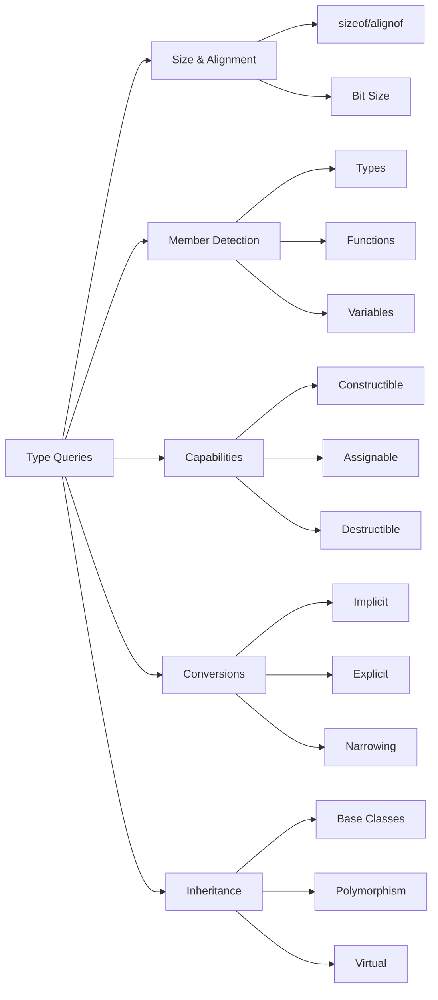

# Type Queries

## Overview

XIEITE's type query traits provide sophisticated mechanisms for extracting information about types at compile time. These traits go beyond simple classification to provide detailed type properties, relationships, and capabilities.

## Query Categories

### Size and Alignment Queries

#### Basic Size Information
```cpp
template<typename T>
constexpr std::size_t type_size = sizeof(T);

template<typename T>
constexpr std::size_t type_align = alignof(T);

template<typename T>
constexpr std::size_t member_count = xieite::member_count_v<T>;

template<typename T>
constexpr std::size_t bit_size = sizeof(T) * CHAR_BIT;
```

#### Alignment Queries
```cpp
template<typename T>
concept is_naturally_aligned = alignof(T) == sizeof(T);

template<typename T>
concept is_power_of_two_aligned = (alignof(T) & (alignof(T) - 1)) == 0;

template<typename T>
constexpr std::size_t alignment_offset(void* ptr) {
    return reinterpret_cast<std::uintptr_t>(ptr) % alignof(T);
}
```

### Member Queries

#### Member Type Detection
```cpp
template<typename T>
concept has_value_type = requires {
    typename T::value_type;
};

template<typename T>
concept has_iterator_types = requires {
    typename T::iterator;
    typename T::const_iterator;
    typename T::reverse_iterator;
    typename T::const_reverse_iterator;
};

template<typename T>
concept has_allocator_type = requires {
    typename T::allocator_type;
};
```

#### Member Function Detection
```cpp
template<typename T>
concept has_size_method = requires(T t) {
    { t.size() } -> std::convertible_to<std::size_t>;
};

template<typename T>
concept has_empty_method = requires(T t) {
    { t.empty() } -> std::convertible_to<bool>;
};

template<typename T>
concept has_clear_method = requires(T t) {
    t.clear();
};

template<typename T>
concept has_begin_end = requires(T t) {
    { t.begin() } -> std::input_or_output_iterator;
    { t.end() } -> std::sentinel_for<decltype(t.begin())>;
};
```

### Capability Queries

#### Constructibility Queries
```cpp
template<typename T>
concept is_default_constructible = std::is_default_constructible_v<T>;

template<typename T>
concept is_copy_constructible = std::is_copy_constructible_v<T>;

template<typename T>
concept is_move_constructible = std::is_move_constructible_v<T>;

template<typename T, typename... Args>
concept is_constructible_from = std::is_constructible_v<T, Args...>;

template<typename T>
concept is_nothrow_movable =
    std::is_nothrow_move_constructible_v<T> &&
    std::is_nothrow_move_assignable_v<T>;
```

#### Assignability Queries
```cpp
template<typename T>
concept is_copy_assignable = std::is_copy_assignable_v<T>;

template<typename T>
concept is_move_assignable = std::is_move_assignable_v<T>;

template<typename T, typename U>
concept is_assignable_from = std::is_assignable_v<T&, U>;

template<typename T>
concept is_swappable = std::is_swappable_v<T>;
```

### Conversion Queries

#### Implicit Conversion Detection
```cpp
template<typename From, typename To>
concept is_implicitly_convertible = std::is_convertible_v<From, To>;

template<typename From, typename To>
concept is_explicitly_convertible = requires(From f) {
    static_cast<To>(f);
};

template<typename T>
concept is_convertible_to_bool = std::is_convertible_v<T, bool>;

template<typename T>
concept is_numeric_convertible =
    std::is_convertible_v<T, int> ||
    std::is_convertible_v<T, double>;
```

#### Narrowing Detection
```cpp
template<typename From, typename To>
concept is_narrowing_conversion = !requires(From f) {
    To{f};  // Would fail if narrowing
};

template<typename T, typename U>
concept is_safe_conversion =
    std::is_convertible_v<T, U> &&
    !is_narrowing_conversion<T, U>;
```

### Inheritance Queries

#### Base Class Detection
```cpp
template<typename Derived, typename Base>
concept is_derived_from = std::is_base_of_v<Base, Derived>;

template<typename T, typename Base>
concept is_publicly_derived =
    std::is_base_of_v<Base, T> &&
    std::is_convertible_v<T*, Base*>;

template<typename T, typename Base>
concept is_virtually_derived = requires {
    // Complex detection using type traits
    typename xieite::virtual_base_detector<T, Base>;
};
```

#### Polymorphic Queries
```cpp
template<typename T>
concept is_polymorphic = std::is_polymorphic_v<T>;

template<typename T>
concept has_virtual_destructor = std::has_virtual_destructor_v<T>;

template<typename T>
concept is_abstract = std::is_abstract_v<T>;

template<typename T>
concept is_final = std::is_final_v<T>;
```

## Advanced Query Patterns

### Template Parameter Queries

```cpp
template<typename T>
struct template_arity;

template<template<typename...> class Tmpl, typename... Args>
struct template_arity<Tmpl<Args...>> {
    static constexpr std::size_t value = sizeof...(Args);
};

template<typename T>
inline constexpr std::size_t template_arity_v = template_arity<T>::value;
```

### Nested Type Extraction

```cpp
template<typename T, typename Default = void>
struct extract_value_type {
    using type = Default;
};

template<typename T>
    requires has_value_type<T>
struct extract_value_type<T, void> {
    using type = typename T::value_type;
};

template<typename T, typename Default = void>
using extract_value_type_t = typename extract_value_type<T, Default>::type;
```

### Function Signature Queries

```cpp
template<typename T>
struct function_traits;

template<typename R, typename... Args>
struct function_traits<R(Args...)> {
    using return_type = R;
    using argument_types = std::tuple<Args...>;
    static constexpr std::size_t arity = sizeof...(Args);

    template<std::size_t N>
    using argument_type = std::tuple_element_t<N, argument_types>;
};

template<typename T>
using function_return_t = typename function_traits<T>::return_type;

template<typename T>
inline constexpr std::size_t function_arity_v = function_traits<T>::arity;
```

### Member Pointer Queries

```cpp
template<typename T>
struct is_member_pointer_traits : std::false_type {};

template<typename T, typename C>
struct is_member_pointer_traits<T C::*> : std::true_type {
    using member_type = T;
    using class_type = C;
};

template<typename T>
concept is_member_pointer = is_member_pointer_traits<T>::value;

template<typename T>
using member_pointer_class_t = typename is_member_pointer_traits<T>::class_type;
```

## Compile-Time Property Queries

### Numeric Limits Queries
```cpp
template<typename T>
concept has_numeric_limits = std::numeric_limits<T>::is_specialized;

template<typename T>
    requires has_numeric_limits<T>
constexpr auto numeric_min = std::numeric_limits<T>::min();

template<typename T>
    requires has_numeric_limits<T>
constexpr auto numeric_max = std::numeric_limits<T>::max();

template<typename T>
concept is_signed_type = std::numeric_limits<T>::is_signed;
```

### Iterator Trait Queries
```cpp
template<typename T>
concept has_iterator_traits = requires {
    typename std::iterator_traits<T>::value_type;
    typename std::iterator_traits<T>::difference_type;
    typename std::iterator_traits<T>::pointer;
    typename std::iterator_traits<T>::reference;
    typename std::iterator_traits<T>::iterator_category;
};

template<typename T>
using iterator_value_t = typename std::iterator_traits<T>::value_type;

template<typename T>
using iterator_category_t = typename std::iterator_traits<T>::iterator_category;
```

## Relationship Queries

### Type Comparison
```cpp
template<typename T, typename U>
concept is_same = std::is_same_v<T, U>;

template<typename T, typename U>
concept is_similar = std::is_same_v<std::decay_t<T>, std::decay_t<U>>;

template<typename T, typename U>
concept is_related = is_same<T, U> ||
                     std::is_base_of_v<T, U> ||
                     std::is_base_of_v<U, T>;
```

### Layout Compatibility
```cpp
template<typename T, typename U>
concept is_layout_compatible =
    sizeof(T) == sizeof(U) &&
    alignof(T) == alignof(U) &&
    std::is_standard_layout_v<T> &&
    std::is_standard_layout_v<U>;

template<typename T, typename U>
concept is_pointer_interconvertible =
    std::is_pointer_interconvertible_base_of_v<T, U>;
```

## Usage Examples

### Compile-Time Decisions
```cpp
template<typename T>
class optimized_container {
    static constexpr bool use_small_buffer =
        sizeof(T) <= 16 &&
        std::is_nothrow_move_constructible_v<T>;

    using storage_type = std::conditional_t<
        use_small_buffer,
        std::array<std::byte, 16>,
        std::unique_ptr<T[]>
    >;

    storage_type storage_;
};
```

### SFINAE with Queries
```cpp
template<typename T>
auto serialize(const T& obj)
    -> std::enable_if_t<has_serialize_method<T>, std::string> {
    return obj.serialize();
}

template<typename T>
auto serialize(const T& obj)
    -> std::enable_if_t<!has_serialize_method<T> &&
                        std::is_arithmetic_v<T>, std::string> {
    return std::to_string(obj);
}
```

### Concept-Based Overloading
```cpp
template<typename T>
    requires has_size_method<T> && has_empty_method<T>
void process_container(const T& container) {
    if (!container.empty()) {
        std::cout << "Container size: " << container.size() << '\n';
    }
}

template<typename T>
    requires std::is_array_v<T>
void process_container(const T& array) {
    std::cout << "Array size: " << std::extent_v<T> << '\n';
}
```

## Performance Considerations

### Query Evaluation
- All queries are evaluated at compile time
- No runtime overhead for type queries
- Complex queries may increase compilation time
- Use memoization patterns for repeated queries

### Template Instantiation
```cpp
// Cache query results to avoid repeated instantiation
template<typename T>
struct type_info_cache {
    static constexpr bool is_trivial = std::is_trivial_v<T>;
    static constexpr bool is_copyable = std::is_copy_constructible_v<T>;
    static constexpr bool is_movable = std::is_move_constructible_v<T>;
    static constexpr std::size_t size = sizeof(T);
    static constexpr std::size_t alignment = alignof(T);
};

template<typename T>
using cached_info = type_info_cache<T>;
```

## Common Pitfalls

### Incomplete Type Issues
```cpp
// This will fail for incomplete types
template<typename T>
constexpr std::size_t get_size() {
    return sizeof(T);  // Error if T is incomplete
}

// Better: use SFINAE to handle incomplete types
template<typename T, typename = void>
struct safe_sizeof {
    static constexpr std::size_t value = 0;
    static constexpr bool valid = false;
};

template<typename T>
struct safe_sizeof<T, std::void_t<decltype(sizeof(T))>> {
    static constexpr std::size_t value = sizeof(T);
    static constexpr bool valid = true;
};
```

### Reference Type Handling
```cpp
// Always decay types for consistent queries
template<typename T>
struct normalized_queries {
    using type = std::decay_t<T>;
    static constexpr bool is_const = std::is_const_v<std::remove_reference_t<T>>;
    static constexpr bool is_reference = std::is_reference_v<T>;
    static constexpr bool is_pointer = std::is_pointer_v<type>;
};
```

## Best Practices

1. **Cache complex queries** in type traits to avoid repeated evaluation
2. **Use concepts** for cleaner syntax and better error messages
3. **Handle incomplete types** gracefully with SFINAE
4. **Normalize types** (remove cv-qualifiers and references) before querying
5. **Document query requirements** clearly in template constraints

## Mermaid Diagram



## See Also

- [Type Classification](./classification.md)
- [Type Traits API](../../reference/api/trait.md)
- [Concepts Documentation](./concepts.md)
- [SFINAE Helpers](./sfinae_helpers.md)
