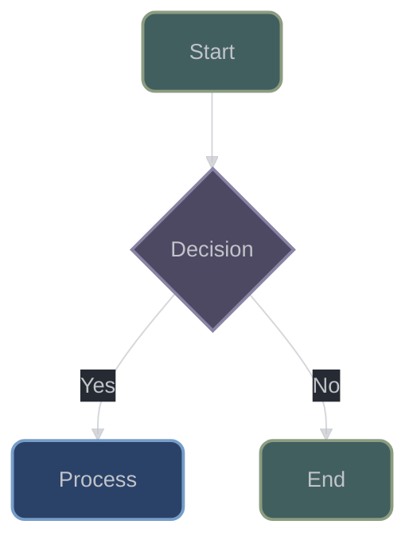

# Comprehensive Technical Documentation Generation for XIEITE

## CRITICAL REQUIREMENTS - FORENSIC ACCURACY MANDATE

### Zero-Assumption Policy

- **ABSOLUTE PROHIBITION**: No functionality may be documented without direct code verification
- **MANDATORY VALIDATION**: Every behavior must trace to specific source implementation
- **CROSS-VERIFICATION**: Confirm understanding through multiple code paths and edge cases
- **SOURCE CITATION**: Include file paths and line references for all critical implementations

## Documentation Mission & Scope

1. Create comprehensive technical documentation for XIEITE's internal mechanisms, focusing exclusively on:
   - Template metaprogramming patterns and techniques
   - Macro system internals (especially ARROW macros)
   - Concept-based design and compile-time validation
   - Cross-platform compatibility mechanisms
   - Internal utility implementations
   - Advanced C++20/23 feature usage
   - All 616 header files across 8 categories

2. Maintain a very detailed progress tracker to track progress as well as being able to refer to when determining if the task is complete

### Target Audience Profile

- C++ proficiency assumed (intermediate to advanced)
- Modern C++ (C++20/23) experience required
- Seeking deep understanding of template metaprogramming
- Implementing high-performance utilities requiring compile-time optimization

### Documentation Depth Requirements

1. Internal Mechanisms Priority
   * Document ALL internal utilities, structures, and mechanisms including:
     - Macro expansion patterns (XIEITE_ARROW family)
     - Template specialization techniques
     - Concept requirements and constraints
     - Compile-time computation patterns
     - Platform-specific conditionals
     - Header guard patterns

2. Technical Focus Only
   * EXCLUDE basic C++ concepts
   * INCLUDE technical implementation details:
     - Template instantiation mechanics
     - SFINAE and concept-based overload resolution
     - Compile-time string manipulation
     - Constexpr/consteval optimization patterns
     - Cross-platform macro conditionals

3. Platform-Specific Technical Content
   * Document platform-specific details:
     - OS detection macros (sys/os.hpp)
     - Architecture detection (sys/arch.hpp)
     - Platform-specific optimizations
     - Conditional compilation patterns
     - Endianness handling

4. Code Examples Structure
   - Inline Snippets: Focused examples for each utility
   - Complete Projects (3 total):
     1. Simple: Basic utility usage patterns
     2. Advanced: Template metaprogramming showcase
     3. Integration: Real-world application integration

5. Comprehensive Error Documentation
   * Document EVERY error condition:
     - Static assertions and their triggers
     - Concept requirement failures
     - SFINAE failure patterns
     - Compile-time error messages
     - Platform-specific limitations

## Required Documentation Sections with Detail Level

### Part I: Core Architecture & Design Philosophy

1. Library Architecture (10-15 pages)
   - Header-only design rationale
   - Namespace organization (xieite)
   - Dependency management (self-contained)
   - Header guard patterns (XIEITE_HEADER_<CATEGORY>_<NAME>)
   - Build system integration (CMake)

2. Macro System Deep Dive (20-25 pages)
   - XIEITE_ARROW macro family complete analysis
   - Preprocessor utility patterns
   - Conditional compilation system
   - Token manipulation macros
   - Macro composition techniques

3. Template Metaprogramming Foundation (15-20 pages)
   - Concept-based design patterns
   - SFINAE vs Concepts usage
   - Compile-time computation strategies
   - Type traits implementation patterns
   - Template specialization hierarchies

### Part II: Category Deep Dives

4. Preprocessor Utilities (pp) - 72 headers (25-30 pages)
   - Arrow macro system internals
   - Conditional compilation utilities
   - Token manipulation macros
   - Version detection system
   - Platform detection macros
   - Each macro's expansion analysis

5. Type Traits (trait) - 276 headers (40-50 pages)
   - Concept definitions and requirements
   - Type classification system
   - Compile-time type queries
   - SFINAE helpers
   - Standard library trait extensions
   - Custom trait implementation patterns

6. Mathematics Utilities (math) - 110 headers (30-35 pages)
   - Compile-time math functions
   - Numeric algorithms
   - Statistical functions
   - Geometric utilities
   - Precision handling
   - Overflow/underflow protection

7. Data Structures (data) - 65 headers (20-25 pages)
   - Fixed-size containers
   - String manipulation utilities
   - Compile-time data structures
   - Iterator utilities
   - Container algorithms
   - Memory management patterns

8. Functional Programming (fn) - 35 headers (15-20 pages)
   - Function composition patterns
   - Currying and partial application
   - Memoization implementation
   - Combinator patterns
   - Scope and process guards
   - User-defined literals

9. Metaprogramming Utilities (meta) - 28 headers (15-20 pages)
   - Template manipulation
   - Compile-time sequences
   - Type list operations
   - Substitution failure detection
   - Compile-time repetition

10. System Utilities (sys) - 21 headers (10-15 pages)
    - Platform detection
    - Environment variable access
    - OS-specific features
    - Architecture detection
    - Endianness handling
    - System information queries

11. Input/Output (io) - 9 headers (8-10 pages)
    - Stream utilities
    - Formatting helpers
    - Debug output utilities
    - File operations
    - Scanning and parsing

### Part III: Advanced Patterns & Best Practices

12. Complex Usage Patterns (15-20 pages)
    - Template composition techniques
    - Performance optimization patterns
    - Compile-time vs runtime tradeoffs
    - Error handling strategies
    - Integration with STL

13. Cross-Platform Development (10-15 pages)
    - Platform detection and branching
    - Compiler-specific workarounds
    - ABI compatibility considerations
    - Build configuration patterns

## Documentation Format Requirements - mdBook Compatible

### mdBook Structure Requirements

- **MUST** be fully compatible with mdBook and mdbook-mermaid plugin
- **MUST** include proper SUMMARY.md for navigation
- **MUST** use mdBook-compatible Markdown features only
- **MUST** include book.toml configuration file

### Markdown Requirements (mdBook-specific)

- GitHub-flavored Markdown compatible with mdBook renderer
- Mermaid diagrams using ```mermaid code blocks for mdbook-mermaid
- Collapsible sections using HTML details/summary tags
- Syntax highlighting with C++ language tags (```cpp)
- Internal linking using mdBook format: `[text](./path/to/file.md)`
- Anchor links using `#` for same-page navigation
- Table of contents auto-generated by mdBook
- Source file references with consistent formatting

### Mermaid Diagram Style Requirements

**CRITICAL**: ALL mermaid diagrams in the documentation MUST follow the visual style guide provided in `diagram_templates.md`. This ensures visual consistency across all documentation.

#### Mandatory Mermaid Styling Rules

1. **Use Dark Theme Configuration**: All diagrams MUST include the dark theme configuration block from `diagram_templates.md`
2. **Color Palette Compliance**: Use ONLY the color palette defined in the style guide:
   - Primary Blue: `#2b4268ff` (stroke: `#779DC9ff`)
   - Secondary Green: `#425f5fff` (stroke: `#8c9c81ff`)
   - Tertiary Purple: `#4d4962ff` (stroke: `#8983a5ff`)
   - Accent Brown: `#7a6253ff` (stroke: `#c7ac9bff`)
   - Accent Red: `#724848ff` (stroke: `#ac9696ff`)
   - Accent Yellow: `#7a7253ff` (stroke: `#c7c19bff`)
   - Accent Teal: `#2b5f5fff` (stroke: `#6d9c9cff`)
   - Neutral Gray: `#3a3f47ff` (stroke: `#6a6f77ff`)

3. **Node Type Styling**: Apply semantic colors consistently:
   - Decision nodes (diamonds): Purple (`#4d4962ff`)
   - Process nodes (rectangles): Blue (`#2b4268ff`)
   - Start/Entry points: Green (`#425f5fff`)
   - End/Exit points: Green for success, Red for errors
   - Special processes: Brown (`#7a6253ff`)
   - Data/Storage: Gray (`#3a3f47ff`)

4. **Style Declaration Format**: Follow exact syntax:
   ```
   style NODE_ID fill:#HEXCOLORff,stroke:#STROKECOLORff,stroke-width:2px,color:#C1C4CA,rx:8,ry:8
   ```
   - NO spaces after property names
   - Always include `ff` suffix for opacity
   - Standard stroke-width: `2px`
   - Text color: `#C1C4CA`
   - Corner radius: `rx:8,ry:8`

5. **Configuration Block**: Every diagram MUST start with the theme configuration from the templates

6. **Visual Hierarchy**: Maintain consistency with:
   - Background: `#262B33`
   - Cluster background: `#22272f62`
   - Line color: `#C1C4CAAA`
   - Text colors as defined in style guide

Example diagram

### mdBook File Organization

```toml
docs/
├── book.toml                   # mdBook configuration
├── diagram_templates.md        # Mermaid style guide reference
├── src/                        # mdBook source directory
│   ├── SUMMARY.md              # mdBook table of contents
│   ├── README.md               # Book introduction
│   ├── architecture/
│   │   ├── README.md           # Architecture overview
│   │   ├── overview.md
│   │   ├── macro_system.md
│   │   └── template_patterns.md
│   ├── categories/
│   │   ├── README.md           # Categories overview
│   │   ├── pp/                 # Preprocessor docs
│   │   │   ├── README.md
│   │   │   └── *.md            # Individual utility docs
│   │   ├── trait/              # Type traits docs
│   │   │   ├── README.md
│   │   │   └── *.md
│   │   ├── math/               # Mathematics docs
│   │   │   ├── README.md
│   │   │   └── *.md
│   │   ├── data/               # Data structures docs
│   │   │   ├── README.md
│   │   │   └── *.md
│   │   ├── fn/                 # Functional docs
│   │   │   ├── README.md
│   │   │   └── *.md
│   │   ├── meta/               # Metaprogramming docs
│   │   │   ├── README.md
│   │   │   └── *.md
│   │   ├── sys/                # System docs
│   │   │   ├── README.md
│   │   │   └── *.md
│   │   └── io/                 # I/O docs
│   │       ├── README.md
│   │       └── *.md
│   ├── examples/
│   │   ├── README.md           # Examples overview
│   │   ├── basic.md            # Simple usage examples
│   │   ├── advanced.md         # Complex patterns
│   │   └── integration.md      # Real-world integration
│   └── reference/
│       ├── README.md           # API reference overview
│       └── api/                # Complete API reference
├── xieite_tracking.csv         # Progress tracking spreadsheet
└── theme/                      # Optional custom mdBook theme
```

### mdBook Configuration (book.toml)

```toml
[book]
authors = ["XIEITE Documentation Team"]
language = "en"
multilingual = false
src = "src"
title = "XIEITE Technical Documentation"

[preprocessor.mermaid]
command = "mdbook-mermaid"

[output.html]
mathjax-support = true
git-repository-url = "https://github.com/Eczbek/xieite"
edit-url-template = "https://github.com/Eczbek/xieite/edit/main/docs/{path}"

[output.html.playground]
editable = true
line-numbers = true

[output.html.search]
enable = true
limit-results = 30
teaser-word-count = 30
use-boolean-and = true
boost-title = 2
boost-hierarchy = 1
boost-paragraph = 1
expand = true
heading-split-level = 3
```

### SUMMARY.md Structure Template

```markdown
# Summary

[Introduction](README.md)

# Core Architecture

- [Overview](architecture/README.md)
  - [Library Architecture](architecture/overview.md)
  - [Macro System](architecture/macro_system.md)
  - [Template Patterns](architecture/template_patterns.md)

# Category Documentation

- [Categories Overview](categories/README.md)
  - [Preprocessor Utilities](categories/pp/README.md)
    - [Arrow Macros](categories/pp/arrow.md)
    - [Additional utilities...]
  - [Type Traits](categories/trait/README.md)
    - [Concepts](categories/trait/concepts.md)
    - [Additional traits...]
  [... continue for all categories]

# Examples

- [Examples Overview](examples/README.md)
  - [Basic Usage](examples/basic.md)
  - [Advanced Patterns](examples/advanced.md)
  - [Integration Guide](examples/integration.md)

# API Reference

- [Complete API Reference](reference/README.md)
  - [Preprocessor API](reference/api/pp.md)
  - [Type Traits API](reference/api/trait.md)
  [... continue for all categories]
```

### Code Block Requirements

All code examples must use proper mdBook syntax highlighting:

```cpp
#include <xieite/pp/arrow.hpp>

auto example(int x)
    XIEITE_ARROW(x * 2)
```

## Special Focus Areas

### Arrow Macro System Deep Dive

Document the complete XIEITE_ARROW family:
- XIEITE_ARROW - Auto-deduced return and noexcept
- XIEITE_ARROW_NOEX - Forced noexcept(true)
- XIEITE_ARROW_RET - Return without decltype
- XIEITE_ARROW_IF - Conditional execution
- XIEITE_ARROW_CHOOSE - Conditional return
- XIEITE_ARROW_TRY - Exception handling
- XIEITE_ARROW_DECL - Parameter declaration
- XIEITE_ARROW_CTOR - Constructor helper

### Concept-Based Design

Document the concept system including:
- Concept definition patterns
- Subsumption relationships
- Constraint composition
- Concept-based overloading
- Required expressions
- Type requirements

## Research & Validation Requirements

### Primary Source Analysis (MANDATORY)

Must examine and document from:
- Every header file in include/xieite/
- Complete macro expansion analysis
- Template instantiation traces
- Compile-time evaluation paths
- Platform-specific branches
- Error messages and static_asserts

### Code Verification Process

For each documented feature:
1. Locate primary implementation in header
2. Trace macro expansions if applicable
3. Identify concept requirements
4. Test compile-time behavior
5. Verify with example code
6. Document edge cases and limitations

### Quality Metrics

Documentation must achieve:
- 100% header file coverage (616 files)
- Code-verified accuracy for all utilities
- Compilable inline examples
- Complete template parameter documentation
- Concept requirement exhaustiveness
- Platform variation completeness
- Full mdBook compatibility
- Successful mdBook build without errors
- Visual consistency in all Mermaid diagrams per style guide

### Deliverable Requirements

Begin with:
1. Create tracking CSV with all 616 headers
2. Set up mdBook directory structure with book.toml
3. Copy diagram_templates.md to docs directory for reference
4. Generate initial SUMMARY.md with all planned sections
5. Begin with pp/ category (arrow macros priority)
6. Document in dependency order

After approval:
- Generate documentation in mdBook-compatible format
- Ensure all internal links work correctly
- Verify mermaid diagrams render properly with consistent styling
- Provide working code examples inline
- Create three complete example projects
- Include all discovered edge cases and gotchas
- Test final mdBook build with `mdbook build` and `mdbook serve`

Priority Order:

1. **Highest Priority**: pp/ (preprocessor, especially arrow macros)
2. **High Priority**: trait/ (type traits and concepts)
3. **Medium Priority**: math/, data/, fn/
4. **Lower Priority**: meta/, sys/, io/
5. **Final**: Complete example projects and mdBook build verification

This documentation will serve as the definitive technical reference for XIEITE internals, providing the deep technical understanding required for advanced C++ template metaprogramming and utility development, delivered as a fully functional mdBook with visually consistent diagrams.

### Quality Assurance

#### Verification Requirements
- All documentation MUST be traced directly to source code
- No assumptions or generalizations can be made for ANY content included in the docs being generated
- Include source file references for critical information
- Mark any unclear areas for technical review
- Verify mdBook builds successfully without warnings
- Confirm all Mermaid diagrams follow the style guide

#### Completeness Checklist
- [ ] All 616 header files documented
- [ ] Cross-references between related utilities included
- [ ] Complete API reference generated
- [ ] Navigation structure tested in mdBook
- [ ] All internal links verified
- [ ] Mermaid diagrams render correctly with consistent styling
- [ ] Code examples syntax highlighted properly
- [ ] mdBook search functionality working
- [ ] All diagrams follow diagram_templates.md style guide
- [ ] Final `mdbook build` successful

### Execution Strategy

#### Initial Setup
- [ ] Create a master tracking spreadsheet/CSV with:
  - File path
  - Category
  - Header name
  - Documentation status (Not Started/In Progress/Complete)
  - Primary function/utility purpose
  - Dependencies
  - Complexity level
  - Verification status
  - Timestamp
  - Notes
- [ ] Create mdBook structure with book.toml
- [ ] Copy diagram_templates.md to docs directory
- [ ] Generate complete SUMMARY.md skeleton
- [ ] Install mdbook and mdbook-mermaid for testing

#### Batching Approach
- Process headers by category in dependency order
- Complete full documentation for each utility before moving to next
- Maintain context by documenting related utilities together
- Regularly test mdBook build to catch formatting issues early
- Verify diagram styling matches templates after each section

#### Progress Tracking
- Update master tracking file after each header is documented
- Update SUMMARY.md as new sections are completed
- Note any utilities requiring special attention
- Flag complex template metaprogramming that needs deeper analysis
- Periodically run `mdbook build` to verify output
- Check diagram rendering for style compliance

## Critical Notes
- **Accuracy is paramount**: This documentation will be used by C++ developers to understand the inner workings of XIEITE's template metaprogramming and utility implementations
- **No assumptions/guessing/hallucinations**: Only document what can be verified in code
- **Any misinformation is much more harmful than lack of information**
- **Maintain scope**: Use tracking tools to ensure no header is missed
- **Preserve context**: Work in large batches to maintain understanding of utility relationships
- **mdBook compatibility**: All output must render correctly in mdBook without modifications
- **Visual consistency**: ALL Mermaid diagrams MUST follow the diagram_templates.md style guide exactly
